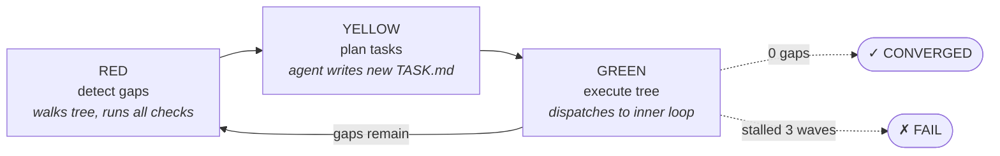
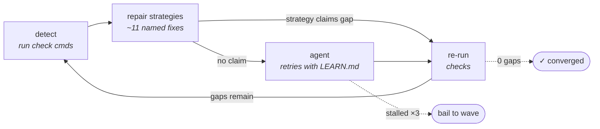

<div align="center">


# The autonomous AI agent playbook.

**The agent framework that runs autonomously for hours — even days, across thousands of tasks.**

[](./LICENSE)
[](https://www.npmjs.com/package/@converge/core)
[](https://www.typescriptlang.org/)
[](https://nodejs.org/)

[Quick Start](#quick-start) · [Architecture](#architecture) · [Examples](./examples) · [Documentation](./docs) · [Contributing](./CONTRIBUTING.md)

</div>

---

Converge is an open-source, TypeScript-native framework for orchestrating long-running AI agent workflows. Instead of authoring step-by-step graphs or hand-tuned prompts, you declare what "done" looks like — the artifacts that must exist, the checks that must pass — and Converge continuously measures the gap, generates the work to close it, and self-corrects when checks fail.

State lives in plain files on disk. Kill the process and resume from the last checkpoint. No graph wiring. No hosted control plane.

```bash
npm install -g @converge/core
```

## Highlights

- **Goal-driven** — declare outputs and checks, not steps
- **Deterministic verification** — every check is a shell command, never an LLM judge
- **Self-correcting** — typed failures route through ~11 named repair strategies before the agent retries
- **Dynamic task trees** — work decomposes at runtime as the project state evolves
- **Crash-safe** — atomic journal on disk; resume any run after a kill
- **Multi-provider** — Claude, Gemini, Kimi, Qwen via the `agentfn` abstraction

## Why Converge?

Most agent frameworks ask you to author the *path* — chains, graphs, supervisors, role hierarchies. That works for short, well-known workflows. It breaks down when the work is open-ended, when scope emerges as you go, or when failures need surgical recovery rather than blind retries.

Converge inverts the question.

| Step-driven frameworks                       | Converge                                                  |
| -------------------------------------------- | --------------------------------------------------------- |
| You write `plan() → execute() → check()`     | You declare the artifacts and shell-based checks          |
| An LLM-as-judge decides success              | `npm test`, `tsc --noEmit`, `grep -q` decide success      |
| Failures retry the same prompt               | Typed failures route to repair strategies, then to agent  |
| Static graph defined upfront                 | Task tree emerges via dynamic WBS at runtime              |
| Crash = lost run                             | Atomic journal on disk; resume mid-flight                 |

## Architecture

A Converge **playbook** is a tree of `TASK.md` files on disk. The runtime executes that tree with two nested feedback loops — an outer loop that plans, and an inner loop that executes.

### The task tree

```
.converge/playbooks/{name}/
├── playbook.yml              # entry: name, defaults, root task
└── tasks/
    └── root/
        ├── TASK.md           # frontmatter (outputs, checks) + agent instructions
        ├── wbs.js            # optional: spawn children at runtime
        └── design/
            ├── TASK.md
            └── implementation/
                ├── TASK.md
                ├── server/TASK.md
                └── tests/TASK.md
```

Each `TASK.md` declares its `outputs` (the files the task must produce), its `checks` (shell commands that must exit `0`), and a markdown body instructing the agent. Tasks nest. Dependencies resolve from disk. A `wbs.js` next to a `TASK.md` can spawn child tasks at runtime — so scope emerges from the problem, not from a graph drawn upfront.

### The two-loop model

#### Outer loop · Playbook Wave Loop

The outer loop plans which tasks to run. A **wave** is a single full pass over the task tree.



- **RED — detect gaps.** Walk every task, run its checks. Failed checks and missing outputs form the *gap set*.
- **YELLOW — plan tasks.** Send the gap set to a planning agent that authors new `TASK.md` files (or marks existing ones ready) to close them.
- **GREEN — execute tree.** Dispatch each pending task to the inner loop, in dependency order.

If gaps remain, the outer loop runs another wave. The playbook **converges** when a wave detects zero gaps. It **fails** if three consecutive waves make no progress.

#### Inner loop · Task Self-Correction Loop

The inner loop executes a single task until its checks pass. Failures don't blindly retry the agent — they route through typed repair strategies first.



1. **Detect.** Run check commands. Failures become *typed gaps* — `missing-input`, `buggy-check`, `tool-env`, `dependency`, and so on.
2. **Repair strategies.** ~11 named strategies get a chance to claim each gap *before* the agent does. A `missing-input` reschedules the producer; a `buggy-check` relaxes the predicate; a `tool-env` surfaces a setup hint.
3. **Agent.** Only when no strategy claims the gap does it fall through to the agent — which retries with `LEARN.md` in context: the carried-forward analysis from prior attempts.
4. **Re-run.** Re-execute checks. If gaps remain, loop. Three consecutive stalls and the task bails up to the outer wave loop.

`LEARN.md` is the framework's memory. Every attempt is a directory on disk; lessons carry forward so the agent doesn't repeat the same mistake twice.

### Five primitives, all on disk

1. **Playbook** — `playbook.yml` plus a tree of tasks under `.converge/playbooks/{name}/tasks/`.
2. **Task** — a `TASK.md` (frontmatter + body). Tasks nest. Dependencies resolve from paths.
3. **WBS** — a `wbs.js` next to a `TASK.md` spawns children at runtime, materialized as real `TASK.md` files on disk.
4. **Repair strategies** — typed failure handlers that fire before the agent does.
5. **Journal & `LEARN.md`** — every attempt is a directory; `LEARN.md` carries lessons forward between attempts.

Everything is plain text. Every state transition is observable on disk.

## Quick Start

Install the CLI:

```bash
npm install -g @converge/core
```

Initialize a playbook, plan from a goal, and run it:

```bash
converge init --name="my-api"
converge plan "REST API with health check endpoint and test suite"
converge run
```

Converge generates a task tree from your description. Each task declares its outputs, checks, and instructions:

```markdown
---
title: Health Check Endpoint
outputs:
  - src/routes/health.ts
  - src/routes/health.test.ts
checks:
  - id: server-starts
    cmd: npx tsx src/index.ts &; sleep 2; curl -sf http://localhost:3000/health; kill %1
    description: Health endpoint returns 200
  - id: tests-pass
    cmd: npx vitest run src/routes/health.test.ts
    description: Health check tests pass
---

Implement a GET /health endpoint that returns `{ "status": "ok" }`.
Write unit tests covering the success case and response shape.
```

`converge run` discovers gaps, executes tasks, self-corrects on failure, and repeats until every check passes or the budget is exhausted.

## Use Cases

**Software development.** Full application builds where requirements flow from design through implementation, tests, and docs. Checks run linters, type checkers, and test suites at every step. Failed tests produce structured analysis; the next attempt applies targeted fixes.

**Deep research.** Multi-source literature reviews, competitive analyses, synthesis reports. Tasks gather sources, extract findings, cross-reference, and synthesize — each step verified before the next begins.

**Scientific research.** Hypothesis formulation, experiments, academic paper drafting. Checks enforce GRADE evidence ratings, statistical rigor, and contradiction resolution. Bayesian priors update across epochs; the loop stops when quality scores converge.

**Content production.** Editorial workflows for blogs, docs, marketing copy. Checks enforce word counts, required sections, link validity, and brand voice. Playbooks encode your editorial process for repeatable execution.

**Business automation.** Client deliverables, compliance audits, onboarding workflows. Define the final package; Converge assembles it from templates, data sources, and verification steps.

The domain doesn't matter. If you can describe what done looks like, Converge can get there. See [`examples/`](./examples) for ready-to-run playbooks across each of these domains.

## Development

Build Converge from source and run the `converge` CLI against your local checkout.

### Prerequisites

- **Node.js** ≥ 20
- **pnpm** 10.29.3+ (pinned via `packageManager` in `package.json`)

### Clone, install, build

```bash
git clone https://github.com/myanlabs/converge.git
cd converge
pnpm install
pnpm build
```

### Use the CLI locally

From the repo root, run the CLI directly against source (no global install):

```bash
pnpm converge --help
pnpm converge init --name="my-api"
pnpm converge plan "REST API with health check endpoint and test suite"
pnpm converge run
```

To expose the built CLI as a `converge` command on your `$PATH`, link the `@converge/core` package globally:

```bash
pnpm build
pnpm --filter @converge/core link --global
converge --help
```

Run `pnpm --filter @converge/core unlink --global` to remove the link.

### Common tasks

```bash
pnpm test           # run all tests
pnpm typecheck      # type-check the monorepo
pnpm build          # rebuild after source changes
pnpm clean          # remove build artifacts
```

## Documentation

- **[Getting Started](./docs/getting-started.md)** — Install, configure, and run your first workflow
- **[Concepts](./docs/concepts/)** — Deterministic checks, dynamic WBS, the journal, repair strategies
- **[Architecture & Reference](./packages/core/README.md)** — Core internals, task format, full API
- **[Why Converge?](./docs/why-converge.md)** — Problem statement and design philosophy
- **[Architecture Decisions](./docs/adr/)** — ADRs for key design choices
- **[Examples](./examples/)** — Ready-to-run playbooks across domains
- **[Contributing](./CONTRIBUTING.md)** — Development setup and guidelines
- **[Security](./SECURITY.md)** — Reporting vulnerabilities

## Acknowledgements

Converge draws from ideas that predate AI agents: SQL's declarative data retrieval, Terraform's desired-state infrastructure, and control theory's feedback loops. The gap-driven convergence model applies these proven patterns to AI orchestration — measure the distance to done, generate work to close it, verify, correct, repeat.

## License

MIT — see [LICENSE](./LICENSE)

<div align="center">

**Goal-driven · Deterministic · Self-correcting**

</div>
