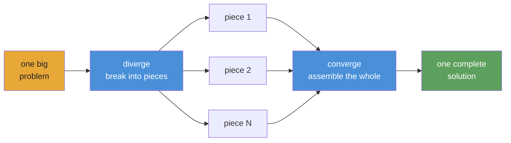

<div align="center">


# Converge

### Autonomous AI agents that adapt, execute, and converge.

[](https://www.npmjs.com/package/@openplaybooks/converge)
[](https://github.com/openplaybooks-dev/converge/stargazers)
[](./LICENSE)
[](https://nodejs.org/)
[](https://www.typescriptlang.org/)
[](./examples)
[](./docs/getting-started/install.md)

[Quick Start](#quick-start) · [Examples](./examples) · [Docs](./docs) · [Translations](./i18n) · [Contributing](./CONTRIBUTING.md)

</div>

---

## What Converge Is

Converge is a runtime for **autonomous playbooks** - version-controlled bundles of tasks an AI agent runs end-to-end.

You write the playbook as a folder of markdown files. Each task declares what it produces and the shell commands that prove it. Converge compiles the folder into a DAG, dispatches an agent to execute it, runs the checks, retries failures, and walks the graph until everything passes.

The playbook is the durable thing. Commit it, fork it, re-run it.

**Not a static workflow. A living playbook.**

---

## Why This Exists

The agents got good. The work still doesn't compound.

Projects like [`gstack`](https://github.com/garrytan/gstack), [`superpowers`](https://github.com/obra/superpowers), [`agent-skills`](https://github.com/addyosmani/agent-skills), Anthropic's [`financial-services`](https://github.com/anthropics/financial-services), and [`claude-seo`](https://github.com/AgriciDaniel/claude-seo) prove what's possible when prompts harden into reusable skills, specialist roles, and domain workflows. They also expose what gets stranded: most of that capability lives inside one host, one session, one person's setup. The run ends, the context dies, the next person starts from zero.

So we asked the obvious question. What if the artifact wasn't the chat — it was the playbook?

A playbook should *run*, not just describe. Fan out into tasks. Verify its own outputs with shell-level checks. Pick up where it failed. Survive a provider swap. Be the thing you commit, fork, and re-run a year later, when the chat session that spawned it has been gone for eleven months.

That's the bet behind Converge. Playbooks grow from one-task recipes into hundred-task autonomous systems — and once they're durable artifacts, the community gets to share them. The runner makes execution effortless. The playbook keeps the knowledge.

---

## Quick Start

> ⚠️ **Token consumption warning:** Converge dispatches AI agents that call LLM APIs. A playbook can consume tens of millions of tokens. Use a cheap model — see [Provider Setup](#provider-setup) below.

### 1. Install

```bash
npm install -g @openplaybooks/converge
```

<details>
<summary><strong>Or: let your coding agent install Converge for you</strong> — copy-paste prompt</summary>

Paste the prompt below into Claude Code, Codex, or any other coding agent in the directory where you want the project to live. The agent will install Converge, scaffold the project, pick a provider that matches the API keys you already have, ask you for a one-line goal, generate the first playbook, and dry-run it for you.

```markdown
You are setting up Converge — an autonomous-agent playbook runner — in the current directory. Work in 4 phases. Ask me only when a phase requires a decision.

1. **Analyze the project.** Look at the current directory and report what's here in one short paragraph. Cover: is this a git repo (and on what branch)? what languages/frameworks does the file tree suggest? is there an existing `.converge/` directory? anything I should be careful about (heavy `node_modules`, committed secrets, etc.)? If the directory looks like the wrong place to drop a Converge project, stop and ask me.

   Also confirm `converge --version` works. If it doesn't, run `npm install -g @openplaybooks/converge` and print the installed version.

2. **Ask which auth path I want.** Don't guess from environment variables — present these options verbatim and wait for me to pick. Each maps to a `--backend` (the agent CLI) + `--provider` (the LLM endpoint) combo for `converge init`. Tell me the exact `export` for the API-key env var I need, if any, and wait for confirmation before moving on.

   **A. Claude via OAuth (recommended).** `--backend=claude --provider=anthropic-oauth`. Run `claude login` once if I haven't. No env vars to set.

   **B. Claude via Anthropic API key.** `--backend=claude --provider=anthropic`. Tell me to `export ANTHROPIC_API_KEY=sk-ant-…`.

   **C. Claude via cheap Anthropic-compatible proxy.** Ask which:
   - **MiniMax** → `--backend=claude --provider=minimax`. Tell me to `export MINIMAX_API_KEY=…`.
   - **DeepSeek** → `--backend=claude --provider=deepseek`. Tell me to `export DEEPSEEK_API_KEY=…`.

   **D. Codex CLI.** `--backend=codex --provider=openai`. Tell me to `export CODEX_API_KEY=…` (or `OPENAI_API_KEY`).

   **E. Other backend (Gemini / Kimi / Qwen / ACP / DeepCode).** Use `--backend=<name>`; the matching `--provider=<name>` is the default. Tell me which vendor API-key env var to set.

3. **Scaffold the project.** Confirm the current working directory is the intended project root (the one you analyzed in step 1). If a fresh folder is wanted, ask before `mkdir <name> && cd <name>`. If cwd already has a `.converge/` directory, ask before passing `--force`. Then run:

       converge init --skills --backend=<chosen> --provider=<chosen>

   non-interactively. The project name is taken from cwd. `--skills` installs the bundled `/converge-planning` and `/converge-control` skills under `.claude/skills/` (and `.codex/skills/`). Proxy providers (`minimax`, `deepseek`) bake the full routing into `.converge/project.yaml` — no per-shell `ANTHROPIC_*` exports needed.

4. **Offer playbook creation.** Ask me one question: *"Want to design your first playbook now?"*

   - If yes — **hand off to the `/converge-planning` skill**. That skill knows the full authoring workflow (decompose the goal, write TASK.md files, declare dependencies and checks); don't try to replicate it. Just invoke `/converge-planning` and let it take over.
   - If no — tell me to start later by invoking `/converge-planning` inside Claude Code, or by copying a built-in template with `converge add --from-example hello-world`.

Rules:
- Never invent API keys or commit secrets.
- If a step fails, stop and show me the raw error. In particular: if `converge run` ever returns `Invalid API key` / HTTP 401, the cause is almost always conflicting `ANTHROPIC_*` env vars from a previous setup — go back to step 2 with me, don't retry blindly.
- Do not delete `.converge/`, `node_modules/`, or anything in cwd without explicit confirmation.
```

</details>

### 2. Bootstrap a project

```bash
mkdir my-project && cd my-project
converge init --backend=claude --provider=anthropic-oauth
```

The project name is taken from the current directory (`my-project` here), so
`converge init` writes `.converge/` into whatever you `cd` into. Run it from
an existing project root to add Converge to an existing repo instead.

### 3. Create a playbook

```bash
# Start from a built-in example (no AI needed)
converge add --from-example hello-world
```

Or, for a guided AI-driven design from scratch, invoke `/converge-planning` inside Claude Code (installed by `converge init --skills`).

### 4. Run

```bash
converge run
```

That's it. The five-minute walkthrough: **[Your first playbook](./docs/getting-started/your-first-playbook.md)**.

---

## How It Works

**You write playbooks as markdown files and folders. Converge compiles them into a DAG and dispatches AI agents to run it.**



**The mental model: diverge → converge.** Break the problem into independent pieces, run them in parallel, assemble the result. Recursive — any piece can itself diverge.

## Playbook Structure

A playbook is authored as a small set of top-level phases, with reusable templates for the work that fans out at runtime. Each `TASK.md` declares what it produces and the shell commands that check whether it's done.

```
.converge/playbooks/{name}/
├── playbook.yml
├── tasks/
│   ├── 01-requirements/TASK.md
│   ├── 02-design/TASK.md
│   ├── 03-scaffold/TASK.md   # seed: { mode: cli } parent
│   └── 04-integrate/TASK.md
└── templates/
    ├── page/TASK.md          # reusable page blueprint
    ├── api/TASK.md           # reusable endpoint blueprint
    ├── db-model/TASK.md      # reusable schema/model blueprint
    └── component/TASK.md     # reusable shared UI blueprint
```

Authored playbooks stay compact; the DAG fans out at runtime when seed tasks `converge spawn` from `templates/`.

---

## What You Can Build

Every example below marked **available** is a real, runnable playbook in [`examples/`](./examples/). Examples marked **coming soon** are designed but not yet shipped.

### Showcase: real autonomous runs

If the playbook is the artifact, the run is the proof. Each demo below will land as its own repo — containing the playbook, the run journal, and the code Converge produced — so anyone can audit what autonomous workflows actually ship.

| Demo                                                                          | Status      | Description                                |
| ----------------------------------------------------------------------------- | ----------- | ------------------------------------------ |
| [`demo-saas-9h`](https://github.com/openplaybooks-dev/demo-saas-9h)           | coming soon | Converge built this SaaS app in 9 hours    |
| [`demo-migration`](https://github.com/openplaybooks-dev/demo-migration)       | coming soon | Converge migrated 40 files automatically   |
| [`demo-test-repair`](https://github.com/openplaybooks-dev/demo-test-repair)   | coming soon | Converge fixed 127 failing tests           |

### Starter

| Example                                      | Status     | Description                                                          |
| -------------------------------------------- | ---------- | -------------------------------------------------------------------- |
| [`hello-world`](./examples/hello-world/)     | available  | Simplest possible playbook — one task, two checks                    |
| [`data-pipeline`](./examples/data-pipeline/) | available  | Sequential pipeline: fetch → transform → validate                    |

### Software

| Example                                      | Status     | Description                                                          |
| -------------------------------------------- | ---------- | -------------------------------------------------------------------- |
| [`fullstack-app`](./examples/fullstack-app/) | available  | Seed-driven dynamic backend + frontend generation                    |
| [`flutter-app`](./examples/flutter-app/)     | available  | Autonomous mobile app generation in Flutter / Dart                   |
| [`app-builder`](./examples/app-builder/)     | coming soon | Generic app scaffolding playbook                                    |

### Research

| Example                                                  | Status     | Description                                                                              |
| -------------------------------------------------------- | ---------- | ---------------------------------------------------------------------------------------- |
| [`deep-research`](./examples/deep-research/)             | available  | Layered iterative-deepening with quality-gated progression                               |
| [`scientific-research`](./examples/scientific-research/) | available  | Bayesian reasoning, GRADE evidence, meta-analysis, paper generation — 8-phase epoch loop |
| [`frontier-research`](./examples/frontier-research/)     | available  | Beam-search frontier exploration with parallel beams and convergence tracking            |

### Simulation

| Example                                  | Status      | Description                                                                  |
| ---------------------------------------- | ----------- | ---------------------------------------------------------------------------- |
| [`social-sim`](./examples/social-sim/)   | available   | Loop-based persona-driven social simulation with spawned child tasks per tick |
| [`game-ai-pk`](./examples/game-ai-pk/)   | coming soon | Persistent-cast reality-show single-episode game                              |

### Optimization

| Example                                                              | Status     | Description                                                                              |
| -------------------------------------------------------------------- | ---------- | ---------------------------------------------------------------------------------------- |
| [`evolutionary-optimization`](./examples/evolutionary-optimization/) | available  | Fitness-landscape search for prompt tuning, hyperparameter sweeps, training recipes      |

### Provider integration

| Example                                  | Status     | Description                                                                              |
| ---------------------------------------- | ---------- | ---------------------------------------------------------------------------------------- |
| [`acp-demo`](./examples/acp-demo/)       | available  | Claude Agent SDK (`acp`) provider — programmatic agent invocation                        |

### Coming soon

These examples are designed but not yet shipped — see the linked issue or watch the [`examples/`](./examples/) directory for updates:

- `cinematic-video-production` — AI film director: `idea.md` → consistent cinematic clip library
- `game-assets-video` — platformer asset pack from a single `idea.md`
- `autonomous-pentest` — multi-stage pentest sweep with PoC-gated findings (authorized use only)
- `financial-deep-research` — multi-phase equity research with per-ticker analysis
- `baby-app` — minimal full-stack starter template

[Browse all examples →](./examples/)

---

## Provider Setup

Converge supports multiple runtime providers. The project scaffold and CLI currently expose first-class provider IDs for **Claude** (`provider: claude`), **Codex** (`provider: codex`), **ACP / OpenAI-compatible endpoints** (`provider: acp`), **Kimi** (`provider: kimi`), **Qwen** (`provider: qwen`), **Gemini** (`provider: gemini`), and **DeepCode** (`provider: deepcode`). You configure them in `.converge/project.yaml`. **Use a cheap model for development** — Claude Opus costs $15/$75 per 1M tokens; cheap models cost under $1/$3.

### Recommended cheap models

| Model                 | Input / 1M | Output / 1M | Best for                    |
| --------------------- | ---------- | ----------- | --------------------------- |
| `deepseek-v4-flash`   | $0.27      | $1.10       | Sub-agents, fast checks     |
| `deepseek-v4-pro[1m]` | $0.55      | $2.19       | Primary reasoning           |
| `MiniMax-M2.7`        | $0.50      | $1.50       | Balanced price/perf         |
| Claude Opus 4.5       | $15.00     | $75.00      | Highest quality (expensive) |

### Sample `.converge/project.yaml`

```yaml
# .converge/project.yaml
name: my-project

ai:
  default: claude
  providers:
    # ── Claude Code backend ──────────────────────────
    claude:
      provider: claude
      env:
        # Route through DeepSeek (cheap)
        ANTHROPIC_BASE_URL: https://api.deepseek.com/anthropic
        ANTHROPIC_AUTH_TOKEN: "${DEEPSEEK_API_KEY}"
        ANTHROPIC_MODEL: deepseek-v4-pro[1m]
        ANTHROPIC_DEFAULT_HAIKU_MODEL: deepseek-v4-flash
        CLAUDE_CODE_SUBAGENT_MODEL: deepseek-v4-flash

        # Or route through MiniMax-M2.7 (uncomment to use)
        # ANTHROPIC_BASE_URL: "https://api.minimax.io/anthropic"
        # ANTHROPIC_AUTH_TOKEN: "${MINIMAX_API_KEY}"
        # ANTHROPIC_MODEL: "MiniMax-M2.7"

    # ── Codex backend ────────────────────────────────
    codex:
      provider: codex
      env:
        CODEX_API_KEY: "${CODEX_API_KEY}"
        # Or set OPENAI_API_KEY instead
```

**Claude Code** runs via the `claude` CLI — set `DEEPSEEK_API_KEY` or `MINIMAX_API_KEY` in your environment. **Codex** runs via the `codex` CLI (`npm i -g @openai/codex`) — set `CODEX_API_KEY` or `OPENAI_API_KEY`. Converge resolves `${VAR}` references automatically. `converge init` scaffolds this file for you.

> **Bundled examples default to MiniMax.** Every example in [`examples/`](./examples/) ships with a `.converge/project.yaml` that routes Claude through `https://api.minimax.io/anthropic` using `MiniMax-M2.7`. Set `MINIMAX_API_KEY` in your environment and they run end-to-end. To use a different provider, override `ANTHROPIC_BASE_URL` / `ANTHROPIC_MODEL` (or edit the per-example `project.yaml`).

Full guide: [Switching providers](./docs/guides/switch-providers.md).

---

## Integrations

Converge integrates at two layers:

- **Coding agents** for authoring and operating playbooks from your workspace
- **Runtime providers** for executing tasks inside the playbook itself

### Coding agents

Converge ships with two bundled **skills** so you can design and run playbooks without leaving your coding agent:

| Skill               | What it does                                                                                                     |
| ------------------- | ---------------------------------------------------------------------------------------------------------------- |
| `converge-planning` | Design a new playbook from a prompt — generates PLAN.md, TASK.md files, dependency graph, and shell-level checks |
| `converge-control`  | Run and monitor a playbook — classifies DAG events, diagnoses failures, re-runs incrementally                    |

### End-to-end flow

```bash
# 1. Bootstrap a project with skills installed
mkdir my-project && cd my-project
converge init --skills

# 2. In your coding agent, design the playbook
/converge-planning   # "Build a REST API for user management with auth"

# 3. Run
converge run

# 4. Hand off to converge-control — it monitors, diagnoses, and re-runs on failure
/converge-control    # run → monitor → retry failures
```

<details>
<summary><strong>Claude Code</strong></summary>

- `converge init --skills` installs bundled skills to `.claude/skills/`
- Claude Code auto-discovers skills from that directory
- Invoke them directly with `/converge-planning` and `/converge-control`

```bash
mkdir my-project && cd my-project
converge init --skills

# Re-run on an existing project to install bundled skills only
converge init --skills
```

</details>

<details>
<summary><strong>Codex</strong></summary>

- `converge init --skills` also installs bundled skills to `.codex/skills/`
- Codex reads skills from that directory the same way
- Use the same Converge skills to plan and operate playbooks from your Codex workspace

```bash
mkdir my-project && cd my-project
converge init --skills

# Re-run on an existing project to install bundled skills only
converge init --skills
```

</details>

<details>
<summary><strong>Other coding-agent setups</strong></summary>

- Bundled coding-agent skill installation is documented here for Claude Code and Codex specifically
- Runtime provider portability is configured separately in `.converge/project.yaml`

See [Switching providers](./docs/guides/switch-providers.md).

</details>

### Skill behavior

- Type `/skill-name` to invoke: the skill loads its reference docs, CLI commands, event catalog, and troubleshooting recipes with full context
- `converge-planning` handles the upfront design phase; `converge-control` takes over during execution

### Install skills to an existing project

```bash
converge init --skills
```

### Runtime providers

The playbook runtime is the portable layer. You can switch providers in `.converge/project.yaml` without rewriting the playbook.

<details>
<summary><strong>Claude</strong></summary>

- First-class backend via `provider: claude`
- Runs through the `claude` CLI
- Supports Anthropic-compatible routing like DeepSeek or MiniMax through `ANTHROPIC_BASE_URL`

</details>

<details>
<summary><strong>Codex</strong></summary>

- First-class backend via `provider: codex`
- Runs through the `codex` CLI
- Uses `CODEX_API_KEY` or `OPENAI_API_KEY`

</details>

<details>
<summary><strong>Gemini, Kimi, Qwen, and OpenAI-compatible endpoints</strong></summary>

- Converge scaffolds direct provider IDs for `provider: gemini`, `provider: kimi`, and `provider: qwen`
- Use `provider: acp` when you want an arbitrary OpenAI-compatible endpoint or a custom `baseUrl`
- Mixing cheaper and stronger providers inside one playbook is the main cost/performance lever

</details>

<details>
<summary><strong>Portable by design</strong></summary>

- Skills help agents do the work
- Playbooks define the work
- Providers are execution backends you can swap underneath the same playbook

</details>

---

## Packages

| Package                                  | Path                                    | Purpose                                                                                                    |
| ---------------------------------------- | --------------------------------------- | ---------------------------------------------------------------------------------------------------------- |
| [`@openplaybooks/converge-core`](./packages/core/)     | `packages/core/`                        | Programmatic TypeScript engine: runner registry, task graph, state machine, repair strategies.              |
| [`@openplaybooks/converge`](./packages/cli/)       | `packages/cli/`                         | Canonical npm install target for `converge`. Bootstrap, run, watch, tail. Drives runs via provider backends. |
| Provider packs                           | `packages/{claude,gemini,kimi,qwen}fn/` | Provider-specific backends. Swap without changing playbooks.                                               |

---

## Dogfood

Significant parts of this repo were built by Converge running playbooks against itself — CLI redesign (63 tasks), landing page (65 tasks), docs generation, and more. [See the receipts →](./.converge/playbooks/). If the runtime didn't work, this README would be hand-typed.

### Dogfooded CI

The repo's own contribution flow is run by Converge. Deterministic gates (build, test, typecheck, format, commit-message lint, secret scan) run automatically on every PR. On top of that, maintainers can trigger Converge playbooks from the Actions tab:

- [`ci-pr-review`](./.converge/playbooks/ci-pr-review/) — reviews a PR diff and posts a structured comment
- [`ci-docs-drift`](./.converge/playbooks/ci-docs-drift/) — flags docs whose `sources:` frontmatter no longer matches the code
- [`ci-commit-lint`](./.converge/playbooks/ci-commit-lint/) — explains why a commit fails the message convention and proposes a fix
- [`ci-release-notes`](./.converge/playbooks/ci-release-notes/) — drafts release notes from commits since the previous tag

The bot reviewing your PR is itself a playbook. Edit the prompt and open a PR.

> **`v0.1.0` · public preview** — Runtime ships. **12 runnable example playbooks** across software, research, simulation, and provider integration. More coming soon.

---

## Translations

- [Tiếng Việt](./i18n/vi/README.md)
- [Español](./i18n/es/README.md)
- [Português do Brasil](./i18n/pt-BR/README.md)
- [简体中文](./i18n/zh-CN/README.md)
- [日本語](./i18n/ja/README.md)

---

## Community

- **[Discussions](https://github.com/openplaybooks-dev/converge/discussions)** — questions, ideas, playbook patterns
- **[Issues](https://github.com/openplaybooks-dev/converge/issues)** — bug reports, feature requests
- **[Contributing](./CONTRIBUTING.md)** — dev setup, project structure, how to ship a PR

---

## Sponsors & enterprise support

### Sponsors

<table>
  <tr>
    <td align="center" width="220">
      <a href="https://mezon.ai">
        
      </a>
      <br />
      <strong><a href="https://mezon.ai">Mezon</a></strong>
      <br />
      <sub>The Live, Work, and Play Platform.</sub>
    </td>
    <td align="center" width="220">
      <a href="https://ncc.plus">
        
      </a>
      <br />
      <strong><a href="https://ncc.plus">NCC.plus</a></strong>
      <br />
      <sub>Enterprise AI adoption services.</sub>
    </td>
  </tr>
</table>

To sponsor Converge or list your services here, open an [issue](https://github.com/openplaybooks-dev/converge/issues) or reach out via [Discussions](https://github.com/openplaybooks-dev/converge/discussions).

---

## License

MIT — see [LICENSE](./LICENSE)

<div align="center">

**Autonomous · Repeatable · Verifiable**

</div>
