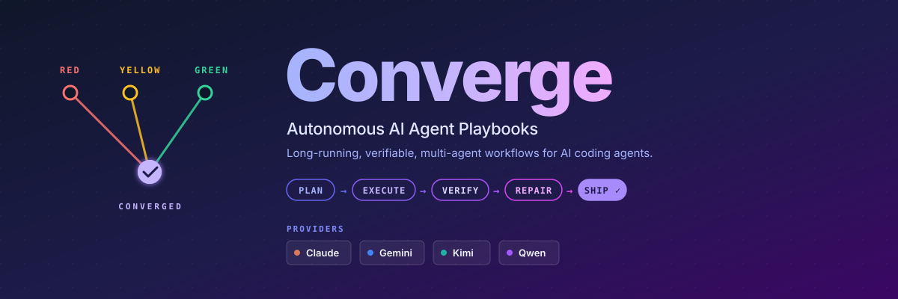

<div align="center">



# Autonomous AI Agent Framework — TypeScript

*A crash-safe, self-correcting multi-agent orchestration engine for verifiable agentic workflows. Plan, execute, verify, fix, ship — resumable from any kill.*

[](https://www.npmjs.com/package/@converge/core)
[](https://github.com/myanlabs/converge/stargazers)
[](./LICENSE)
[](https://nodejs.org/)
[](https://www.typescriptlang.org/)
[](./examples)
[](./docs/getting-started/install.md)

[Quick Start](#quick-start) · [What you can build](#what-you-can-build) · [Examples](./examples) · [Documentation](./docs) · [Contributing](./CONTRIBUTING.md)

</div>

> **`v0.1.0` · public preview** — Runtime ships. **22+ runnable example playbooks** across software, research, security, and creative production. CLI ergonomics evolving toward v1.0.

---

## What a run looks like

```
$ converge init my-research && cd my-research
$ converge init --from-prompt "Literature review on transformer in-context learning limits"
$ converge run

[plan]   generated 8 tasks across 3 phases
[wave 1] RED  detected 8 gaps
         YELLOW planned tasks
         GREEN  executing...

  ✓ 01-define-scope        converged in 2 attempts
  ✓ 02-source-search       converged in 1 attempt
  ⟳ 03-extract-findings    check failed → repair-strategy:missing-input → ✓
  ✓ 04-cross-reference     converged in 1 attempt
  ✓ 05-synthesize          converged in 3 attempts
  ✓ 06-evidence-grade      converged in 1 attempt
  ✓ 07-draft-report        converged in 2 attempts
  ✓ 08-convergence-check   converged in 1 attempt

[wave 2] RED  detected 0 gaps  →  ✓ CONVERGED

8/8 tasks. 1 auto-repair. report.md written to ./out/
```

You write the goal. The runtime plans the tasks, executes them in dependency order, verifies every step with shell-command checks, and self-corrects when anything fails.

**No graph wiring. No hand-tuned prompts. No babysitting.**

## What is Converge?

**An autonomous AI agent framework for building verifiable, crash-safe, self-correcting multi-agent workflows in TypeScript. Runs for hours or days across thousands of tasks, with deterministic shell-level checks, auto-repair, and resume-from-any-kill crash safety.**

A Converge **playbook** is an AI project: a tree of tasks on disk, each one declaring what it produces and the shell commands that check whether it's done. You write the playbook (or clone one from [examples](./examples)). The runtime composes the tasks into a graph, runs each in dependency order, verifies the outputs, and self-corrects when checks fail — for hours or days, across thousands of tasks, resumable from any kill.

> **Long-running AI work becomes a version-controlled project, not a prompt you babysit.**

A playbook on disk:

```
.converge/playbooks/{name}/
├── playbook.yml              # entry: name, run config, task paths
└── tasks/
    ├── 01-analyze/
    │   ├── TASK.md           # parent task (optional)
    │   └── tasks/
    │       ├── 01a-extract/TASK.md    # frontmatter (depends_on, outputs, checks)
    │       └── 01b-fingerprint/TASK.md
    ├── 02-catalog/TASK.md
    └── 03-build/
        ├── TASK.md
        ├── seed.js           # optional: spawn children at runtime
        └── tasks/
            ├── 03a-backend/TASK.md
            └── 03b-frontend/TASK.md
```

Each TASK.md declares its own `depends_on` — no centralized dependency wiring in playbook.yml.
playbook.yml lists task paths only, making the hierarchy explicit and AI-friendly.

How a run executes:


Each wave detects gaps, plans tasks to close them, and executes — looping until the playbook converges or three consecutive waves make no progress. Inside each task, typed failures route through named repair strategies before falling back to the agent. See [Concepts](./docs/concepts/) for the full runtime model.

## Highlights

- **Runs for hours, days, thousands of tasks.** Crash-safe checkpoints; resume from any kill.
- **Every check is a shell command.** No LLM-as-judge, no vibes.
- **Same playbook, same shape of result.** Outputs and journal are version-controlled.
- **Failures auto-repair.** Typed strategies fire before the agent retries.
- **The task graph grows at runtime.** Scope emerges with the work.
- **One abstraction, four providers.** Claude, Gemini, Kimi, Qwen.

> Most agent frameworks ask "did the LLM say it's done?" Converge asks "does the test suite pass?"

## What problems does Converge solve?

**Long-running, multi-stage AI work that has to actually finish.** When the work is fifty tasks, or two hundred, or a pipeline that runs for hours, the runtime has to survive partial failures — a stuck check on task 23 can't kill task 47. Tasks form a graph, not a chain. The framework repairs typed failures before retrying the agent, checkpoints every step to disk, and resumes from any kill.

**Structured outputs that have to be verifiable.** Real artifacts come with real predicates. A code change passes `tsc`, `eslint`, and the test suite. A research report has citations that resolve. A security finding ships a reproducible PoC. Every check is a shell command — not an LLM judging itself.

> **"Done" is a deterministic question, not a vibe.**

**Repeatable processes that change shape based on input.** The same playbook runs three layers deep on a hard question and one layer deep on a simple one. An asset pipeline spawns one task per scene. A research loop runs another epoch only if the quality score hasn't plateaued. The task graph grows at runtime, so the playbook is one file but the runs are problem-shaped.

## What you can build

Every example below is a real, runnable playbook in [`examples/`](./examples/) — clone it, edit the `idea.md` or scope file, and run.

### Software & apps

- **[`fullstack-app`](./examples/fullstack-app/)** — Seed-driven playbook that dynamically spawns backend + frontend tasks. Generates a runnable codebase with passing tests.
- **[`flutter-app`](./examples/flutter-app/)** — autonomous mobile app generation in Flutter / Dart.
- **[`baby-app`](./examples/baby-app/)** — minimal full-stack template; clone-and-edit starting point.

### Research & writing

- **[`deep-research`](./examples/deep-research/)** — layered iterative-deepening research. Layer 1 surveys breadth, Layer 2 narrows to promising areas, Layer 3 investigates deeply. Quality gates control progression.
- **[`scientific-research`](./examples/scientific-research/)** — autonomous research pipeline with Bayesian reasoning, GRADE evidence ratings, meta-analysis, and academic paper generation. 8-phase epoch loop; converges when quality scores plateau.
- **[`frontier-research`](./examples/frontier-research/)** — multi-source synthesis for fast-moving technical domains.

### Creative production

- **[`cinematic-video-production`](./examples/cinematic-video-production/)** — end-to-end AI film director. Input an `idea.md`, get a `clips/` folder with consistent cinematic shots and a `clips.json` manifest ready for an NLE. 15 min – 1 h narrative video; defeats AI-video drift with locked element libraries + compositing bridge + bookend frames.
- **[`game-assets-video`](./examples/game-assets-video/)** — complete platformer asset pack — characters, props, scenes, tilesheets, parallax backgrounds — driven by a single `idea.md`. Per-character animations rendered as video, then split into game-engine frames.
- **[`game-aiwolf`](./examples/game-aiwolf/)** — multi-agent simulation playbook.

### Security

- **[`autonomous-pentest`](./examples/autonomous-pentest/)** — one-off, sequential, exhaustive pentest sweep. Spawns ~250 tasks per run; findings reach the final report only when a reproducible PoC is captured (Shannon's proof-by-exploit gate). Refuses to run without a `scope.yml` declaring authorization. **Authorized use only.**

### Operations & data

- **[`data-pipeline`](./examples/data-pipeline/)** — sequential pipeline with task dependencies: fetch → transform → validate.
- **[`evolutionary-optimization`](./examples/evolutionary-optimization/)** — search over a fitness landscape; useful for prompt tuning, hyperparameter sweeps, copy testing.

[Browse all 22 examples →](./examples/)

## Converge builds Converge

Significant parts of this repo were built by Converge running playbooks against itself. The `.converge/playbooks/` directory in this repository contains the receipts:

- **`cli-redesign`** — 63 tasks. The v2 CLI surface (`--select` DSL, `compile`, `target/manifest.json`, the three-state dynamic-DAG manifest) is being implemented by Converge from a design doc.
- **`landing-page`** — 65 tasks. The Astro landing site at `apps/landing/` was scaffolded and built by a playbook.
- **`oss-standardize`** — 38 tasks. Brand consolidation, documentation, and OSS-readiness work.
- **`self-improvement-loop`** — 10 tasks, run mode `loop`. Continuously improves the framework toward top-tier OSS quality.
- **`docs`** — re-runnable. Re-generates `docs/` from source whenever framework code changes.
- **`cli-to-core-extraction`** — 4 tiers, ~4k lines moved. Refactored orchestration out of `packages/cli` into `packages/core`.

> **The dogfood is the proof.** Every playbook above ran against this codebase, produced a checkpointed journal, and survived crashes and resumes. If the runtime didn't work, this README would be hand-typed.

## Quick Start

```bash
npm install -g @converge/core
converge init my-project
converge init --from-prompt "What you want done — one sentence"
converge run
```

Generates a task tree from your description and runs it to convergence. The five-minute walkthrough: **[Your first playbook](./docs/getting-started/your-first-playbook.md)**.

For a deeper start:
- **[Install](./docs/getting-started/install.md)** — install the CLI and configure providers
- **[Concepts](./docs/concepts/)** — deterministic checks, dynamic Seed, the journal, repair strategies
- **[Why Converge](./docs/getting-started/why-converge.md)** — design philosophy and lineage

## Community

- **[GitHub Discussions](https://github.com/myanlabs/converge/discussions)** — questions, ideas, playbook patterns
- **[GitHub Issues](https://github.com/myanlabs/converge/issues)** — bug reports and feature requests
- **[Contributing Guide](./CONTRIBUTING.md)** — development setup, project structure, how to ship a PR

---

**Keywords:** AI agent framework · agentic workflow · autonomous agents · multi-agent orchestration · Claude Code framework · LLM workflow engine · long-running AI · verifiable AI · crash-safe · self-correcting agents · TypeScript agent framework · MCP-compatible · playbook automation · agent harness · Gemini agents · Kimi K2 · Qwen Code

---

## License

MIT — see [LICENSE](./LICENSE)

<div align="center">

**Autonomous · Repeatable · Verifiable**

</div>
