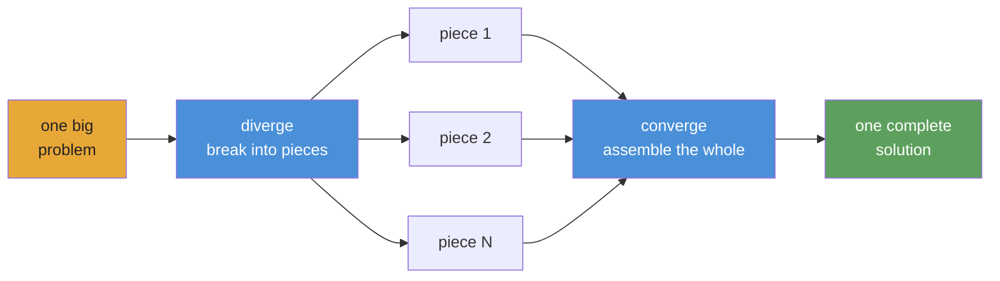

<div align="center">


# Autonomous AI agent playbooks

**Agent harnessing and orchestration for complex, repeatable, verifiable workflows.**

[](https://www.npmjs.com/package/@converge/core)
[](https://github.com/myanlabs/converge/stargazers)
[](./LICENSE)
[](https://nodejs.org/)
[](https://www.typescriptlang.org/)
[](./examples)
[](./docs/getting-started/install.md)

[Quick Start](#quick-start) · [Examples](./examples) · [Docs](./docs) · [Contributing](./CONTRIBUTING.md)

</div>

> **`v0.1.0` · public preview** — Runtime ships. **26+ runnable example playbooks** across software, research, security, and creative production.

---

## How it works

**You write playbooks as markdown files and folders. Converge compiles them into a DAG and dispatches AI agents to run it.**



**The mental model: diverge → converge.** Break the problem into independent pieces, run them in parallel, assemble the result. Recursive — any piece can itself diverge.

1. **`converge init`** — bootstrap a project with provider config and directory structure.
2. **`converge add`** — pull an example, generate from a prompt, or write the playbook manually.
3. **`converge run`** — compiles the DAG, dispatches agents, loops until checks pass. Each node: an agent does the work, shell checks verify it. Retries on failure, caches on success.

**Write — TASK.md files and folders. Plain markdown. Version control it.**

**Share the playbook, re-run it anytime. Same inputs, same outputs.**

---

## What you can build

Every example below is a real, runnable playbook in [`examples/`](./examples/).

### Software
| Example | Description |
|---|---|
| [`fullstack-app`](./examples/fullstack-app/) | Seed-driven dynamic backend + frontend generation with passing tests |
| [`flutter-app`](./examples/flutter-app/) | Autonomous mobile app generation in Flutter / Dart |
| [`baby-app`](./examples/baby-app/) | Minimal full-stack template; clone, edit, run |

### Research
| Example | Description |
|---|---|
| [`deep-research`](./examples/deep-research/) | Layered iterative-deepening with quality-gated progression |
| [`scientific-research`](./examples/scientific-research/) | Bayesian reasoning, GRADE evidence, meta-analysis, paper generation — 8-phase epoch loop |
| [`frontier-research`](./examples/frontier-research/) | Multi-source synthesis for fast-moving technical domains |

### Creative
| Example | Description |
|---|---|
| [`cinematic-video-production`](./examples/cinematic-video-production/) | End-to-end AI film director. `idea.md` → `clips/` with locked elements + compositing |
| [`game-assets-video`](./examples/game-assets-video/) | Platformer asset pack — characters, props, tilesheets, parallax — from a single `idea.md` |
| [`game-aiwolf`](./examples/game-aiwolf/) | Multi-agent simulation playbook |

### Security
| Example | Description |
|---|---|
| [`autonomous-pentest`](./examples/autonomous-pentest/) | ~250-task pentest sweep. Findings gated by reproducible PoC. Requires `scope.yml`. **Authorized use only.** |

### Ops & data
| Example | Description |
|---|---|
| [`data-pipeline`](./examples/data-pipeline/) | Sequential pipeline: fetch → transform → validate |
| [`due-diligence`](./examples/due-diligence/) | Multi-source company research across 5 public sources, cross-referencing, and risk-scored HTML report |
| [`evolutionary-optimization`](./examples/evolutionary-optimization/) | Fitness-landscape search for prompt tuning, hyperparameter sweeps, copy testing |

[Browse all 26 examples →](./examples/)

---

## Playbook structure

A playbook is a tree of tasks on disk. Each TASK.md declares what it produces and the shell commands that check whether it's done. No centralized wiring.

```
.converge/playbooks/{name}/
├── playbook.yml              # entry: name, run config, task paths
└── tasks/
    ├── 01-analyze/
    │   ├── TASK.md
    │   └── tasks/
    │       ├── 01a-extract/TASK.md    # frontmatter (depends_on, outputs, checks)
    │       └── 01b-fingerprint/TASK.md
    ├── 02-catalog/TASK.md
    └── 03-build/
        ├── TASK.md
        ├── seed.js           # optional: spawn children at runtime
        └── tasks/
            ├── 03a-backend/TASK.md
            └── 03b-frontend/TASK.md
```

Execution loop — diverge, execute, converge:

```
  DIVERGE ──→ EXECUTE ──→ CONVERGE
  seed runs   children     body reads outputs,
  spawns      produce      integrates, validates
  children    outputs      → 0 gaps = done
```

The runtime walks the DAG in topological layers. Each node either executes (AI agent + shell checks) or is cached (fingerprint unchanged from previous run). Failed nodes retry up to the attempt cap; downstream nodes wait until dependencies complete. Like dbt's `run` — deterministic ordering, incremental caching, no loops.

---

## Quick Start

> ⚠️ **Token consumption warning:** Converge dispatches AI agents that call LLM APIs. A playbook can consume tens of millions of tokens. Use a cheap model — see [Provider setup](#provider-setup) below.

### 1. Install

```bash
npm install -g @converge/core
```

### 2. Bootstrap a project

```bash
converge init --name=my-project
```

### 3. Create a playbook

```bash
# Start from a built-in example (no AI needed)
converge add --from-example hello-world

# Or generate one from a prompt (requires AI config)
converge add --from-prompt "Literature review on in-context learning"
```

### 4. Run

```bash
converge run
```

That's it. The five-minute walkthrough: **[Your first playbook](./docs/getting-started/your-first-playbook.md)**.

---

## Why Converge

**Checks, not vibes.** Every task declares shell-command checks — `tsc`, `grep`, `eslint`, a test suite. The runtime loops until they pass. No LLM judging its own output.

**Fingerprint caching, not checkpoint files.** Every node gets a SHA-256 fingerprint. Unchanged nodes skip execution — like dbt's incremental models. Kill at node 47; re-run picks up from what completed.

**Playbooks, not prompts.** A chat transcript dies with the session. A playbook is version-controlled TASK.md files. Same inputs, same outputs, every run. Anyone on the team can re-run it.

**DAG, not context window.** A chat window exhausts after a few features. A playbook DAG breaks work into independent TASK.md files — each fits in one window. The runtime chains them topologically. 670 tasks, zero lost context.

**Swap providers, not rewrite workflows.** Claude, Gemini, Kimi, Qwen — change one config, same playbook runs. Stub mode for zero-cost offline development.

**Dynamic scope, not static wiring.** A `seed.js` function spawns nodes at runtime based on input — one scene becomes one task, one stock ticker becomes one analysis branch. The DAG grows to fit the problem, not the template.

---

## Provider setup

Converge runs on any LLM. It supports two agent backends — **Claude Code** (`provider: claude`) and **OpenAI Codex** (`provider: codex`) — each routing through your chosen model. You configure the backend in `.converge/project.yaml`. **Use a cheap model for development** — Claude Opus costs $15/$75 per 1M tokens; cheap models cost under $1/$3.

### Recommended cheap models

| Model | Input / 1M | Output / 1M | Best for |
|---|---|---|---|
| `deepseek-v4-flash` | $0.27 | $1.10 | Sub-agents, fast checks |
| `deepseek-v4-pro[1m]` | $0.55 | $2.19 | Primary reasoning |
| `MiniMax-M2.7` | $0.50 | $1.50 | Balanced price/perf |
| Claude Opus 4.5 | $15.00 | $75.00 | Highest quality (expensive) |

### Sample `.converge/project.yaml`

```yaml
# .converge/project.yaml
name: my-project

ai:
  default: claude
  providers:
    # ── Claude Code backend ──────────────────────────
    claude:
      provider: claude
      env:
        # Route through DeepSeek (cheap)
        ANTHROPIC_BASE_URL: https://api.deepseek.com/anthropic
        ANTHROPIC_AUTH_TOKEN: "${DEEPSEEK_API_KEY}"
        ANTHROPIC_MODEL: deepseek-v4-pro[1m]
        ANTHROPIC_DEFAULT_HAIKU_MODEL: deepseek-v4-flash
        CLAUDE_CODE_SUBAGENT_MODEL: deepseek-v4-flash

        # Or route through MiniMax-M2.7 (uncomment to use)
        # ANTHROPIC_BASE_URL: "https://api.minimax.io/anthropic"
        # ANTHROPIC_AUTH_TOKEN: "${MINIMAX_API_KEY}"
        # ANTHROPIC_MODEL: "MiniMax-M2.7"

    # ── Codex backend ────────────────────────────────
    codex:
      provider: codex
      env:
        CODEX_API_KEY: "${CODEX_API_KEY}"
        # Or set OPENAI_API_KEY instead
```

**Claude Code** runs via the `claude` CLI — set `DEEPSEEK_API_KEY` or `MINIMAX_API_KEY` in your environment. **Codex** runs via the `codex` CLI (`npm i -g @openai/codex`) — set `CODEX_API_KEY` or `OPENAI_API_KEY`. Converge resolves `${VAR}` references automatically. `converge init` scaffolds this file for you.

Full guide: [Switching providers](./docs/guides/switch-providers.md).

---

## Claude Code & Codex integration

Converge ships with two **skills** that plug into your coding agent so you can design and run playbooks without leaving the terminal:

| Skill | What it does |
|---|---|
| `converge-planning` | Design a new playbook from a prompt — generates PLAN.md, TASK.md files, dependency graph, and shell-level checks |
| `converge-control` | Run and monitor a playbook — classifies DAG events, diagnoses failures, re-runs incrementally |

### End-to-end flow

```bash
# 1. Bootstrap a project with skills installed
converge init --name=my-project --skills

# 2. In Claude Code, design the playbook
/converge-planning   # "Build a REST API for user management with auth"

# 3. Run
converge run

# 4. Hand off to converge-control — it monitors, diagnoses, and re-runs on failure
/converge-control    # run → monitor → retry failures
```

### How it works

- `converge init --skills` installs both skills to `.claude/skills/` and `.codex/skills/`
- **Claude Code** and **Codex** auto-discover skills from these directories — no configuration needed
- Type `/skill-name` to invoke: the skill loads its full reference docs (CLI commands, event catalog, troubleshooting recipes) and operates with full context
- `converge-planning` handles the upfront design phase; `converge-control` takes over during execution — they're built to hand off to each other

### Install skills to an existing project

```bash
converge skills install                    # default: .claude/skills/
converge skills install --target .codex/skills
```

---

## Packages

| Package | Path | Purpose |
|---|---|---|
| [`@converge/core`](./packages/core/) | `packages/core/` | Pure-TypeScript engine: runner registry, task graph, state machine, repair strategies. No UI dependencies. |
| [`@converge/cli`](./packages/cli/) | `packages/cli/` | Terminal CLI. Bootstrap, run, watch, tail. Drives runs via provider backends. |
| [`@converge/studio`](./packages/studio/) | `packages/studio/` | Web UI for visualizing runs, inspecting tasks, browsing journals. |
| Provider packs | `packages/{claude,gemini,kimi,qwen}fn/` | Provider-specific backends. Swap without changing playbooks. |

---

## Dogfood

Significant parts of this repo were built by Converge running playbooks against itself — CLI redesign (63 tasks), landing page (65 tasks), docs generation, and more. [See the receipts →](./.converge/playbooks/). If the runtime didn't work, this README would be hand-typed.

---

## Community

- **[Discussions](https://github.com/myanlabs/converge/discussions)** — questions, ideas, playbook patterns
- **[Issues](https://github.com/myanlabs/converge/issues)** — bug reports, feature requests
- **[Contributing](./CONTRIBUTING.md)** — dev setup, project structure, how to ship a PR

---

## License

MIT — see [LICENSE](./LICENSE)

<div align="center">

**Autonomous · Repeatable · Verifiable**

</div>
