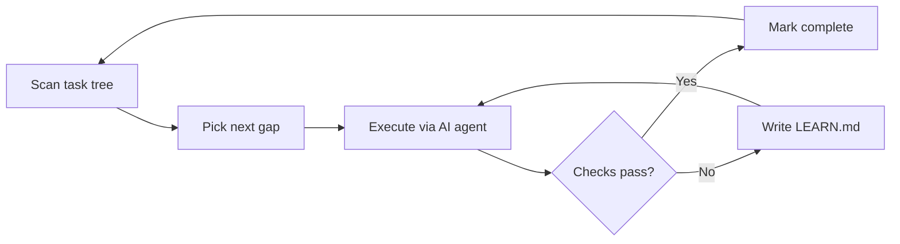

<div align="center">


### Define done. Converge gets there.

[](./LICENSE)
[](https://www.npmjs.com/package/@converge/core)
[](https://www.typescriptlang.org/)
[](https://nodejs.org/)

</div>

Converge is an open-source, TypeScript-native framework for orchestrating complex AI agent workflows. Instead of defining steps, graphs, or roles, you declare what "done" looks like — what files must exist, what checks must pass — and Converge continuously measures gaps, generates work to close them, and self-corrects when things fail.

270 lines of core logic. 92% test coverage. 7 runtime dependencies.

```bash
npm install -g @converge/core
```

## Why Converge?

**Gap-driven, not step-driven** — SQL describes what data you want, not how to fetch it. Terraform describes what infrastructure you want, not what API calls to make. Converge describes what the finished project looks like and figures out the rest.

**Self-correcting across attempts** — When a check fails, Converge writes a structured LEARN.md analyzing what went wrong. The next attempt reads that analysis and applies targeted corrections instead of retrying blind.

**Filesystem is the plan** — Your `.converge/` directory is the execution plan. `ls` is your dashboard, `cat` is your debugger, `git diff` shows exactly what changed. No opaque state stores.

**Deterministic verification** — Checks are shell commands: `grep`, `test`, `npm test`, `python validate.py`. Real assertions against real files, not AI judgment calls.

**Dynamic task spawning** — WBS scripts decompose work at runtime based on project state. Scope emerges from the problem, not from a predetermined graph.

**Crash-safe checkpoints** — Kill the process, restart, and Converge picks up exactly where it left off. Long-running workflows survive interruptions.

**Multi-provider** — Claude, Gemini, Kimi, and Qwen via the `agentfn` abstraction. No vendor lock-in.

## How It Works



Converge runs a continuous loop: scan the task tree for incomplete work, pick the next gap, execute it with an AI agent following markdown instructions, and verify with shell-based checks. When a check fails, the agent writes a LEARN.md capturing what went wrong. The next attempt reads that analysis and applies targeted corrections. The loop repeats until every task passes or the budget is exhausted.

## Quick Start

```bash
npm install -g @converge/core
converge init --name="my-api"
converge plan "REST API with health check endpoint and test suite"
converge run
```

Converge generates a task tree from your description. Each task includes target files, shell-based checks, and instructions for the AI agent. Here's what a generated task looks like:

```markdown
---
title: Health Check Endpoint
outputs:
  - src/routes/health.ts
  - src/routes/health.test.ts
checks:
  - id: server-starts
    cmd: npx tsx src/index.ts &; sleep 2; curl -sf http://localhost:3000/health; kill %1
    description: Health endpoint returns 200
  - id: tests-pass
    cmd: npx vitest run src/routes/health.test.ts
    description: Health check tests pass
---

Implement a GET /health endpoint that returns `{ "status": "ok" }`.
Write unit tests covering the success case and response shape.
```

`converge run` discovers gaps (missing files, failing checks), executes tasks, self-corrects on failure, and repeats until done.

## Use Cases

**Software Development** — Full application builds where requirements flow through design, implementation, tests, and docs. Checks run linters, type checkers, and test suites at every step. Failed tests produce structured analysis; the next attempt applies targeted fixes.

**Deep Research** — Multi-source literature reviews, competitive analyses, and synthesis reports. Tasks gather sources, extract findings, cross-reference, and synthesize — each step verified before the next begins.

**Scientific Research** — Literature reviews, hypothesis formulation, experiments, and academic paper drafting. Checks enforce GRADE evidence ratings, statistical rigor, and contradiction resolution. Bayesian priors update across epochs; the loop stops when quality scores converge.

**Content Production** — Blog posts, documentation, marketing copy with editorial checks. Checks enforce word counts, required sections, link validity, and brand voice consistency. Playbooks encode your editorial process for repeatable execution.

**Business Automation** — Client deliverables, compliance audits, onboarding workflows. Define what the final package looks like; Converge assembles it from templates, data sources, and verification steps.

The domain doesn't matter. If you can describe what done looks like, Converge can get there.

## Documentation

- **[Getting Started](./docs/getting-started.md)** — Install, configure, and run your first workflow
- **[Architecture & Reference](./packages/core/README.md)** — Core internals, task format, and full API
- **[Why Converge?](./docs/why-converge.md)** — Problem statement and design philosophy
- **[Architecture Decisions](./docs/adr/)** — ADRs for key design choices
- **[Contributing](./CONTRIBUTING.md)** — Development setup and guidelines

## Acknowledgements

Converge draws from ideas that predate AI agents: SQL's declarative data retrieval, Terraform's desired-state infrastructure, and control theory's feedback loops. The gap-driven convergence model applies these proven patterns to AI orchestration — measure the distance to done, generate work to close it, verify, correct, repeat.

## License

MIT — see [LICENSE](./LICENSE)

<div align="center">

Gap-driven. Convergent. Markdown-first.

</div>
