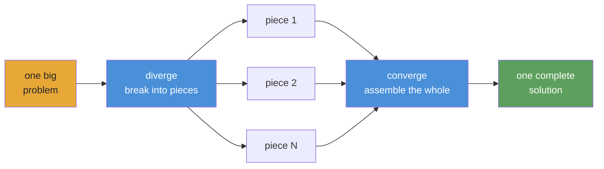

<div align="center">


# Converge

**AI Agent harnessing for durable autonomous playbooks.**

[](https://www.npmjs.com/package/@openplaybooks/converge)
[](https://github.com/openplaybooks-dev/converge/stargazers)
[](./LICENSE)
[](https://nodejs.org/)
[](https://www.typescriptlang.org/)
[](./examples)
[](./docs/getting-started/install.md)

[Quick Start](#quick-start) · [Examples](./examples) · [Docs](./docs) · [Translations](./i18n) · [Contributing](./CONTRIBUTING.md)

</div>

---

## What Converge Is

The current AI agent landscape is powerful, but still fragmented and manual. We have good models, good tools, and good skills, but turning them into a reliable workflow for complex work still takes a lot of glue.

Converge is a framework for autonomous playbooks. It lets you chain tasks and skills into a complex workflow an agent can run end to end, with checks, retries, and self-correction built into the loop.

A playbook is the durable artifact: versioned, inspectable, and runnable. It captures the structure of the work, the expected outputs, and the checks that make the result trustworthy.

**Not a static workflow. A living playbook.**

## Quick Start

> ⚠️ **Token consumption warning:** Converge dispatches AI agents that call LLM APIs. A playbook can consume tens of millions of tokens. Use a cheap model — see [Provider setup](#provider-setup) below.

### 1. Install

```bash
npm install -g @openplaybooks/converge
```

<details>
<summary><strong>Or: let your coding agent install Converge for you</strong> — copy-paste prompt</summary>

Paste the prompt below into Claude Code, Codex, or any other coding agent in the directory where you want the project to live. The agent will install Converge, scaffold the project, pick a provider that matches the API keys you already have, ask you for a one-line goal, generate the first playbook, and dry-run it for you.

```markdown
You are setting up Converge — an autonomous-agent playbook runner — in the
current directory. Do this end-to-end, asking me only when you must.

1. **Install.** Run `npm install -g @openplaybooks/converge` (skip if `converge --version` already works). Print the installed version.

2. **Detect a provider.** Look at my environment in this order — first match wins, and tell me which one you picked:
   - `MINIMAX_API_KEY`        → `--provider-template=claude` with `ANTHROPIC_BASE_URL=https://api.minimax.io/anthropic`, `ANTHROPIC_AUTH_TOKEN=${MINIMAX_API_KEY}`, `ANTHROPIC_MODEL=MiniMax-M2.7`
   - `DEEPSEEK_API_KEY`       → `--provider-template=claude` with `ANTHROPIC_BASE_URL=https://api.deepseek.com/anthropic`, `ANTHROPIC_AUTH_TOKEN=${DEEPSEEK_API_KEY}`, `ANTHROPIC_MODEL=deepseek-v4-pro[1m]`
   - `ANTHROPIC_API_KEY`      → `--provider-template=claude` (default Anthropic endpoint)
   - `CODEX_API_KEY` or `OPENAI_API_KEY` → `--provider-template=codex`
   - none of the above → ask me which provider to use; if I don't know, default to `--provider-template=claude` and remind me I'll need to set an API key before `converge run` (not `--dry`).

3. **Scaffold.** Run `converge init --name=<repo-or-folder-name> --provider-template=<chosen>` non-interactively. If the project already exists, ask before passing `--force`.

4. **Patch the provider config** for the chosen route. Edit `.converge/project.yaml` so the `env:` block under the provider matches the mapping in step 2 (e.g. add `ANTHROPIC_BASE_URL` and `ANTHROPIC_MODEL` for MiniMax/DeepSeek). Do not invent keys I haven't set.

5. **Ask me for the goal.** One sentence: "What should this playbook do?" Wait for my reply.

6. **Create the first playbook.** Run `converge add --from-prompt "<my one-liner>"`. Show me the playbook name it picked.

7. **Verify.** Run `converge run --dry` and show me the output. It should print "Will run: …" and "Dry run — N task(s) would execute." with no errors. If it fails, show me the exact error and stop.

8. **Report.** Tell me: provider used, playbook name created, number of tasks, the exact command to actually execute (`converge run`), and which API key needs to be set if any.

Rules:
- Never invent API keys or commit secrets.
- If a step fails, stop and show me the raw error — do not retry blindly.
- Do not delete `.converge/` or `node_modules/` without asking.
```

</details>

### 2. Bootstrap a project

```bash
converge init --name=my-project --provider-template=codex
```

### 3. Create a playbook

```bash
# Start from a built-in example (no AI needed)
converge add --from-example hello-world

# Or generate one from a prompt (requires AI config)
converge add --from-prompt "Literature review on in-context learning"
```

### 4. Run

```bash
converge run
```

That's it. The five-minute walkthrough: **[Your first playbook](./docs/getting-started/your-first-playbook.md)**.

---

## The Playbook Bet

The current generation of AI agents is already powerful. You can see it in projects like [`gstack`](https://github.com/garrytan/gstack), [`superpowers`](https://github.com/obra/superpowers), [`agent-skills`](https://github.com/addyosmani/agent-skills), Anthropic's [`financial-services`](https://github.com/anthropics/financial-services), and [`claude-seo`](https://github.com/AgriciDaniel/claude-seo). They show what happens when prompts turn into reusable skills, specialist roles, and domain workflows.

But they also point at the same missing piece. A lot of this power is still hard to carry forward. The good parts often live inside a specific setup, a specific host, or a pile of manual glue.

That led to a simple question: what if the real artifact was not the session, but the playbook?

Converge takes that idea in an autonomous direction. A playbook should not just document the work. It should run. It should chain tasks and skills into a larger system, adapt to the shape of the problem, verify its own outputs, and self-correct when something breaks.

That is the bet behind Converge: playbooks can grow from small recipes into complex autonomous systems, and the more people write them, share them, and improve them together, the more the community gets a reusable library of real agent work instead of isolated sessions. The runner makes execution effortless. The playbook keeps the knowledge.

---

## What Makes Converge Different

**Checks, not vibes.** Every task declares shell-command checks — `tsc`, `grep`, `eslint`, a test suite. The runtime loops until they pass. No LLM judging its own output.

**Fingerprint caching, not checkpoint files.** Every node gets a SHA-256 fingerprint. Unchanged nodes skip execution — like dbt's incremental models. Kill at node 47; re-run picks up from what completed.

**Playbooks, not prompts.** A chat transcript dies with the session. A playbook is version-controlled TASK.md files. Same inputs, same outputs, every run. Anyone on the team can re-run it.

**DAG, not context window.** A chat window exhausts after a few features. A playbook DAG breaks work into independent TASK.md files — each fits in one window. The runtime chains them topologically. 670 tasks, zero lost context.

**Swap providers, not rewrite workflows.** Claude, Gemini, Kimi, Qwen, Codex — change one config, same playbook runs. Stub mode for zero-cost offline development.

**Dynamic scope, not static wiring.** Tasks can expand work at runtime through the current CLI-seed contract (`seed: { mode: cli }` plus `converge spawn ...`), so one scene becomes one task, one stock ticker becomes one analysis branch. The DAG grows to fit the problem, not the template.

---

## How It Works

**You write playbooks as markdown files and folders. Converge compiles them into a DAG and dispatches AI agents to run it.**



**The mental model: diverge → converge.** Break the problem into independent pieces, run them in parallel, assemble the result. Recursive — any piece can itself diverge.

## Playbook Structure

A playbook is authored as a small set of top-level phases, with reusable templates for the work that fans out at runtime. Each `TASK.md` declares what it produces and the shell commands that check whether it's done.

```
.converge/playbooks/{name}/
├── playbook.yml
├── tasks/
│   ├── 01-requirements/TASK.md
│   ├── 02-design/TASK.md
│   ├── 03-scaffold/TASK.md   # seed: { mode: cli } parent
│   └── 04-integrate/TASK.md
└── templates/
    ├── page/TASK.md          # reusable page blueprint
    ├── api/TASK.md           # reusable endpoint blueprint
    ├── db-model/TASK.md      # reusable schema/model blueprint
    └── component/TASK.md     # reusable shared UI blueprint
```

For a full-stack app, `01-requirements` can define the product brief, feature list, and user flows. `02-design` can turn that into screen structure, data shape, and architecture boundaries. Then `03-scaffold` reads that spec and emits `converge spawn template ...` commands to materialize as many concrete tasks as needed: `home-page`, `dashboard-page`, `settings-page`, `auth-api`, `users-api`, `billing-api`, `user-model`, `invoice-model`, shared UI components, and more.

That is the selling point: one authored playbook stays compact, but one seeded parent task can fan out into N page, API, database, and component tasks from reusable templates. `04-integrate` then wires the outputs back together into one working app. The DAG grows to fit the problem, not the template.

The runtime walks that DAG in topological layers. Each node either executes (AI agent + shell checks) or is cached (fingerprint unchanged from previous run). Failed nodes retry up to the attempt cap; downstream nodes wait until dependencies complete. Like dbt's `run` — deterministic ordering, incremental caching, no loops.

---

## What You Can Build

Every example below marked **available** is a real, runnable playbook in [`examples/`](./examples/). Examples marked **coming soon** are designed but not yet shipped.

### Starter

| Example                                      | Status     | Description                                                          |
| -------------------------------------------- | ---------- | -------------------------------------------------------------------- |
| [`hello-world`](./examples/hello-world/)     | available  | Simplest possible playbook — one task, two checks                    |
| [`data-pipeline`](./examples/data-pipeline/) | available  | Sequential pipeline: fetch → transform → validate                    |

### Software

| Example                                      | Status     | Description                                                          |
| -------------------------------------------- | ---------- | -------------------------------------------------------------------- |
| [`fullstack-app`](./examples/fullstack-app/) | available  | Seed-driven dynamic backend + frontend generation                    |
| [`flutter-app`](./examples/flutter-app/)     | available  | Autonomous mobile app generation in Flutter / Dart                   |
| [`app-builder`](./examples/app-builder/)     | coming soon | Generic app scaffolding playbook                                    |

### Research

| Example                                                  | Status     | Description                                                                              |
| -------------------------------------------------------- | ---------- | ---------------------------------------------------------------------------------------- |
| [`deep-research`](./examples/deep-research/)             | available  | Layered iterative-deepening with quality-gated progression                               |
| [`scientific-research`](./examples/scientific-research/) | available  | Bayesian reasoning, GRADE evidence, meta-analysis, paper generation — 8-phase epoch loop |
| [`frontier-research`](./examples/frontier-research/)     | available  | Beam-search frontier exploration with parallel beams and convergence tracking            |

### Simulation

| Example                                  | Status      | Description                                                                  |
| ---------------------------------------- | ----------- | ---------------------------------------------------------------------------- |
| [`social-sim`](./examples/social-sim/)   | available   | Loop-based persona-driven social simulation with spawned child tasks per tick |
| [`game-ai-pk`](./examples/game-ai-pk/)   | coming soon | Persistent-cast reality-show single-episode game                              |

### Optimization

| Example                                                              | Status     | Description                                                                              |
| -------------------------------------------------------------------- | ---------- | ---------------------------------------------------------------------------------------- |
| [`evolutionary-optimization`](./examples/evolutionary-optimization/) | available  | Fitness-landscape search for prompt tuning, hyperparameter sweeps, training recipes      |

### Provider integration

| Example                                  | Status     | Description                                                                              |
| ---------------------------------------- | ---------- | ---------------------------------------------------------------------------------------- |
| [`acp-demo`](./examples/acp-demo/)       | available  | Claude Agent SDK (`acp`) provider — programmatic agent invocation                        |

### Coming soon

These examples are designed but not yet shipped — see the linked issue or watch the [`examples/`](./examples/) directory for updates:

- `cinematic-video-production` — AI film director: `idea.md` → consistent cinematic clip library
- `game-assets-video` — platformer asset pack from a single `idea.md`
- `autonomous-pentest` — multi-stage pentest sweep with PoC-gated findings (authorized use only)
- `financial-deep-research` — multi-phase equity research with per-ticker analysis
- `baby-app` — minimal full-stack starter template

[Browse all examples →](./examples/)

---

## Provider setup

Converge supports multiple runtime providers. The project scaffold and CLI currently expose first-class provider IDs for **Claude** (`provider: claude`), **Codex** (`provider: codex`), **ACP / OpenAI-compatible endpoints** (`provider: acp`), **Kimi** (`provider: kimi`), **Qwen** (`provider: qwen`), **Gemini** (`provider: gemini`), and **DeepCode** (`provider: deepcode`). You configure them in `.converge/project.yaml`. **Use a cheap model for development** — Claude Opus costs $15/$75 per 1M tokens; cheap models cost under $1/$3.

### Recommended cheap models

| Model                 | Input / 1M | Output / 1M | Best for                    |
| --------------------- | ---------- | ----------- | --------------------------- |
| `deepseek-v4-flash`   | $0.27      | $1.10       | Sub-agents, fast checks     |
| `deepseek-v4-pro[1m]` | $0.55      | $2.19       | Primary reasoning           |
| `MiniMax-M2.7`        | $0.50      | $1.50       | Balanced price/perf         |
| Claude Opus 4.5       | $15.00     | $75.00      | Highest quality (expensive) |

### Sample `.converge/project.yaml`

```yaml
# .converge/project.yaml
name: my-project

ai:
  default: claude
  providers:
    # ── Claude Code backend ──────────────────────────
    claude:
      provider: claude
      env:
        # Route through DeepSeek (cheap)
        ANTHROPIC_BASE_URL: https://api.deepseek.com/anthropic
        ANTHROPIC_AUTH_TOKEN: "${DEEPSEEK_API_KEY}"
        ANTHROPIC_MODEL: deepseek-v4-pro[1m]
        ANTHROPIC_DEFAULT_HAIKU_MODEL: deepseek-v4-flash
        CLAUDE_CODE_SUBAGENT_MODEL: deepseek-v4-flash

        # Or route through MiniMax-M2.7 (uncomment to use)
        # ANTHROPIC_BASE_URL: "https://api.minimax.io/anthropic"
        # ANTHROPIC_AUTH_TOKEN: "${MINIMAX_API_KEY}"
        # ANTHROPIC_MODEL: "MiniMax-M2.7"

    # ── Codex backend ────────────────────────────────
    codex:
      provider: codex
      env:
        CODEX_API_KEY: "${CODEX_API_KEY}"
        # Or set OPENAI_API_KEY instead
```

**Claude Code** runs via the `claude` CLI — set `DEEPSEEK_API_KEY` or `MINIMAX_API_KEY` in your environment. **Codex** runs via the `codex` CLI (`npm i -g @openai/codex`) — set `CODEX_API_KEY` or `OPENAI_API_KEY`. Converge resolves `${VAR}` references automatically. `converge init` scaffolds this file for you.

> **Bundled examples default to MiniMax.** Every example in [`examples/`](./examples/) ships with a `.converge/project.yaml` that routes Claude through `https://api.minimax.io/anthropic` using `MiniMax-M2.7`. Set `MINIMAX_API_KEY` in your environment and they run end-to-end. To use a different provider, override `ANTHROPIC_BASE_URL` / `ANTHROPIC_MODEL` (or edit the per-example `project.yaml`).

Full guide: [Switching providers](./docs/guides/switch-providers.md).

---

## Integrations

Converge integrates at two layers:

- **Coding agents** for authoring and operating playbooks from your workspace
- **Runtime providers** for executing tasks inside the playbook itself

### Coding agents

Converge ships with two bundled **skills** so you can design and run playbooks without leaving your coding agent:

| Skill               | What it does                                                                                                     |
| ------------------- | ---------------------------------------------------------------------------------------------------------------- |
| `converge-planning` | Design a new playbook from a prompt — generates PLAN.md, TASK.md files, dependency graph, and shell-level checks |
| `converge-control`  | Run and monitor a playbook — classifies DAG events, diagnoses failures, re-runs incrementally                    |

### End-to-end flow

```bash
# 1. Bootstrap a project with skills installed
converge init --name=my-project --skills

# 2. In your coding agent, design the playbook
/converge-planning   # "Build a REST API for user management with auth"

# 3. Run
converge run

# 4. Hand off to converge-control — it monitors, diagnoses, and re-runs on failure
/converge-control    # run → monitor → retry failures
```

<details>
<summary><strong>Claude Code</strong></summary>

- `converge init --skills` installs bundled skills to `.claude/skills/`
- Claude Code auto-discovers skills from that directory
- Invoke them directly with `/converge-planning` and `/converge-control`

```bash
converge init --name=my-project --skills

# Re-run on an existing project to install bundled skills only
converge init --skills
```

</details>

<details>
<summary><strong>Codex</strong></summary>

- `converge init --skills` also installs bundled skills to `.codex/skills/`
- Codex reads skills from that directory the same way
- Use the same Converge skills to plan and operate playbooks from your Codex workspace

```bash
converge init --name=my-project --skills

# Re-run on an existing project to install bundled skills only
converge init --skills
```

</details>

<details>
<summary><strong>Other coding-agent setups</strong></summary>

- Bundled coding-agent skill installation is documented here for Claude Code and Codex specifically
- Runtime provider portability is configured separately in `.converge/project.yaml`

See [Switching providers](./docs/guides/switch-providers.md).

</details>

### Skill behavior

- Type `/skill-name` to invoke: the skill loads its reference docs, CLI commands, event catalog, and troubleshooting recipes with full context
- `converge-planning` handles the upfront design phase; `converge-control` takes over during execution

### Install skills to an existing project

```bash
converge init --skills
```

### Runtime providers

The playbook runtime is the portable layer. You can switch providers in `.converge/project.yaml` without rewriting the playbook.

<details>
<summary><strong>Claude</strong></summary>

- First-class backend via `provider: claude`
- Runs through the `claude` CLI
- Supports Anthropic-compatible routing like DeepSeek or MiniMax through `ANTHROPIC_BASE_URL`

</details>

<details>
<summary><strong>Codex</strong></summary>

- First-class backend via `provider: codex`
- Runs through the `codex` CLI
- Uses `CODEX_API_KEY` or `OPENAI_API_KEY`

</details>

<details>
<summary><strong>Gemini, Kimi, Qwen, and OpenAI-compatible endpoints</strong></summary>

- Converge scaffolds direct provider IDs for `provider: gemini`, `provider: kimi`, and `provider: qwen`
- Use `provider: acp` when you want an arbitrary OpenAI-compatible endpoint or a custom `baseUrl`
- Mixing cheaper and stronger providers inside one playbook is the main cost/performance lever

</details>

<details>
<summary><strong>Portable by design</strong></summary>

- Skills help agents do the work
- Playbooks define the work
- Providers are execution backends you can swap underneath the same playbook

</details>

---

## Packages

| Package                                  | Path                                    | Purpose                                                                                                    |
| ---------------------------------------- | --------------------------------------- | ---------------------------------------------------------------------------------------------------------- |
| [`@openplaybooks/converge-core`](./packages/core/)     | `packages/core/`                        | Programmatic TypeScript engine: runner registry, task graph, state machine, repair strategies.              |
| [`@openplaybooks/converge`](./packages/cli/)       | `packages/cli/`                         | Canonical npm install target for `converge`. Bootstrap, run, watch, tail. Drives runs via provider backends. |
| [`@openplaybooks/studio`](./packages/studio/) | `packages/studio/`                      | Web UI for visualizing runs, inspecting tasks, browsing journals.                                          |
| Provider packs                           | `packages/{claude,gemini,kimi,qwen}fn/` | Provider-specific backends. Swap without changing playbooks.                                               |

---

## Dogfood

Significant parts of this repo were built by Converge running playbooks against itself — CLI redesign (63 tasks), landing page (65 tasks), docs generation, and more. [See the receipts →](./.converge/playbooks/). If the runtime didn't work, this README would be hand-typed.

### Dogfooded CI

The repo's own contribution flow is run by Converge. Deterministic gates (build, test, typecheck, format, commit-message lint, secret scan) run automatically on every PR. On top of that, maintainers can trigger Converge playbooks from the Actions tab:

- [`ci-pr-review`](./.converge/playbooks/ci-pr-review/) — reviews a PR diff and posts a structured comment
- [`ci-docs-drift`](./.converge/playbooks/ci-docs-drift/) — flags docs whose `sources:` frontmatter no longer matches the code
- [`ci-commit-lint`](./.converge/playbooks/ci-commit-lint/) — explains why a commit fails the message convention and proposes a fix
- [`ci-release-notes`](./.converge/playbooks/ci-release-notes/) — drafts release notes from commits since the previous tag

The bot reviewing your PR is itself a playbook. Edit the prompt and open a PR.

> **`v0.1.0` · public preview** — Runtime ships. **12 runnable example playbooks** across software, research, simulation, and provider integration. More coming soon.

---

## Translations

- [Tiếng Việt](./i18n/vi/README.md)
- [Español](./i18n/es/README.md)
- [Português do Brasil](./i18n/pt-BR/README.md)
- [简体中文](./i18n/zh-CN/README.md)
- [日本語](./i18n/ja/README.md)

---

## Community

- **[Discussions](https://github.com/openplaybooks-dev/converge/discussions)** — questions, ideas, playbook patterns
- **[Issues](https://github.com/openplaybooks-dev/converge/issues)** — bug reports, feature requests
- **[Contributing](./CONTRIBUTING.md)** — dev setup, project structure, how to ship a PR

---

## License

MIT — see [LICENSE](./LICENSE)

<div align="center">

**Autonomous · Repeatable · Verifiable**

</div>
