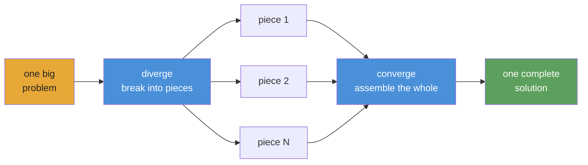
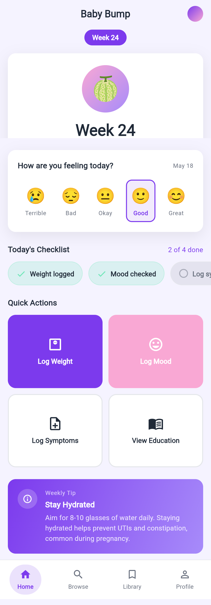

<div align="center">


# Converge

### Long-running AI agents that adapt until outcomes converge.

Converge runs autonomous agents through adaptive, multi-step playbooks.

[](https://www.npmjs.com/package/@openplaybooks/converge)
[](https://github.com/openplaybooks-dev/converge/stargazers)
[](./LICENSE)
[](https://nodejs.org/)
[](https://www.typescriptlang.org/)
[](./examples)
[](./docs/getting-started/install.md)

[Quick Start](#quick-start) · [Examples](./examples) · [Docs](./docs) · [Translations](./i18n) · [Contributing](./CONTRIBUTING.md)

</div>

---

## Overview

Converge runs AI coding agents (Claude, Codex, …) through a chain of tasks defined as a **reusable, shareable playbook**. Each task declares its outputs and shell-check exit criteria; the **adaptive execution loop** retries failures and can spawn follow-up tasks that match the shape of the project at runtime; a **persistent run journal** lets a killed run resume instead of starting over.

---

## Why This Exists

Most "agent skills" today are prompts: instructions written down once, with the hope the agent follows them next time. That works for a single step and falls apart across many, because nothing enforces that each step's output is real before the next one consumes it.

Repos like [`gstack`](https://github.com/garrytan/gstack), [`superpowers`](https://github.com/obra/superpowers), [`agent-skills`](https://github.com/addyosmani/agent-skills), and [`claude-seo`](https://github.com/AgriciDaniel/claude-seo) do make it work, by chaining tasks and threading context between them by hand. The chain is doing the heavy lifting, not the prompt.

Converge makes that chain a first-class artifact: each task declares what it produces and the shell checks that prove it, and the engine resets the context window at every task boundary, so long-running work stays affordable instead of compounding.

---

## Quick Start

> ⚠️ **Token consumption warning:** Converge dispatches AI agents that call LLM APIs. A playbook can consume tens of millions of tokens. Use a cheap model; see [Provider Setup](./docs/getting-started/install.md) below.

### 1. Install

```bash
npm install -g @openplaybooks/converge
```

Prefer to have your coding agent do it? See [Pro tips → Let your coding agent install Converge](#7-pro-tips).

### 2. Bootstrap a project

```bash
mkdir my-project && cd my-project # or just cd into an existing project root
converge init --skills
```

`converge init` scaffolds `.converge/project.yaml` into your current directory.
`--skills` installs the bundled `/converge-planning` and `/converge-control`
skills into `.claude/skills/` (and `.codex/skills/`). If you've already run
`converge init`, re-running with `--skills` will only update the skills — it
won't overwrite your project config.

### 3. Create a playbook

```bash
# Start from a built-in example (no AI needed)
converge add --from-example hello-world
```

### 4. Run

```bash
converge run
```

That's it. The five-minute walkthrough: **[Your first playbook](./docs/getting-started/your-first-playbook.md)**.

**Provider setup:** `converge init` scaffolds `.converge/project.yaml` with provider config. Fill in any `$VAR` placeholders in that file or export them in your shell before running. See [Provider Setup](./docs/getting-started/install.md) for the full provider matrix.

### 5. Pro tips

<details>
<summary><strong>Babysit with Claude</strong> — two prompts, hours of unattended work</summary>

Converge runs best when an instance of Claude Code is watching it, not fire-and-forget. The intended happy path is end-to-end inside Claude.

**Step A — launch Claude and plan the playbook.** Open Claude Code in your project directory, then type:

```text
/converge-planning

Plan a playbook that scrapes the top 20 HN posts every hour,
summarises each thread with comments, and writes a daily digest
to ./digests/YYYY-MM-DD.md.
```

The `/converge-planning` skill takes over: decomposes the goal, writes TASK.md files, declares dependencies, and wires shell-level checks. You end with a runnable playbook on disk under `.converge/playbooks/<name>/`.

**Step B — hand the run to Claude to babysit.** Once the playbook exists, ask Claude to drive it. Give it the playbook path so `/converge-control` knows exactly what to watch:

```text
/converge-control

Babysit the playbook at .converge/playbooks/hn-digest/.
Run it, monitor the event stream, and fix any task that fails
— diagnose, patch, and re-run until every node passes.
```

Under `/converge-control`, every level of the playbook auto-resolves: DAG nodes, dynamically spawned children, retries, repairs. Failures are classified and replayed without manual graph surgery, so a babysat run can chug along for hours straight without a human in the loop. You walk back to your laptop and the playbook is either done or sitting on a real failure worth looking at.

</details>

<details>
<summary><strong>Let your coding agent install Converge</strong> — copy-paste prompt</summary>

Paste the prompt below into Claude Code, Codex, or any other coding agent in the directory where you want the project to live. The agent will install Converge, scaffold the project, pick a provider that matches the API keys you already have, ask you for a one-line goal, generate the first playbook, and dry-run it for you.

```markdown
You are setting up Converge — an autonomous-agent playbook runner — in the current directory. Work in 4 phases. Ask me only when a phase requires a decision.

1. **Analyze the project.** Look at the current directory and report what's here in one short paragraph. Cover: is this a git repo (and on what branch)? what languages/frameworks does the file tree suggest? is there an existing `.converge/` directory? anything I should be careful about (heavy `node_modules`, committed secrets, etc.)? If the directory looks like the wrong place to drop a Converge project, stop and ask me.

   Also confirm `converge --version` works. If it doesn't, run `npm install -g @openplaybooks/converge` and print the installed version.

2. **Ask which auth path I want.** Don't guess from environment variables — present these options verbatim and wait for me to pick. Each maps to a `--backend` (the agent CLI) + `--provider` (the LLM endpoint) combo for `converge init`. Tell me the exact `export` for the API-key env var I need, if any, and wait for confirmation before moving on.

   **A. Claude via OAuth (recommended).** `--backend=claude --provider=anthropic-oauth`. Run `claude login` once if I haven't. No env vars to set.

   **B. Claude via Anthropic API key.** `--backend=claude --provider=anthropic`. Tell me to `export ANTHROPIC_API_KEY=sk-ant-…`.

   **C. Claude via cheap Anthropic-compatible proxy.** Ask which:
   - **MiniMax** → `--backend=claude --provider=minimax`. Tell me to `export MINIMAX_API_KEY=…`.
   - **DeepSeek** → `--backend=claude --provider=deepseek`. Tell me to `export DEEPSEEK_API_KEY=…`.

   **D. Codex CLI.** `--backend=codex --provider=openai`. Tell me to `export CODEX_API_KEY=…` (or `OPENAI_API_KEY`).

   **E. Other backend (Gemini / Kimi / Qwen / ACP / DeepCode).** Use `--backend=<name>`; the matching `--provider=<name>` is the default. Tell me which vendor API-key env var to set.

3. **Scaffold the project.** Confirm the current working directory is the intended project root (the one you analyzed in step 1). If a fresh folder is wanted, ask before `mkdir <name> && cd <name>`. If cwd already has a `.converge/` directory, ask before passing `--force`. Then run:

       converge init --skills --backend=<chosen> --provider=<chosen>

   non-interactively. The project name is taken from cwd. `--skills` installs the bundled `/converge-planning` and `/converge-control` skills under `.claude/skills/` (and `.codex/skills/`). Proxy providers (`minimax`, `deepseek`) bake the full routing into `.converge/project.yaml` — no per-shell `ANTHROPIC_*` exports needed.

4. **Offer playbook creation.** Ask me one question: *"Want to design your first playbook now?"*

   - If yes — **hand off to the `/converge-planning` skill**. That skill knows the full authoring workflow (decompose the goal, write TASK.md files, declare dependencies and checks); don't try to replicate it. Just invoke `/converge-planning` and let it take over.
   - If no — tell me to start later by invoking `/converge-planning` inside Claude Code, or by copying a built-in template with `converge add --from-example hello-world`.

Rules:
- Never invent API keys or commit secrets.
- If a step fails, stop and show me the raw error. In particular: if `converge run` ever returns `Invalid API key` / HTTP 401, the cause is almost always conflicting `ANTHROPIC_*` env vars from a previous setup — go back to step 2 with me, don't retry blindly.
- Do not delete `.converge/`, `node_modules/`, or anything in cwd without explicit confirmation.
```

</details>

---

## Adaptive execution loops

Each task is a markdown file that declares its **outputs** and the shell **checks** that prove them. Converge resolves dependencies into a DAG, runs tasks in parallel where it can, retries failures with structured context, spawns work it didn't know it needed, and swaps providers without changing the playbook. That's the loop that adapts when reality breaks the plan.



The mental model: **diverge → converge**. Break the problem into independent pieces, run them in parallel, assemble the result. Recursive: any piece can itself diverge.

## Reusable playbooks

A playbook is authored once as a small set of top-level phases, with reusable templates for the work that fans out at runtime. Each `TASK.md` declares what it produces and the shell commands that check whether it's done, so the same playbook can be re-run, forked, or adapted to a new domain without rewriting the graph.

```
my-project/
├── .converge/
│   ├── project.yaml          # ← created by `converge init`
│   ├── playbooks/
│   │   └── default/
│   │       ├── playbook.yml   # ← created by `converge add`
│   │       ├── tasks/         # ← static, authored tasks
│   │       │   └── 01-create-greeting/
│   │       │       └── TASK.md
│   │       ├── templates/     # ← reusable blueprints for dynamic/frontier tasks
│   │       │   ├── page/
│   │       │   │   └── TASK.md
│   │       │   └── api/
│   │       │       └── TASK.md
│   │       ├── scripts/       # ← optional: helpers called from task bodies or checks
│   │       │   ├── verify-bundle.sh
│   │       │   └── build-manifest.ts
│   │       └── skills/        # ← playbook-scoped SKILL.md files
│   │           └── research/
│   │               └── SKILL.md
│   ├── inventory/
│   │   └── default/
│   │       └── tasks.jsonl
│   └── _archive/             # ← prior playbook snapshots
└── output/                   # ← task outputs (gitignored)
```

Complex playbooks may also include `journal/` (run state). See any example in [`examples/`](./examples/) for a complete working structure.

Authored playbooks stay compact; the DAG fans out at runtime when `mode: spawner` tasks write a `spawn.plan.jsonl` manifest and the framework applies it automatically. Drop reusable shell or TS helpers in the playbook's `scripts/` directory and invoke them from a task's body or `checks:` when shell one-liners get unwieldy.

---

## Persistent run journal

Every run is journalled to `.converge/journal/`. Each task's declared outputs and shell-check results land on disk as the run progresses, so a killed or interrupted run can be resumed instead of restarted, and `converge inspect` can replay what happened without a separate telemetry stack.

Richer memory primitives (frontier checkpoints, typed lessons, cross-machine portable resume) are designed in [`docs/rfcs/`](./docs/rfcs/) but not all shipped yet.

---

## What You Can Build

Every example below marked **available** is a real, runnable playbook in [`examples/`](./examples/). Examples marked **coming soon** are designed but not yet shipped.

### Showcase: real long-running playbooks

Each demo links to its own repository, which contains the playbook, the run journal, and the code Converge produced. Some are not yet published.

<div align="center">

<table>
  <tr>
    <td align="center" width="33%">
      <a href="https://github.com/openplaybooks-dev/converge-example-baby-app">
        <br/>
        <b><code>baby-app</code></b>
      </a><br/>
      
      
      <br/>
      <sub>Long-running playbook that builds a pregnancy companion app</sub>
    </td>
    <td align="center" width="33%">
      <br/>
      <b><code>app-builder</code></b><br/>
      
      
      <br/>
      <sub>Generate full-stack SaaS apps from a spec</sub>
    </td>
    <td align="center" width="33%">
      <br/>
      <b><code>cinematic-video-production</code></b><br/>
      
      
      <br/>
      <sub>End-to-end shot list → render pipeline</sub>
    </td>
  </tr>
  <tr>
    <td align="center" width="33%">
      <br/>
      <b><code>autonomous-pentest</code></b><br/>
      
      <br/>
      <sub>Recon → exploit → report, one playbook</sub>
    </td>
    <td align="center" width="33%">
      <br/>
      <b><code>financial-deep-research</code></b><br/>
      
      
      <br/>
      <sub>Research agent for equity and market analysis</sub>
    </td>
    <td align="center" width="33%">
      <br/>
      <b><code>game-ai-pk</code></b><br/>
      
      
      <br/>
      <sub>Agent-vs-agent gameplay arena</sub>
    </td>
  </tr>
</table>

</div>

### Available examples

| Example                                                              | Domain               | Description                                                                              |
| -------------------------------------------------------------------- | -------------------- | ---------------------------------------------------------------------------------------- |
| [`hello-world`](./examples/hello-world/)                             | Starter              | Simplest possible playbook — one task, two checks                                        |
| [`data-pipeline`](./examples/data-pipeline/)                         | Starter              | Sequential pipeline: fetch → transform → validate                                        |
| [`fullstack-app`](./examples/fullstack-app/)                         | Software             | Spawner-driven dynamic backend + frontend generation                                     |
| [`flutter-app`](./examples/flutter-app/)                             | Software             | Autonomous mobile app generation in Flutter / Dart                                       |
| [`deep-research`](./examples/deep-research/)                         | Research agent       | Layered iterative-deepening with quality-gated progression                               |
| [`scientific-research`](./examples/scientific-research/)             | Research agent       | Bayesian reasoning, GRADE evidence, meta-analysis, paper generation — 8-phase epoch loop |
| [`frontier-research`](./examples/frontier-research/)                 | Research agent       | Beam-search frontier exploration with parallel beams and convergence tracking            |
| [`social-sim`](./examples/social-sim/)                               | Simulation           | Loop-based persona-driven social simulation with spawned child tasks per tick            |
| [`evolutionary-optimization`](./examples/evolutionary-optimization/) | Optimization         | Fitness-landscape search for prompt tuning, hyperparameter sweeps, training recipes      |
| [`acp-demo`](./examples/acp-demo/)                                   | Provider integration | Claude Agent SDK (`acp`) provider — programmatic agent invocation                        |

**Coming soon:** `game-assets-video`. Designed but not yet shipped — watch [`examples/`](./examples/) for updates.

[Browse all examples →](./examples/)

---

## Provider Setup

`converge init` writes `.converge/project.yaml` for you. Pick a backend (the agent CLI — `claude`, `codex`, `gemini`, `kimi`, `qwen`, `acp`, `deepcode`) and a provider (the LLM endpoint — Anthropic, MiniMax, DeepSeek, OpenAI, …), and Converge wires up the rest.

**Use a cheap model for development.** A playbook can burn tens of millions of tokens; the price gap matters:

| Model                 | Input / 1M | Output / 1M | Best for               |
| --------------------- | ---------- | ----------- | ---------------------- |
| `deepseek-v4-flash`   | $0.27      | $1.10       | Sub-agents, checks     |
| `MiniMax-M2.7`        | $0.50      | $1.50       | Balanced price/perf    |
| `deepseek-v4-pro[1m]` | $0.55      | $2.19       | Primary reasoning      |
| Claude Opus 4.5       | $15.00     | $75.00      | Highest quality        |

> **Bundled examples default to MiniMax.** Every example in [`examples/`](./examples/) routes Claude through `https://api.minimax.io/anthropic` using `MiniMax-M2.7`. Set `MINIMAX_API_KEY` and they run end-to-end.

- **Initial setup** — every backend × provider combo with the exact `project.yaml` each `converge init` writes: [Provider setup](./docs/getting-started/provider-setup.md).
- **Per-task overrides** — mixing cheap and premium models inside one playbook: [Switch providers](./docs/guides/switch-providers.md).

---

## Integrations

Converge integrates at two layers:

- **Coding agents** for authoring and operating playbooks from your workspace
- **Runtime providers** for executing tasks inside the playbook itself

### Coding agents

Converge ships with two bundled **skills** so you can design and run playbooks without leaving your coding agent:

| Skill               | What it does                                                                                                     |
| ------------------- | ---------------------------------------------------------------------------------------------------------------- |
| `converge-planning` | Design a new playbook from a prompt — generates PLAN.md, TASK.md files, dependency graph, and shell-level checks |
| `converge-control`  | Run and monitor a playbook — classifies DAG events, diagnoses failures, re-runs incrementally                    |

`converge init --skills` installs the bundled skills to `.claude/skills/` and `.codex/skills/`.

### Runtime providers

The playbook runtime is the portable layer. You can switch providers in `.converge/project.yaml` without rewriting the playbook.

<details>
<summary><strong>Claude</strong></summary>

- First-class backend via `provider: claude`
- Runs through the `claude` CLI
- Supports Anthropic-compatible routing like DeepSeek or MiniMax through `ANTHROPIC_BASE_URL`

</details>

<details>
<summary><strong>Codex</strong></summary>

- First-class backend via `provider: codex`
- Runs through the `codex` CLI
- Uses `CODEX_API_KEY` or `OPENAI_API_KEY`

</details>

<details>
<summary><strong>Gemini, Kimi, Qwen, and OpenAI-compatible endpoints</strong></summary>

- Converge scaffolds direct provider IDs for `provider: gemini`, `provider: kimi`, and `provider: qwen`
- Use `provider: acp` when you want an arbitrary OpenAI-compatible endpoint or a custom `baseUrl`
- Mixing cheaper and stronger providers inside one playbook is the main cost/performance lever

</details>

<details>
<summary><strong>Portable by design</strong></summary>

- Skills help agents do the work
- Playbooks define the work
- Providers are execution backends you can swap underneath the same playbook

</details>

---

## Packages

| Package                                  | Path                                    | Purpose                                                                                                    |
| ---------------------------------------- | --------------------------------------- | ---------------------------------------------------------------------------------------------------------- |
| [`@openplaybooks/converge-core`](./packages/core/)     | `packages/core/`                        | Programmatic TypeScript engine: runner registry, task graph, state machine, repair strategies.              |
| [`@openplaybooks/converge`](./packages/cli/)       | `packages/cli/`                         | Canonical npm install target for `converge`. Bootstrap, run, watch, tail. Drives runs via provider backends. |
| Provider packs                           | `packages/{claude,gemini,kimi,qwen}fn/` | Provider-specific backends. Swap without changing playbooks.                                               |

---

## Contributing

This repo ships features through three playbooks at [`.converge/playbooks/`](./.converge/playbooks/):

```
sources → rfc-ideation → human → rfc-shipping → code-audit → human → shipped
```

`rfc-ideation` drafts RFCs. A maintainer accepts one. `rfc-shipping` opens the PR. `code-audit` reviews it. A maintainer merges.

| To contribute… | Do this |
|---|---|
| An idea | Drop a file in [`docs/ideas/`](./docs/ideas/) |
| A bug or request | Open an [issue](https://github.com/openplaybooks-dev/converge/issues) |
| A code change | Open a PR |

Dev setup is in [`CONTRIBUTING.md`](./CONTRIBUTING.md). The full SDLC is in [`.converge/README.md`](./.converge/README.md).

---

## Translations

- [Tiếng Việt](./i18n/vi/README.md)
- [Español](./i18n/es/README.md)
- [Português do Brasil](./i18n/pt-BR/README.md)
- [简体中文](./i18n/zh-CN/README.md)
- [日本語](./i18n/ja/README.md)

---

## Community

- **[Discussions](https://github.com/openplaybooks-dev/converge/discussions)** — questions, ideas, playbook patterns
- **[Issues](https://github.com/openplaybooks-dev/converge/issues)** — bug reports, feature requests
- **[Contributing](./CONTRIBUTING.md)** — dev setup, project structure, how to ship a PR

---

## Sponsors & enterprise support

### Sponsors

<table>
  <tr>
    <td align="center" width="220">
      <a href="https://mezon.ai">
        
      </a>
      <br />
      <strong><a href="https://mezon.ai">Mezon</a></strong>
      <br />
      <sub>The Live, Work, and Play Platform.</sub>
    </td>
    <td align="center" width="220">
      <a href="https://ncc.plus">
        
      </a>
      <br />
      <strong><a href="https://ncc.plus">NCC.plus</a></strong>
      <br />
      <sub>Enterprise AI adoption services.</sub>
    </td>
  </tr>
</table>

To sponsor Converge or list your services here, open an [issue](https://github.com/openplaybooks-dev/converge/issues) or reach out via [Discussions](https://github.com/openplaybooks-dev/converge/discussions).

---

## License

MIT — see [LICENSE](./LICENSE)

<div align="center">

**Autonomous · Repeatable · Verifiable**

</div>
