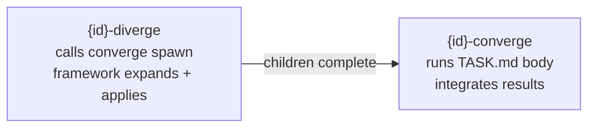

# Convergence

Every task that's too large for a single step follows the same rhythm: **diverge, let children execute, converge.** It's the pattern that gives Converge its name: not a brand, but a description of what the runtime does.

## The three phases

```
DIVERGE                    EXECUTE                    CONVERGE
───────                    ───────                    ────────
Parent splits         Children run             Parent reads their
into sub-tasks        independently            outputs, integrates,
                                               validates the whole
```

**1. Diverge.** The parent analyzes its scope and identifies the sub-problems that together cover it. It spawns children: either statically (hand-written TASK.md files in `tasks/`) or dynamically (a `mode: spawner` body calls `converge spawn <id> <template> --var key=value...` per child; the framework expands templates and applies — RFC 0024).

**2. Execute.** Children run independently. They don't know about each other. Each reads its declared inputs, does its work, produces its declared outputs. Children of the same parent run in parallel when their dependencies allow it.

**3. Converge.** The parent gathers children's outputs, integrates them, and produces the converged result. This is active work: reading files, cross-validating, assembling. The parent's output isn't "B and C ran." It's a verified, integrated whole.

## Recursive at every level

The pattern is recursive. A child can itself diverge, spawn its own sub-tasks, and converge their results before handing a clean output up to its parent.

```
Task A: "Build Dashboard"
├── DIVERGE: split into Data Pipeline + UI Components
├── CHILDREN EXECUTE:
│   ├── B: "Data Pipeline"
│   │   ├── DIVERGE: split into fetch + transform
│   │   ├── execute fetch, execute transform
│   │   └── CONVERGE: validate schema, join, produce data.json
│   └── C: "UI Components"
│       ├── DIVERGE: split into charts + tables
│       ├── execute charts, execute tables
│       └── CONVERGE: validate components, produce components/
└── CONVERGE: read data.json + components/, assemble dashboard,
    validate integration, produce dashboard/
```

Every level adds value through convergence. B's converge produces clean data. C's converge produces clean UI. A's converge produces the integrated dashboard. No level is just a folder.

## In the DAG: two nodes per container

In the execution DAG, a container task becomes two nodes:



- **`{id}-diverge`** runs first. For `mode: spawner` it calls `converge spawn <id> <template> --var key=value...` per child and the framework expands them against templates; for static children it simply marks itself done. Children depend on it.
- **Children** execute independently. Each produces its declared `outputs:`.
- **`{id}-converge`** runs after all children complete. It depends on every child. It executes the TASK.md body: pure convergence instructions. Division was already handled by the spawner body or static children. The body reads children's outputs, integrates, validates, and produces the converged result.

The DAG flows only forward. No re-queue, no push-back. Diverge → children → converge, at every level.

## The TASK.md body is the converge prompt

The body runs only during convergence. Division is handled by the `mode: spawner` body (which calls `converge spawn <id> <template> --var key=value...` per child) or by static children in the `tasks/` directory. The body of a converging parent is pure convergence instructions: what to do with children's outputs.

```markdown
---
id: build-dashboard
outputs:
  - dashboard/index.html
inputs:
  - data-pipeline/data.json
  - ui-components/components/
checks:
  - cmd: test -f dashboard/index.html
---

Read data-pipeline/data.json and ui-components/components/.
Assemble them into dashboard/index.html.
Validate every data field binds to a UI component.
If any component references missing data, report the gap.
```

There's no `## Division` section in the body. The spawner body handles spawning children (via `converge spawn <id> <template> --var key=value...` calls); the converger body handles integrating their results. The LLM reads it like any other task prompt: the difference is timing — the converge node only runs after all children complete.

## Passthrough vs. converging containers

The converge node always exists. What changes is whether the body is empty.

**Empty body = passthrough.** The converge node completes immediately when children are done. No work, no integration: just a DAG join point. Useful when the parent exists only to group children and downstream tasks need a single dependency target.

**Non-empty body = convergence.** The converge node runs the body as its prompt: reads children's outputs, integrates, validates, produces the converged result. The litmus test: *what does this parent produce that no child produces individually?* If the answer is something, write a body.

The converge node is unconditional. Every container gets a diverge and a converge. The body decides whether the converge does work or just passes through.

## How the runtime handles it

The runtime detects containers automatically during DAG construction. No configuration is needed:

1. **At compile time**, `buildDagFromPlaybookObject` detects containers (tasks with `mode: spawner` / `mode: converger` or static children under `tasks/`) and splits them into diverge + converge nodes.
2. **During execution**, the diverge node runs first. For `mode: spawner`, the body calls `converge spawn <id> <template> --var key=value...` per child and the framework expands them against templates and applies; children are then wired to the converge node's `depends_on`.
3. **After children complete**, the converge node naturally becomes ready in the DAG (all its dependencies are satisfied) and executes.
4. **The converge node runs like any task**: no special execution path. Its TASK.md body is the prompt.

## Crash safety

The split-node model is crash-safe by construction. `runstate.json` persists the status of every node:

| Crash point | Resume behavior |
|---|---|
| Before diverge runs | Diverge is `pending` → executes normally |
| After diverge, before children | Diverge `pass` (skip), children restored from runstate, converge node wired to restored children |
| Mid-children (some done) | Completed children skip, pending re-run, converge waits |
| Mid-converge | Converge `running` → `pending` → re-executes |

On resume, `runstate.json` is the single source of truth. Completed nodes are skipped. The converge node's dependencies are re-wired from the persisted child list.

## Where this lives in the codebase

| Component | File |
|---|---|
| DAG node type | `packages/core/src/dag/dag-node.ts:3` |
| DAG construction + container split | `packages/core/src/run.ts:1054-1092` |
| Converge wiring during spawn | `packages/core/src/run.ts:969-983` |
| Converge wiring during resume | `packages/core/src/run.ts:341-354` |
| Converge wiring via `executeDag` | `packages/core/src/dag/dag-runner.ts:130-142` |
| Example: agentic-calculator | `examples/agentic-calculator/` |
| Planning skill: model reference | `skills/converge-planning/references/model.md` |
