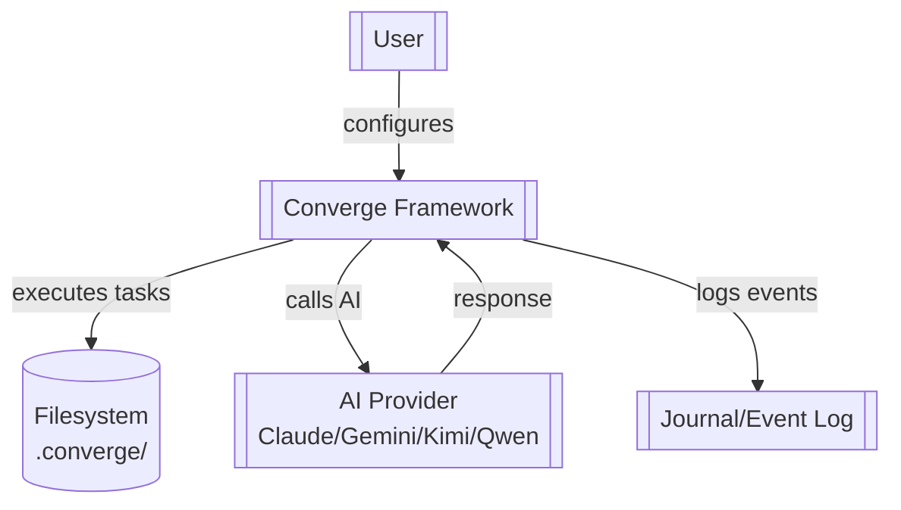
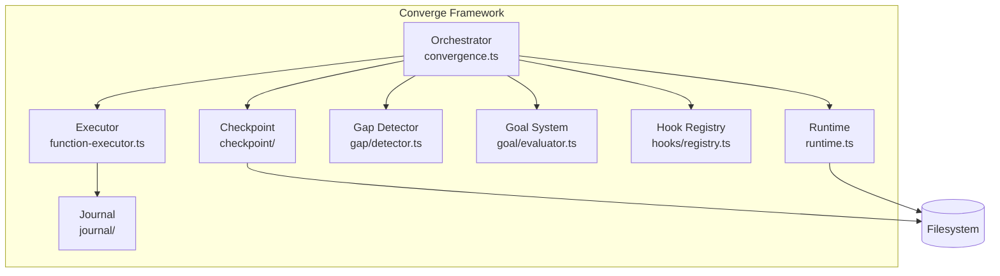
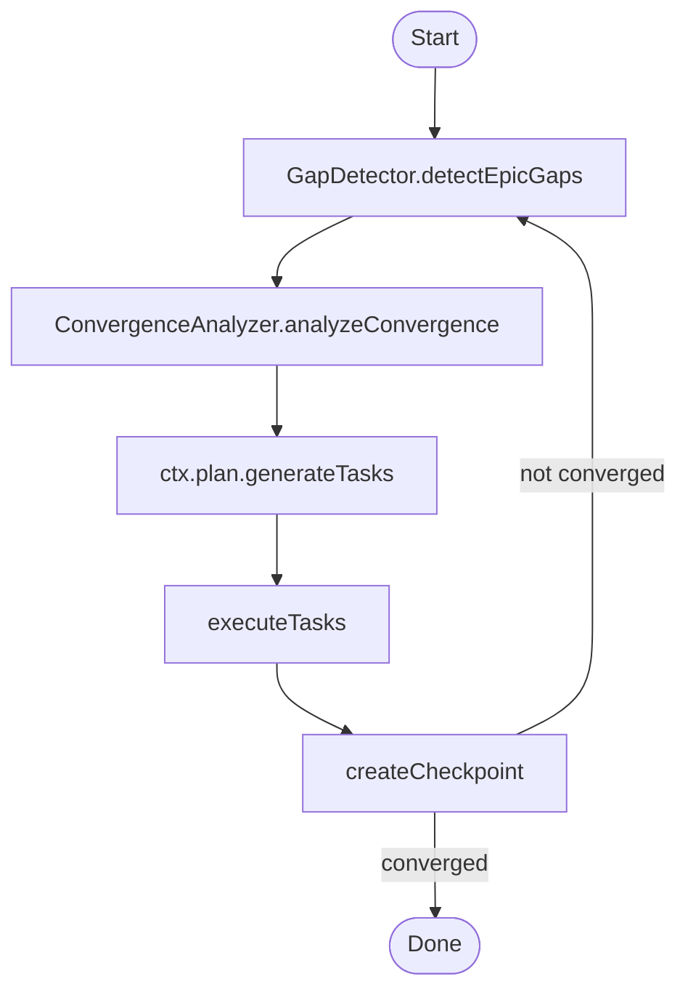
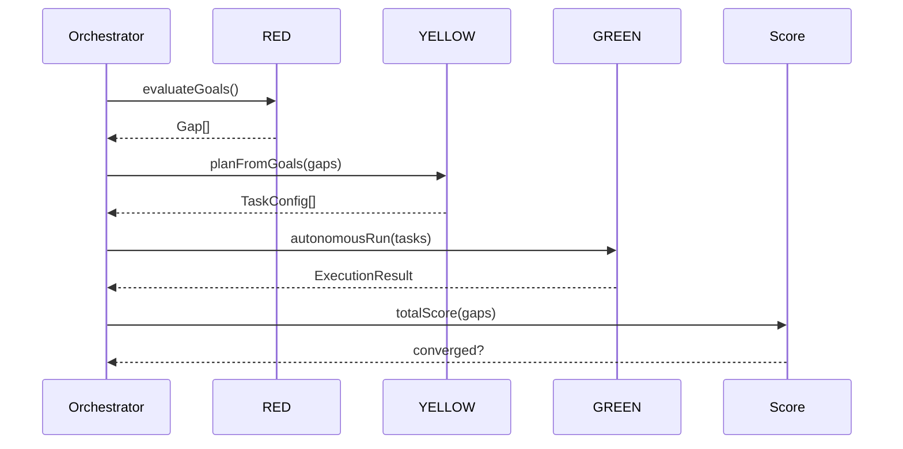
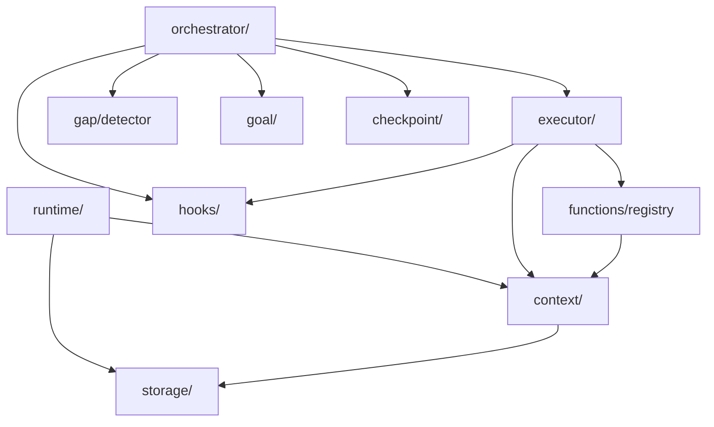

# Architecture Overview

## System Context (C4 Level 1)

## Container Architecture (C4 Level 2)

## Convergence Loop (Component Architecture)

## Core Components

### Orchestrator (`orchestrator/convergence.ts`)
- **Responsibility**: Main convergence loop controller
- **Role**: Coordinates evaluate → plan → execute → checkpoint cycle
- **Key Method**: `runEpicConvergence()`

### Runtime (`runtime/runtime.ts`)
- **Responsibility**: Provides all manager interfaces
- **Components**:
  - `GoalManagerImpl` - Goal hierarchy management
  - `TaskManagerImpl` - Task lifecycle management
  - `EpicManagerImpl` - Epic coordination
  - `ProjectManagerImpl` - Project-level operations

### Gap System (`gap/detector.ts`)
- **Responsibility**: Detect and track gaps between current and desired state
- **Components**:
  - `GapDetector` - Identifies gaps
  - `ConvergenceAnalyzer` - Analyzes convergence state
- **Gap Types**: structural, semantic, quality, integration
- **Gap Levels**: project, epic, task

### Goal System (`goal/evaluator.ts`)
- **Responsibility**: Goal hierarchy and satisfaction evaluation
- **Hierarchy**: Epic → Goal → Sub-goal
- **Key Functions**: `GoalEvaluatorImpl`, `extractTasksFromUnsatisfiedGoals()`

### Executor (`executor/function-executor.ts`)
- **Responsibility**: Execute TaskFn via registry with retry logic
- **Components**:
  - `FunctionExecutor` - Single task execution
  - `BatchExecutor` - Parallel execution
- **Features**: Exponential backoff retry, post-execution checks

### Function Registry (`functions/registry.ts`)
- **Responsibility**: Central registry for all functions
- **Function Types**:
  - `CheckFn` - Verification functions
  - `EvalFn` - Evaluation functions
  - `PlanFn` - Planning functions
  - `TaskFn` - Task execution functions

### Context System (`context/`)
- **Responsibility**: Immutable context hierarchy
- **Hierarchy**:
  - `ProjectContext` - Project-level APIs (fs, shell, log, git, eval, plan)
  - `EpicContext` - Epic-level context (inherits ProjectContext)
  - `TaskContext` - Task-level context (inherits EpicContext)
- **Pattern**: Read-only access, child inherits from parent

### Storage (`storage/`)
- **Responsibility**: Filesystem-native persistence
- **Locations**:
  - `.converge/project.yaml` - Project config
  - `.converge/epics/{id}.yaml` - Epic configs
  - `.converge/epics/{id}/tasks/{id}.yaml` - Task configs
  - `.converge/epics/{id}.status.yaml` - Runtime status
- **Pattern**: YAML configs tracked in git, status files runtime-generated

### Hooks (`hooks/registry.ts`)
- **Responsibility**: Lifecycle event system
- **Events**: task:start, task:complete, epic:start, epic:complete, gap:resolved
- **Features**: Priority ordering, error isolation, legacy plugin bridge

### Journal (`journal/`)
- **Responsibility**: Event logging and execution trace
- **Components**:
  - `EventWriter` - Writes events to log
  - `ExecutionTrace` - Traces task execution
  - `GapLedger` - Tracks gap resolution

### Checkpoint (`checkpoint/`)
- **Responsibility**: Crash-safe resumability
- **V3 Model**: Stores cursor + execution context only
- **Pattern**: Tree traversal naturally resumes from cursor

## Wave-Based Convergence Model

**Waves**:
1. **RED Wave**: Evaluate all goals for satisfaction
2. **YELLOW Wave**: Generate TASK.md files for unsatisfied goals
3. **GREEN Wave**: Execute implementation tasks
4. **Score**: Measure progress, repeat if not converged

## Key Design Decisions

### 1. Filesystem-Native Storage
- **Decision**: `.converge/` directory IS the plan
- **Rationale**: `ls` becomes dashboard, `git diff` shows changes, no opaque state
- **Trade-off**: Less efficient than DB, but more debuggable and git-friendly

### 2. Gap-Driven vs Task-Driven
- **Decision**: Gaps drive work generation, not static task lists
- **Rationale**: System adapts to actual state, not assumed state
- **Trade-off**: More compute at runtime, but more reliable convergence

### 3. Immutable Context Hierarchy
- **Decision**: ProjectContext → EpicContext → TaskContext (read-only inheritance)
- **Rationale**: Prevents accidental cross-task contamination
- **Trade-off**: More object creation, but safer execution

### 4. Shell-Based Verification
- **Decision**: Checks are shell commands (`grep`, `npm test`)
- **Rationale**: Real assertions against real files, no mocking
- **Trade-off**: Platform-dependent, but trustworthy

## Module Dependencies

