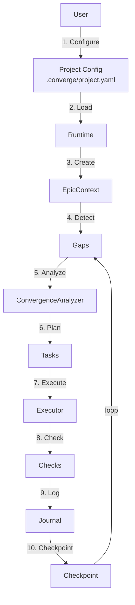
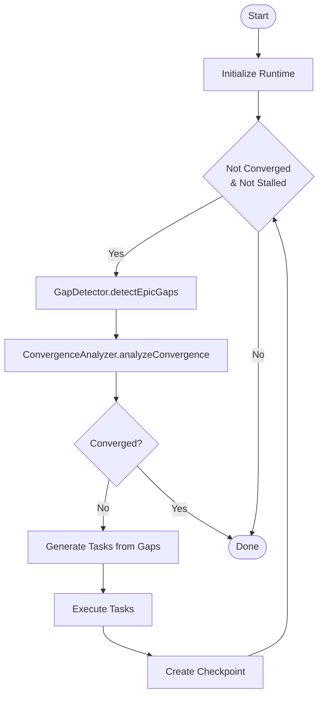
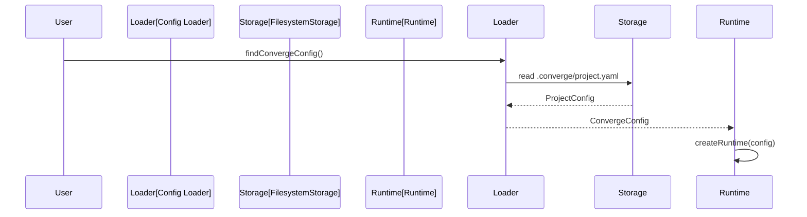
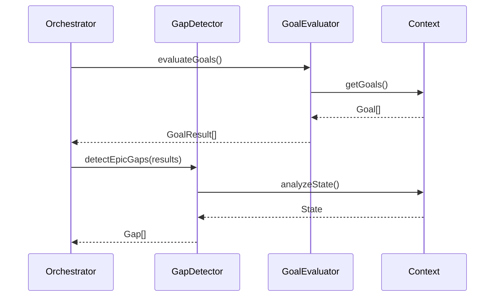
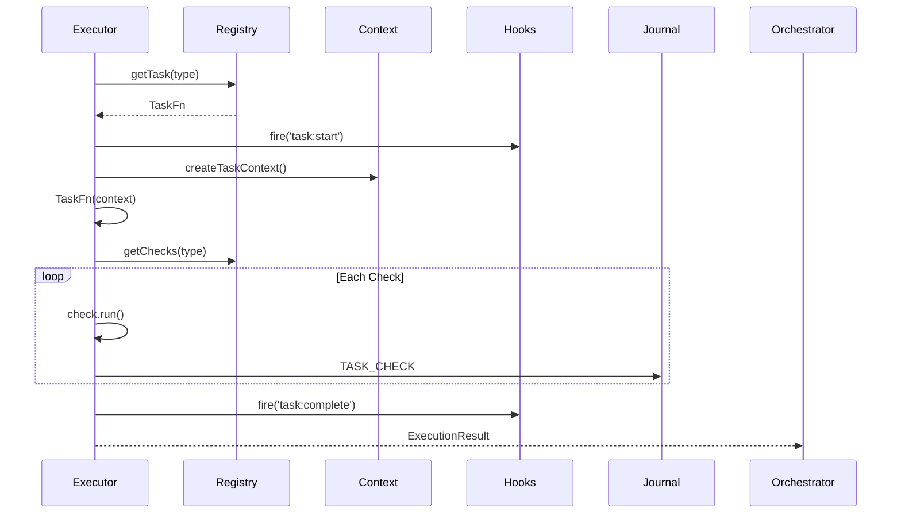
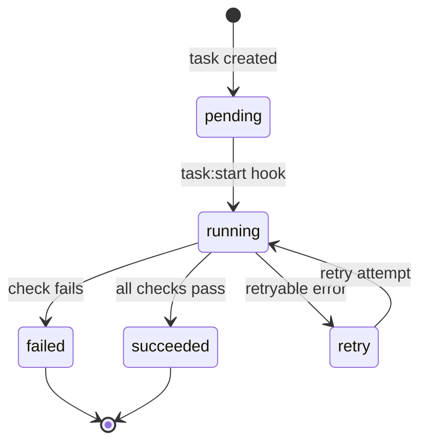
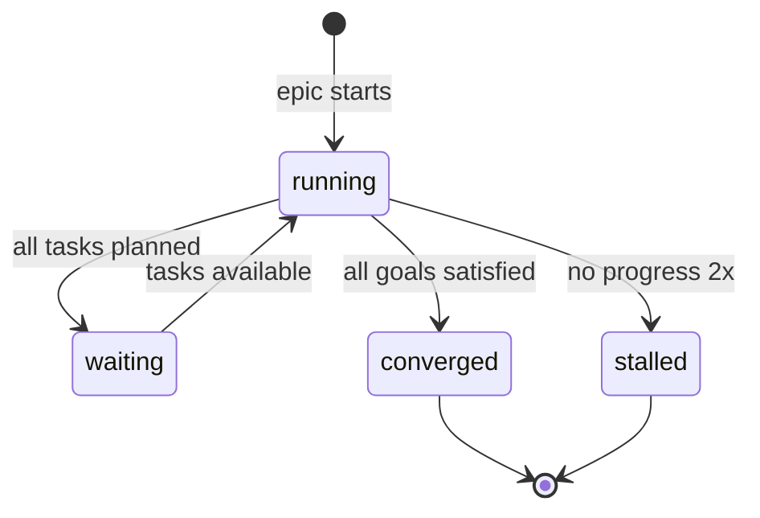
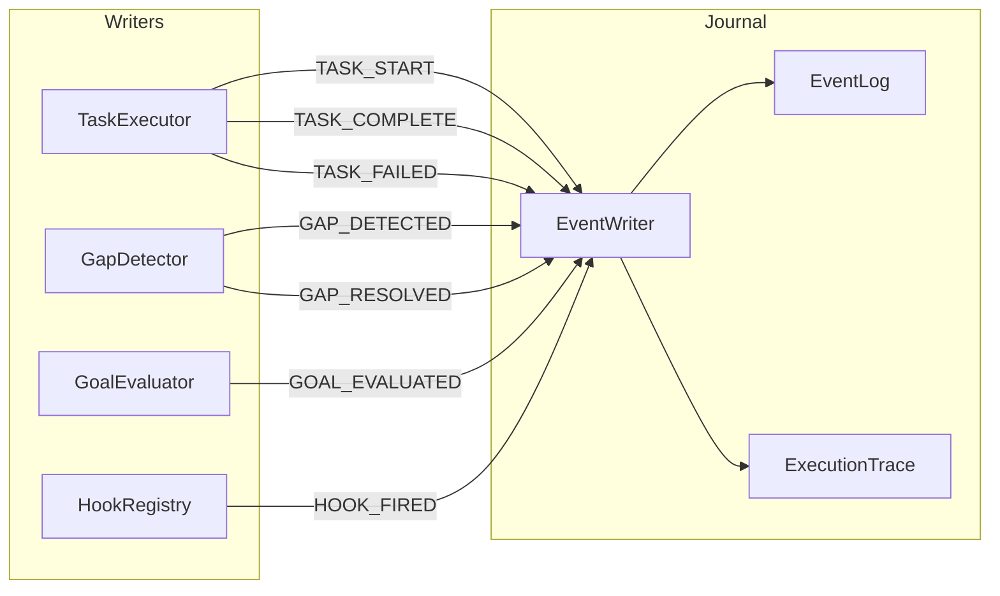
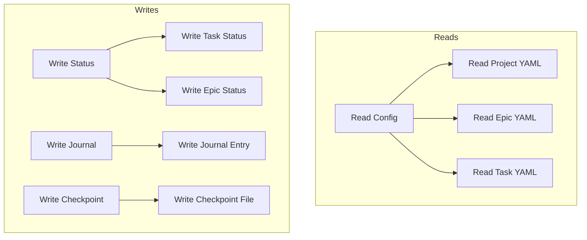

# Data Flow

## End-to-End Execution Flow



## Convergence Orchestrator Flow



## Data Flow Between Modules

### 1. Configuration Loading



### 2. Gap Detection



### 3. Task Execution



## Data Models

### ProjectConfig
```typescript
interface ProjectConfig {
  id: string;
  title?: string;
  goals: Goal[];
  variables?: Record<string, string>;
  plugins?: PluginManifest[];
  ai?: AIProviderConfig;
  epicDefaults?: Partial<EpicConfig>;
}
```

### Gap
```typescript
interface Gap {
  id: string;
  type: 'structural' | 'semantic' | 'quality' | 'integration';
  level: 'project' | 'epic' | 'task';
  description: string;
  severity: 'critical' | 'high' | 'medium' | 'low';
  resolved: boolean;
  timestamp: number;
  relatedGoals?: string[];
}
```

### TaskConfig
```typescript
interface TaskConfig {
  id: string;
  title: string;
  type: string;
  inputs?: TaskInput[];
  outputs?: TaskOutput[];
  checks?: CheckConfig[];
  retries?: number;
  timeout?: number;
}
```

### ExecutionResult
```typescript
interface ExecutionResult {
  taskId: string;
  success: boolean;
  duration: number;
  output?: string;
  error?: string;
  checkResults?: CheckResult[];
  attempts: number;
}
```

## State Transitions

### Task State Machine



### Epic State Machine



## Journal Event Flow



## Checkpoint Data

Minimal checkpoint state for crash recovery:

```typescript
interface Checkpoint {
  epicId: string;
  cursor: string;          // Current position in task tree
  executionContext: {
    completedTasks: string[];
    pendingTasks: string[];
    currentTask?: string;
  };
  gapState: {
    resolvedGaps: string[];
    pendingGaps: string[];
  };
  timestamp: number;
}
```

## Storage Read/Write Flow


