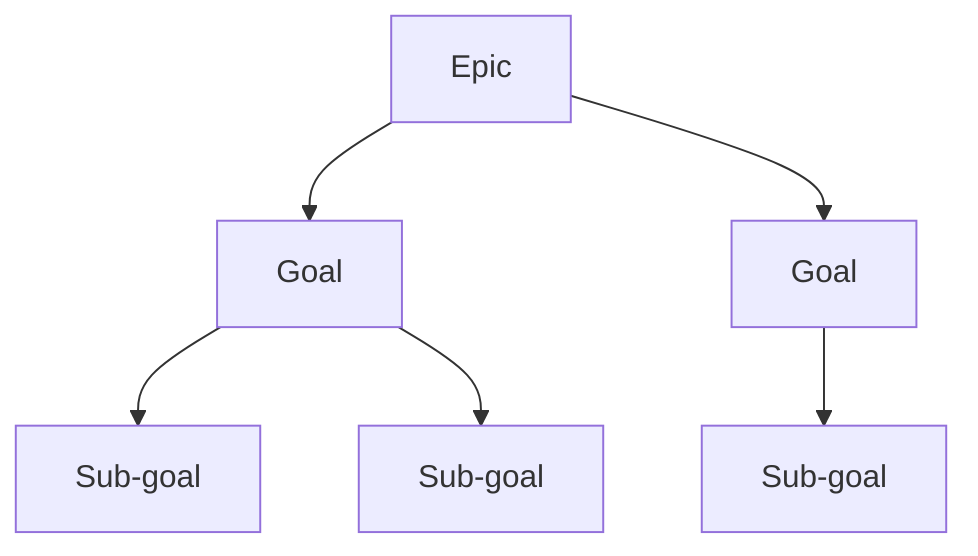
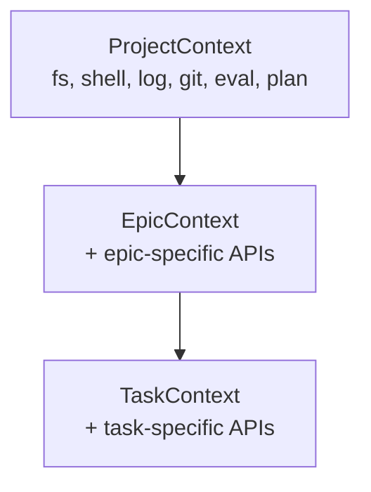
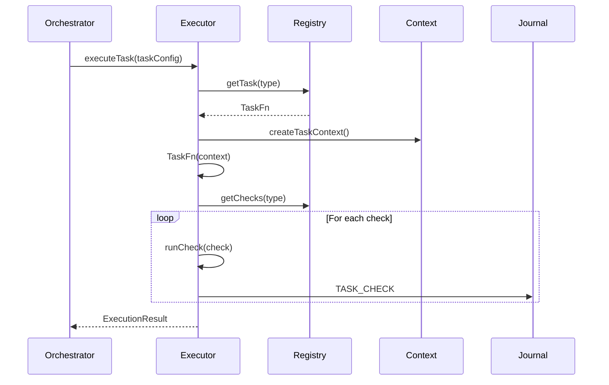

# Features

## Core Features

### 1. Gap-Driven Execution

The system continuously detects **gaps** between current and desired state.

**Gap Types**:
- `structural` - Missing files, directories, configurations
- `semantic` - Logic errors, incomplete implementations
- `quality` - Code style, test coverage, documentation
- `integration` - API compatibility, dependency issues

**Gap Interface**:
```typescript
interface Gap {
  id: string;
  type: 'structural' | 'semantic' | 'quality' | 'integration';
  level: 'project' | 'epic' | 'task';
  description: string;
  severity: 'critical' | 'high' | 'medium' | 'low';
  resolved: boolean;
  timestamp: number;
}
```

### 2. Goal Hierarchy

Goals form a hierarchy: **Epic → Goal → Sub-goal**



**Goal Satisfaction**: Goals are evaluated by `EvalFn` functions registered in the global registry.

### 3. Wave-Based Convergence

Three-phase execution in waves:

| Wave | Phase | Description |
|------|-------|-------------|
| RED | Evaluate | Check all goals for satisfaction |
| YELLOW | Plan | Generate TASK.md for unsatisfied goals |
| GREEN | Execute | Run autonomous implementation |

### 4. Function Registry

Four function types registered centrally:

| Type | Purpose | Called By |
|------|---------|-----------|
| `CheckFn` | Verify task completion | Executor (post-run) |
| `EvalFn` | Evaluate goal satisfaction | Orchestrator |
| `PlanFn` | Generate tasks from goals | Planning phase |
| `TaskFn` | Execute task logic | Executor |

**Registry Usage**:
```typescript
// Register
registerTask('implementation', async (ctx) => { /* ... */ });

// Lookup and execute
const fn = getTask('implementation');
await fn(context);
```

### 5. Immutable Context Hierarchy



Each context is **read-only** and inherits parent capabilities.

### 6. Checkpoint System (V3)

Crash-safe resumability with minimal state:

- Only stores **cursor position** + **execution context**
- Tree traversal naturally resumes from cursor
- No full state serialization

### 7. Lifecycle Hooks

```typescript
interface ConvergeHooks {
  'task:start'?: HookFn;
  'task:complete'?: HookFn;
  'task:failed'?: HookFn;
  'epic:start'?: HookFn;
  'epic:complete'?: HookFn;
  'gap:resolved'?: HookFn;
  'goal:satisfied'?: HookFn;
}
```

Hooks are **priority-ordered** and **error-isolated** (hook failure doesn't stop execution).

### 8. Multi-Provider AI

Pluggable AI provider abstraction via `agentfn`:

- **claudefn** - Anthropic Claude
- **geminifn** - Google Gemini
- **kiminifn** - Moonshot Kimi
- **qwenfn** - Alibaba Qwen

```typescript
// All providers implement the same interface
interface AICaller {
  complete(prompt: string): Promise<AIResponse>;
  stream(prompt: string): AsyncGenerator<AIResponse>;
}
```

### 9. Self-Correction via LEARN.md

When checks fail:
1. Structured analysis written to `LEARN.md`
2. Next attempt reads and applies targeted fixes
3. Loop continues until convergence or max attempts

### 10. Playbook System

Unified workflow configuration:

```yaml
name: my-playbook
tasks:
  - source: ./playbooks/default/tasks/01-prepare
  - source: ./playbooks/default/tasks/02-build
  - source: ./playbooks/default/tasks/03-test
```

## Implementation Details

### Task Execution Flow



### Retry Logic

Exponential backoff with jitter:

```typescript
const delay = Math.min(baseDelay * 2 ** attempt, maxDelay);
const jitter = Math.random() * delay * 0.1;
await sleep(delay + jitter);
```

### Verification Strategy

Checks are **shell commands** that must exit 0:

```yaml
checks:
  - name: typescript-compiles
    command: npx tsc --noEmit
  - name: tests-pass
    command: npm test
  - name: no-console-error
    command: grep -r "console.error" src/ || true
```

### Journal Events

| Event | Payload |
|-------|---------|
| `TASK_START` | taskId, timestamp |
| `TASK_COMPLETE` | taskId, duration, result |
| `TASK_FAILED` | taskId, error |
| `TASK_RETRY` | taskId, attempt, delay |
| `GAP_DETECTED` | gap |
| `GAP_RESOLVED` | gap |
| `GOAL_SATISFIED` | goal |
