# Tokens preview — `grassland`

_24 tokens · biome=`grassland` · generated by `scripts/tokens_preview.py`._

Each token is shown with its sketch SVG, footprint, layer eligibility, and the gameplay + visual fields the painter and engine consume. See `TOKENS_SPEC.md` for the principles behind each field, `SCHEMA.md` for the file format.

## Categories

| Category | Folder | Count | Tokens |
|---|---|---|---|
| [Ground](#ground) | `ground/` | 5 | [`ground`](#token-ground), [`ground-10w`](#token-ground-10w), [`ground-20w`](#token-ground-20w), [`ground-3w`](#token-ground-3w), [`ground-bumpy`](#token-ground-bumpy) |
| [Platform](#platform) | `platforms/` | 3 | [`platform-wood`](#token-platform-wood), [`platform-wood-3w`](#token-platform-wood-3w), [`platform-wood-7w`](#token-platform-wood-7w) |
| [Hazard](#hazard) | `hazards/` | 3 | [`pond`](#token-pond), [`pond-3w`](#token-pond-3w), [`thorn-patch`](#token-thorn-patch) |
| [Decoration](#decoration) | `decorations/` | 4 | [`branch-frame`](#token-branch-frame), [`bush`](#token-bush), [`flower-patch`](#token-flower-patch), [`rock`](#token-rock) |
| [Background](#background) | `background/` | 5 | [`mountain-distant`](#token-mountain-distant), [`mountain-small`](#token-mountain-small), [`tree-band-far`](#token-tree-band-far), [`tree-cluster-mid`](#token-tree-cluster-mid), [`tree-cluster-near`](#token-tree-cluster-near) |
| [Marker](#marker) | `markers/` | 4 | [`exit`](#token-exit), [`pickup-key`](#token-pickup-key), [`pickup-potion`](#token-pickup-potion), [`spawn`](#token-spawn) |

## Ground

### `ground`

**symbol** `#` · **category** `ground` · **kind** `terrain` · **footprint** 5×1 · **layers** `play`

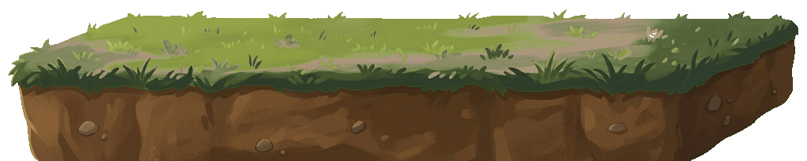

| field | value |
|---|---|
| anchor | `bottom-left` |
| passable | `false` |
| damage | `0` |
| beats | — |
| fill | `#5B3B1C` |
| material | grassy soil |
| detail_density | `medium` |
| sketch | [`ground/ground/concept.png`](ground/ground/concept.png) (1024×205px) |
| source | [`ground/ground/token.md`](ground/ground/token.md) |

**Art notes**

> Solid foreground earth — grass blades on top, packed dirt body
> below. Top edge meets sky cleanly. Slight color variation in the
> grass (lighter and darker tufts) but no flowers or rocks unless
> a separate decoration token is placed on top.

### `ground-10w`

**symbol** `G` · **category** `ground` · **kind** `terrain` · **footprint** 10×1 · **layers** `play`

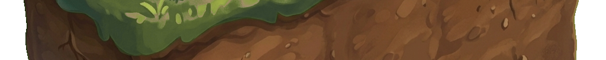

| field | value |
|---|---|
| anchor | `bottom-left` |
| passable | `false` |
| damage | `0` |
| beats | — |
| fill | `#5B3B1C` |
| material | grassy soil |
| detail_density | `medium` |
| sketch | [`ground/ground-10w/concept.png`](ground/ground-10w/concept.png) (1024×102px) |
| source | [`ground/ground-10w/token.md`](ground/ground-10w/token.md) |

**Art notes**

> Long run of grassy ground, 10 tiles wide. Use for the main
> walkable stretches between gameplay events. Continuous grass top
> edge with subtle waviness; uniform packed-dirt body. Same palette
> as `ground` and `ground-3w` for seamless adjacency.

### `ground-20w`

**symbol** `@` · **category** `ground` · **kind** `terrain` · **footprint** 20×1 · **layers** `play`

| field | value |
|---|---|
| anchor | `bottom-left` |
| passable | `false` |
| damage | `0` |
| beats | — |
| fill | `#5B3B1C` |
| material | grassy soil |
| detail_density | `medium` |
| sketch | [`ground/ground-20w/concept.png`](ground/ground-20w/concept.png) (1024×51px) |
| source | [`ground/ground-20w/token.md`](ground/ground-20w/token.md) |

**Art notes**

> Very long run of grassy ground, 20 tiles wide. Use for the big
> uninterrupted stretches where the player walks for a while
> between gameplay events. Same look as `ground-10w` and shorter
> variants — continuous grass top edge, packed-dirt body, subtle
> waviness in the grass blades. Distinct symbol so it doesn't
> merge with adjacent `ground-10w` regions during compile.

### `ground-3w`

**symbol** `g` · **category** `ground` · **kind** `terrain` · **footprint** 3×1 · **layers** `play`

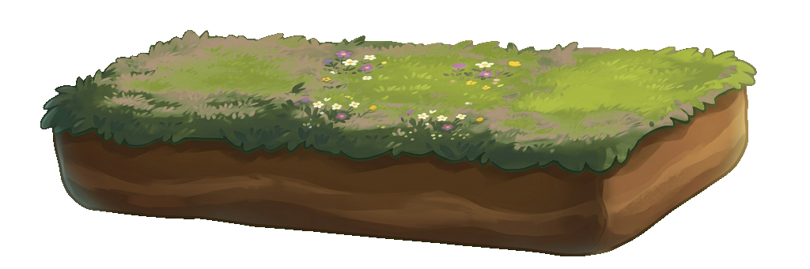

| field | value |
|---|---|
| anchor | `bottom-left` |
| passable | `false` |
| damage | `0` |
| beats | — |
| fill | `#5B3B1C` |
| material | grassy soil |
| detail_density | `medium` |
| sketch | [`ground/ground-3w/concept.png`](ground/ground-3w/concept.png) (1024×341px) |
| source | [`ground/ground-3w/token.md`](ground/ground-3w/token.md) |

**Art notes**

> Short run of grassy ground, 3 tiles wide. Same look as `ground`
> but narrower — useful for filling small gaps between hazards or
> for narrow ledges. Grass blades on top, packed dirt body below.

### `ground-bumpy`

**symbol** `B` · **category** `ground` · **kind** `terrain` · **footprint** 5×2 · **layers** `play`

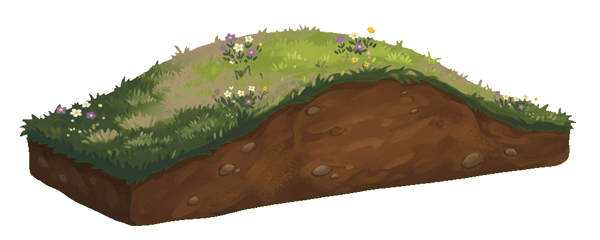

| field | value |
|---|---|
| anchor | `bottom-left` |
| passable | `false` |
| damage | `0` |
| beats | — |
| fill | `#5B3B1C` |
| material | grassy soil with a low rise |
| detail_density | `medium` |
| sketch | [`ground/ground-bumpy/concept.png`](ground/ground-bumpy/concept.png) (1024×410px) |
| source | [`ground/ground-bumpy/token.md`](ground/ground-bumpy/token.md) |

**Art notes**

> Grass-topped ground that rises gently in the middle, 2 tiles tall
> at the peak and 1 tile tall at the edges. Reads as a small
> natural mound. Use for breaking up long flat stretches; the
> player can walk over it without jumping. Grass blades on top,
> dirt body below — same palette as `ground`.

## Platform

### `platform-wood`

**symbol** `=` · **category** `platform` · **kind** `terrain` · **footprint** 4×1 · **layers** `play`

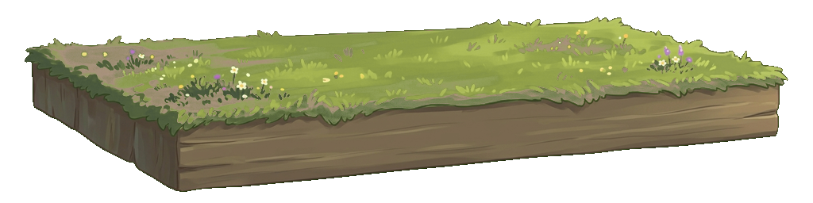

| field | value |
|---|---|
| anchor | `bottom-left` |
| passable | `false` |
| damage | `0` |
| beats | platform-up |
| fill | `#7A6F5A` |
| material | weathered wooden ledge with grass top |
| detail_density | `low` |
| sketch | [`platforms/platform-wood/concept.png`](platforms/platform-wood/concept.png) (1024×256px) |
| source | [`platforms/platform-wood/token.md`](platforms/platform-wood/token.md) |

**Art notes**

> Floating wooden platform the player can land on. Top edge is a
> thin grass-topped lip; the body is a single horizontal wooden
> plank. No support posts — reads as suspended in air. Soft drop
> shadow on the underside if lighting calls for it.

### `platform-wood-3w`

**symbol** `-` · **category** `platform` · **kind** `terrain` · **footprint** 3×1 · **layers** `play`

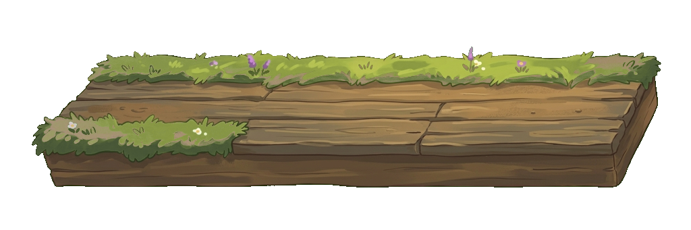

| field | value |
|---|---|
| anchor | `bottom-left` |
| passable | `false` |
| damage | `0` |
| beats | platform-up |
| fill | `#7A6F5A` |
| material | weathered wooden ledge with grass top |
| detail_density | `low` |
| sketch | [`platforms/platform-wood-3w/concept.png`](platforms/platform-wood-3w/concept.png) (1024×341px) |
| source | [`platforms/platform-wood-3w/token.md`](platforms/platform-wood-3w/token.md) |

**Art notes**

> Narrow floating wooden platform, 3 tiles wide. Same construction
> as `platform-wood`: thin grass-topped lip + horizontal wooden
> plank body. Use for tighter jumps or stepping stones in chains.

### `platform-wood-7w`

**symbol** `_` · **category** `platform` · **kind** `terrain` · **footprint** 7×1 · **layers** `play`

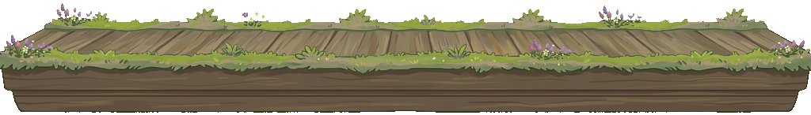

| field | value |
|---|---|
| anchor | `bottom-left` |
| passable | `false` |
| damage | `0` |
| beats | platform-up |
| fill | `#7A6F5A` |
| material | weathered wooden ledge with grass top |
| detail_density | `low` |
| sketch | [`platforms/platform-wood-7w/concept.png`](platforms/platform-wood-7w/concept.png) (1024×146px) |
| source | [`platforms/platform-wood-7w/token.md`](platforms/platform-wood-7w/token.md) |

**Art notes**

> Wide floating wooden platform, 7 tiles across. Same look as
> `platform-wood` but wider — use as a major resting ledge or for
> placing pickups (potion, key) on top. Two parallel plank lines
> visible underneath; soft drop shadow along the underside.

## Hazard

### `pond`

**symbol** `W` · **category** `hazard` · **kind** `terrain` · **footprint** 6×1 · **layers** `play`

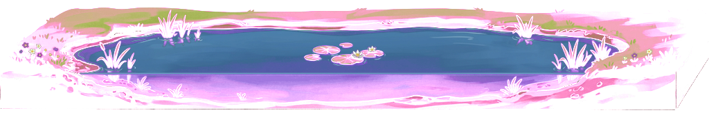

| field | value |
|---|---|
| anchor | `bottom-left` |
| passable | `false` |
| damage | `1` |
| beats | hazard |
| fill | `#3A6FAA` |
| material | wetland water |
| detail_density | `medium` |
| sketch | [`hazards/pond/concept.png`](hazards/pond/concept.png) (1024×171px) |
| source | [`hazards/pond/token.md`](hazards/pond/token.md) |

**Art notes**

> A small wetland pond with grass shoreline. Reeds along the left
> and right edges, lily pads centered, calm reflective surface.
> Mud bank where water meets grass. No waves, no foam — still water.

### `pond-3w`

**symbol** `w` · **category** `hazard` · **kind** `terrain` · **footprint** 3×1 · **layers** `play`

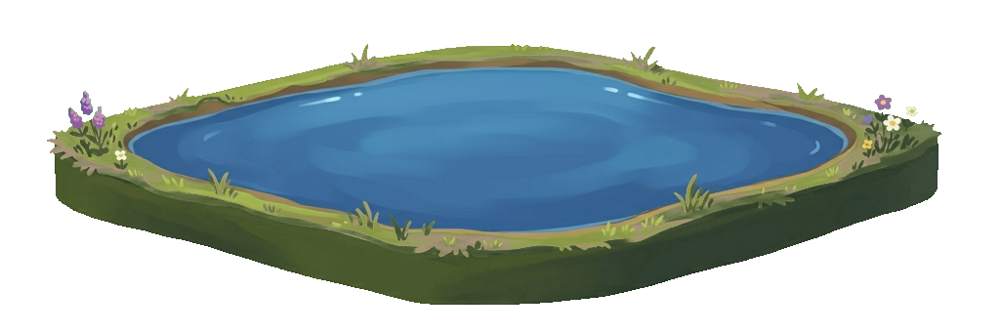

| field | value |
|---|---|
| anchor | `bottom-left` |
| passable | `false` |
| damage | `1` |
| beats | hazard |
| fill | `#3A6FAA` |
| material | small puddle |
| detail_density | `low` |
| sketch | [`hazards/pond-3w/concept.png`](hazards/pond-3w/concept.png) (1024×341px) |
| source | [`hazards/pond-3w/token.md`](hazards/pond-3w/token.md) |

**Art notes**

> Small shallow puddle, 3 tiles wide and only 1 tile deep. Calm
> blue water with a thin grass-meets-water shoreline on both sides.
> Use as a tutorial-friendly water hazard — visible from spawn,
> easy to jump over, teaches the jump mechanic.

### `thorn-patch`

**symbol** `^` · **category** `hazard` · **kind** `terrain` · **footprint** 2×1 · **layers** `play`

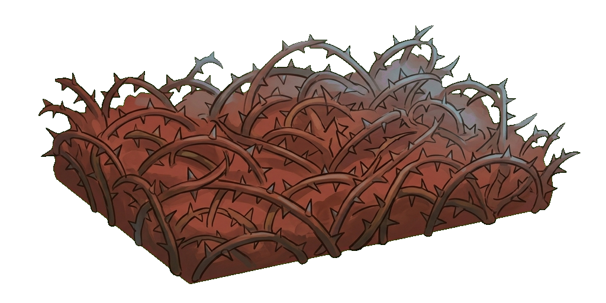

| field | value |
|---|---|
| anchor | `bottom-left` |
| passable | `true` |
| damage | `2` |
| beats | hazard |
| fill | `#A03A3A` |
| material | thorny brambles |
| detail_density | `medium` |
| sketch | [`hazards/thorn-patch/concept.png`](hazards/thorn-patch/concept.png) (1024×512px) |
| source | [`hazards/thorn-patch/token.md`](hazards/thorn-patch/token.md) |

**Art notes**

> Tangled patch of dark thorny brambles, 2 tiles wide. Sits on top
> of the ground (passable but damaging — the player CAN walk
> through but takes damage). Spiky silhouette with reddish-brown
> stems and small dark thorns. Distinct from water hazards: dry,
> rough, prickly rather than wet.

## Decoration

### `branch-frame`

**symbol** `Y` · **category** `decoration` · **kind** `terrain` · **footprint** 4×6 · **layers** `fg`

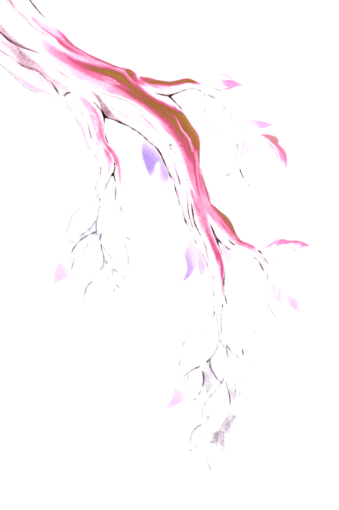

| field | value |
|---|---|
| anchor | `top-left` |
| passable | `true` |
| damage | `0` |
| beats | — |
| fill | `#876041` |
| material | drooping foreground branch with leaves |
| detail_density | `medium` |
| sketch | [`decorations/branch-frame/concept.png`](decorations/branch-frame/concept.png) (683×1024px) |
| source | [`decorations/branch-frame/token.md`](decorations/branch-frame/token.md) |

**Art notes**

> A drooping branch with leaves hanging from the top of the camera
> frame — sits in front of the playable area on the fg layer.
> Anchored at top-left so the token's `at` position is the corner
> where the branch enters the canvas. Painter applies slight
> focus blur and pulls toward near-silhouette (darker than the
> play layer's foliage). Use to frame the camera at scene edges.

### `bush`

**symbol** `b` · **category** `decoration` · **kind** `terrain` · **footprint** 2×1 · **layers** `play`, `bg-mid`

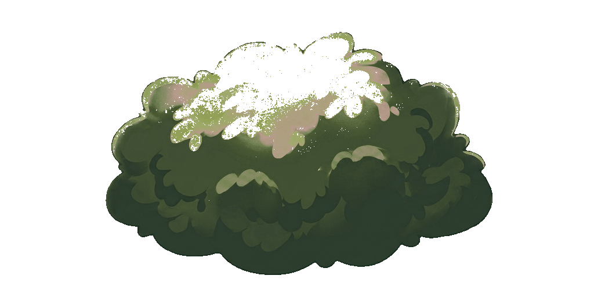

| field | value |
|---|---|
| anchor | `bottom-left` |
| passable | `true` |
| damage | `0` |
| beats | — |
| fill | `#44772D` |
| material | rounded leafy bush |
| detail_density | `low` |
| sketch | [`decorations/bush/concept.png`](decorations/bush/concept.png) (1024×512px) |
| source | [`decorations/bush/token.md`](decorations/bush/token.md) |

**Art notes**

> A small rounded leafy bush, 2 tiles wide and 1 tile tall.
> Eligible for both play (sits on the ground as foreground
> decoration) and bg-mid (sits on the mid-distance horizon for
> silhouette variety). Round shape with a softer highlight on top
> using Bright Grass Green; main mass uses Deep Forest Green.

### `flower-patch`

**symbol** `f` · **category** `decoration` · **kind** `terrain` · **footprint** 2×1 · **layers** `play`

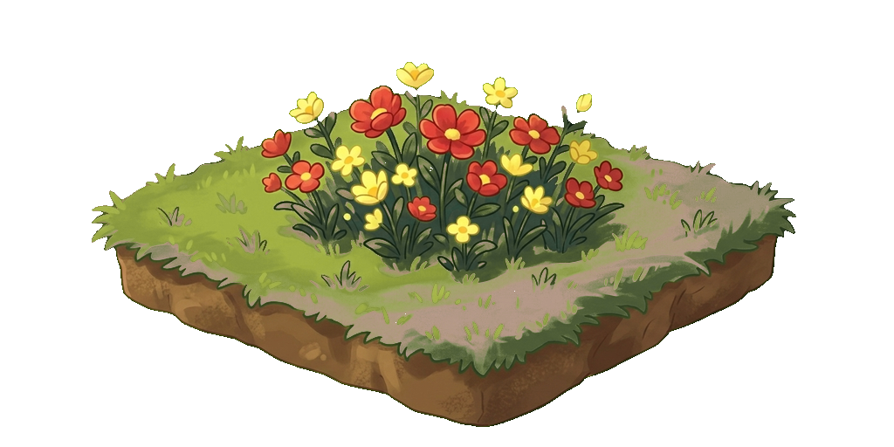

| field | value |
|---|---|
| anchor | `bottom-left` |
| passable | `true` |
| damage | `0` |
| beats | — |
| fill | `#E03E3E` |
| material | wildflower cluster |
| detail_density | `low` |
| sketch | [`decorations/flower-patch/concept.png`](decorations/flower-patch/concept.png) (1024×512px) |
| source | [`decorations/flower-patch/token.md`](decorations/flower-patch/token.md) |

**Art notes**

> A small cluster of wildflowers (red and yellow) growing from the
> grass, 2 tiles wide. Fully passable decoration. Adds color
> accents to long grass stretches. Stem greens read against the
> `ground` token's grass top; bloom colors use Vibrant Red and
> Potion Glow Yellow from the palette.

### `rock`

**symbol** `r` · **category** `decoration` · **kind** `terrain` · **footprint** 1×1 · **layers** `play`

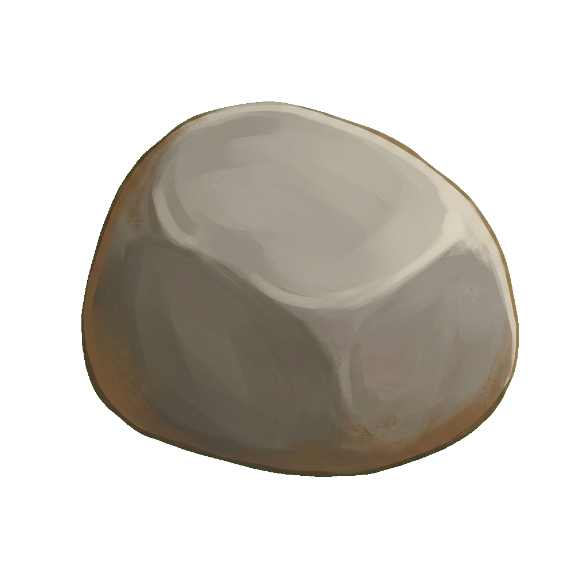

| field | value |
|---|---|
| anchor | `bottom-left` |
| passable | `true` |
| damage | `0` |
| beats | — |
| fill | `#7A6F5A` |
| material | smooth grey boulder |
| detail_density | `low` |
| sketch | [`decorations/rock/concept.png`](decorations/rock/concept.png) (1024×1024px) |
| source | [`decorations/rock/token.md`](decorations/rock/token.md) |

**Art notes**

> A single smooth grey boulder, 1 tile in size. Sits on the ground
> as decoration; the player walks past it (passable). Rounded form
> with a soft highlight on the upper-right and a small ground
> shadow on the lower-left. Use for breaking up long flat stretches
> of `ground` without changing the gameplay shape.

## Background

### `mountain-distant`

**symbol** `M` · **category** `background` · **kind** `terrain` · **footprint** 15×6 · **layers** `bg-far`

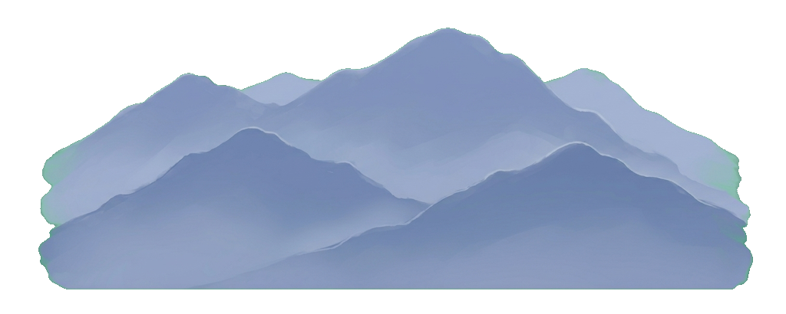

| field | value |
|---|---|
| anchor | `bottom-left` |
| passable | `true` |
| damage | `0` |
| beats | — |
| fill | `#7A8FB0` |
| material | hazy distant mountain ridge |
| detail_density | `low` |
| sketch | [`background/mountain-distant/concept.png`](background/mountain-distant/concept.png) (1024×410px) |
| source | [`background/mountain-distant/token.md`](background/mountain-distant/token.md) |

**Art notes**

> Distant mountain silhouette on the bg-far layer. Hazy blue-violet
> tones, very low saturation. No surface detail — mountains read as
> layered silhouettes with atmospheric perspective. Multiple peaks
> of varying height; closer peaks slightly more saturated than the
> farther ones.

### `mountain-small`

**symbol** `m` · **category** `background` · **kind** `terrain` · **footprint** 8×4 · **layers** `bg-far`

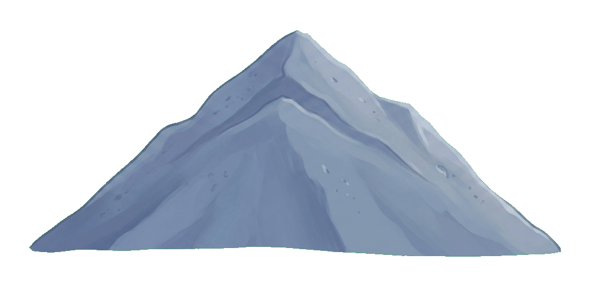

| field | value |
|---|---|
| anchor | `bottom-left` |
| passable | `true` |
| damage | `0` |
| beats | — |
| fill | `#92A6B2` |
| material | single distant peak |
| detail_density | `low` |
| sketch | [`background/mountain-small/concept.png`](background/mountain-small/concept.png) (1024×512px) |
| source | [`background/mountain-small/token.md`](background/mountain-small/token.md) |

**Art notes**

> A single distant peak, narrower and shorter than `mountain-distant`.
> Triangular silhouette with two subtle layered ridges suggesting
> depth. Hazy blue-violet tone. Use for filling smaller bg-far
> gaps or for varying the horizon profile when placed alongside
> larger mountain tokens.

### `tree-band-far`

**symbol** `~` · **category** `background` · **kind** `terrain` · **footprint** 12×3 · **layers** `bg-far`

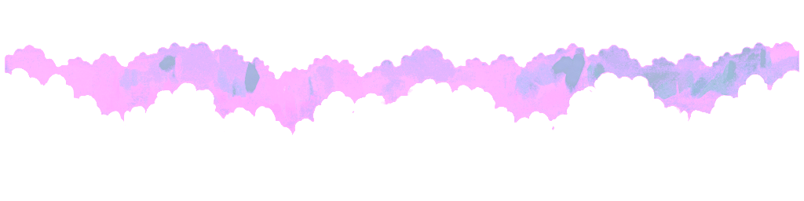

| field | value |
|---|---|
| anchor | `bottom-left` |
| passable | `true` |
| damage | `0` |
| beats | — |
| fill | `#92A6B2` |
| material | very distant forest band |
| detail_density | `low` |
| sketch | [`background/tree-band-far/concept.png`](background/tree-band-far/concept.png) (1024×256px) |
| source | [`background/tree-band-far/token.md`](background/tree-band-far/token.md) |

**Art notes**

> A wide band of distant treetops, painted on the far layer. Heavy
> atmospheric haze: very low saturation, cool blue-violet tone (use
> Distant Mountain Blue palette). No individual tree detail —
> reads as a soft silhouette band where the canopy meets the sky.
> Use to fill long horizontal stretches of bg-far between mountains.

### `tree-cluster-mid`

**symbol** `T` · **category** `background` · **kind** `terrain` · **footprint** 3×4 · **layers** `bg-mid`

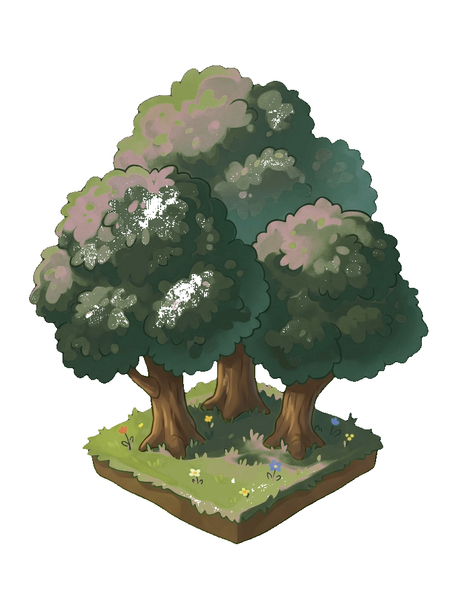

| field | value |
|---|---|
| anchor | `bottom-left` |
| passable | `true` |
| damage | `0` |
| beats | — |
| fill | `#3F7A4A` |
| material | broadleaf foliage with brown trunks |
| detail_density | `medium` |
| sketch | [`background/tree-cluster-mid/concept.png`](background/tree-cluster-mid/concept.png) (768×1024px) |
| source | [`background/tree-cluster-mid/token.md`](background/tree-cluster-mid/token.md) |

**Art notes**

> Mid-distance cluster of two or three broadleaf trees with rounded
> canopies. Painted on the bg-mid layer — slightly desaturated
> compared to foreground trees, with atmospheric haze pulling toward
> the layer's palette. Trunks are short and stocky; canopies overlap
> softly.

### `tree-cluster-near`

**symbol** `t` · **category** `background` · **kind** `terrain` · **footprint** 4×5 · **layers** `bg-mid`, `fg`

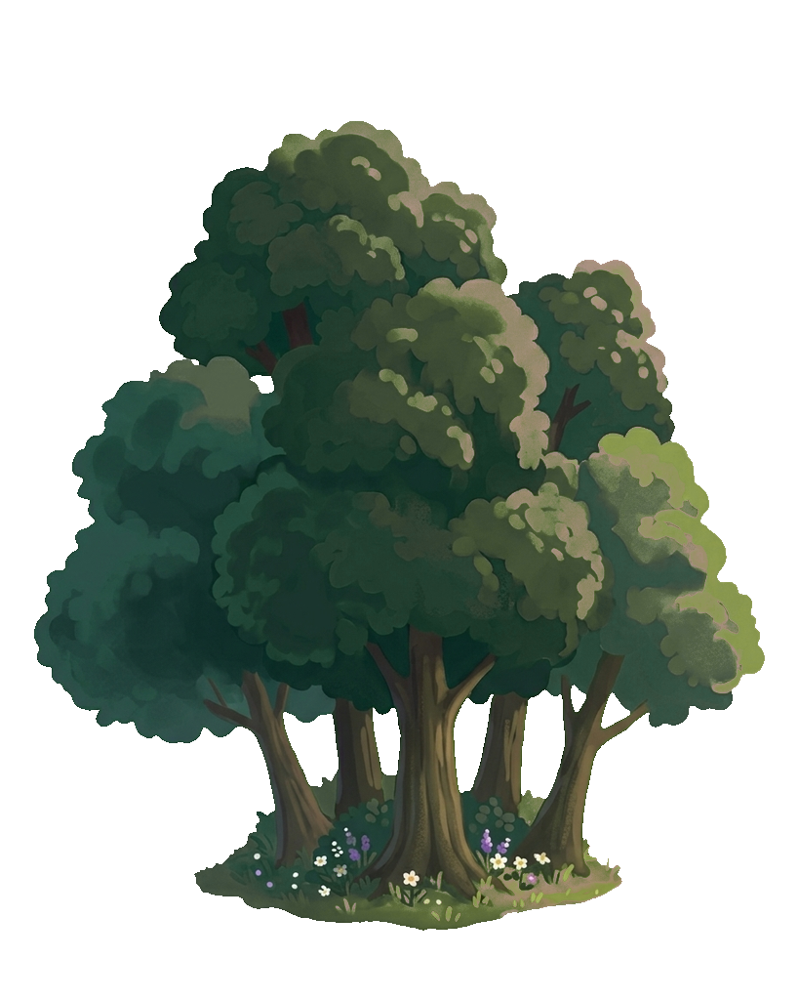

| field | value |
|---|---|
| anchor | `bottom-left` |
| passable | `true` |
| damage | `0` |
| beats | — |
| fill | `#44772D` |
| material | broadleaf tree cluster, foreground saturation |
| detail_density | `medium` |
| sketch | [`background/tree-cluster-near/concept.png`](background/tree-cluster-near/concept.png) (819×1024px) |
| source | [`background/tree-cluster-near/token.md`](background/tree-cluster-near/token.md) |

**Art notes**

> A larger, closer cluster of broadleaf trees with deeper green
> foliage and visible trunk shadows. Eligible for both bg-mid and
> fg layers — when placed on fg the painter applies slight focus
> blur and pulls toward near-silhouette. Compared to
> `tree-cluster-mid`: bigger footprint (4w-5h), darker greens
> (Deep Forest Green palette), more trunk visibility.

## Marker

### `exit`

**symbol** `X` · **category** `marker` · **kind** `dynamic` · **footprint** 1×1 · **layers** `play`

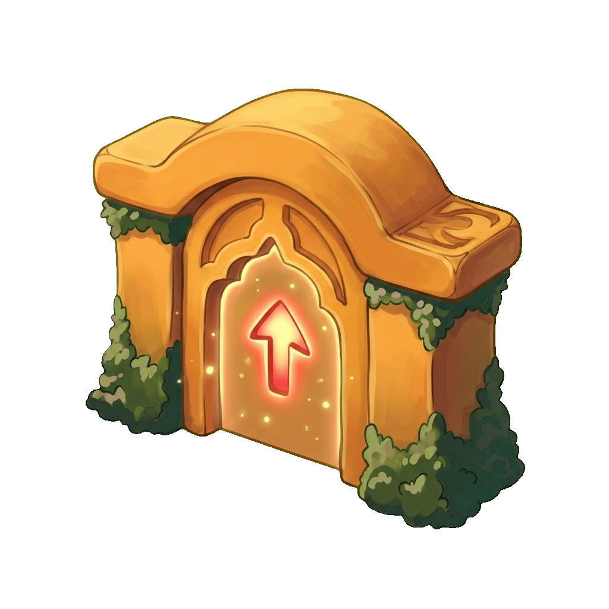

| field | value |
|---|---|
| anchor | `bottom-left` |
| passable | `true` |
| damage | `0` |
| beats | exit |
| fill | `#FFAA44` |
| material | gameplay marker (invisible at runtime) |
| detail_density | `low` |
| sketch | [`markers/exit/concept.png`](markers/exit/concept.png) (1024×1024px) |
| source | [`markers/exit/token.md`](markers/exit/token.md) |

**Art notes**

> Gameplay marker for level exit. Visually invisible at runtime;
> engine handles the transition. Sketch shows a visible cue for
> composition review.

### `pickup-key`

**symbol** `K` · **category** `marker` · **kind** `dynamic` · **footprint** 1×1 · **layers** `play`

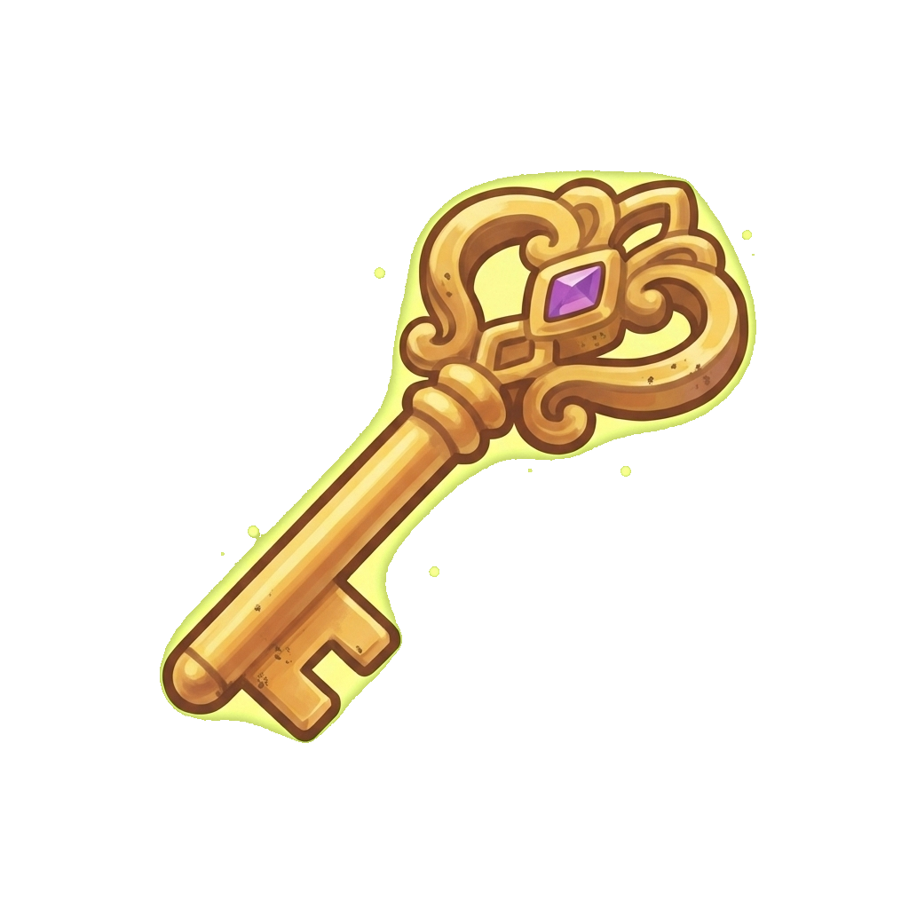

| field | value |
|---|---|
| anchor | `bottom-left` |
| passable | `true` |
| damage | `0` |
| beats | pickup |
| fill | `#FDFFA6` |
| material | gold key pickup point |
| detail_density | `low` |
| sketch | [`markers/pickup-key/concept.png`](markers/pickup-key/concept.png) (1024×1024px) |
| source | [`markers/pickup-key/token.md`](markers/pickup-key/token.md) |

**Art notes**

> Gameplay marker for a gold-key pickup. The key sprite itself is
> placed by the engine (it's a separate animated prop from
> objects.json::gold-key); this token declares only the position
> and kind. Painter shows a faint warm glow halo so designers can
> see where pickups landed during composition review — the engine
> overrides this in-game.

### `pickup-potion`

**symbol** `P` · **category** `marker` · **kind** `dynamic` · **footprint** 1×1 · **layers** `play`

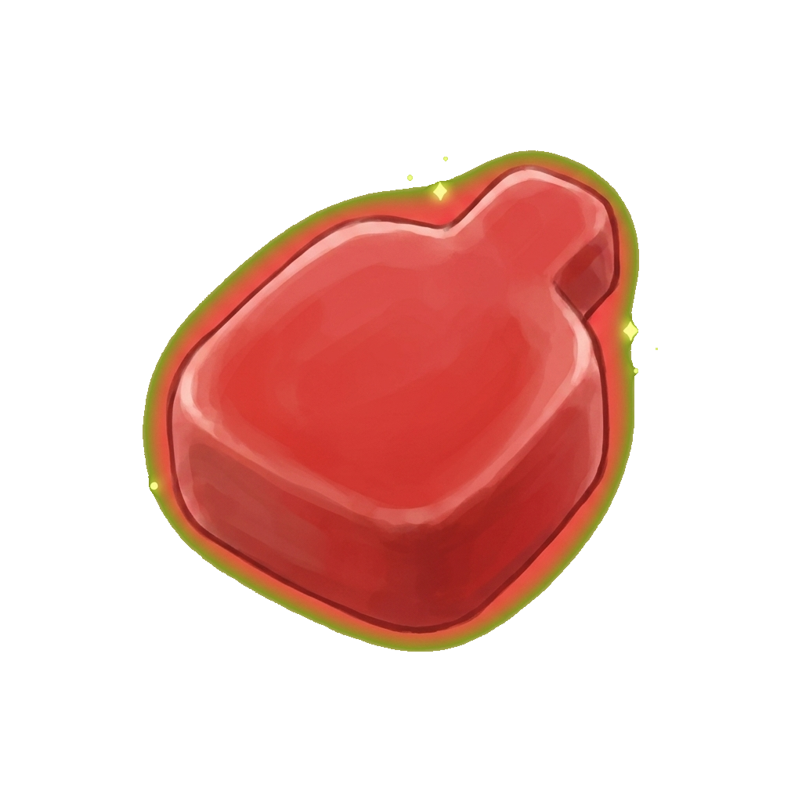

| field | value |
|---|---|
| anchor | `bottom-left` |
| passable | `true` |
| damage | `0` |
| beats | pickup |
| fill | `#E03E3E` |
| material | health potion pickup point |
| detail_density | `low` |
| sketch | [`markers/pickup-potion/concept.png`](markers/pickup-potion/concept.png) (1024×1024px) |
| source | [`markers/pickup-potion/token.md`](markers/pickup-potion/token.md) |

**Art notes**

> Gameplay marker for a health-potion pickup. Like `pickup-key`,
> the potion sprite itself is placed by the engine (objects.json
> ::health-potion); this token declares only position and kind.
> Painter shows a faint red glow halo for design-time visibility.

### `spawn`

**symbol** `S` · **category** `marker` · **kind** `dynamic` · **footprint** 1×1 · **layers** `play`

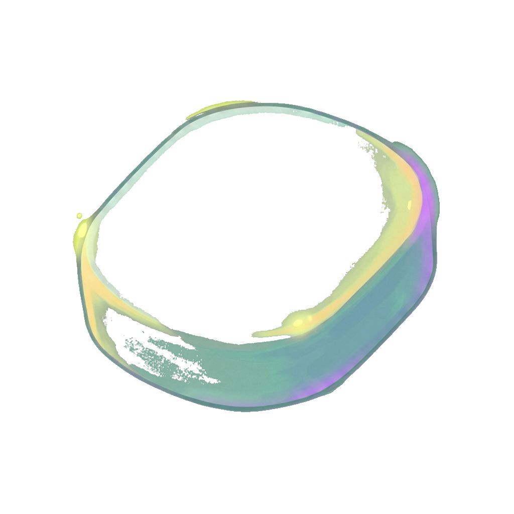

| field | value |
|---|---|
| anchor | `bottom-left` |
| passable | `true` |
| damage | `0` |
| beats | spawn |
| fill | `#88FFAA` |
| material | gameplay marker (invisible at runtime) |
| detail_density | `low` |
| sketch | [`markers/spawn/concept.png`](markers/spawn/concept.png) (1024×1024px) |
| source | [`markers/spawn/token.md`](markers/spawn/token.md) |

**Art notes**

> Gameplay marker. Visually invisible in the final scene — engine
> reads the spawn beat from the manifest and places the player here.
> The sketch shows a small visible cue only so designers can see
> where spawns landed during composition review.

