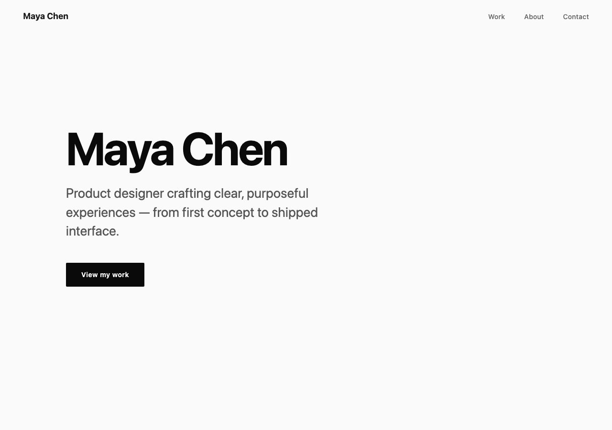
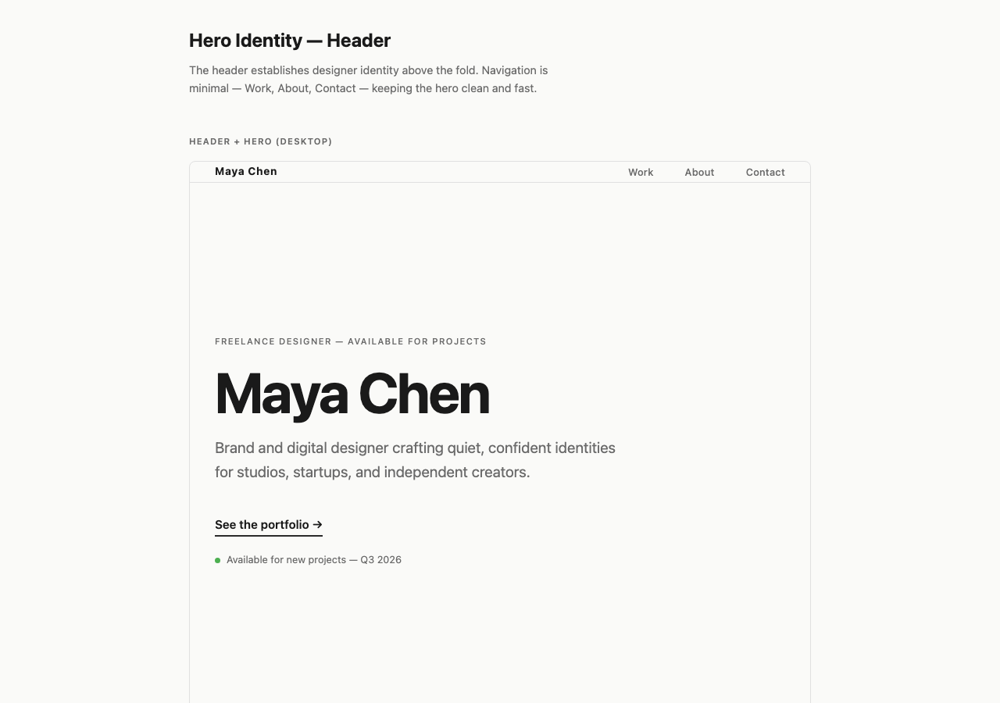
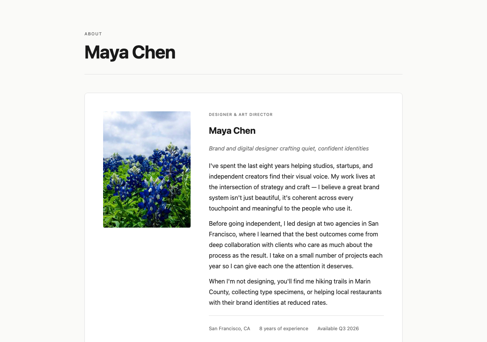
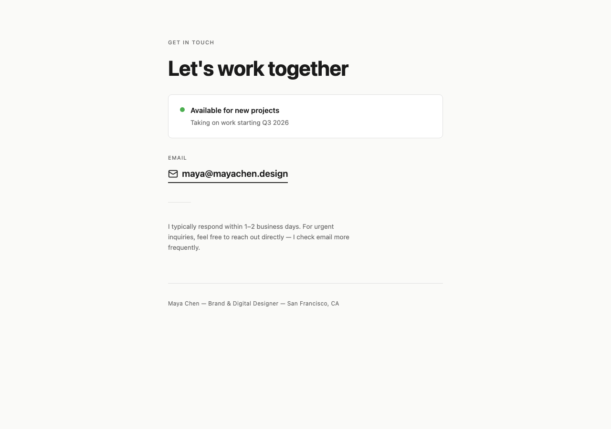
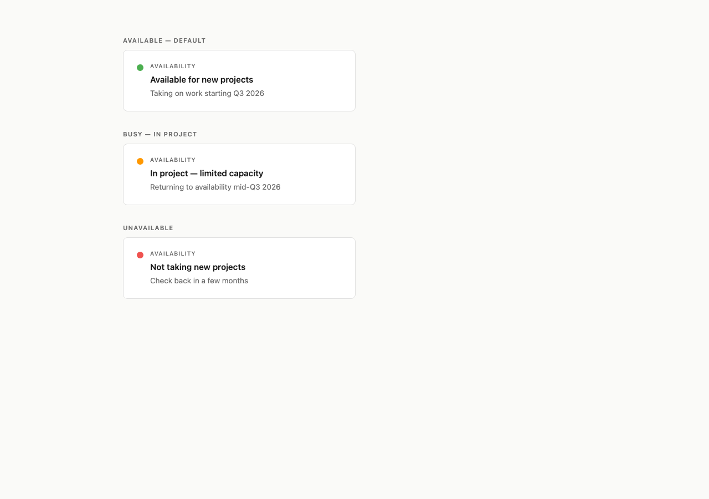

# Product Design Example

Transform a product idea into MVP concept mockups using the **epic > feature** hierarchy. Each feature produces a self-contained HTML mockup that opens in any browser.

## Screenshots

Generated mockups from a single run on `docs/idea.txt` (a freelance designer portfolio):

| Home Page | Hero Header |
|---|---|
|  |  |

| Work Grid | About Section |
|---|---|
|  |  |

| Contact Email | Availability Status |
|---|---|
|  |  |

Every mockup is a single self-contained HTML file — all CSS embedded, no external dependencies.

## Sample Output

After a full run on the included `docs/idea.txt` (a freelance designer portfolio page):

```
docs/product/
  PRODUCT_BRIEF.md          "Portfolio Page — single-page site for a freelance designer"
  SCOPE.md                  MVP boundaries and constraints
  RESEARCH_REPORT.md        Market analysis of portfolio platforms
  user-personas.md          Target user profiles
  SITEMAP.md                Page hierarchy
  USER_JOURNEYS.md          Key user flows
  ARCHITECTURE.md           Information architecture
  EPIC_MAP.md               Epic visualization and dependencies
  HANDOFF.md                Development handoff document
  TRACEABILITY.md           Epic > Feature mapping
  features/
    hero-identity/catalog.json       3 features: name display, tagline, CTA
    work-showcase/catalog.json       3 features: grid, metadata, filters
    about-bio/catalog.json           3 features: background, approach, process
    contact-availability/catalog.json 3 features: email, status, section
    responsive-performance/catalog.json 4 features: mobile, desktop, static, stability

.design/screens/                     Self-contained HTML mockups
  hero-identity/
    hero-identity-header/.../design.html    Name + tagline concept
    hero-identity-cta/.../design.html       CTA button concept
  work-showcase/
    work-grid/design.html                   Portfolio grid layout
    work-showcase-grid/.../design.html      Grid variant
    work-showcase-metadata/.../design.html  Project metadata cards
  about-bio/
    about-bio-section/.../design.html       Bio section layout
    about-bio-content/.../design.html       Content block
    about-bio-process/.../design.html       Process description
  contact-availability/
    contact-availability-email/.../design.html   Email display
    contact-availability-section/.../design.html Contact section
    contact-availability-status/.../design.html  Availability badge
  portfolio/
    home-page/design.html                   Full page composite
```

Each `design.html` is a single file with all CSS in `<style>` tags. No external dependencies.

## Playbook Structure

```
.converge/playbooks/product-design/
  playbook.yml                    Playbook manifest (3 workers, resumable)
  PLAN.md                         DAG overview

  tasks/
    01-brief/                     Product brief + scope definition
      tasks/01-product-brief/       Write PRODUCT_BRIEF.md from idea.txt
      tasks/02-scope/               Write SCOPE.md
    02-research/                  Market research + personas
      tasks/01-market-research/     Write RESEARCH_REPORT.md
      tasks/02-personas/            Write user-personas.md
    03-architecture/              Sitemap + journeys + IA
      tasks/01-sitemap/             Write SITEMAP.md
      tasks/02-journeys/            Write USER_JOURNEYS.md
      tasks/03-ia/                  Write ARCHITECTURE.md
    04-epics/                     Epic decomposition + feature catalogs
      tasks/01-epic-catalog/        Write epics.json + EPIC_MAP.md
      tasks/05-features/            Spawner: one feature-analysis per epic
    05-design/                    Spawner: one HTML mockup per feature
    10-package/                   Handoff + traceability
      tasks/01-handoff/             Write HANDOFF.md
      tasks/02-traceability/        Write TRACEABILITY.md

  templates/
    feature-analysis/             Spawned per epic (reads epics.json)
    design-mockup/                Spawned per feature (produces design.html)

  skills/
    product-brief/                How to write a product brief
    scope-definition/             How to define MVP scope
    research-synthesis/           Market research methodology
    persona-development/          User persona creation
    sitemap-design/               Page hierarchy design
    journey-mapping/              User journey mapping
    information-architecture/     IA methodology
    epic-decomposition/           Epic identification
    feature-prioritization/       Feature scoring (MoSCoW + RICE)
    html-mockup/                  Self-contained HTML mockup creation
    handoff-preparation/          Handoff document writing
    traceability/                 Epic > Feature mapping

  scripts/
    validate-epic-coverage.sh     Every epic has >= 1 feature
    validate-html-structure.sh    All HTML files are self-contained
```

## DAG

```
01-brief  >  02-research  >  03-architecture  >  04-epics  >  05-design  >  10-package
  |              |                |                  |            |              |
  brief          research         sitemap            epic-catalog  (spawner)     handoff
  scope          personas         journeys           (spawner)    per-feature    traceability
                                  IA                 per-epic     HTML mockup
                                                     catalog
```

Phases run sequentially. Within each phase, children run in parallel (up to 3 workers).

## How to Run

### Prerequisites

```bash
# From the repo root
pnpm install && pnpm build
```

### 1. Provide your product idea

Edit `docs/idea.txt` with your product concept:

```
# My Product

A brief description of what you want to design.
```

### 2. Preview the DAG

```bash
cd examples/product-design
converge run --playbook=product-design --dry
```

### 3. Run the playbook

```bash
converge run --playbook=product-design
```

The run takes 5-15 minutes depending on model speed. It produces all docs, catalogs, and HTML mockups.

### 4. Resume if interrupted

```bash
converge run --playbook=product-design --resume
```

### 5. Review outputs

Open any mockup in a browser:

```bash
open .design/screens/portfolio/home-page/design.html
open .design/screens/hero-identity/hero-identity-header/*/design.html
```

Read the product docs:

```bash
cat docs/product/PRODUCT_BRIEF.md
cat docs/product/HANDOFF.md
```

## Cleanup

### Clean generated outputs only

```bash
rm -rf docs/product .design/screens
```

### Clean everything (outputs + runtime state)

```bash
rm -rf docs/product .design/screens \
       .converge/journal .converge/inventory
```

### Full reset (also removes feature catalogs)

```bash
rm -rf docs/product .design \
       .converge/journal .converge/inventory
```

## Customization

- **Change the product idea** — edit `docs/idea.txt` and re-run
- **Add skills** — create `skills/<name>/SKILL.md` with methodology instructions
- **Add phases** — create `tasks/<NN>-<name>/TASK.md` with appropriate `depends_on`
- **Change worker count** — edit `playbook.yml` > `run.workers`
