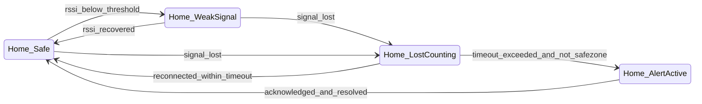
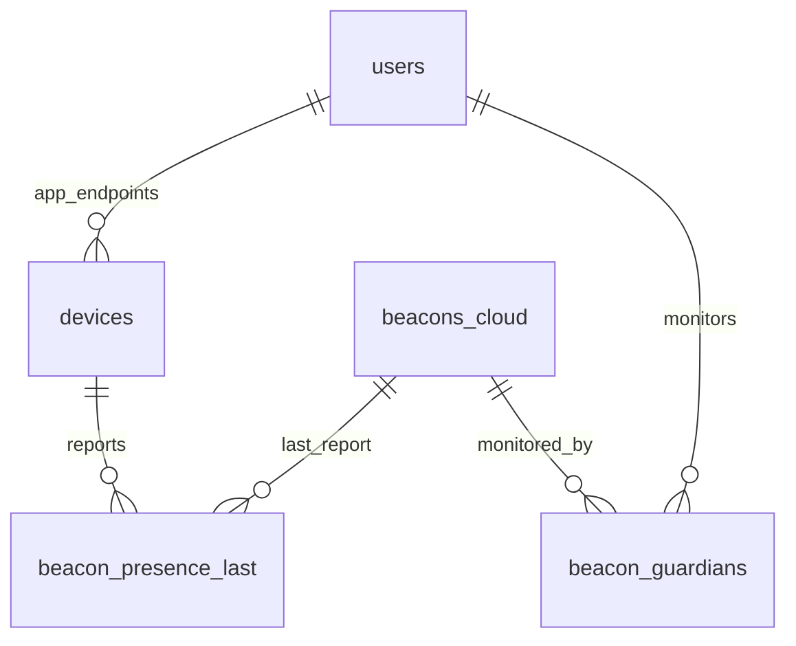

# Design Proposal - Child Safety Beacon App

## Purpose

A child safety application that detects when a child is left behind by monitoring Bluetooth beacons. When the adult's device moves away from the beacon for a specified duration, the app triggers comprehensive alerts to prevent children from being accidentally left unattended.

## 📋 Overview

### Purpose
A child safety application that detects when a child is left behind by monitoring Bluetooth beacons.
A child safety application that detects when a child is left behind by monitoring Bluetooth beacons. When the adult's device moves away from the beacon for a specified duration, the app triggers comprehensive alerts.

### Value Proposition
- **Simple**: No GPS required, uses BLE technology
- **Battery Efficient**: BLE consumes minimal power compared to GPS
- **Multi-user Support** (Phase 2): More powerful than AirTag-style local solutions
- **Family-Oriented**: Designed specifically for child safety

---

## 🎯 Core Features

### 1. Beacon Connection
- Scan for available BLE beacons
- Select beacon to monitor
- Save beacon configuration
- Store beacon credentials locally

### 2. Distance Monitoring (Core)
- Continuous beacon signal reception
- Track RSSI (Received Signal Strength Indicator)
- Monitor connection state
- Real-time proximity detection

### 3. Disconnection Alert (Critical)
Trigger when signal lost for > X minutes **and** the beacon is **not** considered safe by aggregate rules (see **Aggregate beacon safety (Phase 2)** under Alert System). Phase 1 uses only local BLE + active safe zones; Phase 2 adds “another guardian user still in BLE range” via server sync.

When alert criteria are met, delivery includes:
- Device vibration
- Loud audio alarm
- High-priority push notification (deep link opens **Home** in alert phase)
- **In-app**: same **Home** screen with elevated alert state (unified UI); optional **full-screen takeover** only where the platform requires it (e.g. locked device) — reuse the same component tree

### 4. Multi-user Support (Phase 2)
- **Many-to-many:** one **user** can monitor many beacons; one beacon can be monitored by many **users** (co-guardians). Copy and UI list people (“Mẹ”, “Bố”), not handsets — see **Product language (Phase 2)** under Data Storage (cloud schema section).
- **Technical endpoints:** each app install is a `device` (push token + BLE source). Telemetry (in-range / RSSI bucket) is reported per `device`; the server **rolls up** presence to **per-user** status for API responses and lists.
- **Server sync required** for cross-user awareness: one phone’s BLE stack cannot see another phone’s RSSI.
- **Invites:** scanning/registering a beacon on server creates/links `beacon`; owner invites other users (deep link or short code). Accepting adds a `beacon_guardians` row (`user_id`, `beacon_id`).
- **Collective awareness:** before escalating to `alert_active`, the app (or server) evaluates **aggregate beacon safety** so a local “signal lost” does not alarm if another guardian user still sees the beacon within freshness window `T`, or if safe-zone rules apply.

### 5. History & Logging
Store and display:
- Disconnection timestamps
- Reconnection timestamps
- Duration of disconnection events
- Alert history

### 6. Alert Configuration
Customizable settings:
- Timeout: 2 min / 5 min / custom
- Audio: enable/disable
- Vibration: enable/disable
- Sensitivity (advanced)

### 7. Safe Zones (Important)
Define locations where no alerts are triggered:
- Home coordinates
- School coordinates
- Other trusted locations
- Auto-detect via GPS
- Radius configuration (default: 50m)
- Active/Inactive toggle per zone

### 8. Background Monitoring
- **Android**: Continuous background service
- **iOS**: iBeacon region monitoring

---

## 📱 Screens

### 1. Splash / Onboarding
```
Purpose: First-time user guidance

Content:
- App introduction
- Beacon placement instructions
- Permission requests:
  - Bluetooth (required for beacon)
  - Location (required for safe zones - explained clearly)
  - Notifications (required for alerts)

Actions:
- "Get Started" button
- Permission request dialogs
```

### 2. Home Screen (Critical) — unified hub
```
Purpose: Single main monitoring surface. All proximity states and the emergency
alert use the SAME layout and visual language (cards, status icon, accent colors) — only
priority, copy, và accent intensity thay đổi. No separate "alert world" UI.

Layout (top → bottom):

1) Compact status row
   - One line + status pill: Safe | Weak signal | Lost (countdown) | Alert active
   - "Last updated" timestamp (BLE / state refresh)
   - Sits on **Warm Background** như rest of Home (optional ultra-light scrim only);
     **không** separate boxed strip that reads like a CMS module

2) Status icon (SVG only — not a large hero banner)
   - Replace generic "guard / shield / safe" pictograms with **super hero kid** SVG
     variants keyed to state (same slot next to or inside the status row).
   - Safe: kid flying / confident (small icon, **Primary Text** stroke)
   - Weak: softer pose or light cloud accent in-icon
   - Lost / countdown: attentive / searching pose in-icon
   - Alert: urgent pose in-icon + stronger pill/headline (icon stays compact)
   - Optional: subtle vector morph or short Lottie **inside icon bounds only**
     (roughly 24–40dp), never a full-screen character illustration
   - Accessibility: explicit text + pill luôn present; `aria-label` on SVG
     (e.g. "Trạng thái: đang an toàn")

3) Map card (card trắng / rounded; không hard grid)
   - **Breathing room**: generous vertical margin above/below; do not stack edge-to-edge
     tiles — one focal card at a time feels **open**, không dashboard grid.
   - Shows last saved GPS point captured at BLE disconnect OR when alert fires
     (on-demand capture — not continuous tracking; copy explains this)
   - Pin, short accuracy note, timestamp of snapshot
   - Actions: "Expand map" (full map / external maps app as needed)
   - Empty state: no snapshot yet — illustration nhẹ + "Chưa có vị trí đã lưu" +
     copy helper: "Vị trí sẽ được tự động lưu khi beacon mất kết nối"
     + CTA "Bật định vị" nếu thiếu permission. Illustration: icon bản đồ nhỏ
     (32–40dp) với super hero kid ngồi/chờ, stroke **Primary Text** — không banner
     lớn, giữ card compact.

4) Beacon strip (single soft card)
   - Beacon display name
   - Proximity: Gần / Xa (or Near / Far) derived from RSSI
   - Last seen beacon time; battery if hardware reports it
   - Quick link to beacon / scan settings
   - **Phase 2:** same card links to **Beacon detail** (§9) for co-guardian list and per-user proximity rollup

5) Tracking controls
   - Start / Stop monitoring (primary clarity)
   - Test alert (secondary)

6) Push notification quick mute ("Tạm tắt thông báo push")
   - Chips or segmented control: 5 / 10 / 15 minutes
   - When active: "Đang tắt thông báo đến …" + one-tap cancel
   - Distinct from "Hoãn cảnh báo" / alert snooze in Settings (logic may differ;
     copy on Home must not confuse the two)

7) When alertPhase is active (see §4), same screen shows:
   - Headline + time since disconnect
   - Same map card, beacon strip, mute chips
   - Primary actions: "Tôi đã kiểm tra" (acknowledge), dismiss / resolve,
     optional alert snooze (if product keeps separate from push mute)

Visual direction: see "Visual design system (BabyGuard)" in UI/UX Guidelines.
```

### 3. Add Device Screen
```
Purpose: Discover and configure new beacon

Display Elements:
- Scanning animation
- List of discovered beacons
- Beacon details (UUID, Major, Minor, RSSI)
- Scanning status

Actions:
- Select beacon from list
- Name input (e.g., "Blue Berry")
- Save button
- Rescan button
```

### 4. Alert as Home state (no separate Alert route)
```
Purpose: Emergency information uses the SAME Home layout so users never context-switch
to a different "red screen" information architecture.

Home.alertPhase state machine (conceptual):
- idle — normal monitoring UI
- weak — weak RSSI (optional sub-state of idle with distinct status SVG + pill)
- lost_countdown — signal lost, timer toward threshold; show countdown + map prep
- alert_active — threshold exceeded and not skipped by safe zone

Trigger: `alert_active` when disconnection threshold exceeded **after** safe-zone re-check **and** **Phase 2** aggregate re-check (no fresh peer in_range within `T`, `beacon_safe_aggregate` is false).

Display (all on Home, elevated):
- Status pill + headline (e.g. risk copy — product/legal to finalize)
- Elapsed time since disconnect; beacon name and link to beacon strip
- Map card: GPS snapshot from disconnect/alert moment (see §2)
- Push mute 5/10/15 still available where product allows silencing notifications
- Actions: acknowledge ("Tôi đã kiểm tra"), dismiss/resolve, optional snooze for
  alarm logic (Settings defines durations; must be labeled differently from push mute)

Interruptibility (unchanged):
- Vibration, alarm audio, high-priority notification still fire per configuration.

Deep link: tapping the notification opens Home with alertPhase=alert_active and
the same blocks visible.

Optional Phase 2 / platform exception:
- Full-screen takeover ONLY when OS or safety policy requires (e.g. keyguard);
  implementation MUST reuse Home alert components (single component tree).
```

### 5. Settings Screen
```
Purpose: Configure app behavior

Sections:
- Alert Configuration:
  - Timeout: 2 / 5 / 10 / custom (minutes)
  - Audio: on/off
  - Vibration: on/off
  - Alert sound selection

- Beacon Configuration:
  - RSSI threshold
  - Scan interval
  - Connection timeout

- Account (Phase 2):
  - Family members
  - User profile

- Notifications:
  - Permission management
  - Do Not Disturb handling
  - Copy alignment with Home: "Tạm tắt thông báo push" (5/10/15) vs
    "Hoãn cảnh báo" / alarm snooze — same labels as on Home where duplicated
```

### 6. Safe Zones Screen
```
Purpose: Manage safe locations (home, school, etc.)

Display Elements:
- List of configured safe zones:
  - Name (e.g., "Nhà", "Trường học")
  - Address
  - Radius (meters)
  - Active/Inactive toggle
- Map view showing safe zones
- Current location indicator

Actions:
- Add new safe zone:
  - Get current GPS location
  - Enter address manually
  - Set radius (slider/input)
- Edit existing zone
- Delete zone
- Toggle zone active/inactive
```

### 7. History Screen
```
Purpose: View past alert events

Display Elements:
- List of events sorted by date
- Event details:
  - Timestamp
  - Duration
  - Beacon name
  - Action taken
  - Safe zone status (was in safe zone?)

Actions:
- Filter by date range
- Export data
- Clear history
```

### 8. Multi-user Screen (Phase 2)
```
Purpose: Family / co-guardian awareness — scoped per beacon when opened from Beacon detail,
or global entry from Settings → Account / Family (product choice).

Display Elements:
- List of guardian USERS (not “phones”): display name, avatar optional
- Per-user status (rolled up from all their app endpoints):
  - Đang gần beacon / Xa hoặc không thấy beacon / Ngoại tuyến app / Tạm dừng theo dõi
  - “Cập nhật lần cuối” from freshest heartbeat contributing to that rollup
- When opened in beacon context: same list filtered to guardians of THAT beacon only;
  copy ties to “Người cùng theo dõi [tên beacon]”

Actions:
- Invite user to this beacon (deep link / code) — adds beacon_guardians membership
- Remove guardian (permissions: owner vs guardian)
- Pull-to-refresh / sync aggregate beacon state

Cross-link: Beacon strip on Home → Beacon detail (§9) shows the same per-beacon list
in a card; Multi-user screen is the fuller management surface.
```

### 9. Beacon Detail & Co-guardians (Phase 2)
```
Purpose: One place to see beacon metadata and WHO shares monitoring — user-first copy.

Layout:
- Beacon name (canonical from server when synced), UUID / Major / Minor (read-only or advanced)
- Card “Người cùng theo dõi”:
  - Rows = USERS with beacon_guardians membership
  - Each row: name/avatar, trạng thái người dùng (gần / xa / không thấy / ngoại tuyến / tạm dừng), last update
  - Current viewer uses the SAME status vocabulary (no separate “phone status” branch in UI)
- Actions: Invite guardian, Leave beacon group, open Multi-user (§8) for bulk manage

Empty / solo state: only current user → short helper copy + CTA “Mời người cùng theo dõi”.

Debug-only (internal): optional raw endpoint list per user — never default consumer UI.
```

---

## 🔄 User Flow

### Primary Flow
```
1. User opens app
   ↓
2. Onboarding (first time only)
   - Grant permissions
   - Learn how to use
   ↓
3. Add Device
   - Scan for beacon
   - Select and name beacon
   ↓
4. Start Tracking
   - Home shows Safe (or Weak) with status icon + beacon strip; map empty until first
     disconnect/alert snapshot exists
   - App moves to background
   ↓
5. Monitoring
   - Continuous BLE scanning
   - RSSI tracking
   ↓
6. Disconnection Detected
   - Get current GPS location (for safe zone check; also candidate for last
     map snapshot if alert path proceeds)
   - Check if in safe zone → if yes: No alert (silent logging); stay Safe
   - **Phase 2 (sync on):** fetch/refresh aggregate beacon state; if another guardian
     user still in BLE range (fresh ≤ T): same as safe — no countdown / no alert for this device
   - If NOT safe by aggregate rules → Timer starts; Home may show lost_countdown state
   ↓
7. Threshold Exceeded
   - Re-check safe zone and **Phase 2:** re-check aggregate (peer in_range, freshness T)
   - If aggregate still safe → No alert (silent log); Home stays or returns to idle/safe
   - If NOT safe → Capture GPS snapshot for map; trigger audio/vibration/
     notification; Home enters alert_active (same screen, elevated UI — not a new route)
   ↓
8. User Acknowledges (on Home)
   - User confirms on Home actions; alert phase clears
   - Event logged with safe zone context and last snapshot metadata
```

### Safe Zone Detection Flow
```
1. BLE disconnection detected
   ↓
2. Get current GPS coordinates
   ↓
3. Calculate distance to each active safe zone
   ↓
4. If ANY zone distance < radius → SKIP ALERT
   ↓
5. If NO zone within radius → PROCEED TO ALERT
```

### Beacon Reconnection Flow
```
1. Signal lost → timer starts
2. User returns near beacon
3. Signal detected → timer stops
4. Status returns to "Safe"
5. Optional: Reconnection notification
```

### Home UI state machine (reference)



**Phase 2:** transitions from `Home_LostCounting` back to `Home_Safe` may also occur when **`beacon_safe_aggregate`** becomes true (e.g. peer guardian enters in_range or safe zone applies) without a local BLE reconnect — mirror this in the client state driver when aggregate refresh says “safe”.

---

## 🏗️ Technical Architecture

### Frontend Components

#### Core Modules
```
┌─────────────────────────────────────────┐
│          UI Layer                       │
│  ┌──────────┐ ┌──────────────────────┐ │
│  │  Splash  │ │   Home (all states:  │ │
│  │  Onboard │ │   idle, weak, lost,  │ │
│  │          │ │   alert_active)      │ │
│  └──────────┘ └──────────────────────┘ │
│  ┌──────────────────────────────────┐ │
│  │ Phase 2: Beacon detail,         │ │
│  │ Multi-user (co-guardians)       │ │
│  └──────────────────────────────────┘ │
└─────────────────────────────────────────┘
                    ↓
┌─────────────────────────────────────────┐
│       Business Logic Layer             │
│  ┌──────────┐ ┌──────────┐ ┌──────────┐ │
│  │ Beacon   │ │  Alert   │ │ Settings │ │
│  │ Manager  │ │ Manager  │ │ Manager  │ │
│  └──────────┘ └──────────┘ └──────────┘ │
│  ┌──────────────────────────────────┐  │
│  │     Safe Zone Manager (NEW)      │  │
│  │  - GPS location checking         │  │
│  │  - Radius distance calculation   │  │
│  │  - Zone CRUD operations          │  │
│  └──────────────────────────────────┘  │
│  ┌──────────────────────────────────┐  │
│  │  Guardian / Sync (Phase 2)       │  │
│  │  - Heartbeat upload per device   │  │
│  │  - Fetch aggregate beacon state  │  │
│  │  - Invites & membership cache    │  │
│  └──────────────────────────────────┘  │
└─────────────────────────────────────────┘
                    ↓
┌─────────────────────────────────────────┐
│       Device Abstraction Layer          │
│  ┌──────────┐ ┌──────────────────────┐   │
│  │  BLE     │ │   Background        │   │
│  │ Scanner  │ │   Service           │   │
│  └──────────┘ └──────────────────────┘   │
└─────────────────────────────────────────┘
```

### Technology Stack

#### Cross-Platform Framework
- **Flutter** or **React Native**
  - Single codebase for iOS & Android
  - Native BLE access
  - Background execution support

#### Platform-Specific
- **Android**:
  - Foreground Service for continuous monitoring
  - BLE scan with high priority
  - FusedLocationProviderClient for safe zone detection (on-demand only)
  - Location permission: "While in use" (no background tracking)
  - Notification channels for alerts

- **iOS**:
  - CoreLocation for iBeacon monitoring
  - CLLocationManager for safe zone detection (on-demand only)
  - Location permission: "When in use" (no background tracking)
  - Background location updates (only for BLE, not GPS)
  - UserNotifications for alerts

#### State Management
- Provider / Riverpod (Flutter) or Redux (React Native)
- Local storage: Hive / SQLite

### BLE Implementation Details

#### Beacon Protocol
- **Format**: iBeacon (Apple) or Eddystone (optional)
- **Data Structure**:
  ```
  UUID: Unique app identifier
  Major: Device group identifier
  Minor: Individual device identifier
  RSSI: Signal strength indicator
  ```

#### Scanning Strategy
```
Android:
- Start foreground service
- Start BLE scan with SCAN_MODE_LOW_LATENCY
- Filter by UUID to reduce power consumption
- Update RSSI every 1-2 seconds

iOS:
- Set up beacon region monitoring
- Enter/Exit region triggers
- Ranging for precise distance
```

#### Distance Calculation
```
RSSI → Distance formula:
Distance = 10^((TxPower - RSSI) / (10 * n))

Where:
- TxPower: Measured power at 1m (calibrated)
- RSSI: Current signal strength
- n: Path loss exponent (typically 2-4)

Distance Zones:
- Immediate: < 1m
- Near: 1-10m
- Far: > 10m
```

### Background Execution

#### Android
```kotlin
// Foreground Service
class BeaconMonitoringService : Service() {
    override fun onStartCommand() {
        startForeground(NOTIFICATION_ID, notification)
        startBLEScan()
    }
}
```

#### iOS
```swift
// Beacon Region Monitoring
locationManager.startMonitoring(for: beaconRegion)
locationManager.startRangingBeacons(satisfying: beaconRegion)
```

### Alert System

#### Aggregate beacon safety (Phase 2)
Define a single predicate used before escalating to countdown / alert:

```
beacon_safe_aggregate =
  in_active_safe_zone
  OR any_guardian_user_in_ble_proximity
```

- **`in_active_safe_zone`:** same Haversine check as today against **active** zones. **Policy choice (document explicitly in implementation):** use GPS of the **user currently holding this app session** vs **household-shared** zone list — pick one product-wide to avoid ambiguous “safe” when guardians are far apart.
- **`any_guardian_user_in_ble_proximity`:** at least one **other** guardian `user_id` (rollup: any of their `device` endpoints) has reported `in_range = true` for this `beacon_id` within freshness window **`T`** (recommended configurable band **30–90s**; default set in Settings or remote config).
- **Rollup rule (default):** if a user has multiple app installs, **in_range** for that user is true if **any** of their devices reports in-range within `T`. (Alternate strict mode: require primary device only — only if product explicitly adds it.)

**Offline / no server (Phase 1 behavior):** `any_guardian_user_in_ble_proximity` is **unknown** → treat as **false** (cannot suppress by peers). Only local BLE + local safe zones apply. **Stale sync:** if the app cannot refresh aggregate state within `T`, follow the same conservative rule as offline for peer suppression (configurable fail-open vs fail-closed is a **safety vs false-alarm** tradeoff — default recommendation: **fail-closed for peer suppression**, i.e. do not assume another guardian is near without fresh server data).

#### Alert Trigger Logic
```
Phase 1 (local only):
SAFE → SIGNAL_LOST → SAFE_ZONE_CHECK → THRESHOLD_EXCEEDED → ALERT

Phase 2 (with server aggregate):
SAFE → SIGNAL_LOST → SAFE_ZONE_CHECK → GUARDIAN_PEER_CHECK → THRESHOLD_EXCEEDED → ALERT

Conditions:
- SAFE: local RSSI indicates “seen” / above threshold (product’s BLE state)
- SIGNAL_LOST: local RSSI below threshold or region exit (platform-specific)
- SAFE_ZONE_CHECK: on-demand GPS vs active safe zones
  - If in safe zone → Skip alert path (silent log); aggregate safe = true
  - If NOT in safe zone → continue
- GUARDIAN_PEER_CHECK (Phase 2, when sync available):
  - If beacon_safe_aggregate still true because another guardian user is in_range (fresh ≤ T) → treat as safe for THIS device’s escalation: return to SAFE or hold lost_countdown suppressed (same UX outcome: no alert_active)
  - If not safe by aggregate → continue
- THRESHOLD_EXCEEDED: time_lost > configured_timeout AND NOT beacon_safe_aggregate
- ALERT: user must acknowledge

Notes:
- Re-check safe zone (and optionally refresh aggregate) at threshold boundary, same as today.
- History / analytics should log suppression reason codes: in_safe_zone, peer_guardian_in_range, stale_peer_data, offline_no_peer_channel.
```

#### Safe Zone Detection Algorithm
```
1. On BLE disconnection:
   distance = getDistance(currentLat, currentLon, zoneLat, zoneLon)

2. Check if distance < zone.radius for ANY active zone

3. If yes: Skip alert, log event with in_safe_zone=1
   If no: Proceed with alert flow

Distance calculation (Haversine formula):
a = sin²(Δlat/2) + cos(lat1) * cos(lat2) * sin²(Δlon/2)
c = 2 * atan2(√a, √(1-a))
distance = R * c  (R = 6371 km)
```

#### Alert Types
```
1. In-App Alert:
   - Home screen in alert_active phase (unified layout; elevated emphasis)
   - Same map, beacon, and actions as rest of app; acknowledgment required for resolve
   - Optional full-screen wrapper ONLY for platform/policy — same components inside

2. System Notification:
   - High priority notification
   - Bypasses Do Not Disturb (configurable)
   - Context: "Child may be left behind!" + location info

3. Audio/Vibration:
   - Custom sound file
   - Maximum volume
   - Repeating vibration pattern

4. Silent Alert (Safe Zone Mode):
   - Logged to history only
   - No audio/vibration/notification
   - User can review later in History screen
```

### Data Storage

#### Local Database Schema
```sql
-- Beacon configurations
CREATE TABLE beacons (
    id INTEGER PRIMARY KEY,
    uuid TEXT NOT NULL,
    major INTEGER,
    minor INTEGER,
    name TEXT NOT NULL,
    created_at INTEGER,
    is_active INTEGER,
    -- Phase 2: optional link to server canonical row after login / sync
    server_beacon_id TEXT
);

-- Alert events (optional snapshot_* for Home map "last position")
CREATE TABLE alert_events (
    id INTEGER PRIMARY KEY,
    beacon_id INTEGER,
    lost_at INTEGER,
    found_at INTEGER,
    duration INTEGER,
    acknowledged INTEGER,
    in_safe_zone INTEGER,
    snapshot_lat REAL,
    snapshot_lon REAL,
    snapshot_accuracy_m REAL,
    snapshot_at INTEGER,
    FOREIGN KEY(beacon_id) REFERENCES beacons(id)
);

-- Safe zones
CREATE TABLE safe_zones (
    id INTEGER PRIMARY KEY,
    name TEXT NOT NULL,
    latitude REAL NOT NULL,
    longitude REAL NOT NULL,
    radius INTEGER DEFAULT 50,
    address TEXT,
    is_active INTEGER DEFAULT 1,
    created_at INTEGER
);

-- Settings
CREATE TABLE settings (
    key TEXT PRIMARY KEY,
    value TEXT
);
```

#### Cloud database schema (Phase 2)

Server-side (Postgres-like / cloud) complements local SQLite. Identifiers are examples.

```sql
-- Authenticated person (family / account)
CREATE TABLE users (
    id TEXT PRIMARY KEY,
    display_name TEXT NOT NULL,
    email_or_auth_subject TEXT,
    created_at INTEGER
);

-- One row per app install / push endpoint (NOT shown as primary list UI)
CREATE TABLE devices (
    id TEXT PRIMARY KEY,
    user_id TEXT NOT NULL REFERENCES users(id),
    platform TEXT NOT NULL,
    push_token TEXT,
    label TEXT,
    last_seen_at INTEGER,
    created_at INTEGER
);

-- Logical beacon (UUID+major+minor unique on server)
CREATE TABLE beacons_cloud (
    id TEXT PRIMARY KEY,
    uuid TEXT NOT NULL,
    major INTEGER NOT NULL,
    minor INTEGER NOT NULL,
    canonical_name TEXT,
    created_at INTEGER,
    UNIQUE (uuid, major, minor)
);

-- Many users per beacon, many beacons per user
CREATE TABLE beacon_guardians (
    beacon_id TEXT NOT NULL REFERENCES beacons_cloud(id),
    user_id TEXT NOT NULL REFERENCES users(id),
    role TEXT NOT NULL, -- owner | guardian
    joined_at INTEGER NOT NULL,
    push_enabled INTEGER DEFAULT 1,
    display_order INTEGER,
    PRIMARY KEY (beacon_id, user_id)
);

-- Latest telemetry per physical endpoint (BLE source of truth)
CREATE TABLE beacon_presence_last (
    beacon_id TEXT NOT NULL REFERENCES beacons_cloud(id),
    device_id TEXT NOT NULL REFERENCES devices(id),
    in_range INTEGER NOT NULL,
    rssi_bucket INTEGER,
    updated_at INTEGER NOT NULL,
    PRIMARY KEY (beacon_id, device_id)
);
```

**ERD (conceptual)**



#### Sync API (sketch, Phase 2)

All requests authenticated (session / device token). Paths are illustrative.

| Method | Path | Body / query | Purpose |
|--------|------|----------------|---------|
| `POST` | `/v1/beacons` | `{ uuid, major, minor, name }` | Register or resolve canonical `beacon_id` |
| `POST` | `/v1/beacons/:beaconId/guardians/invite` | `{ role }` | Create invite; returns code or deep link URL |
| `POST` | `/v1/invites/:code/accept` | — | Add `beacon_guardians` for current user |
| `POST` | `/v1/beacons/:beaconId/presence` | `{ in_range, rssi_bucket?, ts }` | **Heartbeat** from current `device` (throttled client-side, e.g. every 15–30s while monitoring) |
| `GET` | `/v1/beacons/:beaconId/state` | optional `?include=guardians` | **Aggregate read:** `beacon_safe_aggregate`, `reasons[]`, `guardians[]` **rolled up per user** (`display_name`, `user_status`, `last_update_at`, optional `in_range`); server applies `T` when computing peer branch |

**Invite flow (summary):** Owner registers beacon → invites co-guardian by share sheet → invitee accepts on their account → new `beacon_guardians` row; each user’s devices start optional presence heartbeats.

#### Product language (Phase 2)

- **User-first copy:** “Người cùng theo dõi”, “Còn **Mẹ** đang gần beacon”, “**Bố** tạm dừng theo dõi”.
- **Implementation split:** `device` exists for push + BLE telemetry; **API `guardians` and all consumer-facing lists are per-`user`** after rollup.

---

## 🔐 Security & Privacy

### Data Privacy
- Beacon data stored locally on device
- GPS for safe zones and on-demand snapshots (disconnect / alert) for Home map —
  not continuous location history or live tracking
- Safe zone data stored locally only
- No continuous GPS tracking — captures at disconnect/alert (and safe-zone checks)
- Optional server sync (Phase 2) with encryption; **presence heartbeats** expose coarse proximity (in_range / optional RSSI bucket), not continuous GPS — disclose in consent copy
- User consent for all permissions

### Security Measures
- Encrypted local storage
- Secure beacon communication
- Authentication for multi-user features
- Data backup with user consent

---

## 📊 Phase Roadmap

### Phase 1 (MVP)
- ✅ Single-user beacon monitoring
- ✅ Basic alerts
- ✅ Local storage
- ✅ iOS & Android support

### Phase 2
- 🔲 Multi-user / many-to-many beacons (`users`, `devices`, `beacon_guardians`, presence rollup)
- 🔲 Cloud sync + authenticated **presence heartbeat** + **`GET /beacons/:id/state`** aggregate
- 🔲 Invites (deep link / code) and **Beacon detail** + **Multi-user** screens (user-first copy)
- 🔲 **Aggregate beacon safety** in alert pipeline (`T`, offline / stale policy)
- 🔲 Family accounts / auth
- 🔲 Enhanced analytics

### Phase 3
- 🔲 Beacon battery monitoring
- 🔲 Multiple beacons per child
- 🔲 Wearable integration
- 🔲 Emergency services integration

---

## 🎨 UI/UX Guidelines

### Visual design system (BabyGuard)

**Color palette — neutral ấm, dịu nhẹ (warm & calming)**

Nguyên tắc: **nhà đất ấm**, màu trung tính (neutral) với các accent nhẹ cho từng loại card. Không gradient rực rỡ, ưu tiên sự bình yên và dễ đọc.

| Vai trò | Hex | Dùng cho |
|---------|-----|----------|
| **Warm Background** | **`#F4F2EE`** | Nền chính toàn app (beige xám ấm) |
| **Card Surface** | `#FFFFFF` | Card, container nổi |
| **Soft Shadow Gray** | `#E7E3DC` | Border nhẹ, divider |
| **Primary Text** | `#1E1E1E` | Text chính (đen dịu, không pure black) |
| **Secondary Text** | `#8E8E8E` | Text phụ, label |
| **Accent Yellow** | `#F3D98C` | Feeding card (ấm, thân thiện) |
| **Accent Mint** | `#CDE3DC` | Growth card (nhẹ, calming) |
| **Accent Lavender** | `#C9D4F5` | Diaper card (dịu, mềm) |
| **Accent Peach** | `#EED9D2` | Sleep card (neutral ấm) |
| **Primary Button** | `#000000` | CTA chính (đen contrast cao) |
| **Button Text** | `#FFFFFF` | Text trên button |

**Quy ước:** Background luôn là `#F4F2EE`; card luôn `#FFFFFF`; CTA primary luôn là black button (`#000000`) với white text.

**Brand & mood**

- **Ấm áp & bình yên** = nền beige xám ấm + card trắng + text đen dịu; **tinh tế** = các accent nhẹ (yellow, mint, lavender, peach) cho từng card type.
- Cảnh báo: **Accent Peach** hoặc **Accent Yellow** nổi bật + text/icon **Primary Text**.
- **Super hero kid SVG icon** chỉ xuất hiện dưới dạng **compact status icon** (24–40dp), KHÔNG phải banner hoặc hero section lớn. Icon thay thế các pictogram generic (shield/guard). Tập hợp SVG theo state:
  - **Safe**: bé bay lượn, tự tin — stroke **Primary Text**, vibe dịu
  - **Weak**: bé nhẹ nhàng, có mây nhỏ trong icon — warning subtle
  - **Lost / countdown**: bé chú ý, tìm kiếm — alert but not urgent
  - **Alert**: bé dồn hết sức, khẩn cấp — stronger pose + **Accent Peach/Yellow**
  - **Kích thước icon**: 24–32dp cho compact, tối đa 40dp cho emphasis
  - **Animation**: micro-motion Lottie hoặc SVG morph (~300–400ms) BÊN TRONG icon bounds, không expand ra ngoài

**Màu sắc & surfaces (neutral & clean)**

- **Không gradient rực rỡ** — ưu tiên nền beige xám ấm (`#F4F2EE`) với card trắng (`#FFFFFF`)
  và border nhẹ (`#E7E3DC`). State transitions sử dụng **accent colors** thay vì
  gradient shift.
- **Card hierarchy**: card trắng nổi lên trên nền ấm, tạo separation nhẹ nhàng.
- **Viền**: ưu tiên **Soft Shadow Gray** (`#E7E3DC`) hoặc không viền; tránh viền
  xám đậm bao quanh mọi khối (dấu hiệu CMS).
- **State communication**: dùng **pill + icon + accent color** thay vì gradient shift.

**Không gian mở (airy layout — không “đóng khung” dashboard)**

- **Nhịp dọc rộng**: khoảng trống có chủ đích giữa status, map, beacon, CTAs — không
  lấp đầy viewport bằng nhiều ô cùng kích thước.
- **Ít “đảo” thông tin**: ưu tiên 2–3 vùng nổi bật / màn chính; tránh lưới card đều
  tăn (rows of equal boxes).
- **Không dashboard CMS**: không grid 12 cột đầy module; không mỗi section một khung
  đậm + tiêu đề tab; controls dính mép hợp lý với **safe area** + padding ngang thoáng.

**Layout & surfaces (tóm tắt kỹ thuật)**

- Nền: **Warm Background** (`#F4F2EE`) — beige xám ấm, flat, không gradient.
- Cards: bo lớn, nền trắng (`#FFFFFF`), đổ bóng cực nhẹ hoặc không — **không**
  elevation “tấm ván” xếp chồng như admin panel.
- Status: pill + chữ; alert: **shift accent color** trên pill/CTA, layout Home
  giữ nguyên.

**Semantic color roles** (state is communicated by pill + text + status icon, not only hue)

- **Safe**: **Accent Mint** pill/ring + stroke icon (có thể trộn nhẹ **Primary Text** trên đường nét).
- **Weak**: viền / nền pill tint **Accent Yellow** nhẹ (~30–50% opacity).
- **Lost / countdown**: **Accent Peach** đậm dần (opacity / overlay), vẫn cùng hex gốc.
- **Alert active**: **Accent Peach** hoặc **Accent Yellow** nổi bật + CTA **Primary Button** (`#000000`).
- **Map / safe zone**: pin và vòng zone = **Primary Text** (`#1E1E1E`).

### Design tokens (reference — implement as theme)

| Token | Role | Example direction (BabyGuard neutral palette) |
|-------|------|-------------------|
| `color.background` | Nền chính toàn app | **Warm Background** `#F4F2EE` |
| `color.card` | Card surface | **Card Surface** `#FFFFFF` |
| `color.border` | Border nhẹ, divider | **Soft Shadow Gray** `#E7E3DC` |
| `color.textPrimary` | Text chính | **Primary Text** `#1E1E1E` |
| `color.textSecondary` | Text phụ, label | **Secondary Text** `#8E8E8E` |
| `color.accentYellow` | Feeding card, warning nhẹ | **Accent Yellow** `#F3D98C` |
| `color.accentMint` | Safe state, Growth card | **Accent Mint** `#CDE3DC` |
| `color.accentLavender` | Diaper card | **Accent Lavender** `#C9D4F5` |
| `color.accentPeach` | Alert state, Sleep card | **Accent Peach** `#EED9D2` |
| `color.buttonPrimary` | CTA chính | **Primary Button** `#000000` |
| `color.buttonText` | Text trên button | **Button Text** `#FFFFFF` |
| `spacing.section` | Between major blocks | 24–40dp (air between map / beacon / actions) |
| `spacing.screenHorizontal` | Page gutters | 20–24dp minimum; avoid edge-to-edge card stacks |
| `radius.card` | Map, beacon strip | 20–28dp |
| `elevation.card` | Soft diffuse only | Low |
| `spacing.section` | Between major blocks | 24–40dp (air between map / beacon / actions) |
| `spacing.screenHorizontal` | Page gutters | 20–24dp minimum; avoid edge-to-edge card stacks |
| `radius.card` | Map, beacon strip | 20–28dp |
| `elevation.card` | Soft diffuse only | Low |

### Typography

- One modern **sans** family; clear hierarchy (status line / headline / body).
- Countdown and timers: **tabular figures** where supported.
- Critical alert text: large and readable; still consistent with Home scale.

### Accessibility

- Voice announcements for alerts; haptics; screen reader labels on the **status icon**
  SVG (`aria-label`, e.g. "Trạng thái: đang an toàn").
- **Color-blind**: do not rely on red/green alone — text + shape + motion.
- Outdoor: sufficient contrast on pills and primary buttons (WCAG AA on text).

---

## 🧪 Testing Strategy

### Unit Tests
- Beacon connection logic
- RSSI calculation
- Alert trigger conditions
- Settings management
- Safe zone distance calculation
- Safe zone detection logic
- GPS coordinate validation
- **Phase 2:** `beacon_safe_aggregate` truth table (safe zone OR peer in_range, stale `T`, offline)
- **Phase 2:** per-user rollup from multiple `devices` (any-in-range vs strict mode)

### Integration Tests
- BLE scanning
- Background service behavior
- Notification delivery
- **Phase 2:** heartbeat → aggregate state → suppressed vs fired alert paths (multi-client simulation)

### Manual Testing
- Real beacon hardware
- Various signal conditions
- Battery impact testing
- Background behavior verification

---

## 📝 Development Checklist

### Pre-Development
- [ ] Select beacon hardware
- [ ] Finalize technology stack
- [ ] Set up development environment
- [ ] Create UI/UX mockups
- [ ] Design safe zone user flow
- [ ] Define GPS permission requirements

### Development
- [ ] Implement BLE scanning
- [ ] Build core screens
- [ ] Implement alert system
- [ ] Implement safe zone manager (GPS integration)
- [ ] Build safe zones screen (add/edit/delete zones)
- [ ] Implement safe zone detection logic
- [ ] Update alert trigger with safe zone check
- [ ] Add background monitoring
- [ ] Implement local storage
- [ ] Add safe zones to database schema
- [ ] **Phase 2:** cloud schema + sync client + invite acceptance flow
- [ ] **Phase 2:** Beacon detail + Multi-user UI (per-beacon guardians, user-first copy)
- [ ] **Phase 2:** wire aggregate safety into alert / countdown state machine

### Testing
- [ ] Unit tests
- [ ] Integration tests
- [ ] Safe zone location accuracy testing
- [ ] Safe zone boundary edge case testing
- [ ] GPS permission flow testing
- [ ] Beta testing with real users
- [ ] Battery optimization (GPS usage)

### Deployment
- [ ] App Store submission
- [ ] Play Store submission
- [ ] Documentation
- [ ] User guide

---

## 🚀 Success Metrics

### User Engagement
- Daily active users
- Average session duration
- Beacon attachment rate

### Safety Metrics
- Alert accuracy (false positives/negatives)
- Average response time to alerts
- User satisfaction with alerts

### Technical Metrics
- App crash rate
- Battery consumption
- BLE scan reliability
- Background service uptime

---

## 📚 Appendix

### Beacon Hardware Recommendations
- **Estimote**
- **Kontakt.io**
- **Gimbal**
- Custom iBeacon-compatible devices

### Reference Apps
- **Tile**: Find lost items
- **AirTag**: Apple's tracking device
- **Find My**: Apple's device tracking

### Regulatory Considerations
- BLE frequency regulations
- Child safety app store guidelines
- Data protection compliance (GDPR/COPPA)
