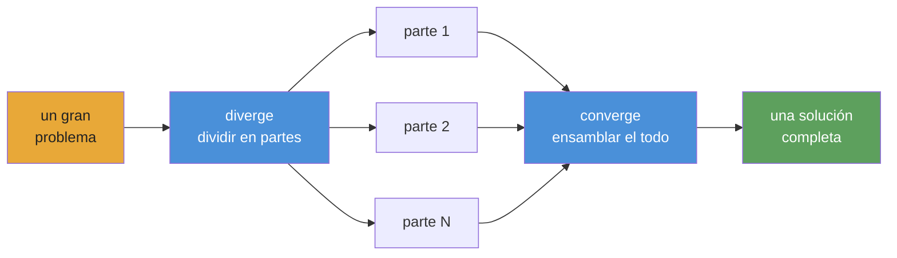

<div align="center">


# Converge

**Orquestación de agentes de IA para playbooks autónomos y duraderos.**

[](https://www.npmjs.com/package/@openplaybooks/converge-core)
[](https://github.com/openplaybooks-dev/converge/stargazers)
[](../../LICENSE)
[](https://nodejs.org/)
[](https://www.typescriptlang.org/)
[](../../examples)
[](../../docs/getting-started/install.md)

[Inicio rápido](#inicio-rápido) · [Ejemplos](../../examples) · [Docs](../../docs) · [Traducciones](../README.md) · [Contribuir](../../CONTRIBUTING.md)

</div>

---

## Qué es Converge

El panorama actual de agentes de IA es potente, pero sigue fragmentado y lleno de trabajo manual. Tenemos buenos modelos, buenas tools y buenas skills, pero convertir todo eso en un workflow confiable para trabajo complejo todavía exige mucho pegamento.

Converge es un framework para playbooks autónomos. Te permite encadenar tasks y skills en un workflow complejo que un agente puede ejecutar de punta a punta, con checks, retries y self-correction dentro del loop.

Un playbook es el artefacto duradero: versionado, inspeccionable y ejecutable. Captura la estructura del trabajo, los outputs esperados y los checks que vuelven confiable el resultado.

**No es un workflow estático. Es un playbook vivo.**

## Inicio rápido

> ⚠️ **Advertencia sobre consumo de tokens:** Converge despacha agentes de IA que llaman APIs de LLM. Un playbook puede consumir decenas de millones de tokens. Usa un modelo barato; mira [Configuración de providers](#configuración-de-providers).

### 1. Instalar

```bash
npm install -g @openplaybooks/converge-core
```

### 2. Bootstrap de un proyecto

```bash
converge init --name=my-project --provider-template=codex
```

### 3. Crear un playbook

```bash
# Start from a built-in example (no AI needed)
converge add --from-example hello-world

# Or generate one from a prompt (requires AI config)
converge add --from-prompt "Literature review on in-context learning"
```

### 4. Ejecutar

```bash
converge run
```

Eso es todo. Recorrido de cinco minutos: **[Your first playbook](../../docs/getting-started/your-first-playbook.md)**.

---

## La apuesta del playbook

La generación actual de agentes de IA ya es poderosa. Se ve en proyectos como [`gstack`](https://github.com/garrytan/gstack), [`superpowers`](https://github.com/obra/superpowers), [`agent-skills`](https://github.com/addyosmani/agent-skills), Anthropic [`financial-services`](https://github.com/anthropics/financial-services) y [`claude-seo`](https://github.com/AgriciDaniel/claude-seo). Muestran lo que pasa cuando los prompts se convierten en skills reutilizables, roles especializados y workflows de dominio.

Pero también señalan la misma pieza faltante. Gran parte de ese poder todavía cuesta mantener y reutilizar. Lo valioso suele vivir dentro de una configuración específica, un host específico o una pila de pegamento manual.

Eso lleva a una pregunta simple: ¿y si el artefacto real no fuera la sesión, sino el playbook?

Converge lleva esa idea en una dirección autónoma. Un playbook no debería solo documentar el trabajo. Debería ejecutarlo. Debería encadenar tasks y skills dentro de un sistema mayor, adaptarse a la forma del problema, verificar sus propios outputs y autocorregirse cuando algo falla.

Esa es la apuesta detrás de Converge: los playbooks pueden crecer desde recetas pequeñas hasta sistemas autónomos complejos, y cuanto más los escriba, comparta y mejore la comunidad, más tendremos una biblioteca reutilizable de trabajo real con agentes en lugar de sesiones aisladas. El runner hace fácil la ejecución. El playbook conserva el conocimiento.

---

## Qué hace diferente a Converge

**Checks, no vibes.** Cada task declara shell-command checks: `tsc`, `grep`, `eslint`, una suite de tests. El runtime repite hasta que pasen. Ningún LLM evalúa su propia salida.

**Fingerprint caching, no checkpoint files.** Cada node recibe un fingerprint SHA-256. Los nodes sin cambios saltan la ejecución, como los modelos incrementales de dbt. Si matas el proceso en el node 47, el re-run retoma desde lo completado.

**Playbooks, no prompts.** Un chat transcript muere con la sesión. Un playbook son archivos `TASK.md` bajo version control. Mismos inputs, mismos outputs, en cada ejecución. Cualquiera del equipo puede re-ejecutarlo.

**DAG, no context window.** Una ventana de chat se agota tras pocas features. Un DAG de playbook divide el trabajo en archivos `TASK.md` independientes; cada uno cabe en una ventana. El runtime los encadena topológicamente. 670 tasks, cero contexto perdido.

**Cambia providers, no reescribas workflows.** Claude, Gemini, Kimi, Qwen, Codex: cambia una config y corre el mismo playbook. Stub mode para desarrollo offline sin costo.

**Alcance dinámico, no wiring estático.** Las tasks pueden expandir trabajo en runtime mediante el contrato actual de CLI seed (`seed: { mode: cli }` más `converge spawn ...`), así que una escena se vuelve una task y un ticker se vuelve una rama de análisis. El DAG crece para ajustarse al problema, no a la plantilla.

---

## Cómo funciona

**Escribes playbooks como archivos y carpetas Markdown. Converge los compila en un DAG y despacha agentes de IA para ejecutarlo.**



**El modelo mental: diverge → converge.** Divide el problema en piezas independientes, ejecútalas en paralelo y ensambla el resultado. Es recursivo: cualquier pieza puede divergir otra vez.

## Estructura del playbook

Un playbook es un árbol de tasks en disco. Cada `TASK.md` declara qué produce y qué comandos de shell comprueban si está hecho. No hay wiring centralizado.

```
.converge/playbooks/{name}/
├── playbook.yml              # entry: name, run config, task paths
└── tasks/
    ├── 01-analyze/
    │   ├── TASK.md
    │   └── tasks/
    │       ├── 01a-extract/TASK.md    # frontmatter (depends_on, outputs, checks)
    │       └── 01b-fingerprint/TASK.md
    ├── 02-catalog/TASK.md
    └── 03-build/
        ├── TASK.md
        ├── TASK.md           # can act as a seed/loop driver
        └── tasks/
            ├── 03a-backend/TASK.md
            └── 03b-frontend/TASK.md
```

El runtime recorre el DAG por capas topológicas. Cada node o se ejecuta (AI agent + shell checks) o se cachea (fingerprint sin cambios frente al run anterior). Los nodes fallidos reintentan hasta el límite; los downstream esperan a que sus dependencias terminen. Como `run` de dbt: orden determinista, caching incremental, sin loops.

---

## Qué puedes construir

Cada ejemplo marcado como **available** abajo es un playbook real y ejecutable en [`examples/`](../../examples/). Los marcados como **coming soon** están diseñados, pero todavía no enviados.

### Starter

| Ejemplo                                      | Estado      | Descripción                                               |
| -------------------------------------------- | ----------- | --------------------------------------------------------- |
| [`hello-world`](../../examples/hello-world/) | available   | El playbook más simple posible: una task, dos checks      |
| [`data-pipeline`](../../examples/data-pipeline/) | available | Pipeline secuencial: fetch → transform → validate         |

### Software

| Ejemplo                                          | Estado      | Descripción                                             |
| ------------------------------------------------ | ----------- | ------------------------------------------------------- |
| [`fullstack-app`](../../examples/fullstack-app/) | available   | Generación dinámica de backend + frontend basada en Seed |
| [`flutter-app`](../../examples/flutter-app/)     | available   | Generación autónoma de app móvil en Flutter / Dart      |
| [`app-builder`](../../examples/app-builder/)     | coming soon | Playbook genérico para scaffolding de apps              |

### Research

| Ejemplo                                                      | Estado      | Descripción                                                                 |
| ------------------------------------------------------------ | ----------- | --------------------------------------------------------------------------- |
| [`deep-research`](../../examples/deep-research/)             | available   | Iterative-deepening por capas con progresión guiada por calidad             |
| [`scientific-research`](../../examples/scientific-research/) | available   | Bayesian reasoning, GRADE evidence, meta-analysis y paper generation        |
| [`frontier-research`](../../examples/frontier-research/)     | available   | Exploración frontier con beam search paralelo y seguimiento de convergencia |

### Simulation

| Ejemplo                                      | Estado      | Descripción                                                               |
| -------------------------------------------- | ----------- | ------------------------------------------------------------------------- |
| [`social-sim`](../../examples/social-sim/)   | available   | Simulación social basada en loops con child tasks por tick                |
| [`game-ai-pk`](../../examples/game-ai-pk/)   | coming soon | Reality show persistente de un solo episodio con game AI                  |

### Optimization

| Ejemplo                                                                  | Estado      | Descripción                                                                    |
| ------------------------------------------------------------------------ | ----------- | ------------------------------------------------------------------------------ |
| [`evolutionary-optimization`](../../examples/evolutionary-optimization/) | available   | Búsqueda sobre fitness landscape para prompt tuning y hyperparameter sweeps    |

### Provider integration

| Ejemplo                                  | Estado      | Descripción                                                   |
| ---------------------------------------- | ----------- | ------------------------------------------------------------- |
| [`acp-demo`](../../examples/acp-demo/)   | available   | Provider `acp` y Claude Agent SDK para invocación programática |

### Coming soon

Estos ejemplos están diseñados, pero todavía no enviados. Mira el issue enlazado o sigue [`examples/`](../../examples/) para novedades:

- `cinematic-video-production` — director de cine IA: `idea.md` → biblioteca consistente de clips cinematográficos
- `game-assets-video` — paquete de assets para platformer a partir de un único `idea.md`
- `autonomous-pentest` — barrido pentest multi-stage con findings gated por PoC reproducible
- `financial-deep-research` — research bursátil multi-phase con análisis por ticker
- `baby-app` — plantilla inicial full-stack mínima

[Browse all examples →](../../examples/)

---

## Configuración de providers

Converge soporta varios runtime providers. El scaffold del proyecto y la CLI exponen hoy IDs de provider de primera clase para **Claude** (`provider: claude`), **Codex** (`provider: codex`), **ACP / endpoints OpenAI-compatible** (`provider: acp`), **Kimi** (`provider: kimi`), **Qwen** (`provider: qwen`), **Gemini** (`provider: gemini`) y **DeepCode** (`provider: deepcode`). Los configuras en `.converge/project.yaml`. **Usa un modelo barato en desarrollo**: Claude Opus cuesta $15/$75 por 1M tokens; modelos baratos cuestan menos de $1/$3.

### Modelos baratos recomendados

| Model                 | Input / 1M | Output / 1M | Mejor para                  |
| --------------------- | ---------- | ----------- | --------------------------- |
| `deepseek-v4-flash`   | $0.27      | $1.10       | Sub-agents, checks rápidos  |
| `deepseek-v4-pro[1m]` | $0.55      | $2.19       | Razonamiento principal      |
| `MiniMax-M2.7`        | $0.50      | $1.50       | Buen balance precio/perf    |
| Claude Opus 4.5       | $15.00     | $75.00      | Máxima calidad (caro)       |

### Ejemplo de `.converge/project.yaml`

```yaml
# .converge/project.yaml
name: my-project

ai:
  default: claude
  providers:
    # ── Claude Code backend ──────────────────────────
    claude:
      provider: claude
      env:
        # Route through DeepSeek (cheap)
        ANTHROPIC_BASE_URL: https://api.deepseek.com/anthropic
        ANTHROPIC_AUTH_TOKEN: "${DEEPSEEK_API_KEY}"
        ANTHROPIC_MODEL: deepseek-v4-pro[1m]
        ANTHROPIC_DEFAULT_HAIKU_MODEL: deepseek-v4-flash
        CLAUDE_CODE_SUBAGENT_MODEL: deepseek-v4-flash

        # Or route through MiniMax-M2.7 (uncomment to use)
        # ANTHROPIC_BASE_URL: "https://api.minimax.io/anthropic"
        # ANTHROPIC_AUTH_TOKEN: "${MINIMAX_API_KEY}"
        # ANTHROPIC_MODEL: "MiniMax-M2.7"

    # ── Codex backend ────────────────────────────────
    codex:
      provider: codex
      env:
        CODEX_API_KEY: "${CODEX_API_KEY}"
        # Or set OPENAI_API_KEY instead
```

**Claude Code** corre mediante la CLI `claude`; define `DEEPSEEK_API_KEY` o `MINIMAX_API_KEY` en tu entorno. **Codex** corre mediante la CLI `codex` (`npm i -g @openai/codex`); define `CODEX_API_KEY` o `OPENAI_API_KEY`. Converge resuelve referencias `${VAR}` automáticamente. `converge init` genera este archivo.

> **Los ejemplos incluidos usan MiniMax por defecto.** Cada ejemplo en [`examples/`](../../examples/) incluye un `.converge/project.yaml` que enruta Claude a `https://api.minimax.io/anthropic` usando `MiniMax-M2.7`. Define `MINIMAX_API_KEY` en tu entorno y corren de punta a punta. Si quieres otro provider, sobrescribe `ANTHROPIC_BASE_URL` / `ANTHROPIC_MODEL` o edita el `project.yaml` del ejemplo.

Guía completa: [Switching providers](../../docs/guides/switch-providers.md).

---

## Integraciones

Converge se integra en dos capas:

- **Coding agents** para diseñar y operar playbooks desde tu workspace
- **Runtime providers** para ejecutar tasks dentro del playbook

### Coding agents

Converge incluye dos **skills** para que puedas diseñar y ejecutar playbooks sin salir de tu coding agent:

| Skill               | Qué hace                                                                                                         |
| ------------------- | ---------------------------------------------------------------------------------------------------------------- |
| `converge-planning` | Diseña un playbook nuevo desde un prompt: genera `PLAN.md`, archivos `TASK.md`, dependency graph y shell-level checks |
| `converge-control`  | Ejecuta y monitorea un playbook: clasifica DAG events, diagnostica fallos y hace re-runs incrementales         |

### Flujo end-to-end

```bash
# 1. Bootstrap a project with skills installed
converge init --name=my-project --skills

# 2. In your coding agent, design the playbook
/converge-planning   # "Build a REST API for user management with auth"

# 3. Run
converge run

# 4. Hand off to converge-control — it monitors, diagnoses, and re-runs on failure
/converge-control    # run → monitor → retry failures
```

<details>
<summary><strong>Claude Code</strong></summary>

- `converge init --skills` instala las skills incluidas en `.claude/skills/`
- Claude Code descubre skills automáticamente desde ese directorio
- Invócalas directamente con `/converge-planning` y `/converge-control`

```bash
converge init --name=my-project --skills

# Re-run on an existing project to install bundled skills only
converge init --skills
```

</details>

<details>
<summary><strong>Codex</strong></summary>

- `converge init --skills` también instala las skills incluidas en `.codex/skills/`
- Codex lee las skills desde ese directorio del mismo modo
- Usa las mismas skills de Converge para planear y operar playbooks desde tu workspace de Codex

```bash
converge init --name=my-project --skills

# Re-run on an existing project to install bundled skills only
converge init --skills
```

</details>

<details>
<summary><strong>Otras configuraciones de coding agents</strong></summary>

- La instalación de skills incluida está documentada aquí específicamente para Claude Code y Codex
- La portabilidad del runtime provider se configura aparte en `.converge/project.yaml`

Consulta [Switching providers](../../docs/guides/switch-providers.md).

</details>

### Comportamiento de las skills

- Escribe `/skill-name` para invocarla: la skill carga docs de referencia, comandos CLI, catálogo de eventos y recetas de troubleshooting con contexto completo
- `converge-planning` cubre la fase de diseño inicial; `converge-control` toma el relevo durante la ejecución

### Instalar skills en un proyecto existente

```bash
converge init --skills
```

### Runtime providers

El runtime del playbook es la capa portable. Puedes cambiar providers en `.converge/project.yaml` sin reescribir el playbook.

<details>
<summary><strong>Claude</strong></summary>

- Backend de primera clase vía `provider: claude`
- Corre mediante la CLI `claude`
- Soporta routing Anthropic-compatible como DeepSeek o MiniMax mediante `ANTHROPIC_BASE_URL`

</details>

<details>
<summary><strong>Codex</strong></summary>

- Backend de primera clase vía `provider: codex`
- Corre mediante la CLI `codex`
- Usa `CODEX_API_KEY` o `OPENAI_API_KEY`

</details>

<details>
<summary><strong>Gemini, Kimi, Qwen y endpoints OpenAI-compatible</strong></summary>

- Converge scaffold IDs directos para `provider: gemini`, `provider: kimi` y `provider: qwen`
- Usa `provider: acp` si quieres un endpoint OpenAI-compatible arbitrario o un `baseUrl` personalizado
- Mezclar providers baratos y fuertes dentro del mismo playbook es la palanca principal de costo/rendimiento

</details>

<details>
<summary><strong>Portable por diseño</strong></summary>

- Las skills ayudan a los agentes a hacer el trabajo
- Los playbooks definen el trabajo
- Los providers son backends de ejecución que puedes intercambiar debajo del mismo playbook

</details>

---

## Paquetes

| Paquete                                      | Path                                    | Propósito                                                                                                    |
| -------------------------------------------- | --------------------------------------- | ------------------------------------------------------------------------------------------------------------ |
| [`@openplaybooks/converge-core`](../../packages/core/)     | `packages/core/`                        | Motor TypeScript puro: runner registry, task graph, state machine, repair strategies. Sin dependencias UI. |
| [`@openplaybooks/converge-cli`](../../packages/cli/)       | `packages/cli/`                         | CLI de terminal. Bootstrap, run, watch, tail. Conduce runs mediante provider backends.                     |
| [`@openplaybooks/studio`](../../packages/studio/) | `packages/studio/`                      | Web UI para visualizar runs, inspeccionar tasks y navegar journals.                                         |
| Provider packs                               | `packages/{claude,gemini,kimi,qwen}fn/` | Backends específicos por provider. Cambia sin modificar playbooks.                                          |

---

## Dogfood

Partes importantes de este repo fueron construidas por Converge ejecutando playbooks sobre sí mismo: rediseño del CLI (63 tasks), landing page (65 tasks), generación de docs y más. [Ver las pruebas →](../../.converge/playbooks/). Si el runtime no funcionara, este README estaría escrito a mano.

> **`v0.1.0` · public preview** — El runtime ya está disponible. **12 playbooks de ejemplo ejecutables** entre software, research, simulation e integración de providers. Más en camino.

---

## Traducciones

- [Tiếng Việt](../vi/README.md)
- [Español](../es/README.md)
- [Português do Brasil](../pt-BR/README.md)
- [简体中文](../zh-CN/README.md)
- [日本語](../ja/README.md)

---

## Comunidad

- **[Discussions](https://github.com/openplaybooks-dev/converge/discussions)** — preguntas, ideas, patrones de playbooks
- **[Issues](https://github.com/openplaybooks-dev/converge/issues)** — reportes de bugs, solicitudes de features
- **[Contributing](../../CONTRIBUTING.md)** — setup de desarrollo, estructura del proyecto, cómo enviar un PR

---

## Licencia

MIT — ver [LICENSE](../../LICENSE)

<div align="center">

**Autónomo · Repetible · Verificable**

</div>
