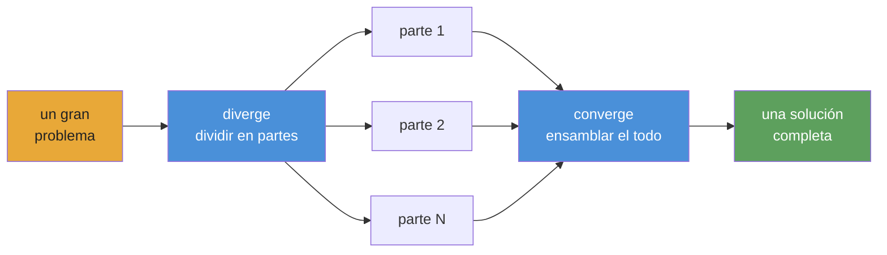

<div align="center">


# Playbooks autónomos para agentes de IA

**Orquestación y ejecución de agentes para workflows complejos, repetibles y verificables.**

[](https://www.npmjs.com/package/@converge/core)
[](https://github.com/myanlabs/converge/stargazers)
[](../../LICENSE)
[](https://nodejs.org/)
[](https://www.typescriptlang.org/)
[](../../examples)
[](../../docs/getting-started/install.md)

[Inicio rápido](#inicio-rápido) · [Ejemplos](../../examples) · [Docs](../../docs) · [Traducciones](../README.md) · [Contribuir](../../CONTRIBUTING.md)

 </div>

---

## Cómo funciona

**Escribes playbooks como archivos y carpetas Markdown. Converge los compila en un DAG y despacha agentes de IA para ejecutarlo.**



**El modelo mental: diverge → converge.** Divide el problema en piezas independientes, ejecútalas en paralelo y ensambla el resultado. Es recursivo: cualquier pieza puede hacer diverge por sí misma.

1. **`converge init`** — inicializa un proyecto con configuración de providers y estructura de directorios.
2. **`converge add`** — trae un ejemplo, genera desde un prompt o escribe el playbook manualmente.
3. **`converge run`** — compila el DAG, despacha agentes y repite hasta que los checks pasen. En cada node: un agente hace el trabajo y los shell checks lo verifican. Reintenta al fallar y cachea al tener éxito.

**Escribe archivos y carpetas TASK.md. Markdown plano. Versiona todo.**

**Comparte el playbook y ejecútalo de nuevo cuando quieras. Mismos inputs, mismos outputs.**

---

## Qué puedes construir

Cada ejemplo de abajo es un playbook real y ejecutable en [`examples/`](../../examples/).

### Software

| Ejemplo                                          | Descripción                                                        |
| ------------------------------------------------ | ------------------------------------------------------------------ |
| [`fullstack-app`](../../examples/fullstack-app/) | Generación dinámica de backend + frontend con Seed y tests pasando |
| [`flutter-app`](../../examples/flutter-app/)     | Generación autónoma de apps móviles en Flutter / Dart              |
| [`baby-app`](../../examples/baby-app/)           | Plantilla full-stack mínima; clonar, editar y ejecutar             |

### Research

| Ejemplo                                                      | Descripción                                                                                    |
| ------------------------------------------------------------ | ---------------------------------------------------------------------------------------------- |
| [`deep-research`](../../examples/deep-research/)             | Profundización iterativa por capas con progresión controlada por calidad                       |
| [`scientific-research`](../../examples/scientific-research/) | Razonamiento bayesiano, evidencia GRADE, meta-análisis y generación de paper — loop de 8 fases |
| [`frontier-research`](../../examples/frontier-research/)     | Síntesis multi-fuente para dominios técnicos que cambian rápido                                |

### Creative

| Ejemplo                                                                    | Descripción                                                                                        |
| -------------------------------------------------------------------------- | -------------------------------------------------------------------------------------------------- |
| [`cinematic-video-production`](../../examples/cinematic-video-production/) | Director de cine IA end-to-end. `idea.md` → `clips/` con elementos bloqueados + composición        |
| [`game-assets-video`](../../examples/game-assets-video/)                   | Pack de assets para platformer — personajes, props, tilesheets, parallax — desde un solo `idea.md` |
| [`social-sim`](../../examples/social-sim/)                                 | Simulación social basada en loops con tareas hijas generadas por tick                              |

### Security

| Ejemplo                                                    | Descripción                                                                                                          |
| ---------------------------------------------------------- | -------------------------------------------------------------------------------------------------------------------- |
| [`autonomous-pentest`](../../examples/autonomous-pentest/) | Barrido pentest de ~250 tareas. Hallazgos gated por PoC reproducible. Requiere `scope.yml`. **Solo uso autorizado.** |

### Ops & data

| Ejemplo                                                                  | Descripción                                                                                  |
| ------------------------------------------------------------------------ | -------------------------------------------------------------------------------------------- |
| [`data-pipeline`](../../examples/data-pipeline/)                         | Pipeline secuencial: fetch → transform → validate                                            |
| [`financial-deep-research`](../../examples/financial-deep-research/)     | Pipeline multi-fase de research de acciones con análisis por ticker y reporte consolidado    |
| [`evolutionary-optimization`](../../examples/evolutionary-optimization/) | Búsqueda en fitness landscape para prompt tuning, barridos de hiperparámetros y copy testing |

[Ver todos los ejemplos →](../../examples/)

---

## Estructura de un playbook

Un playbook es un árbol de tareas en disco. Cada TASK.md declara qué produce y qué comandos de shell comprueban si terminó. No hay cableado centralizado.

```
.converge/playbooks/{name}/
├── playbook.yml              # entry: name, run config, task paths
└── tasks/
    ├── 01-analyze/
    │   ├── TASK.md
    │   └── tasks/
    │       ├── 01a-extract/TASK.md    # frontmatter (depends_on, outputs, checks)
    │       └── 01b-fingerprint/TASK.md
    ├── 02-catalog/TASK.md
    └── 03-build/
        ├── TASK.md
        └── tasks/
            ├── 03a-backend/TASK.md
            └── 03b-frontend/TASK.md
```

Loop de ejecución — diverge, execute, converge:

```
  DIVERGE ──→ EXECUTE ──→ CONVERGE
  seed runs   children     body reads outputs,
  spawns      produce      integrates, validates
  children    outputs      → 0 gaps = done
```

El runtime recorre el DAG en capas topológicas. Cada node se ejecuta (AI agent + shell checks) o se cachea (fingerprint sin cambios respecto a la ejecución anterior). Los nodes fallidos reintentan hasta el límite de intentos; los nodes downstream esperan a que sus dependencias terminen. Como el `run` de dbt: orden determinista, caching incremental, sin loops.

---

## Inicio rápido

> ⚠️ **Advertencia de consumo de tokens:** Converge despacha agentes de IA que llaman APIs de LLM. Un playbook puede consumir decenas de millones de tokens. Usa un modelo barato — ver [Configuración de providers](#configuración-de-providers).

### 1. Instalar

```bash
npm install -g @converge/core
```

### 2. Inicializar un proyecto

```bash
converge init --name=my-project
```

### 3. Crear un playbook

```bash
# Start from a built-in example (no AI needed)
converge add --from-example hello-world

# Or generate one from a prompt (requires AI config)
converge add --from-prompt "Literature review on in-context learning"
```

### 4. Ejecutar

```bash
converge run
```

Eso es todo. Guía de cinco minutos: **[Your first playbook](../../docs/getting-started/your-first-playbook.md)**.

---

## Por qué Converge

**Checks, no intuición.** Cada tarea declara shell-command checks: `tsc`, `grep`, `eslint`, una suite de tests. El runtime repite hasta que pasen. Ningún LLM juzga su propia salida.

**Fingerprint caching, no checkpoint files.** Cada node recibe un fingerprint SHA-256. Los nodes sin cambios saltan la ejecución, como los modelos incrementales de dbt. Si paras en el node 47, al volver a ejecutar continúa desde lo completado.

**Playbooks, no prompts.** Un chat transcript muere con la sesión. Un playbook son archivos TASK.md versionados. Mismos inputs, mismos outputs, en cada ejecución. Cualquiera del equipo puede volver a ejecutarlo.

**DAG, no context window.** Una ventana de chat se agota tras unas pocas features. Un DAG de playbook divide el trabajo en archivos TASK.md independientes; cada uno cabe en una ventana. El runtime los encadena topológicamente. 670 tareas, cero contexto perdido.

**Cambia providers, no reescribas workflows.** Claude, Gemini, Kimi, Qwen, Codex: cambia una config y corre el mismo playbook. Stub mode para desarrollo offline sin coste.

**Scope dinámico, no cableado estático.** Las tareas pueden expandir trabajo en runtime mediante el contrato actual de CLI seed (`seed: { mode: cli }` más `converge spawn ...`), de modo que una escena se vuelve una tarea y un ticker se vuelve una rama de análisis. El DAG crece para ajustarse al problema, no a la plantilla.

---

## Configuración de providers

Converge corre sobre cualquier LLM. Soporta dos backends de agentes — **Claude Code** (`provider: claude`) y **OpenAI Codex** (`provider: codex`) — cada uno enruta a través del modelo que elijas. Configuras el backend en `.converge/project.yaml`. **Usa un modelo barato para desarrollo**: Claude Opus cuesta $15/$75 por 1M tokens; modelos baratos cuestan menos de $1/$3.

### Modelos baratos recomendados

| Model                 | Input / 1M | Output / 1M | Mejor para                 |
| --------------------- | ---------- | ----------- | -------------------------- |
| `deepseek-v4-flash`   | $0.27      | $1.10       | Sub-agents, checks rápidos |
| `deepseek-v4-pro[1m]` | $0.55      | $2.19       | Razonamiento principal     |
| `MiniMax-M2.7`        | $0.50      | $1.50       | Balance precio/rendimiento |
| Claude Opus 4.5       | $15.00     | $75.00      | Máxima calidad (caro)      |

### Ejemplo de `.converge/project.yaml`

```yaml
# .converge/project.yaml
name: my-project

ai:
  default: claude
  providers:
    # ── Claude Code backend ──────────────────────────
    claude:
      provider: claude
      env:
        # Route through DeepSeek (cheap)
        ANTHROPIC_BASE_URL: https://api.deepseek.com/anthropic
        ANTHROPIC_AUTH_TOKEN: "${DEEPSEEK_API_KEY}"
        ANTHROPIC_MODEL: deepseek-v4-pro[1m]
        ANTHROPIC_DEFAULT_HAIKU_MODEL: deepseek-v4-flash
        CLAUDE_CODE_SUBAGENT_MODEL: deepseek-v4-flash

        # Or route through MiniMax-M2.7 (uncomment to use)
        # ANTHROPIC_BASE_URL: "https://api.minimax.io/anthropic"
        # ANTHROPIC_AUTH_TOKEN: "${MINIMAX_API_KEY}"
        # ANTHROPIC_MODEL: "MiniMax-M2.7"

    # ── Codex backend ────────────────────────────────
    codex:
      provider: codex
      env:
        CODEX_API_KEY: "${CODEX_API_KEY}"
        # Or set OPENAI_API_KEY instead
```

**Claude Code** corre mediante el CLI `claude`: define `DEEPSEEK_API_KEY` o `MINIMAX_API_KEY` en tu entorno. **Codex** corre mediante el CLI `codex` (`npm i -g @openai/codex`): define `CODEX_API_KEY` o `OPENAI_API_KEY`. Converge resuelve referencias `${VAR}` automáticamente. `converge init` genera este archivo por ti.

Guía completa: [Switching providers](../../docs/guides/switch-providers.md).

---

## Integración con Claude Code & Codex

Converge incluye dos **skills** que se conectan a tu coding agent para diseñar y ejecutar playbooks sin salir de la terminal:

| Skill               | Qué hace                                                                                                          |
| ------------------- | ----------------------------------------------------------------------------------------------------------------- |
| `converge-planning` | Diseña un playbook nuevo desde un prompt: genera PLAN.md, archivos TASK.md, dependency graph y shell-level checks |
| `converge-control`  | Ejecuta y monitoriza un playbook: clasifica DAG events, diagnostica fallos y re-ejecuta incrementalmente          |

### Flujo end-to-end

```bash
# 1. Bootstrap a project with skills installed
converge init --name=my-project --skills

# 2. In Claude Code, design the playbook
/converge-planning   # "Build a REST API for user management with auth"

# 3. Run
converge run

# 4. Hand off to converge-control — it monitors, diagnoses, and re-runs on failure
/converge-control    # run → monitor → retry failures
```

### Cómo funciona

- `converge init --skills` instala ambos skills en `.claude/skills/` y `.codex/skills/`
- **Claude Code** y **Codex** auto-descubren skills desde esos directorios, sin configuración
- Escribe `/skill-name` para invocarlo: el skill carga sus docs de referencia completos (CLI commands, event catalog, troubleshooting recipes) y opera con contexto completo
- `converge-planning` se encarga de la fase de diseño inicial; `converge-control` toma el relevo durante la ejecución. Están hechos para pasarse el control entre sí

### Instalar skills en un proyecto existente

```bash
converge skills install                    # default: .claude/skills/
converge skills install --target .codex/skills
```

---

## Paquetes

| Paquete                                      | Path                                    | Propósito                                                                                                  |
| -------------------------------------------- | --------------------------------------- | ---------------------------------------------------------------------------------------------------------- |
| [`@converge/core`](../../packages/core/)     | `packages/core/`                        | Motor TypeScript puro: runner registry, task graph, state machine, repair strategies. Sin dependencias UI. |
| [`@converge/cli`](../../packages/cli/)       | `packages/cli/`                         | CLI de terminal. Bootstrap, run, watch, tail. Conduce ejecuciones mediante provider backends.              |
| [`@converge/studio`](../../packages/studio/) | `packages/studio/`                      | Web UI para visualizar runs, inspeccionar tasks y navegar journals.                                        |
| Provider packs                               | `packages/{claude,gemini,kimi,qwen}fn/` | Backends específicos por provider. Cambia sin modificar playbooks.                                         |

---

## Dogfood

Partes importantes de este repo fueron construidas por Converge ejecutando playbooks sobre sí mismo: CLI redesign (63 tareas), landing page (65 tareas), docs generation y más. [Ver los recibos →](../../.converge/playbooks/). Si el runtime no funcionara, este README estaría escrito a mano.

> **`v0.1.0` · public preview** — El runtime ya está disponible. **12 playbooks de ejemplo ejecutables** para software, investigación, simulación e integración de providers. Habrá más próximamente.

---

## Traducciones

- [Tiếng Việt](../vi/README.md)
- [Español](../es/README.md)
- [Português do Brasil](../pt-BR/README.md)
- [简体中文](../zh-CN/README.md)
- [日本語](../ja/README.md)

---

## Comunidad

- **[Discussions](https://github.com/myanlabs/converge/discussions)** — preguntas, ideas, patrones de playbooks
- **[Issues](https://github.com/myanlabs/converge/issues)** — reportes de bugs, solicitudes de features
- **[Contributing](../../CONTRIBUTING.md)** — setup de desarrollo, estructura del proyecto, cómo enviar un PR

---

## Licencia

MIT — ver [LICENSE](../../LICENSE)

<div align="center">

**Autónomo · Repetible · Verificable**

</div>
