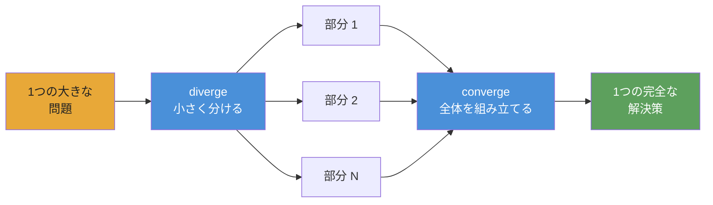

<div align="center">


# 自律型 AI Agent Playbook

**複雑で、再実行可能で、検証可能な workflow のための agent 実行・オーケストレーション。**

[](https://www.npmjs.com/package/@converge/core)
[](https://github.com/myanlabs/converge/stargazers)
[](../../LICENSE)
[](https://nodejs.org/)
[](https://www.typescriptlang.org/)
[](../../examples)
[](../../docs/getting-started/install.md)

[クイックスタート](#クイックスタート) · [Examples](../../examples) · [Docs](../../docs) · [翻訳](../README.md) · [Contributing](../../CONTRIBUTING.md)

</div>

> **`v0.1.0` · public preview** — Runtime が利用可能です。ソフトウェア、リサーチ、セキュリティ、クリエイティブ制作向けに **24 個の実行可能な example playbook** を含みます。

---

## 仕組み

**Playbook を Markdown のファイルとフォルダとして書きます。Converge はそれらを DAG にコンパイルし、AI agent に実行させます。**



**メンタルモデルは diverge → converge です。** 問題を独立した部分に分け、並列に実行し、結果を組み立てます。再帰的なので、どの部分もさらに diverge できます。

1. **`converge init`** — provider 設定とディレクトリ構造を持つ project を bootstrap します。
2. **`converge add`** — example を取り込む、prompt から生成する、または playbook を手で書きます。
3. **`converge run`** — DAG をコンパイルし、agent を dispatch し、checks が pass するまで loop します。各 node では agent が作業し、shell checks が検証します。失敗時は retry、成功時は cache します。

**TASK.md ファイルとフォルダを書く。Plain markdown。Version control する。**

**Playbook を共有し、いつでも再実行する。同じ inputs、同じ outputs。**

---

## 作れるもの

以下の example はすべて [`examples/`](../../examples/) にある実際に実行可能な playbook です。

### Software

| Example                                          | 説明                                                   |
| ------------------------------------------------ | ------------------------------------------------------ |
| [`fullstack-app`](../../examples/fullstack-app/) | Seed による動的 backend + frontend 生成。tests passing |
| [`flutter-app`](../../examples/flutter-app/)     | Flutter / Dart による自律的な mobile app 生成          |
| [`baby-app`](../../examples/baby-app/)           | 最小 full-stack template。clone、edit、run             |

### Research

| Example                                                      | 説明                                                                                     |
| ------------------------------------------------------------ | ---------------------------------------------------------------------------------------- |
| [`deep-research`](../../examples/deep-research/)             | Quality gate で進む layered iterative-deepening                                          |
| [`scientific-research`](../../examples/scientific-research/) | Bayesian reasoning、GRADE evidence、meta-analysis、paper generation — 8-phase epoch loop |
| [`frontier-research`](../../examples/frontier-research/)     | 変化の速い技術領域向けの multi-source synthesis                                          |

### Creative

| Example                                                                    | 説明                                                                                       |
| -------------------------------------------------------------------------- | ------------------------------------------------------------------------------------------ |
| [`cinematic-video-production`](../../examples/cinematic-video-production/) | End-to-end AI film director。`idea.md` → `clips/`、locked elements + compositing           |
| [`game-assets-video`](../../examples/game-assets-video/)                   | Platformer asset pack — characters、props、tilesheets、parallax — 1つの `idea.md` から生成 |
| [`social-sim`](../../examples/social-sim/)                                 | Tick ごとに child tasks を spawn する loop-based social simulation                         |

### Security

| Example                                                    | 説明                                                                                                                  |
| ---------------------------------------------------------- | --------------------------------------------------------------------------------------------------------------------- |
| [`autonomous-pentest`](../../examples/autonomous-pentest/) | 約250 task の pentest sweep。Findings は再現可能な PoC で gate されます。`scope.yml` が必要。**許可された用途のみ。** |

### Ops & data

| Example                                                                  | 説明                                                                                      |
| ------------------------------------------------------------------------ | ----------------------------------------------------------------------------------------- |
| [`data-pipeline`](../../examples/data-pipeline/)                         | Sequential pipeline: fetch → transform → validate                                         |
| [`financial-deep-research`](../../examples/financial-deep-research/)     | Per-ticker analysis と consolidated reporting を持つ multi-phase equity research pipeline |
| [`evolutionary-optimization`](../../examples/evolutionary-optimization/) | Prompt tuning、hyperparameter sweeps、copy testing のための fitness-landscape search      |

[すべての examples を見る →](../../examples/)

---

## Playbook の構造

Playbook は disk 上の task tree です。各 TASK.md は、何を生成するか、完了を確認する shell commands は何かを宣言します。中央集権的な wiring はありません。

```
.converge/playbooks/{name}/
├── playbook.yml              # entry: name, run config, task paths
└── tasks/
    ├── 01-analyze/
    │   ├── TASK.md
    │   └── tasks/
    │       ├── 01a-extract/TASK.md    # frontmatter (depends_on, outputs, checks)
    │       └── 01b-fingerprint/TASK.md
    ├── 02-catalog/TASK.md
    └── 03-build/
        ├── TASK.md
        ├── seed.js           # optional: spawn children at runtime
        └── tasks/
            ├── 03a-backend/TASK.md
            └── 03b-frontend/TASK.md
```

Execution loop — diverge, execute, converge:

```
  DIVERGE ──→ EXECUTE ──→ CONVERGE
  seed runs   children     body reads outputs,
  spawns      produce      integrates, validates
  children    outputs      → 0 gaps = done
```

Runtime は DAG を topological layers で進みます。各 node は実行される（AI agent + shell checks）か、cache されます（前回 run から fingerprint が変わらない場合）。失敗した node は attempt cap まで retry され、downstream nodes は dependencies の完了を待ちます。dbt の `run` のように、決定的な順序、incremental caching、loop なしです。

---

## クイックスタート

> ⚠️ **Token 消費の警告:** Converge は LLM APIs を呼び出す AI agents を dispatch します。1つの playbook が数千万 tokens を消費することがあります。安い model を使ってください — 下の [Provider 設定](#provider-設定) を参照してください。

### 1. インストール

```bash
npm install -g @converge/core
```

### 2. Project を bootstrap

```bash
converge init --name=my-project
```

### 3. Playbook を作成

```bash
# Start from a built-in example (no AI needed)
converge add --from-example hello-world

# Or generate one from a prompt (requires AI config)
converge add --from-prompt "Literature review on in-context learning"
```

### 4. 実行

```bash
converge run
```

これだけです。5分の walkthrough: **[Your first playbook](../../docs/getting-started/your-first-playbook.md)**。

---

## Converge を選ぶ理由

**Checks, not vibes.** 各 task は shell-command checks を宣言します — `tsc`、`grep`、`eslint`、test suite。Runtime はそれらが pass するまで loop します。LLM に自分の output を judge させません。

**Fingerprint caching, not checkpoint files.** 各 node には SHA-256 fingerprint が付きます。変更されていない node は execution を skip します — dbt の incremental models のように。Node 47 で止めても、再実行すれば完了済みの部分から続きます。

**Playbooks, not prompts.** Chat transcript は session とともに消えます。Playbook は version-controlled TASK.md files です。同じ inputs、同じ outputs、毎回同じ run。チームの誰でも再実行できます。

**DAG, not context window.** Chat window は数 features で限界になります。Playbook DAG は作業を独立した TASK.md files に分けます — それぞれが1つの window に収まります。Runtime はそれらを topological に chain します。670 tasks、context loss ゼロ。

**Swap providers, not rewrite workflows.** Claude、Gemini、Kimi、Qwen、Codex — 1つの config を変えるだけで同じ playbook が動きます。Stub mode は zero-cost offline development 用です。

**Dynamic scope, not static wiring.** `seed.js` 関数は input に基づいて runtime で nodes を spawn します — 1つの scene が 1 task に、1つの stock ticker が 1 analysis branch になります。DAG は template ではなく problem に合わせて成長します。

---

## Provider 設定

Converge は任意の LLM で動きます。2つの agent backend — **Claude Code** (`provider: claude`) と **OpenAI Codex** (`provider: codex`) — をサポートし、それぞれ選択した model に route します。Backend は `.converge/project.yaml` で設定します。**開発には安い model を使ってください** — Claude Opus は 1M tokens あたり $15/$75、安い models は $1/$3 未満です。

### 推奨される安い models

| Model                 | Input / 1M | Output / 1M | 最適な用途                  |
| --------------------- | ---------- | ----------- | --------------------------- |
| `deepseek-v4-flash`   | $0.27      | $1.10       | Sub-agents, fast checks     |
| `deepseek-v4-pro[1m]` | $0.55      | $2.19       | Primary reasoning           |
| `MiniMax-M2.7`        | $0.50      | $1.50       | Balanced price/perf         |
| Claude Opus 4.5       | $15.00     | $75.00      | Highest quality (expensive) |

### `.converge/project.yaml` のサンプル

```yaml
# .converge/project.yaml
name: my-project

ai:
  default: claude
  providers:
    # ── Claude Code backend ──────────────────────────
    claude:
      provider: claude
      env:
        # Route through DeepSeek (cheap)
        ANTHROPIC_BASE_URL: https://api.deepseek.com/anthropic
        ANTHROPIC_AUTH_TOKEN: "${DEEPSEEK_API_KEY}"
        ANTHROPIC_MODEL: deepseek-v4-pro[1m]
        ANTHROPIC_DEFAULT_HAIKU_MODEL: deepseek-v4-flash
        CLAUDE_CODE_SUBAGENT_MODEL: deepseek-v4-flash

        # Or route through MiniMax-M2.7 (uncomment to use)
        # ANTHROPIC_BASE_URL: "https://api.minimax.io/anthropic"
        # ANTHROPIC_AUTH_TOKEN: "${MINIMAX_API_KEY}"
        # ANTHROPIC_MODEL: "MiniMax-M2.7"

    # ── Codex backend ────────────────────────────────
    codex:
      provider: codex
      env:
        CODEX_API_KEY: "${CODEX_API_KEY}"
        # Or set OPENAI_API_KEY instead
```

**Claude Code** は `claude` CLI 経由で動きます — `DEEPSEEK_API_KEY` または `MINIMAX_API_KEY` を environment に設定してください。**Codex** は `codex` CLI (`npm i -g @openai/codex`) 経由で動きます — `CODEX_API_KEY` または `OPENAI_API_KEY` を設定してください。Converge は `${VAR}` references を自動で解決します。`converge init` はこの file を scaffold します。

完全な guide: [Switching providers](../../docs/guides/switch-providers.md)。

---

## Claude Code & Codex 連携

Converge には、terminal を離れずに playbook を設計・実行できるよう coding agent に接続する2つの **skills** が付属します。

| Skill               | 役割                                                                                                    |
| ------------------- | ------------------------------------------------------------------------------------------------------- |
| `converge-planning` | Prompt から新しい playbook を設計 — PLAN.md、TASK.md files、dependency graph、shell-level checks を生成 |
| `converge-control`  | Playbook を run and monitor — DAG events を分類し、failures を診断し、incremental に re-run             |

### 全体の流れ

```bash
# 1. Bootstrap a project with skills installed
converge init --name=my-project --skills

# 2. In Claude Code, design the playbook
/converge-planning   # "Build a REST API for user management with auth"

# 3. Run
converge run

# 4. Hand off to converge-control — it monitors, diagnoses, and re-runs on failure
/converge-control    # run → monitor → retry failures
```

### 仕組み

- `converge init --skills` は両方の skills を `.claude/skills/` と `.codex/skills/` に install します
- **Claude Code** と **Codex** はこれらの directories から skills を自動 discovery します — configuration は不要です
- `/skill-name` と入力して invoke します。Skill は full reference docs（CLI commands、event catalog、troubleshooting recipes）を load し、full context で動作します
- `converge-planning` は upfront design phase を担当し、`converge-control` は execution 中に引き継ぎます — 互いに hand off できるように作られています

### 既存 project に skills を install

```bash
converge skills install                    # default: .claude/skills/
converge skills install --target .codex/skills
```

---

## パッケージ

| Package                                      | Path                                    | 目的                                                                                                          |
| -------------------------------------------- | --------------------------------------- | ------------------------------------------------------------------------------------------------------------- |
| [`@converge/core`](../../packages/core/)     | `packages/core/`                        | Pure-TypeScript engine: runner registry、task graph、state machine、repair strategies。UI dependencies なし。 |
| [`@converge/cli`](../../packages/cli/)       | `packages/cli/`                         | Terminal CLI。Bootstrap、run、watch、tail。Provider backends 経由で runs を駆動。                             |
| [`@converge/studio`](../../packages/studio/) | `packages/studio/`                      | Runs の可視化、tasks の inspect、journals の browse のための Web UI。                                         |
| Provider packs                               | `packages/{claude,gemini,kimi,qwen}fn/` | Provider-specific backends。Playbook を変えずに swap できます。                                               |

---

## Dogfood

この repo の重要な部分は、Converge が自身に対して playbooks を実行して作られています — CLI redesign（63 tasks）、landing page（65 tasks）、docs generation など。[証拠を見る →](../../.converge/playbooks/)。Runtime が動かなければ、この README は手書きだったはずです。

---

## 翻訳

- [Tiếng Việt](../vi/README.md)
- [Español](../es/README.md)
- [Português do Brasil](../pt-BR/README.md)
- [简体中文](../zh-CN/README.md)
- [日本語](../ja/README.md)

---

## コミュニティ

- **[Discussions](https://github.com/myanlabs/converge/discussions)** — questions、ideas、playbook patterns
- **[Issues](https://github.com/myanlabs/converge/issues)** — bug reports、feature requests
- **[Contributing](../../CONTRIBUTING.md)** — dev setup、project structure、PR の送り方

---

## ライセンス

MIT — [LICENSE](../../LICENSE) を参照

<div align="center">

**自律的 · 再実行可能 · 検証可能**

</div>
