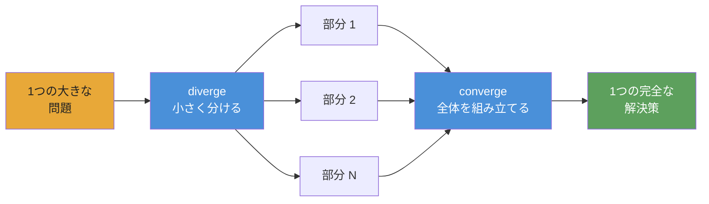

<div align="center">


# Converge

**持続可能な自律 playbook のための AI agent オーケストレーション。**

[](https://www.npmjs.com/package/@openplaybooks/converge-core)
[](https://github.com/openplaybooks-dev/converge/stargazers)
[](../../LICENSE)
[](https://nodejs.org/)
[](https://www.typescriptlang.org/)
[](../../examples)
[](../../docs/getting-started/install.md)

[クイックスタート](#クイックスタート) · [Examples](../../examples) · [Docs](../../docs) · [翻訳](../README.md) · [Contributing](../../CONTRIBUTING.md)

</div>

---

## Converge とは

現在の AI agent の世界は強力ですが、まだ断片的で手作業も多く残っています。良い models、良い tools、良い skills はありますが、それらを複雑な仕事向けの信頼できる workflow に変えるには、まだ多くの glue が必要です。

Converge は自律 playbook のための framework です。tasks と skills をつないで、agent が end-to-end で実行できる複雑な workflow を作れます。loop の中に checks、retries、self-correction が組み込まれています。

Playbook は durable な artifact です。version 管理でき、inspect でき、run できます。仕事の構造、期待される outputs、そして結果を信頼できるものにする checks を記録します。

**Static workflow ではなく、生きた playbook です。**

## クイックスタート

> ⚠️ **Token 消費の警告:** Converge は LLM APIs を呼び出す AI agents を dispatch します。1つの playbook が数千万 tokens を消費することがあります。開発では安い model を使ってください。詳しくは [Provider 設定](#provider-設定) を参照してください。

### 1. Install

```bash
npm install -g @openplaybooks/converge-core
```

### 2. Project を bootstrap

```bash
converge init --name=my-project --provider-template=codex
```

### 3. Playbook を作成

```bash
# Start from a built-in example (no AI needed)
converge add --from-example hello-world

# Or generate one from a prompt (requires AI config)
converge add --from-prompt "Literature review on in-context learning"
```

### 4. Run

```bash
converge run
```

これで完了です。5分の walkthrough: **[Your first playbook](../../docs/getting-started/your-first-playbook.md)**。

---

## Playbook に賭ける理由

今の世代の AI agents はすでに強力です。[`gstack`](https://github.com/garrytan/gstack)、[`superpowers`](https://github.com/obra/superpowers)、[`agent-skills`](https://github.com/addyosmani/agent-skills)、Anthropic の [`financial-services`](https://github.com/anthropics/financial-services)、[`claude-seo`](https://github.com/AgriciDaniel/claude-seo) でそれが分かります。prompts が再利用可能な skills、専門 role、domain workflows になると何が起きるかを示しています。

しかし同時に、同じ missing piece も浮かび上がります。この力の多くは、まだ次へ持ち運びにくいままです。良い部分は特定の setup、特定の host、あるいは手作業の glue の山の中に閉じ込められがちです。

そこで生まれるシンプルな問いがあります。もし本当の artifact が session ではなく playbook だったらどうなるか。

Converge はその考えを autonomous な方向へ押し進めます。Playbook は仕事を記録するだけでなく、実行すべきです。tasks と skills を大きな system に組み込み、問題の形に適応し、自分の outputs を検証し、何か壊れたときには self-correct すべきです。

これが Converge の賭けです。playbooks は小さな recipe から複雑な autonomous system へ成長できる。そしてより多くの人が書き、共有し、一緒に改善するほど、community は isolated sessions ではなく real agent work の reusable library を得られます。runner は execution を容易にし、playbook は知識を残します。

---

## Converge の違い

**Checks, not vibes.** 各 task は shell-command checks を宣言します。`tsc`、`grep`、`eslint`、test suite。runtime はそれらが pass するまで loop します。LLM に自分の output を judge させません。

**Fingerprint caching, not checkpoint files.** 各 node には SHA-256 fingerprint が付きます。変更がない node は execution を skip します。dbt の incremental models のようなものです。node 47 で止めても、re-run は完了済み部分から再開します。

**Playbooks, not prompts.** Chat transcript は session とともに消えます。playbook は version-controlled な `TASK.md` files です。同じ inputs、同じ outputs、毎回同じ run。team の誰でも再実行できます。

**DAG, not context window.** Chat window は few features で限界になります。playbook DAG は work を独立した `TASK.md` files に分け、それぞれが1つの window に収まります。runtime はそれらを topological に chain します。670 tasks、context loss ゼロです。

**Swap providers, not rewrite workflows.** Claude、Gemini、Kimi、Qwen、Codex。config を1つ変えるだけで同じ playbook が動きます。zero-cost offline development のための stub mode もあります。

**Dynamic scope, not static wiring.** tasks は現在の CLI seed contract（`seed: { mode: cli }` と `converge spawn ...`）を通じて runtime 中に work を拡張できます。1つの scene が1 task になり、1つの stock ticker が1 analysis branch になります。DAG は template ではなく problem に合わせて成長します。

---

## 仕組み

**Playbook を Markdown の files と folders として書きます。Converge はそれを DAG に compile し、AI agent に実行させます。**



**メンタルモデルは diverge → converge。** 問題を独立した部分に分け、parallel に実行し、結果を組み立てます。再帰的なので、どの部分もさらに diverge できます。

## Playbook の構造

Playbook は disk 上の task tree です。各 `TASK.md` は、何を生成するか、完了を確認する shell commands は何かを宣言します。centralized な wiring はありません。

```
.converge/playbooks/{name}/
├── playbook.yml              # entry: name, run config, task paths
└── tasks/
    ├── 01-analyze/
    │   ├── TASK.md
    │   └── tasks/
    │       ├── 01a-extract/TASK.md    # frontmatter (depends_on, outputs, checks)
    │       └── 01b-fingerprint/TASK.md
    ├── 02-catalog/TASK.md
    └── 03-build/
        ├── TASK.md
        ├── TASK.md           # can act as a seed/loop driver
        └── tasks/
            ├── 03a-backend/TASK.md
            └── 03b-frontend/TASK.md
```

runtime は DAG を topological layers で進みます。各 node は execute される（AI agent + shell checks）か、cached されます（前回 run から fingerprint が変わらない場合）。失敗した nodes は limit まで retry され、downstream nodes は dependencies の完了を待ちます。dbt の `run` のように、deterministic ordering、incremental caching、loop なしです。

---

## 作れるもの

以下で **available** と書かれている examples はすべて [`examples/`](../../examples/) にある実際に実行可能な playbook です。**coming soon** は設計済みですが、まだ未公開です。

### Starter

| Example                                          | Status      | 説明                                                        |
| ------------------------------------------------ | ----------- | ----------------------------------------------------------- |
| [`hello-world`](../../examples/hello-world/)     | available   | 最小の playbook。1つの task、2つの checks                  |
| [`data-pipeline`](../../examples/data-pipeline/) | available   | Sequential pipeline: fetch → transform → validate          |

### Software

| Example                                          | Status      | 説明                                                         |
| ------------------------------------------------ | ----------- | ------------------------------------------------------------ |
| [`fullstack-app`](../../examples/fullstack-app/) | available   | Seed-driven な dynamic backend + frontend generation         |
| [`flutter-app`](../../examples/flutter-app/)     | available   | Flutter / Dart による autonomous mobile app generation      |
| [`app-builder`](../../examples/app-builder/)     | coming soon | Generic app scaffolding playbook                             |

### Research

| Example                                                      | Status      | 説明                                                                 |
| ------------------------------------------------------------ | ----------- | -------------------------------------------------------------------- |
| [`deep-research`](../../examples/deep-research/)             | available   | Quality gate 付き layered iterative-deepening                        |
| [`scientific-research`](../../examples/scientific-research/) | available   | Bayesian reasoning、GRADE evidence、meta-analysis、paper generation |
| [`frontier-research`](../../examples/frontier-research/)     | available   | Parallel beam search による frontier exploration と convergence tracking |

### Simulation

| Example                                      | Status      | 説明                                                               |
| -------------------------------------------- | ----------- | ------------------------------------------------------------------ |
| [`social-sim`](../../examples/social-sim/)   | available   | Tick ごとに child tasks を spawn する loop-based social simulation |
| [`game-ai-pk`](../../examples/game-ai-pk/)   | coming soon | Persistent-cast 1-episode reality-show game AI                    |

### Optimization

| Example                                                                  | Status      | 説明                                                                  |
| ------------------------------------------------------------------------ | ----------- | --------------------------------------------------------------------- |
| [`evolutionary-optimization`](../../examples/evolutionary-optimization/) | available   | Prompt tuning と hyperparameter sweeps のための fitness-landscape search |

### Provider integration

| Example                                  | Status      | 説明                                                      |
| ---------------------------------------- | ----------- | --------------------------------------------------------- |
| [`acp-demo`](../../examples/acp-demo/)   | available   | `acp` provider と Claude Agent SDK による programmatic invocation |

### Coming soon

これらの examples は設計済みですが、まだ shipped されていません。関連 issue か [`examples/`](../../examples/) directory の更新を見てください。

- `cinematic-video-production` — AI film director: `idea.md` → 一貫した cinematic clip library
- `game-assets-video` — 1つの `idea.md` から作る platformer asset pack
- `autonomous-pentest` — 再現可能な PoC で findings を gate する multi-stage pentest sweep
- `financial-deep-research` — per-ticker analysis を持つ multi-phase equity research
- `baby-app` — minimal full-stack starter template

[Browse all examples →](../../examples/)

---

## Provider 設定

Converge は複数の runtime providers をサポートします。project scaffold と CLI は現在、**Claude**（`provider: claude`）、**Codex**（`provider: codex`）、**ACP / OpenAI-compatible endpoints**（`provider: acp`）、**Kimi**（`provider: kimi`）、**Qwen**（`provider: qwen`）、**Gemini**（`provider: gemini`）、**DeepCode**（`provider: deepcode`）の first-class provider IDs を公開しています。設定は `.converge/project.yaml` で行います。**開発では安い model を使ってください。** Claude Opus は 1M tokens あたり $15/$75、安い models は $1/$3 未満です。

### 推奨される安い models

| Model                 | Input / 1M | Output / 1M | 最適な用途                    |
| --------------------- | ---------- | ----------- | ----------------------------- |
| `deepseek-v4-flash`   | $0.27      | $1.10       | Sub-agents、fast checks       |
| `deepseek-v4-pro[1m]` | $0.55      | $2.19       | Primary reasoning             |
| `MiniMax-M2.7`        | $0.50      | $1.50       | Balanced price/perf           |
| Claude Opus 4.5       | $15.00     | $75.00      | Highest quality（高価）       |

### `.converge/project.yaml` のサンプル

```yaml
# .converge/project.yaml
name: my-project

ai:
  default: claude
  providers:
    # ── Claude Code backend ──────────────────────────
    claude:
      provider: claude
      env:
        # Route through DeepSeek (cheap)
        ANTHROPIC_BASE_URL: https://api.deepseek.com/anthropic
        ANTHROPIC_AUTH_TOKEN: "${DEEPSEEK_API_KEY}"
        ANTHROPIC_MODEL: deepseek-v4-pro[1m]
        ANTHROPIC_DEFAULT_HAIKU_MODEL: deepseek-v4-flash
        CLAUDE_CODE_SUBAGENT_MODEL: deepseek-v4-flash

        # Or route through MiniMax-M2.7 (uncomment to use)
        # ANTHROPIC_BASE_URL: "https://api.minimax.io/anthropic"
        # ANTHROPIC_AUTH_TOKEN: "${MINIMAX_API_KEY}"
        # ANTHROPIC_MODEL: "MiniMax-M2.7"

    # ── Codex backend ────────────────────────────────
    codex:
      provider: codex
      env:
        CODEX_API_KEY: "${CODEX_API_KEY}"
        # Or set OPENAI_API_KEY instead
```

**Claude Code** は `claude` CLI で動きます。`DEEPSEEK_API_KEY` または `MINIMAX_API_KEY` を environment に設定してください。**Codex** は `codex` CLI（`npm i -g @openai/codex`）で動きます。`CODEX_API_KEY` または `OPENAI_API_KEY` を設定してください。Converge は `${VAR}` references を自動で解決します。`converge init` がこの file を scaffold します。

> **Bundled examples は既定で MiniMax を使います。** [`examples/`](../../examples/) の各 example は、Claude を `https://api.minimax.io/anthropic` に `MiniMax-M2.7` で route する `.converge/project.yaml` を含みます。environment に `MINIMAX_API_KEY` を設定すれば end-to-end で動きます。別の provider を使いたい場合は、`ANTHROPIC_BASE_URL` / `ANTHROPIC_MODEL` を override するか、example ごとの `project.yaml` を編集してください。

完全な guide: [Switching providers](../../docs/guides/switch-providers.md)。

---

## Integrations

Converge は2つの layer で統合されます。

- **Coding agents**: workspace から playbooks を authoring / operating するため
- **Runtime providers**: playbook 内の tasks を実行するため

### Coding agents

Converge には、coding agent を離れずに playbooks を設計・実行できるようにする2つの bundled **skills** が含まれます。

| Skill               | 役割                                                                                                              |
| ------------------- | ----------------------------------------------------------------------------------------------------------------- |
| `converge-planning` | Prompt から新しい playbook を設計。`PLAN.md`、`TASK.md` files、dependency graph、shell-level checks を生成      |
| `converge-control`  | Playbook を run and monitor。DAG events を分類し、failures を診断し、incremental に re-run                      |

### End-to-end flow

```bash
# 1. Bootstrap a project with skills installed
converge init --name=my-project --skills

# 2. In your coding agent, design the playbook
/converge-planning   # "Build a REST API for user management with auth"

# 3. Run
converge run

# 4. Hand off to converge-control — it monitors, diagnoses, and re-runs on failure
/converge-control    # run → monitor → retry failures
```

<details>
<summary><strong>Claude Code</strong></summary>

- `converge init --skills` は bundled skills を `.claude/skills/` に install します
- Claude Code はその directory から skills を自動 discovery します
- `/converge-planning` と `/converge-control` で直接 invoke できます

```bash
converge init --name=my-project --skills

# Re-run on an existing project to install bundled skills only
converge init --skills
```

</details>

<details>
<summary><strong>Codex</strong></summary>

- `converge init --skills` は bundled skills を `.codex/skills/` にも install します
- Codex も同じようにその directory から skills を読みます
- Converge の同じ skills を使って、Codex workspace から playbooks を plan / operate できます

```bash
converge init --name=my-project --skills

# Re-run on an existing project to install bundled skills only
converge init --skills
```

</details>

<details>
<summary><strong>その他の coding-agent setups</strong></summary>

- Bundled skills の install については、ここでは Claude Code と Codex 向けに記載しています
- Runtime provider portability は `.converge/project.yaml` で別途設定します

[Switching providers](../../docs/guides/switch-providers.md) を参照してください。

</details>

### Skill の動作

- `/skill-name` と入力して invoke します。skill は reference docs、CLI commands、event catalog、troubleshooting recipes を full context で読み込みます
- `converge-planning` が upfront design phase を担当し、`converge-control` が execution 中に引き継ぎます

### 既存 project に skills を install

```bash
converge init --skills
```

### Runtime providers

Playbook runtime は portable layer です。`.converge/project.yaml` で providers を切り替えても、playbook を書き直す必要はありません。

<details>
<summary><strong>Claude</strong></summary>

- `provider: claude` による first-class backend
- `claude` CLI 経由で実行
- `ANTHROPIC_BASE_URL` を通じて DeepSeek や MiniMax のような Anthropic-compatible routing をサポート

</details>

<details>
<summary><strong>Codex</strong></summary>

- `provider: codex` による first-class backend
- `codex` CLI 経由で実行
- `CODEX_API_KEY` または `OPENAI_API_KEY` を使用

</details>

<details>
<summary><strong>Gemini, Kimi, Qwen, OpenAI-compatible endpoints</strong></summary>

- Converge は `provider: gemini`、`provider: kimi`、`provider: qwen` を直接 scaffold します
- 任意の OpenAI-compatible endpoint や custom `baseUrl` を使うなら `provider: acp` を使います
- 安い provider と強い provider を同じ playbook 内で混ぜることが、cost/performance の主要な lever です

</details>

<details>
<summary><strong>Portable by design</strong></summary>

- Skills は agents が仕事をするのを助ける
- Playbooks は仕事そのものを定義する
- Providers は同じ playbook の下で差し替えられる execution backends

</details>

---

## Packages

| Package                                      | Path                                    | 目的                                                                                                            |
| -------------------------------------------- | --------------------------------------- | --------------------------------------------------------------------------------------------------------------- |
| [`@openplaybooks/converge-core`](../../packages/core/)     | `packages/core/`                        | Pure-TypeScript engine: runner registry、task graph、state machine、repair strategies。UI dependencies なし。 |
| [`@openplaybooks/converge-cli`](../../packages/cli/)       | `packages/cli/`                         | Terminal CLI。Bootstrap、run、watch、tail。provider backends 経由で runs を駆動。                              |
| [`@openplaybooks/studio`](../../packages/studio/) | `packages/studio/`                      | runs の可視化、tasks の inspect、journals の browse のための Web UI。                                           |
| Provider packs                               | `packages/{claude,gemini,kimi,qwen}fn/` | Provider-specific backends。playbooks を変えずに swap できます。                                                |

---

## Dogfood

この repo の重要な部分は、Converge が playbooks を自分自身に対して実行することで作られました。CLI redesign（63 tasks）、landing page（65 tasks）、docs generation などです。[証拠を見る →](../../.converge/playbooks/)。runtime が動かなければ、この README は手書きだったはずです。

> **`v0.1.0` · public preview** — runtime は公開済みです。software、research、simulation、provider integration にまたがる **12 個の runnable example playbooks** を含みます。今後さらに増える予定です。

---

## 翻訳

- [Tiếng Việt](../vi/README.md)
- [Español](../es/README.md)
- [Português do Brasil](../pt-BR/README.md)
- [简体中文](../zh-CN/README.md)
- [日本語](../ja/README.md)

---

## Community

- **[Discussions](https://github.com/openplaybooks-dev/converge/discussions)** — questions、ideas、playbook patterns
- **[Issues](https://github.com/openplaybooks-dev/converge/issues)** — bug reports、feature requests
- **[Contributing](../../CONTRIBUTING.md)** — dev setup、project structure、PR の送り方

---

## ライセンス

MIT — [LICENSE](../../LICENSE) を参照

<div align="center">

**自律的 · 再実行可能 · 検証可能**

</div>
