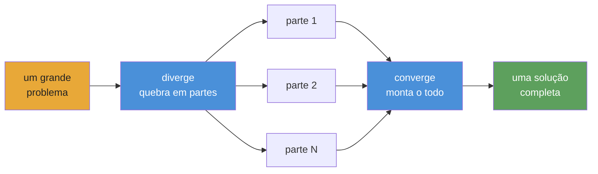

<div align="center">


# Converge

**Orquestração de agentes de IA para playbooks autônomos e duráveis.**

[](https://www.npmjs.com/package/@openplaybooks/converge-core)
[](https://github.com/openplaybooks-dev/converge/stargazers)
[](../../LICENSE)
[](https://nodejs.org/)
[](https://www.typescriptlang.org/)
[](../../examples)
[](../../docs/getting-started/install.md)

[Início rápido](#início-rápido) · [Exemplos](../../examples) · [Docs](../../docs) · [Traduções](../README.md) · [Contribuir](../../CONTRIBUTING.md)

</div>

---

## O que é o Converge

O cenário atual de agentes de IA é poderoso, mas ainda fragmentado e manual. Temos bons modelos, boas tools e boas skills, mas transformar isso em um workflow confiável para trabalho complexo ainda exige muito cola.

O Converge é um framework para playbooks autônomos. Ele permite encadear tasks e skills em um workflow complexo que um agente consegue executar de ponta a ponta, com checks, retries e self-correction dentro do loop.

Um playbook é o artefato durável: versionado, inspecionável e executável. Ele captura a estrutura do trabalho, os outputs esperados e os checks que tornam o resultado confiável.

**Não é um workflow estático. É um playbook vivo.**

## Início rápido

> ⚠️ **Aviso sobre consumo de tokens:** O Converge despacha agentes de IA que chamam APIs de LLM. Um playbook pode consumir dezenas de milhões de tokens. Use um modelo barato; veja [Configuração de providers](#configuração-de-providers).

### 1. Instalar

```bash
npm install -g @openplaybooks/converge-core
```

### 2. Fazer o bootstrap de um projeto

```bash
converge init --name=my-project --provider-template=codex
```

### 3. Criar um playbook

```bash
# Start from a built-in example (no AI needed)
converge add --from-example hello-world

# Or generate one from a prompt (requires AI config)
converge add --from-prompt "Literature review on in-context learning"
```

### 4. Rodar

```bash
converge run
```

Pronto. O walkthrough de cinco minutos: **[Your first playbook](../../docs/getting-started/your-first-playbook.md)**.

---

## A aposta no playbook

A geração atual de agentes de IA já é poderosa. Isso aparece em projetos como [`gstack`](https://github.com/garrytan/gstack), [`superpowers`](https://github.com/obra/superpowers), [`agent-skills`](https://github.com/addyosmani/agent-skills), Anthropic [`financial-services`](https://github.com/anthropics/financial-services) e [`claude-seo`](https://github.com/AgriciDaniel/claude-seo). Eles mostram o que acontece quando prompts viram skills reutilizáveis, papéis especializados e workflows de domínio.

Mas eles também apontam para a mesma peça que ainda falta. Muito desse poder continua difícil de carregar adiante. As melhores partes muitas vezes vivem dentro de um setup específico, de um host específico ou de uma pilha de cola manual.

Isso leva a uma pergunta simples: e se o artefato real não fosse a sessão, mas o playbook?

O Converge leva essa ideia em uma direção autônoma. Um playbook não deveria apenas documentar o trabalho. Ele deveria executá-lo. Deveria encadear tasks e skills em um sistema maior, se adaptar ao formato do problema, verificar seus próprios outputs e se autocorrigir quando algo quebra.

Essa é a aposta por trás do Converge: playbooks podem crescer de receitas pequenas para sistemas autônomos complexos, e quanto mais gente os escrever, compartilhar e melhorar em conjunto, mais a comunidade ganha uma biblioteca reutilizável de trabalho real com agentes em vez de sessões isoladas. O runner torna a execução fácil. O playbook preserva o conhecimento.

---

## O que diferencia o Converge

**Checks, não vibes.** Cada task declara shell-command checks: `tsc`, `grep`, `eslint`, uma suíte de testes. O runtime repete até passarem. Nenhum LLM julga a própria saída.

**Fingerprint caching, não checkpoint files.** Cada node recebe um fingerprint SHA-256. Nodes sem mudanças pulam execução, como os modelos incrementais do dbt. Se você matar o processo no node 47, o re-run continua do que já foi concluído.

**Playbooks, não prompts.** Um chat transcript morre com a sessão. Um playbook é composto por arquivos `TASK.md` versionados. Mesmos inputs, mesmos outputs, em cada execução. Qualquer pessoa do time pode rodar de novo.

**DAG, não context window.** Uma janela de chat acaba depois de poucas features. Um DAG de playbook divide o trabalho em arquivos `TASK.md` independentes; cada um cabe em uma janela. O runtime encadeia tudo topologicamente. 670 tasks, zero perda de contexto.

**Troque providers, não reescreva workflows.** Claude, Gemini, Kimi, Qwen, Codex: mude uma config e rode o mesmo playbook. Stub mode para desenvolvimento offline sem custo.

**Escopo dinâmico, não wiring estático.** Tasks podem expandir trabalho em runtime pelo contrato atual de CLI seed (`seed: { mode: cli }` mais `converge spawn ...`), então uma cena vira uma task e um ticker vira um branch de análise. O DAG cresce para se ajustar ao problema, não ao template.

---

## Como funciona

**Você escreve playbooks como arquivos e pastas Markdown. O Converge compila isso em um DAG e despacha agentes de IA para executá-lo.**



**O modelo mental: diverge → converge.** Quebre o problema em partes independentes, execute em paralelo e monte o resultado. É recursivo: qualquer parte pode divergir novamente.

## Estrutura do playbook

Um playbook é uma árvore de tasks no disco. Cada `TASK.md` declara o que produz e quais comandos de shell verificam se terminou. Não há wiring centralizado.

```
.converge/playbooks/{name}/
├── playbook.yml              # entry: name, run config, task paths
└── tasks/
    ├── 01-analyze/
    │   ├── TASK.md
    │   └── tasks/
    │       ├── 01a-extract/TASK.md    # frontmatter (depends_on, outputs, checks)
    │       └── 01b-fingerprint/TASK.md
    ├── 02-catalog/TASK.md
    └── 03-build/
        ├── TASK.md
        ├── TASK.md           # can act as a seed/loop driver
        └── tasks/
            ├── 03a-backend/TASK.md
            └── 03b-frontend/TASK.md
```

O runtime percorre o DAG em camadas topológicas. Cada node ou executa (AI agent + shell checks) ou entra em cache (fingerprint sem mudança em relação ao run anterior). Nodes com falha tentam novamente até o limite; nodes downstream esperam as dependências terminarem. Como o `run` do dbt: ordem determinística, caching incremental, sem loops.

---

## O que você pode construir

Cada exemplo marcado como **available** abaixo é um playbook real e executável em [`examples/`](../../examples/). Os marcados como **coming soon** já foram desenhados, mas ainda não enviados.

### Starter

| Exemplo                                      | Status      | Descrição                                                     |
| -------------------------------------------- | ----------- | ------------------------------------------------------------- |
| [`hello-world`](../../examples/hello-world/) | available   | O playbook mais simples possível: uma task, dois checks       |
| [`data-pipeline`](../../examples/data-pipeline/) | available | Pipeline sequencial: fetch → transform → validate             |

### Software

| Exemplo                                          | Status      | Descrição                                                |
| ------------------------------------------------ | ----------- | -------------------------------------------------------- |
| [`fullstack-app`](../../examples/fullstack-app/) | available   | Geração dinâmica de backend + frontend orientada por Seed |
| [`flutter-app`](../../examples/flutter-app/)     | available   | Geração autônoma de app mobile em Flutter / Dart         |
| [`app-builder`](../../examples/app-builder/)     | coming soon | Playbook genérico para scaffolding de apps               |

### Research

| Exemplo                                                      | Status      | Descrição                                                                  |
| ------------------------------------------------------------ | ----------- | -------------------------------------------------------------------------- |
| [`deep-research`](../../examples/deep-research/)             | available   | Iterative-deepening em camadas com progressão controlada por qualidade     |
| [`scientific-research`](../../examples/scientific-research/) | available   | Bayesian reasoning, GRADE evidence, meta-analysis e paper generation       |
| [`frontier-research`](../../examples/frontier-research/)     | available   | Exploração frontier com beam search paralelo e acompanhamento de convergência |

### Simulation

| Exemplo                                      | Status      | Descrição                                                              |
| -------------------------------------------- | ----------- | ---------------------------------------------------------------------- |
| [`social-sim`](../../examples/social-sim/)   | available   | Simulação social baseada em loops com child tasks por tick             |
| [`game-ai-pk`](../../examples/game-ai-pk/)   | coming soon | Reality show persistente de episódio único com game AI                 |

### Optimization

| Exemplo                                                                  | Status      | Descrição                                                                |
| ------------------------------------------------------------------------ | ----------- | ------------------------------------------------------------------------ |
| [`evolutionary-optimization`](../../examples/evolutionary-optimization/) | available   | Busca em fitness landscape para prompt tuning e hyperparameter sweeps    |

### Provider integration

| Exemplo                                  | Status      | Descrição                                                  |
| ---------------------------------------- | ----------- | ---------------------------------------------------------- |
| [`acp-demo`](../../examples/acp-demo/)   | available   | Provider `acp` com Claude Agent SDK para invocação programática |

### Coming soon

Estes exemplos já foram desenhados, mas ainda não enviados. Veja a issue correspondente ou acompanhe [`examples/`](../../examples/) para novidades:

- `cinematic-video-production` — diretor de cinema com IA: `idea.md` → biblioteca consistente de clips cinematográficos
- `game-assets-video` — pacote de assets de platformer a partir de um único `idea.md`
- `autonomous-pentest` — varredura pentest multi-stage com findings gated por PoC reproduzível
- `financial-deep-research` — pesquisa de ações multi-phase com análise por ticker
- `baby-app` — template inicial full-stack mínimo

[Browse all examples →](../../examples/)

---

## Configuração de providers

O Converge suporta vários runtime providers. O scaffold do projeto e a CLI expõem hoje IDs de provider de primeira classe para **Claude** (`provider: claude`), **Codex** (`provider: codex`), **ACP / endpoints OpenAI-compatible** (`provider: acp`), **Kimi** (`provider: kimi`), **Qwen** (`provider: qwen`), **Gemini** (`provider: gemini`) e **DeepCode** (`provider: deepcode`). Você os configura em `.converge/project.yaml`. **Use um modelo barato em desenvolvimento**: Claude Opus custa $15/$75 por 1M tokens; modelos baratos custam menos de $1/$3.

### Modelos baratos recomendados

| Model                 | Input / 1M | Output / 1M | Melhor para                |
| --------------------- | ---------- | ----------- | -------------------------- |
| `deepseek-v4-flash`   | $0.27      | $1.10       | Sub-agents, checks rápidos |
| `deepseek-v4-pro[1m]` | $0.55      | $2.19       | Raciocínio principal       |
| `MiniMax-M2.7`        | $0.50      | $1.50       | Bom equilíbrio preço/perf |
| Claude Opus 4.5       | $15.00     | $75.00      | Qualidade máxima (caro)    |

### Exemplo de `.converge/project.yaml`

```yaml
# .converge/project.yaml
name: my-project

ai:
  default: claude
  providers:
    # ── Claude Code backend ──────────────────────────
    claude:
      provider: claude
      env:
        # Route through DeepSeek (cheap)
        ANTHROPIC_BASE_URL: https://api.deepseek.com/anthropic
        ANTHROPIC_AUTH_TOKEN: "${DEEPSEEK_API_KEY}"
        ANTHROPIC_MODEL: deepseek-v4-pro[1m]
        ANTHROPIC_DEFAULT_HAIKU_MODEL: deepseek-v4-flash
        CLAUDE_CODE_SUBAGENT_MODEL: deepseek-v4-flash

        # Or route through MiniMax-M2.7 (uncomment to use)
        # ANTHROPIC_BASE_URL: "https://api.minimax.io/anthropic"
        # ANTHROPIC_AUTH_TOKEN: "${MINIMAX_API_KEY}"
        # ANTHROPIC_MODEL: "MiniMax-M2.7"

    # ── Codex backend ────────────────────────────────
    codex:
      provider: codex
      env:
        CODEX_API_KEY: "${CODEX_API_KEY}"
        # Or set OPENAI_API_KEY instead
```

**Claude Code** roda pela CLI `claude`; defina `DEEPSEEK_API_KEY` ou `MINIMAX_API_KEY` no seu ambiente. **Codex** roda pela CLI `codex` (`npm i -g @openai/codex`); defina `CODEX_API_KEY` ou `OPENAI_API_KEY`. O Converge resolve referências `${VAR}` automaticamente. `converge init` cria esse arquivo.

> **Os exemplos incluídos usam MiniMax por padrão.** Cada exemplo em [`examples/`](../../examples/) inclui um `.converge/project.yaml` que roteia Claude para `https://api.minimax.io/anthropic` usando `MiniMax-M2.7`. Defina `MINIMAX_API_KEY` no ambiente e eles rodam de ponta a ponta. Se quiser outro provider, sobrescreva `ANTHROPIC_BASE_URL` / `ANTHROPIC_MODEL` ou edite o `project.yaml` do exemplo.

Guia completo: [Switching providers](../../docs/guides/switch-providers.md).

---

## Integrações

O Converge se integra em duas camadas:

- **Coding agents** para criar e operar playbooks a partir do seu workspace
- **Runtime providers** para executar tasks dentro do playbook

### Coding agents

O Converge traz duas **skills** para você desenhar e rodar playbooks sem sair do seu coding agent:

| Skill               | O que faz                                                                                                           |
| ------------------- | ------------------------------------------------------------------------------------------------------------------- |
| `converge-planning` | Desenha um novo playbook a partir de um prompt: gera `PLAN.md`, arquivos `TASK.md`, dependency graph e shell-level checks |
| `converge-control`  | Roda e monitora um playbook: classifica DAG events, diagnostica falhas e faz re-runs incrementais                  |

### Fluxo end-to-end

```bash
# 1. Bootstrap a project with skills installed
converge init --name=my-project --skills

# 2. In your coding agent, design the playbook
/converge-planning   # "Build a REST API for user management with auth"

# 3. Run
converge run

# 4. Hand off to converge-control — it monitors, diagnoses, and re-runs on failure
/converge-control    # run → monitor → retry failures
```

<details>
<summary><strong>Claude Code</strong></summary>

- `converge init --skills` instala as skills incluídas em `.claude/skills/`
- O Claude Code descobre skills automaticamente a partir desse diretório
- Invoque diretamente com `/converge-planning` e `/converge-control`

```bash
converge init --name=my-project --skills

# Re-run on an existing project to install bundled skills only
converge init --skills
```

</details>

<details>
<summary><strong>Codex</strong></summary>

- `converge init --skills` também instala as skills incluídas em `.codex/skills/`
- O Codex lê as skills desse diretório da mesma forma
- Use as mesmas skills do Converge para planejar e operar playbooks no seu workspace do Codex

```bash
converge init --name=my-project --skills

# Re-run on an existing project to install bundled skills only
converge init --skills
```

</details>

<details>
<summary><strong>Outras configurações de coding agent</strong></summary>

- A instalação incluída de skills está documentada aqui especificamente para Claude Code e Codex
- A portabilidade do runtime provider é configurada separadamente em `.converge/project.yaml`

Veja [Switching providers](../../docs/guides/switch-providers.md).

</details>

### Comportamento das skills

- Digite `/skill-name` para invocar: a skill carrega docs de referência, comandos CLI, catálogo de eventos e receitas de troubleshooting com contexto completo
- `converge-planning` cuida da fase inicial de desenho; `converge-control` assume durante a execução

### Instalar skills em um projeto existente

```bash
converge init --skills
```

### Runtime providers

O runtime do playbook é a camada portátil. Você pode trocar providers em `.converge/project.yaml` sem reescrever o playbook.

<details>
<summary><strong>Claude</strong></summary>

- Backend de primeira classe via `provider: claude`
- Roda pela CLI `claude`
- Suporta roteamento Anthropic-compatible como DeepSeek ou MiniMax por `ANTHROPIC_BASE_URL`

</details>

<details>
<summary><strong>Codex</strong></summary>

- Backend de primeira classe via `provider: codex`
- Roda pela CLI `codex`
- Usa `CODEX_API_KEY` ou `OPENAI_API_KEY`

</details>

<details>
<summary><strong>Gemini, Kimi, Qwen e endpoints OpenAI-compatible</strong></summary>

- O Converge faz scaffold de IDs diretos para `provider: gemini`, `provider: kimi` e `provider: qwen`
- Use `provider: acp` quando quiser um endpoint OpenAI-compatible arbitrário ou um `baseUrl` customizado
- Misturar providers mais baratos e mais fortes no mesmo playbook é a principal alavanca de custo/performance

</details>

<details>
<summary><strong>Portátil por design</strong></summary>

- As skills ajudam os agentes a fazer o trabalho
- Os playbooks definem o trabalho
- Os providers são backends de execução que você pode trocar sob o mesmo playbook

</details>

---

## Pacotes

| Pacote                                       | Path                                    | Finalidade                                                                                                   |
| -------------------------------------------- | --------------------------------------- | ------------------------------------------------------------------------------------------------------------ |
| [`@openplaybooks/converge-core`](../../packages/core/)     | `packages/core/`                        | Engine TypeScript puro: runner registry, task graph, state machine, repair strategies. Sem dependências UI. |
| [`@openplaybooks/converge`](../../packages/cli/)       | `packages/cli/`                         | CLI de terminal. Bootstrap, run, watch, tail. Conduz runs via provider backends.                            |
| [`@openplaybooks/studio`](../../packages/studio/) | `packages/studio/`                      | Web UI para visualizar runs, inspecionar tasks e navegar journals.                                           |
| Provider packs                               | `packages/{claude,gemini,kimi,qwen}fn/` | Backends específicos por provider. Troque sem alterar playbooks.                                             |

---

## Dogfood

Partes importantes deste repo foram construídas pelo próprio Converge rodando playbooks sobre si mesmo: redesign do CLI (63 tasks), landing page (65 tasks), geração de docs e mais. [Veja os comprovantes →](../../.converge/playbooks/). Se o runtime não funcionasse, este README teria sido escrito à mão.

> **`v0.1.0` · public preview** — O runtime já está disponível. **12 playbooks de exemplo executáveis** em software, research, simulation e integração de providers. Mais em breve.

---

## Traduções

- [Tiếng Việt](../vi/README.md)
- [Español](../es/README.md)
- [Português do Brasil](../pt-BR/README.md)
- [简体中文](../zh-CN/README.md)
- [日本語](../ja/README.md)

---

## Comunidade

- **[Discussions](https://github.com/openplaybooks-dev/converge/discussions)** — perguntas, ideias, padrões de playbook
- **[Issues](https://github.com/openplaybooks-dev/converge/issues)** — relatórios de bug, pedidos de feature
- **[Contributing](../../CONTRIBUTING.md)** — setup de desenvolvimento, estrutura do projeto, como enviar um PR

---

## Licença

MIT — veja [LICENSE](../../LICENSE)

<div align="center">

**Autônomo · Repetível · Verificável**

</div>
