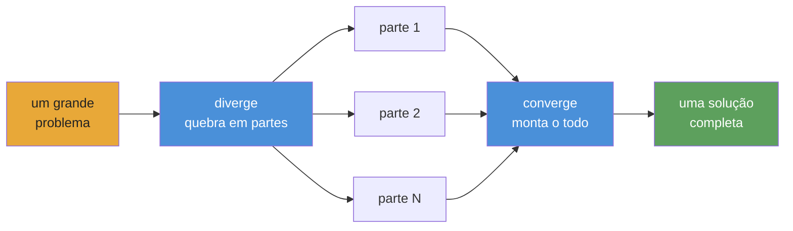

<div align="center">


# Playbooks autônomos para agentes de IA

**Orquestração e execução de agentes para workflows complexos, repetíveis e verificáveis.**

[](https://www.npmjs.com/package/@converge/core)
[](https://github.com/myanlabs/converge/stargazers)
[](../../LICENSE)
[](https://nodejs.org/)
[](https://www.typescriptlang.org/)
[](../../examples)
[](../../docs/getting-started/install.md)

[Início rápido](#início-rápido) · [Exemplos](../../examples) · [Docs](../../docs) · [Traduções](../README.md) · [Contribuir](../../CONTRIBUTING.md)

</div>

> **`v0.1.0` · public preview** — O runtime já está disponível. **24 playbooks de exemplo executáveis** em software, pesquisa, segurança e produção criativa.

---

## Como funciona

**Você escreve playbooks como arquivos e pastas Markdown. O Converge compila isso em um DAG e despacha agentes de IA para executá-lo.**



**O modelo mental: diverge → converge.** Quebre o problema em partes independentes, execute-as em paralelo e monte o resultado. É recursivo: qualquer parte também pode divergir.

1. **`converge init`** — inicializa um projeto com configuração de provider e estrutura de diretórios.
2. **`converge add`** — puxa um exemplo, gera a partir de um prompt ou escreve o playbook manualmente.
3. **`converge run`** — compila o DAG, despacha agentes e repete até os checks passarem. Em cada node: um agente faz o trabalho e shell checks verificam. Falhou, tenta de novo; passou, entra em cache.

**Escreva arquivos e pastas TASK.md. Markdown puro. Versione no Git.**

**Compartilhe o playbook e execute novamente quando quiser. Mesmos inputs, mesmos outputs.**

---

## O que você pode construir

Cada exemplo abaixo é um playbook real e executável em [`examples/`](../../examples/).

### Software

| Exemplo                                          | Descrição                                                         |
| ------------------------------------------------ | ----------------------------------------------------------------- |
| [`fullstack-app`](../../examples/fullstack-app/) | Geração dinâmica de backend + frontend com Seed e testes passando |
| [`flutter-app`](../../examples/flutter-app/)     | Geração autônoma de app mobile em Flutter / Dart                  |
| [`baby-app`](../../examples/baby-app/)           | Template full-stack mínimo; clone, edite e rode                   |

### Research

| Exemplo                                                      | Descrição                                                                                |
| ------------------------------------------------------------ | ---------------------------------------------------------------------------------------- |
| [`deep-research`](../../examples/deep-research/)             | Aprofundamento iterativo em camadas com progressão controlada por qualidade              |
| [`scientific-research`](../../examples/scientific-research/) | Raciocínio bayesiano, evidência GRADE, meta-análise e geração de paper — loop de 8 fases |
| [`frontier-research`](../../examples/frontier-research/)     | Síntese multi-fonte para domínios técnicos que mudam rápido                              |

### Creative

| Exemplo                                                                    | Descrição                                                                                                    |
| -------------------------------------------------------------------------- | ------------------------------------------------------------------------------------------------------------ |
| [`cinematic-video-production`](../../examples/cinematic-video-production/) | Diretor de filme IA end-to-end. `idea.md` → `clips/` com elementos fixos + composição                        |
| [`game-assets-video`](../../examples/game-assets-video/)                   | Pacote de assets para platformer — personagens, props, tilesheets, parallax — a partir de um único `idea.md` |
| [`social-sim`](../../examples/social-sim/)                                 | Simulação social baseada em loops com tarefas filhas geradas por tick                                        |

### Security

| Exemplo                                                    | Descrição                                                                                                              |
| ---------------------------------------------------------- | ---------------------------------------------------------------------------------------------------------------------- |
| [`autonomous-pentest`](../../examples/autonomous-pentest/) | Varredura pentest de ~250 tarefas. Findings gated por PoC reproduzível. Requer `scope.yml`. **Apenas uso autorizado.** |

### Ops & data

| Exemplo                                                                  | Descrição                                                                                   |
| ------------------------------------------------------------------------ | ------------------------------------------------------------------------------------------- |
| [`data-pipeline`](../../examples/data-pipeline/)                         | Pipeline sequencial: fetch → transform → validate                                           |
| [`financial-deep-research`](../../examples/financial-deep-research/)     | Pipeline multi-fase de pesquisa de ações com análise por ticker e relatório consolidado     |
| [`evolutionary-optimization`](../../examples/evolutionary-optimization/) | Busca em fitness landscape para prompt tuning, varreduras de hiperparâmetros e copy testing |

[Ver todos os exemplos →](../../examples/)

---

## Estrutura do playbook

Um playbook é uma árvore de tarefas no disco. Cada TASK.md declara o que produz e quais comandos de shell verificam se terminou. Não há wiring centralizado.

```
.converge/playbooks/{name}/
├── playbook.yml              # entry: name, run config, task paths
└── tasks/
    ├── 01-analyze/
    │   ├── TASK.md
    │   └── tasks/
    │       ├── 01a-extract/TASK.md    # frontmatter (depends_on, outputs, checks)
    │       └── 01b-fingerprint/TASK.md
    ├── 02-catalog/TASK.md
    └── 03-build/
        ├── TASK.md
        ├── seed.js           # optional: spawn children at runtime
        └── tasks/
            ├── 03a-backend/TASK.md
            └── 03b-frontend/TASK.md
```

Loop de execução — diverge, execute, converge:

```
  DIVERGE ──→ EXECUTE ──→ CONVERGE
  seed runs   children     body reads outputs,
  spawns      produce      integrates, validates
  children    outputs      → 0 gaps = done
```

O runtime percorre o DAG em camadas topológicas. Cada node é executado (AI agent + shell checks) ou fica em cache (fingerprint igual ao run anterior). Nodes com falha tentam novamente até o limite de attempts; nodes downstream esperam as dependências completarem. Como o `run` do dbt: ordem determinística, cache incremental, sem loops.

---

## Início rápido

> ⚠️ **Aviso de consumo de tokens:** O Converge despacha agentes de IA que chamam APIs de LLM. Um playbook pode consumir dezenas de milhões de tokens. Use um modelo barato — veja [Configuração de providers](#configuração-de-providers).

### 1. Instalar

```bash
npm install -g @converge/core
```

### 2. Inicializar um projeto

```bash
converge init --name=my-project
```

### 3. Criar um playbook

```bash
# Start from a built-in example (no AI needed)
converge add --from-example hello-world

# Or generate one from a prompt (requires AI config)
converge add --from-prompt "Literature review on in-context learning"
```

### 4. Rodar

```bash
converge run
```

Pronto. Tutorial de cinco minutos: **[Your first playbook](../../docs/getting-started/your-first-playbook.md)**.

---

## Por que Converge

**Checks, não impressão subjetiva.** Toda tarefa declara shell-command checks: `tsc`, `grep`, `eslint`, uma suíte de testes. O runtime repete até passarem. Nenhum LLM julga a própria saída.

**Fingerprint caching, não checkpoint files.** Cada node recebe um fingerprint SHA-256. Nodes sem mudanças pulam a execução, como modelos incrementais do dbt. Parou no node 47; ao rodar de novo, continua do que já completou.

**Playbooks, não prompts.** Um chat transcript morre com a sessão. Um playbook é composto por arquivos TASK.md versionados. Mesmos inputs, mesmos outputs, em toda execução. Qualquer pessoa do time pode rodar novamente.

**DAG, não context window.** Uma janela de chat se esgota depois de algumas features. Um DAG de playbook divide o trabalho em arquivos TASK.md independentes; cada um cabe em uma janela. O runtime encadeia tudo topologicamente. 670 tarefas, zero contexto perdido.

**Troque providers, não reescreva workflows.** Claude, Gemini, Kimi, Qwen, Codex: mude uma config, o mesmo playbook roda. Stub mode para desenvolvimento offline sem custo.

**Escopo dinâmico, não wiring estático.** Uma função `seed.js` cria nodes em runtime com base no input: uma cena vira uma tarefa, um ticker vira um ramo de análise. O DAG cresce para caber no problema, não no template.

---

## Configuração de providers

Converge roda em qualquer LLM. Ele suporta dois backends de agentes — **Claude Code** (`provider: claude`) e **OpenAI Codex** (`provider: codex`) — cada um roteando pelo modelo escolhido. Você configura o backend em `.converge/project.yaml`. **Use um modelo barato para desenvolvimento**: Claude Opus custa $15/$75 por 1M tokens; modelos baratos custam menos de $1/$3.

### Modelos baratos recomendados

| Model                 | Input / 1M | Output / 1M | Melhor para                |
| --------------------- | ---------- | ----------- | -------------------------- |
| `deepseek-v4-flash`   | $0.27      | $1.10       | Sub-agents, checks rápidos |
| `deepseek-v4-pro[1m]` | $0.55      | $2.19       | Raciocínio principal       |
| `MiniMax-M2.7`        | $0.50      | $1.50       | Equilíbrio preço/perf      |
| Claude Opus 4.5       | $15.00     | $75.00      | Máxima qualidade (caro)    |

### Exemplo de `.converge/project.yaml`

```yaml
# .converge/project.yaml
name: my-project

ai:
  default: claude
  providers:
    # ── Claude Code backend ──────────────────────────
    claude:
      provider: claude
      env:
        # Route through DeepSeek (cheap)
        ANTHROPIC_BASE_URL: https://api.deepseek.com/anthropic
        ANTHROPIC_AUTH_TOKEN: "${DEEPSEEK_API_KEY}"
        ANTHROPIC_MODEL: deepseek-v4-pro[1m]
        ANTHROPIC_DEFAULT_HAIKU_MODEL: deepseek-v4-flash
        CLAUDE_CODE_SUBAGENT_MODEL: deepseek-v4-flash

        # Or route through MiniMax-M2.7 (uncomment to use)
        # ANTHROPIC_BASE_URL: "https://api.minimax.io/anthropic"
        # ANTHROPIC_AUTH_TOKEN: "${MINIMAX_API_KEY}"
        # ANTHROPIC_MODEL: "MiniMax-M2.7"

    # ── Codex backend ────────────────────────────────
    codex:
      provider: codex
      env:
        CODEX_API_KEY: "${CODEX_API_KEY}"
        # Or set OPENAI_API_KEY instead
```

**Claude Code** roda via CLI `claude`: defina `DEEPSEEK_API_KEY` ou `MINIMAX_API_KEY` no ambiente. **Codex** roda via CLI `codex` (`npm i -g @openai/codex`): defina `CODEX_API_KEY` ou `OPENAI_API_KEY`. O Converge resolve referências `${VAR}` automaticamente. `converge init` cria esse arquivo para você.

Guia completo: [Switching providers](../../docs/guides/switch-providers.md).

---

## Integração com Claude Code & Codex

Converge vem com duas **skills** que se conectam ao seu coding agent para você desenhar e rodar playbooks sem sair do terminal:

| Skill               | O que faz                                                                                                             |
| ------------------- | --------------------------------------------------------------------------------------------------------------------- |
| `converge-planning` | Desenha um novo playbook a partir de um prompt: gera PLAN.md, arquivos TASK.md, dependency graph e shell-level checks |
| `converge-control`  | Roda e monitora um playbook: classifica DAG events, diagnostica falhas e reexecuta incrementalmente                   |

### Fluxo end-to-end

```bash
# 1. Bootstrap a project with skills installed
converge init --name=my-project --skills

# 2. In Claude Code, design the playbook
/converge-planning   # "Build a REST API for user management with auth"

# 3. Run
converge run

# 4. Hand off to converge-control — it monitors, diagnoses, and re-runs on failure
/converge-control    # run → monitor → retry failures
```

### Como funciona

- `converge init --skills` instala as duas skills em `.claude/skills/` e `.codex/skills/`
- **Claude Code** e **Codex** descobrem skills automaticamente nesses diretórios — sem configuração
- Digite `/skill-name` para invocar: a skill carrega sua documentação de referência completa (CLI commands, event catalog, troubleshooting recipes) e opera com contexto completo
- `converge-planning` cuida da fase inicial de desenho; `converge-control` assume durante a execução. Elas foram feitas para fazer handoff uma para a outra

### Instalar skills em um projeto existente

```bash
converge skills install                    # default: .claude/skills/
converge skills install --target .codex/skills
```

---

## Pacotes

| Pacote                                       | Path                                    | Finalidade                                                                                                  |
| -------------------------------------------- | --------------------------------------- | ----------------------------------------------------------------------------------------------------------- |
| [`@converge/core`](../../packages/core/)     | `packages/core/`                        | Engine TypeScript puro: runner registry, task graph, state machine, repair strategies. Sem dependências UI. |
| [`@converge/cli`](../../packages/cli/)       | `packages/cli/`                         | CLI de terminal. Bootstrap, run, watch, tail. Conduz runs via provider backends.                            |
| [`@converge/studio`](../../packages/studio/) | `packages/studio/`                      | Web UI para visualizar runs, inspecionar tasks e navegar journals.                                          |
| Provider packs                               | `packages/{claude,gemini,kimi,qwen}fn/` | Backends específicos por provider. Troque sem alterar playbooks.                                            |

---

## Dogfood

Partes importantes deste repo foram construídas pelo Converge rodando playbooks contra ele mesmo: CLI redesign (63 tarefas), landing page (65 tarefas), docs generation e mais. [Veja os comprovantes →](../../.converge/playbooks/). Se o runtime não funcionasse, este README teria sido escrito à mão.

---

## Traduções

- [Tiếng Việt](../vi/README.md)
- [Español](../es/README.md)
- [Português do Brasil](../pt-BR/README.md)
- [简体中文](../zh-CN/README.md)
- [日本語](../ja/README.md)

---

## Comunidade

- **[Discussions](https://github.com/myanlabs/converge/discussions)** — perguntas, ideias, padrões de playbook
- **[Issues](https://github.com/myanlabs/converge/issues)** — relatórios de bug, pedidos de funcionalidades
- **[Contributing](../../CONTRIBUTING.md)** — setup de desenvolvimento, estrutura do projeto, como enviar um PR

---

## Licença

MIT — veja [LICENSE](../../LICENSE)

<div align="center">

**Autônomo · Repetível · Verificável**

</div>
