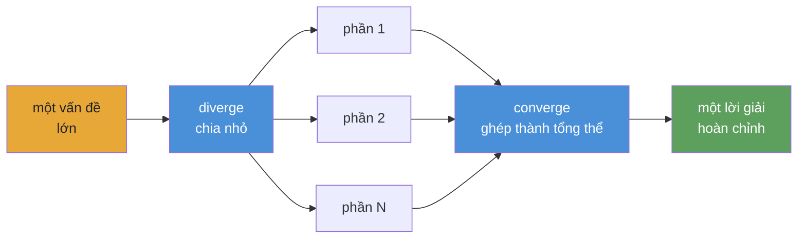

<div align="center">


# Converge

**Khung điều phối tác tử AI cho các playbook tự động, bền vững.**

[](https://www.npmjs.com/package/@converge/core)
[](https://github.com/myanlabs/converge/stargazers)
[](../../LICENSE)
[](https://nodejs.org/)
[](https://www.typescriptlang.org/)
[](../../examples)
[](../../docs/getting-started/install.md)

[Bắt đầu nhanh](#bắt-đầu-nhanh) · [Ví dụ](../../examples) · [Tài liệu](../../docs) · [Bản dịch](../README.md) · [Đóng góp](../../CONTRIBUTING.md)

</div>

---

## Converge là gì

Bối cảnh tác tử AI hiện nay rất mạnh, nhưng vẫn rời rạc và còn nhiều thao tác thủ công. Chúng ta có model tốt, tool tốt và skill tốt, nhưng biến chúng thành một workflow đáng tin cậy cho công việc phức tạp vẫn cần rất nhiều phần keo nối.

Converge là một framework cho playbook tự động. Nó cho phép bạn xâu chuỗi tasks và skills thành một workflow phức tạp mà agent có thể chạy từ đầu đến cuối, với checks, retries và self-correction ngay trong vòng lặp.

Playbook là hiện vật bền vững: có version, có thể kiểm tra và có thể chạy lại. Nó ghi lại cấu trúc công việc, các outputs mong đợi và các checks khiến kết quả trở nên đáng tin.

**Không phải workflow tĩnh. Mà là playbook sống.**

## Bắt đầu nhanh

> ⚠️ **Cảnh báo tiêu thụ token:** Converge điều phối các tác tử AI gọi LLM APIs. Một playbook có thể tiêu thụ hàng chục triệu token. Hãy dùng model rẻ; xem [Thiết lập provider](#thiết-lập-provider).

### 1. Cài đặt

```bash
npm install -g @converge/core
```

### 2. Bootstrap project

```bash
converge init --name=my-project --provider-template=codex
```

### 3. Tạo playbook

```bash
# Start from a built-in example (no AI needed)
converge add --from-example hello-world

# Or generate one from a prompt (requires AI config)
converge add --from-prompt "Literature review on in-context learning"
```

### 4. Chạy

```bash
converge run
```

Vậy là xong. Hướng dẫn 5 phút: **[Your first playbook](../../docs/getting-started/your-first-playbook.md)**.

---

## Cược vào playbook

Thế hệ tác tử AI hiện tại đã rất mạnh. Điều đó thể hiện ở những dự án như [`gstack`](https://github.com/garrytan/gstack), [`superpowers`](https://github.com/obra/superpowers), [`agent-skills`](https://github.com/addyosmani/agent-skills), Anthropic [`financial-services`](https://github.com/anthropics/financial-services) và [`claude-seo`](https://github.com/AgriciDaniel/claude-seo). Chúng cho thấy điều gì xảy ra khi prompt trở thành skill tái sử dụng, vai trò chuyên biệt và workflow theo miền.

Nhưng chúng cũng chỉ ra cùng một mảnh ghép còn thiếu. Rất nhiều sức mạnh đó vẫn khó mang tiếp sang lần sau. Những phần tốt nhất thường sống trong một setup cụ thể, một host cụ thể hoặc một đống keo nối thủ công.

Từ đó xuất hiện một câu hỏi đơn giản: điều gì xảy ra nếu hiện vật thực sự không phải phiên làm việc, mà là playbook?

Converge đẩy ý tưởng đó theo hướng tự động. Playbook không nên chỉ ghi lại công việc. Nó phải chạy được công việc đó. Nó phải xâu chuỗi tasks và skills thành một hệ thống lớn hơn, tự thích nghi với hình dạng của vấn đề, tự kiểm tra outputs và tự sửa khi có thứ gì đó hỏng.

Đó là cược đằng sau Converge: playbook có thể phát triển từ các công thức nhỏ thành hệ thống tự động phức tạp, và càng nhiều người viết, chia sẻ và cùng cải thiện chúng, cộng đồng càng có một thư viện tái sử dụng của công việc tác tử thật thay vì những phiên cô lập. Runner làm cho việc thực thi trở nên dễ dàng. Playbook giữ lại tri thức.

---

## Điều gì làm Converge khác biệt

**Checks, không phải cảm giác.** Mỗi task khai báo shell-command checks: `tsc`, `grep`, `eslint`, một test suite. Runtime lặp cho tới khi chúng pass. Không có LLM nào tự chấm output của chính nó.

**Fingerprint caching, không phải checkpoint files.** Mỗi node có fingerprint SHA-256. Node không đổi thì bỏ qua execution, giống incremental models của dbt. Nếu dừng ở node 47, lần chạy lại sẽ tiếp tục từ phần đã hoàn thành.

**Playbooks, không phải prompts.** Một chat transcript chết cùng session. Playbook là các file `TASK.md` được version-control. Cùng inputs, cùng outputs, trong mỗi lần chạy. Bất kỳ ai trong team cũng có thể chạy lại.

**DAG, không phải context window.** Một cửa sổ chat cạn sau vài features. DAG playbook chia việc thành các file `TASK.md` độc lập; mỗi file vừa một cửa sổ. Runtime nối chúng theo topo. 670 tasks, không mất context.

**Đổi providers, không phải viết lại workflows.** Claude, Gemini, Kimi, Qwen, Codex: đổi một config là cùng playbook vẫn chạy. Có stub mode cho phát triển offline không tốn chi phí.

**Phạm vi động, không phải wiring tĩnh.** Tasks có thể mở rộng công việc lúc runtime thông qua hợp đồng CLI seed hiện tại (`seed: { mode: cli }` cùng `converge spawn ...`), nên một scene thành một task và một mã cổ phiếu thành một nhánh phân tích. DAG lớn lên để phù hợp với bài toán, không bị đóng khung bởi template.

---

## Cách hoạt động

**Bạn viết playbook dưới dạng file và thư mục Markdown. Converge biên dịch chúng thành DAG và điều phối AI agent chạy DAG đó.**



**Mô hình tư duy: diverge → converge.** Chia vấn đề thành các phần độc lập, chạy song song rồi ghép kết quả lại. Nó có tính đệ quy: bất kỳ phần nào cũng có thể diverge tiếp.

## Cấu trúc playbook

Playbook là cây tasks trên đĩa. Mỗi `TASK.md` khai báo nó tạo ra gì và shell commands nào dùng để kiểm tra nó đã xong chưa. Không có wiring tập trung.

```
.converge/playbooks/{name}/
├── playbook.yml              # entry: name, run config, task paths
└── tasks/
    ├── 01-analyze/
    │   ├── TASK.md
    │   └── tasks/
    │       ├── 01a-extract/TASK.md    # frontmatter (depends_on, outputs, checks)
    │       └── 01b-fingerprint/TASK.md
    ├── 02-catalog/TASK.md
    └── 03-build/
        ├── TASK.md
        ├── TASK.md           # can act as a seed/loop driver
        └── tasks/
            ├── 03a-backend/TASK.md
            └── 03b-frontend/TASK.md
```

Runtime đi qua DAG theo các lớp topo. Mỗi node hoặc được thực thi (AI agent + shell checks) hoặc được cache (fingerprint không đổi so với lần chạy trước). Node lỗi sẽ retry tới giới hạn attempt; node downstream chờ dependencies hoàn tất. Giống `run` của dbt: thứ tự xác định, caching incremental, không có loop.

---

## Bạn có thể xây gì

Mỗi ví dụ được đánh dấu **available** bên dưới là playbook thật, chạy được trong [`examples/`](../../examples/). Những ví dụ đánh dấu **coming soon** đã được thiết kế nhưng chưa phát hành.

### Starter

| Ví dụ                                        | Trạng thái   | Mô tả                                                   |
| -------------------------------------------- | ------------ | ------------------------------------------------------- |
| [`hello-world`](../../examples/hello-world/) | available    | Playbook đơn giản nhất có thể: một task, hai checks     |
| [`data-pipeline`](../../examples/data-pipeline/) | available | Pipeline tuần tự: fetch → transform → validate          |

### Software

| Ví dụ                                            | Trạng thái   | Mô tả                                                   |
| ------------------------------------------------ | ------------ | ------------------------------------------------------- |
| [`fullstack-app`](../../examples/fullstack-app/) | available    | Sinh backend + frontend động theo Seed                  |
| [`flutter-app`](../../examples/flutter-app/)     | available    | Sinh app mobile tự động bằng Flutter / Dart             |
| [`app-builder`](../../examples/app-builder/)     | coming soon  | Playbook scaffolding ứng dụng tổng quát                 |

### Research

| Ví dụ                                                        | Trạng thái   | Mô tả                                                                    |
| ------------------------------------------------------------ | ------------ | ------------------------------------------------------------------------ |
| [`deep-research`](../../examples/deep-research/)             | available    | Iterative-deepening nhiều lớp với tiến trình được chặn theo chất lượng   |
| [`scientific-research`](../../examples/scientific-research/) | available    | Bayesian reasoning, GRADE evidence, meta-analysis và paper generation    |
| [`frontier-research`](../../examples/frontier-research/)     | available    | Khám phá frontier bằng beam search song song và theo dõi hội tụ          |

### Simulation

| Ví dụ                                      | Trạng thái   | Mô tả                                                                  |
| ------------------------------------------ | ------------ | ---------------------------------------------------------------------- |
| [`social-sim`](../../examples/social-sim/) | available    | Mô phỏng xã hội theo loop với child tasks cho mỗi tick                 |
| [`game-ai-pk`](../../examples/game-ai-pk/) | coming soon  | Reality show một tập với game AI và dàn nhân vật bền vững              |

### Optimization

| Ví dụ                                                                    | Trạng thái   | Mô tả                                                                   |
| ------------------------------------------------------------------------ | ------------ | ----------------------------------------------------------------------- |
| [`evolutionary-optimization`](../../examples/evolutionary-optimization/) | available    | Tìm kiếm fitness landscape cho prompt tuning và hyperparameter sweeps   |

### Provider integration

| Ví dụ                                | Trạng thái   | Mô tả                                                    |
| ------------------------------------ | ------------ | -------------------------------------------------------- |
| [`acp-demo`](../../examples/acp-demo/) | available  | Provider `acp` với Claude Agent SDK để gọi agent bằng code |

### Coming soon

Những ví dụ này đã được thiết kế nhưng chưa phát hành. Xem issue liên quan hoặc theo dõi [`examples/`](../../examples/) để cập nhật:

- `cinematic-video-production` — đạo diễn phim AI: `idea.md` → thư viện clip điện ảnh nhất quán
- `game-assets-video` — gói asset platformer từ một `idea.md`
- `autonomous-pentest` — quét pentest nhiều giai đoạn với findings bị chặn bởi PoC tái lập được
- `financial-deep-research` — nghiên cứu cổ phiếu nhiều phase với phân tích theo ticker
- `baby-app` — template full-stack tối giản

[Browse all examples →](../../examples/)

---

## Thiết lập provider

Converge hỗ trợ nhiều runtime providers. Scaffold của project và CLI hiện cung cấp provider IDs hạng nhất cho **Claude** (`provider: claude`), **Codex** (`provider: codex`), **ACP / OpenAI-compatible endpoints** (`provider: acp`), **Kimi** (`provider: kimi`), **Qwen** (`provider: qwen`), **Gemini** (`provider: gemini`) và **DeepCode** (`provider: deepcode`). Bạn cấu hình chúng trong `.converge/project.yaml`. **Hãy dùng model rẻ khi phát triển**: Claude Opus có giá $15/$75 cho mỗi 1M token; model rẻ dưới $1/$3.

### Model rẻ khuyến nghị

| Model                 | Input / 1M | Output / 1M | Phù hợp nhất cho          |
| --------------------- | ---------- | ----------- | ------------------------- |
| `deepseek-v4-flash`   | $0.27      | $1.10       | Sub-agents, checks nhanh  |
| `deepseek-v4-pro[1m]` | $0.55      | $2.19       | Suy luận chính            |
| `MiniMax-M2.7`        | $0.50      | $1.50       | Cân bằng giá/hiệu năng    |
| Claude Opus 4.5       | $15.00     | $75.00      | Chất lượng cao nhất (đắt) |

### Mẫu `.converge/project.yaml`

```yaml
# .converge/project.yaml
name: my-project

ai:
  default: claude
  providers:
    # ── Claude Code backend ──────────────────────────
    claude:
      provider: claude
      env:
        # Route through DeepSeek (cheap)
        ANTHROPIC_BASE_URL: https://api.deepseek.com/anthropic
        ANTHROPIC_AUTH_TOKEN: "${DEEPSEEK_API_KEY}"
        ANTHROPIC_MODEL: deepseek-v4-pro[1m]
        ANTHROPIC_DEFAULT_HAIKU_MODEL: deepseek-v4-flash
        CLAUDE_CODE_SUBAGENT_MODEL: deepseek-v4-flash

        # Or route through MiniMax-M2.7 (uncomment to use)
        # ANTHROPIC_BASE_URL: "https://api.minimax.io/anthropic"
        # ANTHROPIC_AUTH_TOKEN: "${MINIMAX_API_KEY}"
        # ANTHROPIC_MODEL: "MiniMax-M2.7"

    # ── Codex backend ────────────────────────────────
    codex:
      provider: codex
      env:
        CODEX_API_KEY: "${CODEX_API_KEY}"
        # Or set OPENAI_API_KEY instead
```

**Claude Code** chạy qua CLI `claude`; đặt `DEEPSEEK_API_KEY` hoặc `MINIMAX_API_KEY` trong environment. **Codex** chạy qua CLI `codex` (`npm i -g @openai/codex`); đặt `CODEX_API_KEY` hoặc `OPENAI_API_KEY`. Converge tự resolve tham chiếu `${VAR}`. `converge init` sẽ scaffold file này.

> **Các ví dụ đi kèm dùng MiniMax mặc định.** Mỗi ví dụ trong [`examples/`](../../examples/) có một `.converge/project.yaml` route Claude qua `https://api.minimax.io/anthropic` bằng `MiniMax-M2.7`. Chỉ cần đặt `MINIMAX_API_KEY` trong environment là chúng có thể chạy end-to-end. Nếu muốn provider khác, hãy override `ANTHROPIC_BASE_URL` / `ANTHROPIC_MODEL` hoặc sửa `project.yaml` của ví dụ.

Hướng dẫn đầy đủ: [Switching providers](../../docs/guides/switch-providers.md).

---

## Tích hợp

Converge tích hợp ở hai lớp:

- **Coding agents** để viết và vận hành playbooks ngay trong workspace
- **Runtime providers** để thực thi tasks bên trong playbook

### Coding agents

Converge đi kèm hai **skills** để bạn thiết kế và chạy playbooks mà không cần rời coding agent:

| Skill               | Chức năng                                                                                                    |
| ------------------- | ------------------------------------------------------------------------------------------------------------ |
| `converge-planning` | Thiết kế playbook mới từ prompt: sinh `PLAN.md`, các file `TASK.md`, dependency graph và shell-level checks |
| `converge-control`  | Chạy và monitor playbook: phân loại DAG events, chẩn đoán lỗi và re-run incremental                         |

### Luồng end-to-end

```bash
# 1. Bootstrap a project with skills installed
converge init --name=my-project --skills

# 2. In your coding agent, design the playbook
/converge-planning   # "Build a REST API for user management with auth"

# 3. Run
converge run

# 4. Hand off to converge-control — it monitors, diagnoses, and re-runs on failure
/converge-control    # run → monitor → retry failures
```

<details>
<summary><strong>Claude Code</strong></summary>

- `converge init --skills` cài bundled skills vào `.claude/skills/`
- Claude Code tự discover skills từ thư mục đó
- Gọi trực tiếp bằng `/converge-planning` và `/converge-control`

```bash
converge init --name=my-project --skills

# Re-run on an existing project to install bundled skills only
converge init --skills
```

</details>

<details>
<summary><strong>Codex</strong></summary>

- `converge init --skills` cũng cài bundled skills vào `.codex/skills/`
- Codex đọc skills từ thư mục đó theo cùng cách
- Dùng cùng các skills của Converge để lập kế hoạch và vận hành playbooks từ workspace Codex của bạn

```bash
converge init --name=my-project --skills

# Re-run on an existing project to install bundled skills only
converge init --skills
```

</details>

<details>
<summary><strong>Các thiết lập coding agent khác</strong></summary>

- Tài liệu cài bundled skills ở đây hiện chỉ mô tả cụ thể cho Claude Code và Codex
- Tính di động của runtime provider được cấu hình riêng trong `.converge/project.yaml`

Xem [Switching providers](../../docs/guides/switch-providers.md).

</details>

### Hành vi của skills

- Gõ `/skill-name` để gọi: skill sẽ nạp reference docs, CLI commands, event catalog và troubleshooting recipes với đầy đủ ngữ cảnh
- `converge-planning` lo phần thiết kế ban đầu; `converge-control` tiếp quản trong quá trình thực thi

### Cài skills vào project hiện có

```bash
converge init --skills
```

### Runtime providers

Runtime của playbook là lớp portable. Bạn có thể đổi providers trong `.converge/project.yaml` mà không phải viết lại playbook.

<details>
<summary><strong>Claude</strong></summary>

- Backend hạng nhất qua `provider: claude`
- Chạy bằng CLI `claude`
- Hỗ trợ route Anthropic-compatible như DeepSeek hoặc MiniMax qua `ANTHROPIC_BASE_URL`

</details>

<details>
<summary><strong>Codex</strong></summary>

- Backend hạng nhất qua `provider: codex`
- Chạy bằng CLI `codex`
- Dùng `CODEX_API_KEY` hoặc `OPENAI_API_KEY`

</details>

<details>
<summary><strong>Gemini, Kimi, Qwen và OpenAI-compatible endpoints</strong></summary>

- Converge scaffold trực tiếp cho `provider: gemini`, `provider: kimi` và `provider: qwen`
- Dùng `provider: acp` nếu bạn muốn một OpenAI-compatible endpoint tùy ý hoặc `baseUrl` riêng
- Pha trộn providers rẻ và mạnh trong cùng một playbook là đòn bẩy chính về chi phí/hiệu năng

</details>

<details>
<summary><strong>Portable theo thiết kế</strong></summary>

- Skills giúp agents làm việc
- Playbooks định nghĩa công việc
- Providers là execution backends có thể thay đổi dưới cùng một playbook

</details>

---

## Packages

| Package                                      | Path                                    | Mục đích                                                                                                    |
| -------------------------------------------- | --------------------------------------- | ----------------------------------------------------------------------------------------------------------- |
| [`@converge/core`](../../packages/core/)     | `packages/core/`                        | Engine TypeScript thuần: runner registry, task graph, state machine, repair strategies. Không phụ thuộc UI. |
| [`@converge/cli`](../../packages/cli/)       | `packages/cli/`                         | Terminal CLI. Bootstrap, run, watch, tail. Điều khiển runs qua provider backends.                           |
| [`@converge/studio`](../../packages/studio/) | `packages/studio/`                      | Web UI để trực quan hóa runs, kiểm tra tasks và duyệt journals.                                            |
| Provider packs                               | `packages/{claude,gemini,kimi,qwen}fn/` | Backend riêng theo provider. Có thể đổi mà không phải thay playbook.                                       |

---

## Dogfood

Nhiều phần quan trọng của repo này được xây bằng chính Converge chạy playbooks lên bản thân nó: thiết kế lại CLI (63 tasks), landing page (65 tasks), sinh docs và hơn thế nữa. [Xem bằng chứng →](../../.converge/playbooks/). Nếu runtime không hoạt động, README này đã phải viết tay.

> **`v0.1.0` · public preview** — Runtime đã phát hành. **12 playbook ví dụ có thể chạy** cho software, research, simulation và tích hợp provider. Sẽ còn thêm nữa.

---

## Bản dịch

- [Tiếng Việt](../vi/README.md)
- [Español](../es/README.md)
- [Português do Brasil](../pt-BR/README.md)
- [简体中文](../zh-CN/README.md)
- [日本語](../ja/README.md)

---

## Cộng đồng

- **[Discussions](https://github.com/myanlabs/converge/discussions)** — câu hỏi, ý tưởng, playbook patterns
- **[Issues](https://github.com/myanlabs/converge/issues)** — báo lỗi, yêu cầu tính năng
- **[Contributing](../../CONTRIBUTING.md)** — dev setup, cấu trúc project, cách gửi PR

---

## Giấy phép

MIT — xem [LICENSE](../../LICENSE)

<div align="center">

**Tự động · Lặp lại được · Kiểm chứng được**

</div>
