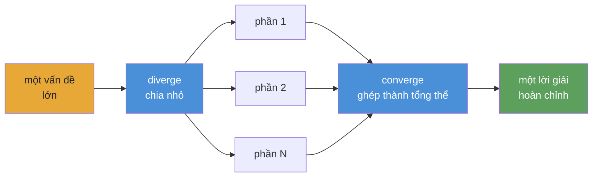

<div align="center">


# Playbook tác tử AI tự động

**Khung điều phối và vận hành tác tử cho các workflow phức tạp, có thể lặp lại, có thể kiểm chứng.**

[](https://www.npmjs.com/package/@converge/core)
[](https://github.com/myanlabs/converge/stargazers)
[](../../LICENSE)
[](https://nodejs.org/)
[](https://www.typescriptlang.org/)
[](../../examples)
[](../../docs/getting-started/install.md)

[Bắt đầu nhanh](#bắt-đầu-nhanh) · [Ví dụ](../../examples) · [Tài liệu](../../docs) · [Bản dịch](../README.md) · [Đóng góp](../../CONTRIBUTING.md)

</div>

---

## Cách hoạt động

**Bạn viết playbook dưới dạng file và thư mục Markdown. Converge biên dịch chúng thành DAG và điều phối AI agent chạy DAG đó.**



**Mô hình tư duy: diverge → converge.** Chia vấn đề thành các phần độc lập, chạy song song, rồi ghép kết quả lại. Có tính đệ quy — bất kỳ phần nào cũng có thể tự diverge tiếp.

1. **`converge init`** — khởi tạo project với cấu hình provider và cấu trúc thư mục.
2. **`converge add`** — kéo một ví dụ, sinh từ prompt, hoặc tự viết playbook.
3. **`converge run`** — biên dịch DAG, điều phối agent, lặp cho đến khi checks pass. Mỗi node: agent làm việc, shell checks xác minh. Fail thì retry, thành công thì cache.

**Viết — file và thư mục TASK.md. Markdown thuần. Đưa vào version control.**

**Chia sẻ playbook, chạy lại bất cứ lúc nào. Cùng input, cùng output.**

---

## Bạn có thể xây gì

Mỗi ví dụ dưới đây là một playbook thật, có thể chạy trong [`examples/`](../../examples/).

### Software

| Ví dụ                                            | Mô tả                                                  |
| ------------------------------------------------ | ------------------------------------------------------ |
| [`fullstack-app`](../../examples/fullstack-app/) | Sinh backend + frontend động bằng Seed, kèm tests pass |
| [`flutter-app`](../../examples/flutter-app/)     | Sinh app mobile tự động bằng Flutter / Dart            |
| [`baby-app`](../../examples/baby-app/)           | Template full-stack tối giản; clone, chỉnh sửa, chạy   |

### Research

| Ví dụ                                                        | Mô tả                                                                           |
| ------------------------------------------------------------ | ------------------------------------------------------------------------------- |
| [`deep-research`](../../examples/deep-research/)             | Nghiên cứu nhiều lớp với iterative deepening và quality gate                    |
| [`scientific-research`](../../examples/scientific-research/) | Suy luận Bayesian, GRADE evidence, meta-analysis, sinh paper — vòng lặp 8 phase |
| [`frontier-research`](../../examples/frontier-research/)     | Tổng hợp nhiều nguồn cho các miền kỹ thuật thay đổi nhanh                       |

### Creative

| Ví dụ                                                                      | Mô tả                                                                               |
| -------------------------------------------------------------------------- | ----------------------------------------------------------------------------------- |
| [`cinematic-video-production`](../../examples/cinematic-video-production/) | Đạo diễn phim AI end-to-end. `idea.md` → `clips/` với locked elements + compositing |
| [`game-assets-video`](../../examples/game-assets-video/)                   | Bộ asset platformer — nhân vật, props, tilesheets, parallax — từ một `idea.md`      |
| [`social-sim`](../../examples/social-sim/)                                 | Mô phỏng xã hội theo vòng lặp, sinh task con cho mỗi tick                           |

### Security

| Ví dụ                                                      | Mô tả                                                                                                             |
| ---------------------------------------------------------- | ----------------------------------------------------------------------------------------------------------------- |
| [`autonomous-pentest`](../../examples/autonomous-pentest/) | Quét pentest ~250 task. Findings được chặn bởi PoC tái lập được. Cần `scope.yml`. **Chỉ dùng khi được ủy quyền.** |

### Ops & data

| Ví dụ                                                                    | Mô tả                                                                                  |
| ------------------------------------------------------------------------ | -------------------------------------------------------------------------------------- |
| [`data-pipeline`](../../examples/data-pipeline/)                         | Pipeline tuần tự: fetch → transform → validate                                         |
| [`financial-deep-research`](../../examples/financial-deep-research/)     | Pipeline nghiên cứu cổ phiếu nhiều phase với phân tích từng ticker và báo cáo tổng hợp |
| [`evolutionary-optimization`](../../examples/evolutionary-optimization/) | Tìm kiếm fitness landscape cho prompt tuning, hyperparameter sweeps, copy testing      |

[Xem tất cả ví dụ →](../../examples/)

---

## Cấu trúc playbook

Một playbook là cây task trên đĩa. Mỗi TASK.md khai báo nó tạo ra gì và shell command nào kiểm tra xem nó đã xong hay chưa. Không có wiring tập trung.

```
.converge/playbooks/{name}/
├── playbook.yml              # entry: name, run config, task paths
└── tasks/
    ├── 01-analyze/
    │   ├── TASK.md
    │   └── tasks/
    │       ├── 01a-extract/TASK.md    # frontmatter (depends_on, outputs, checks)
    │       └── 01b-fingerprint/TASK.md
    ├── 02-catalog/TASK.md
    └── 03-build/
        ├── TASK.md
        └── tasks/
            ├── 03a-backend/TASK.md
            └── 03b-frontend/TASK.md
```

Vòng lặp thực thi — diverge, execute, converge:

```
  DIVERGE ──→ EXECUTE ──→ CONVERGE
  seed runs   children     body reads outputs,
  spawns      produce      integrates, validates
  children    outputs      → 0 gaps = done
```

Runtime đi qua DAG theo các lớp topo. Mỗi node hoặc được thực thi (AI agent + shell checks) hoặc được cache (fingerprint không đổi so với lần chạy trước). Node fail sẽ retry đến giới hạn attempt; node downstream chờ dependency hoàn thành. Giống `run` của dbt — thứ tự xác định, cache incremental, không có loop.

---

## Bắt đầu nhanh

> ⚠️ **Cảnh báo tiêu thụ token:** Converge điều phối AI agent gọi LLM APIs. Một playbook có thể tiêu thụ hàng chục triệu token. Hãy dùng model rẻ — xem [Thiết lập provider](#thiết-lập-provider) bên dưới.

### 1. Cài đặt

```bash
npm install -g @converge/core
```

### 2. Khởi tạo project

```bash
converge init --name=my-project
```

### 3. Tạo playbook

```bash
# Bắt đầu từ ví dụ có sẵn (không cần AI)
converge add --from-example hello-world

# Hoặc sinh từ prompt (cần cấu hình AI)
converge add --from-prompt "Literature review on in-context learning"
```

### 4. Chạy

```bash
converge run
```

Vậy là xong. Hướng dẫn 5 phút: **[Your first playbook](../../docs/getting-started/your-first-playbook.md)**.

---

## Vì sao dùng Converge

**Checks, không phải cảm tính.** Mỗi task khai báo shell-command checks — `tsc`, `grep`, `eslint`, một test suite. Runtime lặp đến khi chúng pass. Không để LLM tự chấm output của nó.

**Fingerprint caching, không phải checkpoint files.** Mỗi node có một fingerprint SHA-256. Node không đổi sẽ skip execution — giống incremental models của dbt. Dừng ở node 47; chạy lại sẽ tiếp tục từ phần đã hoàn thành.

**Playbooks, không phải prompts.** Chat transcript chết cùng session. Playbook là các file TASK.md được version-control. Cùng input, cùng output, mọi lần chạy. Bất kỳ ai trong team cũng có thể chạy lại.

**DAG, không phải context window.** Cửa sổ chat cạn kiệt sau vài feature. DAG playbook chia việc thành các file TASK.md độc lập — mỗi file vừa một cửa sổ. Runtime nối chúng theo thứ tự topo. 670 task, không mất context.

**Đổi provider, không viết lại workflow.** Claude, Gemini, Kimi, Qwen, Codex — đổi một config, cùng playbook vẫn chạy. Stub mode để phát triển offline không tốn chi phí.

**Scope động, không phải wiring tĩnh.** Task có thể mở rộng công việc lúc runtime thông qua hợp đồng CLI seed hiện tại (`seed: { mode: cli }` cùng với `converge spawn ...`), nên một scene thành một task và một mã cổ phiếu thành một nhánh phân tích. DAG lớn lên để phù hợp với vấn đề, không bị bó vào template.

---

## Thiết lập provider

Converge chạy trên bất kỳ LLM nào. Nó hỗ trợ hai agent backend — **Claude Code** (`provider: claude`) và **OpenAI Codex** (`provider: codex`) — mỗi backend route qua model bạn chọn. Bạn cấu hình backend trong `.converge/project.yaml`. **Dùng model rẻ để phát triển** — Claude Opus có giá $15/$75 mỗi 1M token; model rẻ có giá dưới $1/$3.

### Model rẻ khuyến nghị

| Model                 | Input / 1M | Output / 1M | Phù hợp nhất cho          |
| --------------------- | ---------- | ----------- | ------------------------- |
| `deepseek-v4-flash`   | $0.27      | $1.10       | Sub-agents, checks nhanh  |
| `deepseek-v4-pro[1m]` | $0.55      | $2.19       | Suy luận chính            |
| `MiniMax-M2.7`        | $0.50      | $1.50       | Cân bằng giá/hiệu năng    |
| Claude Opus 4.5       | $15.00     | $75.00      | Chất lượng cao nhất (đắt) |

### Mẫu `.converge/project.yaml`

```yaml
# .converge/project.yaml
name: my-project

ai:
  default: claude
  providers:
    # ── Claude Code backend ──────────────────────────
    claude:
      provider: claude
      env:
        # Route through DeepSeek (cheap)
        ANTHROPIC_BASE_URL: https://api.deepseek.com/anthropic
        ANTHROPIC_AUTH_TOKEN: "${DEEPSEEK_API_KEY}"
        ANTHROPIC_MODEL: deepseek-v4-pro[1m]
        ANTHROPIC_DEFAULT_HAIKU_MODEL: deepseek-v4-flash
        CLAUDE_CODE_SUBAGENT_MODEL: deepseek-v4-flash

        # Or route through MiniMax-M2.7 (uncomment to use)
        # ANTHROPIC_BASE_URL: "https://api.minimax.io/anthropic"
        # ANTHROPIC_AUTH_TOKEN: "${MINIMAX_API_KEY}"
        # ANTHROPIC_MODEL: "MiniMax-M2.7"

    # ── Codex backend ────────────────────────────────
    codex:
      provider: codex
      env:
        CODEX_API_KEY: "${CODEX_API_KEY}"
        # Or set OPENAI_API_KEY instead
```

**Claude Code** chạy qua `claude` CLI — đặt `DEEPSEEK_API_KEY` hoặc `MINIMAX_API_KEY` trong environment. **Codex** chạy qua `codex` CLI (`npm i -g @openai/codex`) — đặt `CODEX_API_KEY` hoặc `OPENAI_API_KEY`. Converge tự động resolve `${VAR}` references. `converge init` scaffold file này cho bạn.

Hướng dẫn đầy đủ: [Switching providers](../../docs/guides/switch-providers.md).

---

## Tích hợp Claude Code & Codex

Converge đi kèm hai **skills** cắm vào coding agent của bạn để bạn thiết kế và chạy playbook mà không rời terminal:

| Skill               | Chức năng                                                                                             |
| ------------------- | ----------------------------------------------------------------------------------------------------- |
| `converge-planning` | Thiết kế playbook mới từ prompt — sinh PLAN.md, file TASK.md, dependency graph, và shell-level checks |
| `converge-control`  | Chạy và monitor playbook — phân loại DAG events, chẩn đoán lỗi, re-run incremental                    |

### Luồng end-to-end

```bash
# 1. Bootstrap a project with skills installed
converge init --name=my-project --skills

# 2. In Claude Code, design the playbook
/converge-planning   # "Build a REST API for user management with auth"

# 3. Run
converge run

# 4. Hand off to converge-control — it monitors, diagnoses, and re-runs on failure
/converge-control    # run → monitor → retry failures
```

### Cách hoạt động

- `converge init --skills` cài cả hai skill vào `.claude/skills/` và `.codex/skills/`
- **Claude Code** và **Codex** tự discover skills từ các thư mục này — không cần cấu hình
- Gõ `/skill-name` để invoke: skill load tài liệu tham chiếu đầy đủ (CLI commands, event catalog, troubleshooting recipes) và hoạt động với full context
- `converge-planning` xử lý phase thiết kế ban đầu; `converge-control` tiếp quản trong lúc thực thi — chúng được thiết kế để hand off cho nhau

### Cài skills vào project có sẵn

```bash
converge skills install                    # default: .claude/skills/
converge skills install --target .codex/skills
```

---

## Gói

| Gói                                          | Path                                    | Mục đích                                                                                                    |
| -------------------------------------------- | --------------------------------------- | ----------------------------------------------------------------------------------------------------------- |
| [`@converge/core`](../../packages/core/)     | `packages/core/`                        | Engine TypeScript thuần: runner registry, task graph, state machine, repair strategies. Không phụ thuộc UI. |
| [`@converge/cli`](../../packages/cli/)       | `packages/cli/`                         | Terminal CLI. Bootstrap, run, watch, tail. Điều khiển run qua provider backends.                            |
| [`@converge/studio`](../../packages/studio/) | `packages/studio/`                      | Web UI để visualize runs, inspect tasks, browse journals.                                                   |
| Provider packs                               | `packages/{claude,gemini,kimi,qwen}fn/` | Backend theo provider. Đổi mà không thay playbook.                                                          |

---

## Dogfood

Nhiều phần quan trọng của repo này được xây bởi chính Converge chạy playbook lên bản thân nó — CLI redesign (63 task), landing page (65 task), docs generation, và hơn nữa. [Xem bằng chứng →](../../.converge/playbooks/). Nếu runtime không chạy được, README này đã phải viết tay.

> **`v0.1.0` · public preview** — Runtime đã sẵn sàng. **12 playbook ví dụ có thể chạy** cho phần mềm, nghiên cứu, mô phỏng và tích hợp provider. Sẽ còn thêm nữa.

---

## Bản dịch

- [Tiếng Việt](../vi/README.md)
- [Español](../es/README.md)
- [Português do Brasil](../pt-BR/README.md)
- [简体中文](../zh-CN/README.md)
- [日本語](../ja/README.md)

---

## Cộng đồng

- **[Discussions](https://github.com/myanlabs/converge/discussions)** — câu hỏi, ý tưởng, playbook patterns
- **[Issues](https://github.com/myanlabs/converge/issues)** — báo lỗi, yêu cầu tính năng
- **[Contributing](../../CONTRIBUTING.md)** — dev setup, cấu trúc project, cách gửi PR

---

## Giấy phép

MIT — xem [LICENSE](../../LICENSE)

<div align="center">

**Tự động · Lặp lại được · Kiểm chứng được**

</div>
