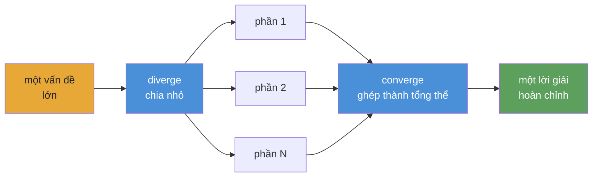

<div align="center">


# Converge

**Khung điều phối AI agent cho các playbook tự động, có thể duy trì lâu dài.**

[](https://www.npmjs.com/package/@openplaybooks/converge)
[](https://github.com/openplaybooks-dev/converge/stargazers)
[](../../LICENSE)
[](https://nodejs.org/)
[](https://www.typescriptlang.org/)
[](../../examples)
[](../../docs/getting-started/install.md)

[Bắt đầu nhanh](#bắt-đầu-nhanh) · [Ví dụ](../../examples) · [Tài liệu](../../docs) · [Bản dịch](../README.md) · [Đóng góp](../../CONTRIBUTING.md)

</div>

---

## Converge là gì

Hệ sinh thái AI agent hiện nay rất mạnh, nhưng vẫn còn rời rạc và phụ thuộc nhiều vào thao tác thủ công. Chúng ta đã có model tốt, tool tốt và skill tốt, nhưng để ghép chúng thành một workflow đáng tin cậy cho những bài toán phức tạp thì vẫn cần khá nhiều công sức nối ghép.

Converge là framework dành cho các playbook tự động. Nó cho phép bạn xâu chuỗi tasks và skills thành một quy trình lớn mà agent có thể chạy từ đầu đến cuối, đồng thời có sẵn checks, retries và self-correction trong vòng lặp thực thi.

Playbook mới là hiện vật bền vững: có thể version-control, có thể kiểm tra và có thể chạy lại. Nó lưu lại cấu trúc công việc, các outputs mong đợi và những checks giúp kết quả trở nên đáng tin.

**Không phải một workflow tĩnh. Mà là một playbook sống.**

## Bắt đầu nhanh

> ⚠️ **Cảnh báo về chi phí token:** Converge điều phối các AI agent gọi LLM APIs. Một playbook có thể tiêu thụ tới hàng chục triệu token. Khi phát triển, nên dùng model rẻ hơn; xem [Thiết lập provider](#thiết-lập-provider).

### 1. Cài đặt

```bash
npm install -g @openplaybooks/converge
```

### 2. Khởi tạo project

```bash
mkdir my-project && cd my-project
converge init --skills
```

`converge init` tạo `.converge/project.yaml` trong thư mục hiện tại.
`--skills` cài các bundled skills `/converge-planning` và `/converge-control`
vào `.claude/skills/` (và `.codex/skills/`). Nếu đã chạy `converge init` trước
đó, chạy lại với `--skills` sẽ chỉ cập nhật skills — không ghi đè cấu hình project.

**Thiết lập provider:** `converge init` tạo `.converge/project.yaml` với cấu hình provider. Điền các biến `$VAR` trong file đó hoặc export chúng trong shell trước khi chạy. Xem [Thiết lập provider](./docs/getting-started/install.md) để biết chi tiết.

### 3. Tạo playbook

```bash
# Start from a built-in example (no AI needed)
converge add --from-example hello-world

# Or generate one from a prompt (requires AI config)
converge add --from-prompt "Literature review on in-context learning"
```

### 4. Chạy

```bash
converge run
```

Vậy là đủ để bắt đầu. Nếu muốn đi nhanh từ đầu đến cuối, xem hướng dẫn **[Your first playbook](../../docs/getting-started/your-first-playbook.md)**.

---

## Vì sao đặt cược vào playbook

Thế hệ AI agent hiện nay đã rất ấn tượng. Có thể thấy điều đó qua những dự án như [`gstack`](https://github.com/garrytan/gstack), [`superpowers`](https://github.com/obra/superpowers), [`agent-skills`](https://github.com/addyosmani/agent-skills), Anthropic [`financial-services`](https://github.com/anthropics/financial-services) và [`claude-seo`](https://github.com/AgriciDaniel/claude-seo). Chúng cho thấy điều gì sẽ xảy ra khi prompt được nâng lên thành skill tái sử dụng, vai trò chuyên biệt và workflow theo miền.

Nhưng chúng cũng cùng chỉ ra một khoảng trống. Phần mạnh nhất của các hệ thống này vẫn thường khó mang sang lần sau. Kiến thức và khả năng thực thi hay bị kẹt trong một setup cụ thể, một host cụ thể, hoặc một lớp keo nối thủ công rất dày.

Từ đó nảy ra một câu hỏi đơn giản: điều gì sẽ xảy ra nếu hiện vật quan trọng nhất không phải là phiên làm việc, mà là playbook?

Converge theo đuổi chính ý tưởng đó. Playbook không nên chỉ dùng để mô tả công việc; nó nên chạy được công việc ấy. Nó cần xâu chuỗi tasks và skills thành một hệ thống lớn hơn, thích nghi với dạng bài toán, tự kiểm tra outputs và tự sửa khi có thứ gì đó hỏng.

Đó là đặt cược cốt lõi của Converge: playbook có thể phát triển từ những công thức nhỏ thành các hệ thống tự động phức tạp. Và càng nhiều người cùng viết, chia sẻ và cải tiến chúng, cộng đồng càng tích lũy được một thư viện công việc agent có thể tái sử dụng, thay vì những phiên làm việc rời rạc. Runner giúp việc thực thi trở nên nhẹ nhàng. Playbook giữ lại tri thức.

---

## Điều gì khiến Converge khác biệt

**Checks, không phải cảm tính.** Mỗi task khai báo shell-command checks như `tsc`, `grep`, `eslint` hay cả một test suite. Runtime sẽ lặp cho đến khi chúng pass. Không có chuyện để LLM tự chấm đầu ra của chính nó.

**Fingerprint caching, không phải checkpoint files.** Mỗi node có fingerprint SHA-256 riêng. Nếu node không thay đổi thì có thể bỏ qua execution, tương tự incremental models trong dbt. Dừng ở node 47 cũng không sao; chạy lại sẽ tiếp tục từ phần đã xong.

**Playbooks, không phải prompts.** Một chat transcript sẽ chết cùng session. Còn playbook là tập hợp các file `TASK.md` nằm trong version control. Cùng inputs, cùng outputs, có thể chạy lại bất cứ lúc nào. Bất kỳ ai trong team cũng có thể dùng lại.

**DAG, không phải context window.** Cửa sổ chat sẽ nhanh chóng đầy sau vài features. Playbook DAG chia công việc thành các file `TASK.md` độc lập, mỗi file nằm gọn trong một context window. Runtime nối chúng lại theo thứ tự topo. 670 tasks, không thất lạc ngữ cảnh.

**Đổi providers, không cần viết lại workflows.** Claude, Gemini, Kimi, Qwen, Codex: chỉ cần đổi config là cùng một playbook vẫn chạy. Ngoài ra còn có stub mode để phát triển offline với chi phí gần như bằng 0.

**Phạm vi động, không phải wiring tĩnh.** Tasks có thể mở rộng công việc ở runtime thông qua hợp đồng CLI seed hiện tại (`seed: { mode: cli }` cùng `converge spawn ...`). Một scene có thể trở thành một task; một mã cổ phiếu có thể mở ra thành cả một nhánh phân tích. DAG lớn lên theo bài toán, chứ không bị khóa cứng bởi template.

---

## Cách hoạt động

**Bạn viết playbook bằng các file và thư mục Markdown. Converge biên dịch chúng thành DAG rồi điều phối AI agent chạy DAG đó.**



**Mô hình tư duy là diverge → converge.** Chia bài toán thành những phần độc lập, chạy song song, rồi ghép kết quả lại. Mô hình này có tính đệ quy: bất kỳ phần nào cũng có thể tiếp tục tách nhỏ thêm.

## Cấu trúc playbook

Playbook là một cây tasks nằm trên đĩa. Mỗi `TASK.md` khai báo task đó tạo ra gì và những shell commands nào sẽ dùng để xác minh rằng nó đã hoàn tất. Không có một file wiring tập trung nào đứng giữa.

```
my-project/
├── .converge/
│   ├── project.yaml          # ← tạo bởi `converge init`
│   ├── playbooks/
│   │   └── default/
│   │       ├── playbook.yml   # ← tạo bởi `converge add`
│   │       ├── tasks/         # ← static, authored tasks
│   │       │   └── 01-create-greeting/
│   │       │       └── TASK.md
│   │       ├── templates/     # ← reusable blueprints cho dynamic/frontier tasks
│   │       │   ├── page/
│   │       │   │   └── TASK.md
│   │       │   └── api/
│   │       │       └── TASK.md
│   │       ├── scripts/       # ← optional: helpers gọi từ task body hoặc checks
│   │       │   ├── verify-bundle.sh
│   │       │   └── build-manifest.ts
│   │       └── skills/        # ← playbook-scoped SKILL.md files
│   │           └── research/
│   │               └── SKILL.md
│   ├── inventory/
│   │   └── default/
│   │       └── tasks.jsonl
│   └── _archive/             # ← các bản playbook trước
└── output/                   # ← outputs của task (gitignored)
```

Các playbook phức tạp có thể thêm `journal/` (trạng thái run). Xem ví dụ trong [`examples/`](../../examples/) để biết cấu trúc hoàn chỉnh.

Runtime đi qua DAG theo từng lớp topo. Mỗi node hoặc được thực thi (AI agent + shell checks), hoặc được lấy từ cache nếu fingerprint không đổi so với lần chạy trước. Node lỗi sẽ retry tới giới hạn attempt; node downstream phải chờ dependencies hoàn tất. Về mặt vận hành, nó gần với `run` của dbt: thứ tự xác định, cache incremental, không có loop.

---

## Bạn có thể xây gì

Mỗi ví dụ được đánh dấu **available** dưới đây là một playbook thật, có thể chạy trong [`examples/`](../../examples/). Những ví dụ ghi **coming soon** đã được thiết kế nhưng chưa phát hành.

### Starter

| Ví dụ                                            | Trạng thái | Mô tả                                                    |
| ------------------------------------------------ | ---------- | -------------------------------------------------------- |
| [`hello-world`](../../examples/hello-world/)     | available  | Playbook đơn giản nhất có thể: một task, hai checks      |
| [`data-pipeline`](../../examples/data-pipeline/) | available  | Pipeline tuần tự: fetch → transform → validate           |

### Software

| Ví dụ                                            | Trạng thái  | Mô tả                                              |
| ------------------------------------------------ | ----------- | -------------------------------------------------- |
| [`fullstack-app`](../../examples/fullstack-app/) | available   | Sinh backend + frontend động dựa trên Seed         |
| [`flutter-app`](../../examples/flutter-app/)     | available   | Sinh app mobile tự động bằng Flutter / Dart        |
| [`app-builder`](../../examples/app-builder/)     | coming soon | Playbook scaffolding ứng dụng tổng quát            |

### Research

| Ví dụ                                                        | Trạng thái | Mô tả                                                                      |
| ------------------------------------------------------------ | ---------- | -------------------------------------------------------------------------- |
| [`deep-research`](../../examples/deep-research/)             | available  | Iterative-deepening nhiều lớp với tiến trình được chặn theo chất lượng     |
| [`scientific-research`](../../examples/scientific-research/) | available  | Bayesian reasoning, GRADE evidence, meta-analysis và paper generation      |
| [`frontier-research`](../../examples/frontier-research/)     | available  | Khám phá frontier bằng beam search song song và theo dõi hội tụ            |

### Simulation

| Ví dụ                                      | Trạng thái  | Mô tả                                                                |
| ------------------------------------------ | ----------- | -------------------------------------------------------------------- |
| [`social-sim`](../../examples/social-sim/) | available   | Mô phỏng xã hội theo loop với child tasks cho mỗi tick               |
| [`game-ai-pk`](../../examples/game-ai-pk/) | coming soon | Reality show một tập với dàn nhân vật bền vững và game AI            |

### Optimization

| Ví dụ                                                                    | Trạng thái | Mô tả                                                                    |
| ------------------------------------------------------------------------ | ---------- | ------------------------------------------------------------------------ |
| [`evolutionary-optimization`](../../examples/evolutionary-optimization/) | available  | Tìm kiếm fitness landscape cho prompt tuning và hyperparameter sweeps    |

### Provider integration

| Ví dụ                                  | Trạng thái | Mô tả                                                          |
| -------------------------------------- | ---------- | -------------------------------------------------------------- |
| [`acp-demo`](../../examples/acp-demo/) | available  | Provider `acp` cùng Claude Agent SDK để gọi agent bằng code    |

### Coming soon

Những ví dụ dưới đây đã được thiết kế nhưng chưa phát hành. Có thể xem issue liên quan hoặc theo dõi [`examples/`](../../examples/) để cập nhật:

- `cinematic-video-production` — đạo diễn phim AI: `idea.md` → thư viện clip điện ảnh nhất quán
- `game-assets-video` — gói asset platformer từ một `idea.md`
- `autonomous-pentest` — quét pentest nhiều giai đoạn với findings bị chặn bởi PoC có thể tái hiện
- `financial-deep-research` — nghiên cứu cổ phiếu nhiều phase với phân tích theo từng ticker
- `baby-app` — template full-stack tối giản

[Browse all examples →](../../examples/)

---

## Thiết lập provider

Converge hỗ trợ nhiều runtime providers. Scaffold của project và CLI hiện cung cấp các provider IDs hạng nhất cho **Claude** (`provider: claude`), **Codex** (`provider: codex`), **ACP / OpenAI-compatible endpoints** (`provider: acp`), **Kimi** (`provider: kimi`), **Qwen** (`provider: qwen`), **Gemini** (`provider: gemini`) và **DeepCode** (`provider: deepcode`). Bạn cấu hình chúng trong `.converge/project.yaml`. **Khi phát triển, nên dùng model rẻ**: Claude Opus có giá $15/$75 cho mỗi 1M token; các model rẻ thường dưới $1/$3.

### Model rẻ khuyến nghị

| Model                 | Input / 1M | Output / 1M | Phù hợp nhất cho           |
| --------------------- | ---------- | ----------- | -------------------------- |
| `deepseek-v4-flash`   | $0.27      | $1.10       | Sub-agents, checks nhanh   |
| `deepseek-v4-pro[1m]` | $0.55      | $2.19       | Suy luận chính             |
| `MiniMax-M2.7`        | $0.50      | $1.50       | Cân bằng giá/hiệu năng     |
| Claude Opus 4.5       | $15.00     | $75.00      | Chất lượng cao nhất, giá cao |

### Mẫu `.converge/project.yaml`

```yaml
# .converge/project.yaml
name: my-project

ai:
  default: claude
  providers:
    # ── Claude Code backend ──────────────────────────
    claude:
      provider: claude
      env:
        # Route through DeepSeek (cheap)
        ANTHROPIC_BASE_URL: https://api.deepseek.com/anthropic
        ANTHROPIC_AUTH_TOKEN: "${DEEPSEEK_API_KEY}"
        ANTHROPIC_MODEL: deepseek-v4-pro[1m]
        ANTHROPIC_DEFAULT_HAIKU_MODEL: deepseek-v4-flash
        CLAUDE_CODE_SUBAGENT_MODEL: deepseek-v4-flash

        # Or route through MiniMax-M2.7 (uncomment to use)
        # ANTHROPIC_BASE_URL: "https://api.minimax.io/anthropic"
        # ANTHROPIC_AUTH_TOKEN: "${MINIMAX_API_KEY}"
        # ANTHROPIC_MODEL: "MiniMax-M2.7"

    # ── Codex backend ────────────────────────────────
    codex:
      provider: codex
      env:
        CODEX_API_KEY: "${CODEX_API_KEY}"
        # Or set OPENAI_API_KEY instead
```

**Claude Code** chạy qua CLI `claude`; hãy đặt `DEEPSEEK_API_KEY` hoặc `MINIMAX_API_KEY` trong environment. **Codex** chạy qua CLI `codex` (`npm i -g @openai/codex`); hãy đặt `CODEX_API_KEY` hoặc `OPENAI_API_KEY`. Converge tự resolve các tham chiếu `${VAR}`. `converge init` sẽ scaffold file này cho bạn.

> **Các ví dụ đi kèm dùng MiniMax theo mặc định.** Mỗi ví dụ trong [`examples/`](../../examples/) có một `.converge/project.yaml` route Claude qua `https://api.minimax.io/anthropic` với `MiniMax-M2.7`. Chỉ cần đặt `MINIMAX_API_KEY` trong environment là có thể chạy end-to-end. Nếu muốn dùng provider khác, hãy override `ANTHROPIC_BASE_URL` / `ANTHROPIC_MODEL` hoặc chỉnh trực tiếp `project.yaml` của ví dụ.

Hướng dẫn đầy đủ: [Switching providers](../../docs/guides/switch-providers.md).

---

## Tích hợp

Converge tích hợp ở hai lớp:

- **Coding agents** để viết và vận hành playbooks ngay trong workspace
- **Runtime providers** để thực thi tasks bên trong playbook

### Coding agents

Converge đi kèm hai **skills** để bạn có thể thiết kế và chạy playbooks mà không cần rời coding agent:

| Skill               | Chức năng                                                                                                    |
| ------------------- | ------------------------------------------------------------------------------------------------------------ |
| `converge-planning` | Thiết kế playbook mới từ prompt: sinh `PLAN.md`, các file `TASK.md`, dependency graph và shell-level checks |
| `converge-control`  | Chạy và theo dõi playbook: phân loại DAG events, chẩn đoán lỗi và re-run incremental                        |

### Luồng end-to-end

```bash
# 1. Bootstrap a project with skills installed
converge init --skills

# 2. In your coding agent, design the playbook
/converge-planning   # "Build a REST API for user management with auth"

# 3. Run
converge run

# 4. Hand off to converge-control — it monitors, diagnoses, and re-runs on failure
/converge-control    # run → monitor → retry failures
```

<details>
<summary><strong>Claude Code</strong></summary>

- `converge init --skills` cài bundled skills vào `.claude/skills/`
- Claude Code tự discover skills từ thư mục đó
- Gọi trực tiếp bằng `/converge-planning` và `/converge-control`

```bash
converge init --name=my-project --skills

# Re-run on an existing project to install bundled skills only
converge init --skills
```

</details>

<details>
<summary><strong>Codex</strong></summary>

- `converge init --skills` cũng cài bundled skills vào `.codex/skills/`
- Codex đọc skills từ thư mục đó theo cùng cách
- Dùng chính các skills này để lập kế hoạch và vận hành playbooks từ workspace Codex của bạn

```bash
converge init --name=my-project --skills

# Re-run on an existing project to install bundled skills only
converge init --skills
```

</details>

<details>
<summary><strong>Các thiết lập coding agent khác</strong></summary>

- Phần cài bundled skills ở đây hiện mới mô tả cụ thể cho Claude Code và Codex
- Tính di động của runtime provider được cấu hình riêng trong `.converge/project.yaml`

Xem [Switching providers](../../docs/guides/switch-providers.md).

</details>

### Hành vi của skills

- Gõ `/skill-name` để gọi: skill sẽ nạp reference docs, CLI commands, event catalog và troubleshooting recipes với đầy đủ ngữ cảnh
- `converge-planning` phụ trách giai đoạn thiết kế ban đầu; `converge-control` tiếp quản trong lúc thực thi

### Cài skills vào project hiện có

```bash
converge init --skills
```

### Runtime providers

Runtime của playbook là lớp portable. Bạn có thể đổi providers trong `.converge/project.yaml` mà không phải viết lại playbook.

<details>
<summary><strong>Claude</strong></summary>

- Backend hạng nhất qua `provider: claude`
- Chạy bằng CLI `claude`
- Hỗ trợ route Anthropic-compatible như DeepSeek hoặc MiniMax qua `ANTHROPIC_BASE_URL`

</details>

<details>
<summary><strong>Codex</strong></summary>

- Backend hạng nhất qua `provider: codex`
- Chạy bằng CLI `codex`
- Dùng `CODEX_API_KEY` hoặc `OPENAI_API_KEY`

</details>

<details>
<summary><strong>Gemini, Kimi, Qwen và OpenAI-compatible endpoints</strong></summary>

- Converge scaffold trực tiếp cho `provider: gemini`, `provider: kimi` và `provider: qwen`
- Dùng `provider: acp` nếu bạn muốn một OpenAI-compatible endpoint tùy ý hoặc `baseUrl` riêng
- Pha trộn providers rẻ và mạnh trong cùng một playbook là đòn bẩy chính về chi phí/hiệu năng

</details>

<details>
<summary><strong>Portable theo thiết kế</strong></summary>

- Skills giúp agents làm việc
- Playbooks định nghĩa công việc
- Providers là execution backends có thể thay đổi dưới cùng một playbook

</details>

---

## Packages

| Package                                      | Path                                    | Mục đích                                                                                                     |
| -------------------------------------------- | --------------------------------------- | ------------------------------------------------------------------------------------------------------------ |
| [`@openplaybooks/converge-core`](../../packages/core/)     | `packages/core/`                        | Engine TypeScript thuần: runner registry, task graph, state machine, repair strategies. Không phụ thuộc UI. |
| [`@openplaybooks/converge`](../../packages/cli/)       | `packages/cli/`                         | Terminal CLI. Bootstrap, run, watch, tail. Điều khiển runs qua provider backends.                           |
| [`@openplaybooks/studio`](../../packages/studio/) | `packages/studio/`                      | Web UI để trực quan hóa runs, kiểm tra tasks và duyệt journals.                                             |
| Provider packs                               | `packages/{claude,gemini,kimi,qwen}fn/` | Backend riêng theo provider. Có thể đổi mà không phải thay playbook.                                        |

---

## Dogfood

Nhiều phần quan trọng của repo này được tạo ra bằng chính Converge chạy playbooks lên bản thân nó: thiết kế lại CLI (63 tasks), landing page (65 tasks), sinh docs và nhiều thứ khác. [Xem bằng chứng →](../../.converge/playbooks/). Nếu runtime không dùng được, README này hẳn đã phải viết tay.

---

## Bản dịch

- [Tiếng Việt](../vi/README.md)
- [Español](../es/README.md)
- [Português do Brasil](../pt-BR/README.md)
- [简体中文](../zh-CN/README.md)
- [日本語](../ja/README.md)

---

## Cộng đồng

- **[Discussions](https://github.com/openplaybooks-dev/converge/discussions)** — câu hỏi, ý tưởng, playbook patterns
- **[Issues](https://github.com/openplaybooks-dev/converge/issues)** — báo lỗi, yêu cầu tính năng
- **[Contributing](../../CONTRIBUTING.md)** — dev setup, cấu trúc project, cách gửi PR

---

## Giấy phép

MIT — xem [LICENSE](../../LICENSE)

<div align="center">

**Tự động · Lặp lại được · Kiểm chứng được**

</div>
