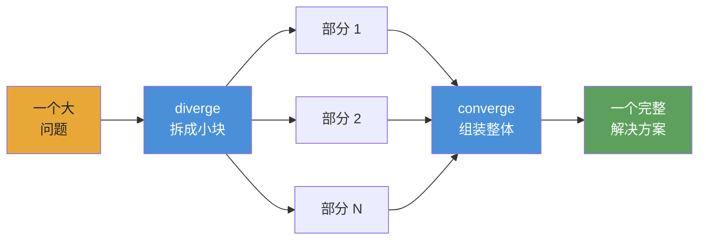

<div align="center">


# Converge

**面向持久化自主 playbook 的 AI agent 编排框架。**

[](https://www.npmjs.com/package/@converge/core)
[](https://github.com/myanlabs/converge/stargazers)
[](../../LICENSE)
[](https://nodejs.org/)
[](https://www.typescriptlang.org/)
[](../../examples)
[](../../docs/getting-started/install.md)

[快速开始](#快速开始) · [示例](../../examples) · [文档](../../docs) · [翻译](../README.md) · [贡献](../../CONTRIBUTING.md)

</div>

---

## Converge 是什么

现在的 AI agent 生态已经很强，但仍然碎片化且依赖大量手工操作。我们有不错的模型、不错的 tools、不错的 skills，但要把它们变成适合复杂工作的可靠 workflow，仍然需要大量胶水代码。

Converge 是一个面向自主 playbook 的框架。它允许你把 tasks 和 skills 串成一个复杂 workflow，由 agent 端到端执行，并在循环中内建 checks、retries 和 self-correction。

Playbook 是可持久保存的核心产物：可版本化、可检查、可运行。它记录工作的结构、期望 outputs，以及让结果可信的 checks。

**它不是静态 workflow，而是活的 playbook。**

## 快速开始

> ⚠️ **Token 消耗警告：** Converge 会调度调用 LLM APIs 的 AI agents。一个 playbook 可能消耗数千万 token。开发时请使用便宜模型，见[Provider 设置](#provider-设置)。

### 1. 安装

```bash
npm install -g @converge/core
```

### 2. Bootstrap 一个项目

```bash
converge init --name=my-project --provider-template=codex
```

### 3. 创建 playbook

```bash
# Start from a built-in example (no AI needed)
converge add --from-example hello-world

# Or generate one from a prompt (requires AI config)
converge add --from-prompt "Literature review on in-context learning"
```

### 4. 运行

```bash
converge run
```

就是这样。五分钟上手：**[Your first playbook](../../docs/getting-started/your-first-playbook.md)**。

---

## 为什么押注 playbook

这一代 AI agents 已经非常强大。你可以从 [`gstack`](https://github.com/garrytan/gstack)、[`superpowers`](https://github.com/obra/superpowers)、[`agent-skills`](https://github.com/addyosmani/agent-skills)、Anthropic 的 [`financial-services`](https://github.com/anthropics/financial-services) 和 [`claude-seo`](https://github.com/AgriciDaniel/claude-seo) 中看到这一点。它们展示了当 prompt 演化为可复用 skills、专家角色和领域 workflow 时会发生什么。

但它们也指向同一个缺失环节。很多能力仍然很难被延续和复用。最有价值的部分常常被困在某个特定 setup、某个特定 host，或者一堆手工胶水里。

于是就有一个简单的问题：如果真正的产物不是一次 session，而是 playbook，会怎样？

Converge 把这个想法推向自主执行。Playbook 不应该只记录工作，它应该能运行工作。它应该把 tasks 和 skills 串成更大的系统，适应问题本身的形状，验证自己的 outputs，并在出错时自我修复。

这就是 Converge 背后的赌注：playbooks 可以从小配方成长为复杂的自主系统；而随着更多人编写、分享、共同改进它们，社区得到的将是一套可复用的真实 agent 工作库，而不是孤立的会话。Runner 让执行变得轻松。Playbook 保存知识本身。

---

## Converge 有什么不同

**Checks，而不是感觉。** 每个 task 都声明 shell-command checks：`tsc`、`grep`、`eslint`、测试套件。Runtime 会循环直到它们通过。不让 LLM 自己评判自己的输出。

**Fingerprint caching，而不是 checkpoint files。** 每个 node 都有一个 SHA-256 fingerprint。未变化的 node 会跳过执行，就像 dbt 的 incremental models。中断在 node 47，重新运行会从已完成部分继续。

**Playbooks，而不是 prompts。** Chat transcript 会随着 session 消失。Playbook 是纳入版本控制的 `TASK.md` 文件。相同 inputs，相同 outputs，每次运行都可复现。团队中任何人都可以重新运行。

**DAG，而不是 context window。** 聊天窗口做几个 feature 后就耗尽。Playbook DAG 把工作拆成独立的 `TASK.md` 文件，每个文件都能放进一个窗口。Runtime 按拓扑顺序连接它们。670 个 tasks，零上下文丢失。

**切换 providers，而不是重写 workflows。** Claude、Gemini、Kimi、Qwen、Codex，改一个配置就能运行同一个 playbook。还有零成本离线开发用的 stub mode。

**动态 scope，而不是静态 wiring。** Tasks 可以通过当前的 CLI seed 契约（`seed: { mode: cli }` 加 `converge spawn ...`）在 runtime 扩展工作，所以一段 scene 会变成一个 task，一个股票 ticker 会变成一个分析分支。DAG 会随着问题增长，而不是被模板限制。

---

## 工作方式

**你把 playbook 写成 Markdown 文件和目录。Converge 将其编译为 DAG，并调度 AI agent 执行。**



**心智模型：diverge → converge。** 把问题拆成独立部分，并行运行，再把结果组装回来。它是递归的：任何一块都可以继续 diverge。

## Playbook 结构

Playbook 是磁盘上的 task 树。每个 `TASK.md` 都声明自己会产出什么，以及哪些 shell commands 用来检查它是否完成。没有中心化 wiring。

```
.converge/playbooks/{name}/
├── playbook.yml              # entry: name, run config, task paths
└── tasks/
    ├── 01-analyze/
    │   ├── TASK.md
    │   └── tasks/
    │       ├── 01a-extract/TASK.md    # frontmatter (depends_on, outputs, checks)
    │       └── 01b-fingerprint/TASK.md
    ├── 02-catalog/TASK.md
    └── 03-build/
        ├── TASK.md
        ├── TASK.md           # can act as a seed/loop driver
        └── tasks/
            ├── 03a-backend/TASK.md
            └── 03b-frontend/TASK.md
```

Runtime 会按拓扑层遍历 DAG。每个 node 要么执行（AI agent + shell checks），要么缓存（fingerprint 相比上次运行没有变化）。失败的 node 会重试到 attempt 上限；downstream node 会等待依赖完成。类似 dbt 的 `run`：确定性顺序、增量缓存、无循环。

---

## 可以构建什么

下面标记为 **available** 的示例都是真实、可运行的 playbook，位于 [`examples/`](../../examples/)。标记为 **coming soon** 的已经设计好，但尚未发布。

### Starter

| 示例                                         | 状态         | 说明                                           |
| -------------------------------------------- | ------------ | ---------------------------------------------- |
| [`hello-world`](../../examples/hello-world/) | available    | 最简单的 playbook：一个 task，两个 checks      |
| [`data-pipeline`](../../examples/data-pipeline/) | available | 顺序 pipeline：fetch → transform → validate    |

### Software

| 示例                                             | 状态         | 说明                                                  |
| ------------------------------------------------ | ------------ | ----------------------------------------------------- |
| [`fullstack-app`](../../examples/fullstack-app/) | available    | 基于 Seed 的动态 backend + frontend 生成             |
| [`flutter-app`](../../examples/flutter-app/)     | available    | 使用 Flutter / Dart 自动生成移动应用                 |
| [`app-builder`](../../examples/app-builder/)     | coming soon  | 通用应用 scaffolding playbook                        |

### Research

| 示例                                                         | 状态         | 说明                                                                     |
| ------------------------------------------------------------ | ------------ | ------------------------------------------------------------------------ |
| [`deep-research`](../../examples/deep-research/)             | available    | 分层 iterative-deepening，并以质量 gate 控制推进                         |
| [`scientific-research`](../../examples/scientific-research/) | available    | Bayesian reasoning、GRADE evidence、meta-analysis 与 paper generation    |
| [`frontier-research`](../../examples/frontier-research/)     | available    | 并行 beam search 的 frontier 探索与收敛跟踪                              |

### Simulation

| 示例                                       | 状态         | 说明                                                                  |
| ------------------------------------------ | ------------ | --------------------------------------------------------------------- |
| [`social-sim`](../../examples/social-sim/) | available    | 基于 loop 的社会模拟，每个 tick 生成 child tasks                      |
| [`game-ai-pk`](../../examples/game-ai-pk/) | coming soon  | 单集 reality show 风格的持久角色 game AI                             |

### Optimization

| 示例                                                                     | 状态         | 说明                                                                  |
| ------------------------------------------------------------------------ | ------------ | --------------------------------------------------------------------- |
| [`evolutionary-optimization`](../../examples/evolutionary-optimization/) | available    | 用于 prompt tuning 和 hyperparameter sweeps 的 fitness-landscape search |

### Provider integration

| 示例                                   | 状态         | 说明                                                   |
| -------------------------------------- | ------------ | ------------------------------------------------------ |
| [`acp-demo`](../../examples/acp-demo/) | available    | `acp` provider 与 Claude Agent SDK 的程序化调用示例    |

### Coming soon

这些示例已经设计好，但尚未发布。可查看关联 issue，或关注 [`examples/`](../../examples/) 目录的更新：

- `cinematic-video-production` — AI 电影导演：`idea.md` → 风格一致的电影片段库
- `game-assets-video` — 从单个 `idea.md` 生成 platformer 美术资源包
- `autonomous-pentest` — 多阶段 pentest sweep，findings 需通过可复现 PoC gate
- `financial-deep-research` — 多阶段股票研究，每个 ticker 单独分析
- `baby-app` — 最小 full-stack 起步模板

[Browse all examples →](../../examples/)

---

## Provider 设置

Converge 支持多个 runtime providers。项目 scaffold 和 CLI 目前提供一等 provider IDs：**Claude**（`provider: claude`）、**Codex**（`provider: codex`）、**ACP / OpenAI-compatible endpoints**（`provider: acp`）、**Kimi**（`provider: kimi`）、**Qwen**（`provider: qwen`）、**Gemini**（`provider: gemini`）和 **DeepCode**（`provider: deepcode`）。你可以在 `.converge/project.yaml` 中配置它们。**开发时请使用便宜模型**：Claude Opus 每 1M token 价格为 $15/$75；便宜模型低于 $1/$3。

### 推荐便宜模型

| Model                 | Input / 1M | Output / 1M | 最适合                         |
| --------------------- | ---------- | ----------- | ------------------------------ |
| `deepseek-v4-flash`   | $0.27      | $1.10       | Sub-agents、快速 checks        |
| `deepseek-v4-pro[1m]` | $0.55      | $2.19       | 主推理                         |
| `MiniMax-M2.7`        | $0.50      | $1.50       | 价格/性能平衡                  |
| Claude Opus 4.5       | $15.00     | $75.00      | 最高质量（昂贵）               |

### `.converge/project.yaml` 示例

```yaml
# .converge/project.yaml
name: my-project

ai:
  default: claude
  providers:
    # ── Claude Code backend ──────────────────────────
    claude:
      provider: claude
      env:
        # Route through DeepSeek (cheap)
        ANTHROPIC_BASE_URL: https://api.deepseek.com/anthropic
        ANTHROPIC_AUTH_TOKEN: "${DEEPSEEK_API_KEY}"
        ANTHROPIC_MODEL: deepseek-v4-pro[1m]
        ANTHROPIC_DEFAULT_HAIKU_MODEL: deepseek-v4-flash
        CLAUDE_CODE_SUBAGENT_MODEL: deepseek-v4-flash

        # Or route through MiniMax-M2.7 (uncomment to use)
        # ANTHROPIC_BASE_URL: "https://api.minimax.io/anthropic"
        # ANTHROPIC_AUTH_TOKEN: "${MINIMAX_API_KEY}"
        # ANTHROPIC_MODEL: "MiniMax-M2.7"

    # ── Codex backend ────────────────────────────────
    codex:
      provider: codex
      env:
        CODEX_API_KEY: "${CODEX_API_KEY}"
        # Or set OPENAI_API_KEY instead
```

**Claude Code** 通过 `claude` CLI 运行；请在环境中设置 `DEEPSEEK_API_KEY` 或 `MINIMAX_API_KEY`。**Codex** 通过 `codex` CLI 运行（`npm i -g @openai/codex`）；请设置 `CODEX_API_KEY` 或 `OPENAI_API_KEY`。Converge 会自动解析 `${VAR}` 引用。`converge init` 会为你生成这个文件。

> **内置示例默认使用 MiniMax。** [`examples/`](../../examples/) 中的每个示例都带有一个 `.converge/project.yaml`，把 Claude 路由到 `https://api.minimax.io/anthropic` 并使用 `MiniMax-M2.7`。设置 `MINIMAX_API_KEY` 后即可端到端运行。如果要换 provider，可覆盖 `ANTHROPIC_BASE_URL` / `ANTHROPIC_MODEL`，或直接修改示例里的 `project.yaml`。

完整指南：[Switching providers](../../docs/guides/switch-providers.md)。

---

## 集成

Converge 在两层上提供集成：

- **Coding agents**：在你的 workspace 中编写和操作 playbooks
- **Runtime providers**：执行 playbook 内部的 tasks

### Coding agents

Converge 内置两个 **skills**，让你无需离开 coding agent 就能设计和运行 playbooks：

| Skill               | 作用                                                                                                            |
| ------------------- | --------------------------------------------------------------------------------------------------------------- |
| `converge-planning` | 从 prompt 设计新 playbook：生成 `PLAN.md`、`TASK.md` 文件、dependency graph 和 shell-level checks             |
| `converge-control`  | 运行并监控 playbook：分类 DAG events、诊断失败并进行增量 re-run                                                |

### 端到端流程

```bash
# 1. Bootstrap a project with skills installed
converge init --name=my-project --skills

# 2. In your coding agent, design the playbook
/converge-planning   # "Build a REST API for user management with auth"

# 3. Run
converge run

# 4. Hand off to converge-control — it monitors, diagnoses, and re-runs on failure
/converge-control    # run → monitor → retry failures
```

<details>
<summary><strong>Claude Code</strong></summary>

- `converge init --skills` 会把内置 skills 安装到 `.claude/skills/`
- Claude Code 会自动从该目录发现 skills
- 直接通过 `/converge-planning` 和 `/converge-control` 调用

```bash
converge init --name=my-project --skills

# Re-run on an existing project to install bundled skills only
converge init --skills
```

</details>

<details>
<summary><strong>Codex</strong></summary>

- `converge init --skills` 也会把内置 skills 安装到 `.codex/skills/`
- Codex 会以相同方式从该目录读取 skills
- 在你的 Codex workspace 中使用同样的 Converge skills 来规划和操作 playbooks

```bash
converge init --name=my-project --skills

# Re-run on an existing project to install bundled skills only
converge init --skills
```

</details>

<details>
<summary><strong>其他 coding-agent 配置</strong></summary>

- 这里记录的内置 skill 安装方式目前只针对 Claude Code 和 Codex
- Runtime provider 的可移植性需另外在 `.converge/project.yaml` 中配置

参见 [Switching providers](../../docs/guides/switch-providers.md)。

</details>

### Skill 行为

- 输入 `/skill-name` 调用：skill 会加载参考文档、CLI commands、event catalog 和 troubleshooting recipes，并带着完整上下文工作
- `converge-planning` 负责前期设计；`converge-control` 在执行阶段接手

### 给已有项目安装 skills

```bash
converge init --skills
```

### Runtime providers

Playbook runtime 是可移植层。你可以在 `.converge/project.yaml` 中切换 providers，而不需要重写 playbook。

<details>
<summary><strong>Claude</strong></summary>

- 一等 backend，使用 `provider: claude`
- 通过 `claude` CLI 运行
- 支持通过 `ANTHROPIC_BASE_URL` 路由到 DeepSeek、MiniMax 等 Anthropic-compatible 服务

</details>

<details>
<summary><strong>Codex</strong></summary>

- 一等 backend，使用 `provider: codex`
- 通过 `codex` CLI 运行
- 使用 `CODEX_API_KEY` 或 `OPENAI_API_KEY`

</details>

<details>
<summary><strong>Gemini、Kimi、Qwen 与 OpenAI-compatible endpoints</strong></summary>

- Converge 会直接 scaffold `provider: gemini`、`provider: kimi` 和 `provider: qwen`
- 如果你需要任意 OpenAI-compatible endpoint 或自定义 `baseUrl`，请使用 `provider: acp`
- 在同一个 playbook 中混合便宜 provider 和强大 provider，是主要的成本/性能杠杆

</details>

<details>
<summary><strong>按设计可移植</strong></summary>

- Skills 帮助 agents 完成工作
- Playbooks 定义工作本身
- Providers 是同一个 playbook 下可替换的执行 backend

</details>

---

## Packages

| Package                                      | Path                                    | 用途                                                                                               |
| -------------------------------------------- | --------------------------------------- | -------------------------------------------------------------------------------------------------- |
| [`@converge/core`](../../packages/core/)     | `packages/core/`                        | 纯 TypeScript engine：runner registry、task graph、state machine、repair strategies。无 UI 依赖。 |
| [`@converge/cli`](../../packages/cli/)       | `packages/cli/`                         | Terminal CLI。Bootstrap、run、watch、tail。通过 provider backends 驱动 runs。                      |
| [`@converge/studio`](../../packages/studio/) | `packages/studio/`                      | 用于可视化 runs、检查 tasks、浏览 journals 的 Web UI。                                             |
| Provider packs                               | `packages/{claude,gemini,kimi,qwen}fn/` | Provider-specific backends。无需修改 playbook 即可切换。                                           |

---

## Dogfood

这个 repo 的重要部分是由 Converge 对自身运行 playbooks 构建出来的：CLI 重设计（63 tasks）、landing page（65 tasks）、文档生成等等。[查看证据 →](../../.converge/playbooks/)。如果 runtime 不能工作，这份 README 就得手写。

> **`v0.1.0` · public preview** — Runtime 已发布。提供 **12 个可运行示例 playbook**，覆盖 software、research、simulation 和 provider integration。后续还会继续增加。

---

## 翻译

- [Tiếng Việt](../vi/README.md)
- [Español](../es/README.md)
- [Português do Brasil](../pt-BR/README.md)
- [简体中文](../zh-CN/README.md)
- [日本語](../ja/README.md)

---

## 社区

- **[Discussions](https://github.com/myanlabs/converge/discussions)** — 问题、想法、playbook patterns
- **[Issues](https://github.com/myanlabs/converge/issues)** — bug reports、feature requests
- **[Contributing](../../CONTRIBUTING.md)** — dev setup、项目结构、如何提交 PR

---

## 许可证

MIT — 见 [LICENSE](../../LICENSE)

<div align="center">

**自主 · 可重复 · 可验证**

</div>
