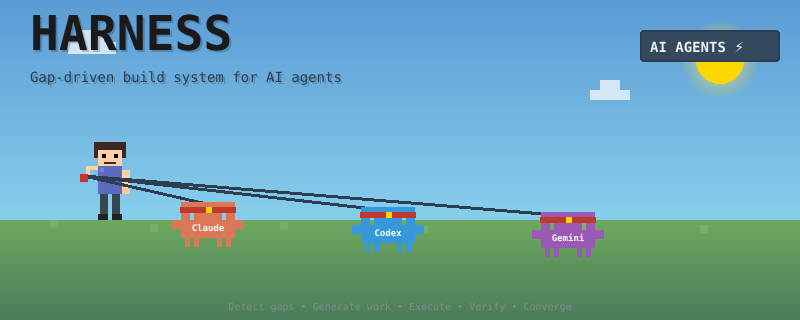

<div align="center">



# Harness

**Next-generation agent harness framework for deterministic, reproducible, and extremely complex AI workflows.**

Playbooks · Markdown-first tasks · Hierarchical task trees · Dynamic task spawning · Just-in-time planning · Self-verification · Self-correction · Goal convergence

</div>

---

## Why Harness?

AI agents are powerful but non-deterministic. A single agent attempting a complex project will hallucinate, lose context, skip steps, and produce inconsistent results across runs. Existing orchestration frameworks paper over this with static pipelines, linear chains, or role-based crews — none of which scale to genuinely complex, multi-phase workflows.

Harness is **general-purpose**. Any domain where work can be expressed as verifiable goals — outputs that exist, checks that pass, invariants that hold — is a domain Harness can automate. Software, research, data, content, operations, legal, science.

Harness takes a different approach: **convergence**. Instead of defining what steps to take, you define what the finished state looks like. Harness continuously measures the gap between current reality and that target, generates work to close it, executes, verifies, self-corrects, and repeats — until the project is done.

---

## Use Cases

Harness is general-purpose. If the work can be expressed as a verifiable target state — files that must exist, checks that must pass, invariants that must hold — Harness can orchestrate it autonomously.

---

### Software Development

Build entire applications end-to-end: data modeling → API design → frontend implementation → tests → documentation. Each phase gates the next. Failing tests block release tasks. New screens are discovered and spawned dynamically from a design spec.

```
playbooks/default/tasks/
├── 01-prepare-requirements/    # validate inputs, gather idea
├── 02-design-system/           # generate design tokens
├── 03-build-screens/           # WBS spawns per-screen pipeline
├── 04-data-layer/              # models, providers, repositories
└── 05-integration/             # routing, testing, polish
```

**Key patterns:** WBS spawns one task per screen/endpoint. Checks run `dart analyze`, `npm test`, `npx playwright test`. Failed tests generate `LEARN.md` with the stack trace; next attempt applies targeted fixes.

---

### Research & Report Generation

Automate literature reviews, competitive analyses, and multi-source synthesis reports. One task group per research domain; tasks gather sources, extract findings, cross-reference, and synthesize — each step verified before the next begins.

```yaml
# tasks/01-market-research/001-gather-sources/TASK.md frontmatter
outputs:
  - research/sources.md
checks:
  - id: minimum-sources
    cmd: "[ $(grep -c '^##' research/sources.md) -ge 20 ]"
    description: At least 20 sources documented
```

**Key patterns:** Checks verify source count minimums, citation format, required sections. WBS splits the research by subtopic and assigns each to a specialist agent.

---

### Data Pipelines & ETL

Process raw data through multi-stage transformation pipelines: ingest → clean → validate → transform → load → verify. Each stage declares its inputs (raw files) and outputs (processed files), with checks that validate row counts, schema conformance, and referential integrity.

```yaml
# tasks/003-validate-schema/TASK.md frontmatter
inputs:
  - data/cleaned/**/*.parquet
outputs:
  - data/validated/report.json
checks:
  - id: no-nulls
    cmd: python check_nulls.py data/validated/
  - id: row-count-ok
    cmd: python check_count.py data/validated/ --min 10000
  - id: schema-conforms
    cmd: python check_schema.py data/validated/ schema.json
```

**Key patterns:** Gap detection identifies when upstream data changes require downstream re-processing. Checks enforce data contracts. Self-correction fixes schema mismatches between pipeline stages.

---

### Content Production at Scale

Generate, review, and publish large content libraries: blog posts, documentation sites, product descriptions, localization, video scripts. A planner task determines the full content scope; WBS spawns one task per piece; checks enforce quality before each item is marked complete.

```yaml
# tasks/002-generate-articles/TASK.md frontmatter
wbs:
  type: nodejs
  path: ./wbs/spawn-articles.js
```

The WBS script reads the content plan and spawns one task per article, each with word count and SEO checks.

**Key patterns:** WBS from a content plan. Checks enforce word count, readability score, SEO requirements. A separate task group handles editorial review and publication.

---

### Business Process Automation

Orchestrate multi-step business workflows that span document generation, data extraction, validation, approvals, and notifications. Each process step is a task with verifiable completion criteria.

**Example: Contract processing pipeline**
```
playbooks/default/tasks/
├── 01-intake/
│   └── 001-extract-fields/    # parse contract → structured JSON
├── 02-validation/
│   └── 001-compliance-check/  # validate against policy rules
├── 03-enrichment/
│   └── 001-risk-scoring/      # score risk from extracted fields
└── 04-output/
    ├── 001-generate-summary/  # produce human-readable summary
    └── 002-route-approval/    # determine approver and send notification
```

**Key patterns:** Each task checks that required fields are present and valid. Failed compliance checks block enrichment. The approval routing task generates its own child tasks per approval path.

---

### Scientific & Research Workflows

Run reproducible computational experiments: hypothesis formulation → data collection → analysis → visualization → reporting. Harness ensures each stage produces verified artifacts before the next begins, making experiments reproducible across runs.

```yaml
# tasks/003-analyze/TASK.md frontmatter
outputs:
  - results/analysis/summary.json
  - results/figures/plot_*.png
checks:
  - id: figures-generated
    cmd: "[ $(ls results/figures/*.png | wc -l) -ge 5 ]"
  - id: stats-valid
    cmd: python validate_stats.py results/analysis/summary.json
  - id: p-values-reported
    cmd: "grep -q 'p_value' results/analysis/summary.json"
```

**Key patterns:** Checks enforce statistical validity, reproducibility, and required outputs. Self-correction re-runs analyses with corrected parameters when validation fails.

---

### DevOps & Infrastructure

Automate infrastructure provisioning, configuration management, and deployment pipelines. Tasks declare the infrastructure state they expect (Terraform plan outputs, health check endpoints, service status) as checks.

```yaml
# tasks/003-deploy-staging/TASK.md frontmatter
inputs:
  - terraform/staging/**/*.tf
outputs:
  - deploy/staging/manifest.json
checks:
  - id: terraform-valid
    cmd: terraform -chdir=terraform/staging validate
  - id: health-check
    cmd: curl -f https://staging.example.com/health
  - id: smoke-test-passes
    cmd: npx playwright test --project=staging
```

**Key patterns:** Checks verify infrastructure health, not just file existence. Self-healing detects environment mismatches and generates corrective tasks. Playbooks parameterize deployment targets (staging vs. production).

---

### The Pattern

Every use case above follows the same structure:

1. **Define the target state** — what files must exist, what checks must pass
2. **Declare the work** — TASK.md files with markdown instructions and YAML frontmatter
3. **Let Harness converge** — it detects gaps, executes, verifies, self-corrects, and repeats

The domain is irrelevant. The framework is the same.

---

## Philosophy

> **Every complex workflow is continuous gap-closing between current state and target state.**

Harness is built on four core principles:

1. **Gap-Driven** — Continuously evaluate current state vs. target invariants. Detect gaps. Generate work dynamically to close them.
2. **Convention over Configuration** — Filesystem structure _is_ the execution structure. Numeric prefixes define order. Subdirectories define hierarchy. Auto-discovery replaces manual registration.
3. **Convergent** — Automatic attempt archiving, checkpoint-based resumption, and fail-fast self-correction ensure progress always moves forward.
4. **Markdown-First** — Tasks are TASK.md files. Goals are GOAL.md files. Skills are SKILL.md files. The primary interface is human-readable markdown with YAML frontmatter — no TypeScript required.

Unlike static pipeline systems that execute a predetermined plan, Harness adapts to actual project state, spawning new tasks just-in-time to close detected gaps.

---

## Quick Start

```bash
npm install harness
```

Create `.harness/project.yaml`:

```yaml
version: 2
name: my-app
description: My autonomous AI project
```

Create `.harness/playbooks/default/playbook.yml`:

```yaml
name: default
description: Main workflow
run:
  mode: autonomous
  maxIterations: 100
  maxTaskAttempts: 3
```

Create your first task at `.harness/playbooks/default/tasks/01-hello/TASK.md`:

```markdown
---
id: 01-hello
title: Hello World
outputs:
  - hello.md
checks:
  - id: hello-exists
    cmd: test -f hello.md
    description: hello.md was created
---

# Hello World

Create a file called `hello.md` with a brief introduction to the project.
Include a title, one-paragraph description, and a list of goals.
```

Run:

```bash
harness run
```

---

## Architecture — 3 Layers

Harness operates at three distinct levels. Each layer handles a different scope of work.

### Layer 1 — Project Orchestration

The top-level loop. Scans the entire playbook, builds an ordered task queue, and drives execution task-by-task until complete. New tasks dynamically spawned by WBS scripts are automatically picked up on the next scan.

```
harness run
│
├── 1. SNAP    — re-scan playbooks/*/tasks/ for all tasks
├── 2. FIND    — pick first incomplete task (by checkpoint + dependency order)
├── 3. EXECUTE — run the task (Layer 2 → Layer 3)
├── 4. COMMIT  — mark complete or failed in checkpoint
└── → repeat from 1 (WBS-spawned child tasks are discovered automatically)
```

Stops when all tasks complete, a task exhausts its retry budget, or `--max-iterations` is reached.

---

### Layer 2 — Task Execution

Each task gets its own isolated execution context inside the journal. On every attempt:

1. Increments the attempt counter in `checkpoint.json`
2. Archives previous `attempts/wip/` to `attempts/{n}/` (full history)
3. Creates a fresh `attempts/wip/` for the new attempt
4. Writes the context snapshot (`REQ.md`, `TASK.md`, `CHECK.md`) into `wip/`
5. On retry: copies `LEARN.md` from previous attempt into `wip/`
6. Runs the task unit (Layer 3)
7. Records outcome in `checkpoint.json`

```
.harness/journal/tasks/{taskId}/
├── README.md              ← how to resume this task manually
├── checkpoint.json        ← attempt history and current status
├── status.json            ← aggregate pass/fail state
└── attempts/
    ├── wip/               ← CURRENT attempt (always present while running)
    │   ├── REQ.md         ← requirements: inputs, outputs, attempt number
    │   ├── TASK.md        ← task instructions (from TASK.md body)
    │   ├── CHECK.md       ← checks that must pass (with shell commands)
    │   ├── LEARN.md       ← failure analysis from previous attempt (attempt 2+)
    │   ├── events.jsonl   ← structured event log
    │   ├── log.log        ← raw agent output
    │   └── facts.json     ← facts captured during this attempt
    ├── 01/                ← archived: attempt 1 (complete snapshot)
    └── 02/                ← archived: attempt 2
```

---

### Layer 3 — Attempt Execution

The innermost layer. Executes a single attempt for a single task, running the AI with full context.

```
TASK.md
   │
   ▼
Read context snapshot (REQ.md, TASK.md, CHECK.md)
   │
   ▼
Phase 1 [Attempt 2+] — Learn
Read LEARN.md: what failed last time, corrections required
   │
   ▼
Phase 2 — Execute
Follow all instructions in TASK.md + apply LEARN.md corrections
   │
   ▼
Phase 3 — Verify (self-correction loop)
Run each check command from CHECK.md
┌─ all pass? ──────────────────────────────► ✅ return success
│
└─ any fail?
     ├─ fixable inline? ── fix → re-run check → loop
     └─ not fixable?   ── write LEARN.md → ❌ return failure
                                  │
                                  ▼ (Layer 1 creates new attempt)
```

---

## Key Features

### Playbooks

Playbooks are the top-level entry point for Harness workflows. A playbook defines a complete workflow — its execution mode, retry policy, and the tasks it contains. Tasks live as TASK.md files inside the playbook's `tasks/` directory.

```yaml
# .harness/playbooks/default/playbook.yml
name: default
description: Flutter mobile app generator
run:
  mode: autonomous
  maxIterations: 100
  maxTaskAttempts: 3
  resume: true
```

A project can have multiple playbooks for different workflows (e.g., `build`, `test`, `deploy`). Each playbook is self-contained with its own tasks and goals.

---

### TASK.md — Declarative Tasks

Tasks are markdown files with YAML frontmatter. The frontmatter declares what the task needs and produces — inputs, outputs, checks, dependencies. The markdown body is the AI's instructions, injected verbatim into the execution context.

```markdown
---
id: 001-gather-idea
title: Validate App Idea
outputs:
  - idea.md
checks:
  - id: idea-md-exists
    cmd: test -f idea.md
    description: idea.md exists
  - id: idea-has-purpose
    cmd: grep -q "## Purpose" idea.md
    description: idea.md has purpose section
---

# Validate App Idea

Validate that `idea.md` exists and contains the required sections.

## Step 0: Check idea.md Exists

If idea.md exists with a ## Purpose section, the task is complete.
Otherwise, create idea.md with at least a ## Purpose section.

## Success Criteria

- idea.md exists in root directory
- idea.md has "## Purpose" section
```

No TypeScript. No build step. The markdown body can include any instructions — step-by-step procedures, code snippets, decision trees, references to other files.

---

### GOAL.md — Convergence Goals

Goals define measurable quality metrics with targets. When a goal's metric doesn't meet its target, the framework identifies the gap and spawns corrective tasks to close it. Goals are how Harness knows what "done" looks like.

A goal with an inline command metric:

```markdown
---
title: Dart Analysis Errors
metric:
  cmd: "dart analyze --no-fatal-infos lib/ 2>&1 | grep -c 'error' || echo 0"
  target: 0
  direction: min
detail:
  cmd: "dart analyze --no-fatal-infos lib/ 2>&1 | head -20"
plan:
  strategy: wbs
tags: [code-quality]
---

Dart static analysis errors. The project should pass `dart analyze` cleanly with no errors.
```

A goal with a script-based metric:

```markdown
---
title: Providers connected to UI
metric:
  script: metric.js
  target: 0
  direction: min
detail:
  script: report.js
plan:
  strategy: split
tags: [data-layer]
---

Every Riverpod provider should be imported and used by at least one screen or widget.
```

The `plan.strategy` field controls how corrective work is generated: `wbs` spawns a tree of subtasks from a work breakdown script, `split` creates one task per failing item, and `single` creates a single corrective task.

---

### Hierarchical Task Trees

Harness models work as a tree. Numeric prefixes on directories control execution order; nesting creates parent-child relationships. Parent tasks complete only when all children complete.

```
playbooks/default/tasks/
├── 01-prepare-requirements/        # runs first
│   ├── TASK.md
│   └── 001-gather-idea/
│       └── TASK.md                 # leaf task
├── 02-design-system/               # runs after 01
│   └── TASK.md
└── 03-build-screens/               # runs after 02
    ├── TASK.md                     # parent with WBS
    └── tasks/                      # WBS-spawned children
        ├── 001-home-screen/
        │   └── TASK.md
        └── 002-settings-screen/
            └── TASK.md
```

The filesystem _is_ the execution plan — no registration, no config files.

---

### Dynamic Task Creation (WBS)

Tasks can reference Work Breakdown Structure scripts that spawn child tasks dynamically at runtime. The parent task doesn't complete until all spawned children are done. This is how Harness handles "we don't know the full scope yet" workflows.

A TASK.md declares its WBS in frontmatter:

```yaml
wbs:
  type: nodejs
  path: ./wbs/index.js
```

The WBS script reads project state and spawns tasks:

```javascript
// wbs/index.js — simplified
const screens = JSON.parse(fs.readFileSync('.stitch/screens.json'));

for (let idx = 0; idx < screens.length; idx++) {
  const screen = screens[idx];
  const prefix = String(idx + 1).padStart(3, '0');

  await ctx.spawn({
    id: `${prefix}-${screen.id}`,
    title: `Screen: ${screen.title}`,
    dependencies: prevScreenLastId ? [prevScreenLastId] : [],
    inputs: ['.stitch/screens.json', '.stitch/system/DESIGN.md'],
    outputs: [`lib/screens/${screen.id}/*.dart`],
  });
}
```

Spawned tasks are written to the filesystem and discovered on the next Layer 1 scan. If the parent task was interrupted mid-spawn, already-spawned children are not re-spawned (checkpoint-safe).

---

### Self-Verification & Self-Correction

Every task declares **checks** — shell commands that must exit 0 for the task to succeed. After each execution, Harness runs every check. Failed checks trigger an inline correction loop; if the agent still can't fix it, it writes `LEARN.md` and the attempt ends.

**Attempt 1 — Execute → Verify:**
```
Phase 1 — Execute TASK.md
Phase 2 — Run all checks from CHECK.md
         ├── all pass → ✅ complete
         └── any fail → AI corrects inline → re-run → still failing → write LEARN.md → ❌ fail
```

**Attempt 2+ — Learn → Execute → Verify:**
```
Phase 1 — Read LEARN.md (what failed, corrections required)
Phase 2 — Execute TASK.md with corrections applied
Phase 3 — Run all checks
         ├── all pass → ✅ complete
         └── any fail → write new LEARN.md → ❌ fail → next attempt
```

**LEARN.md** carries knowledge forward between attempts:

```markdown
# LEARN.md — Attempt 2 Failure Analysis

## Failed Checks

### tests-pass
**Description**: All unit tests pass
**Command**: `npm test`
**Exit code**: 1
**Output**: TypeError: Cannot read properties of undefined (reading 'map') at UserList.tsx:42

## Passed Checks
- ✓ types-compile — TypeScript compiles without errors

## Corrections Required
- **tests-pass**: UserList.tsx line 42 — add null check before calling .map()
  on the users prop. The component must handle undefined/null users array.
```

Max attempts per task is configurable (`maxTaskAttempts` in playbook.yml, default: 2). After exhausting attempts, the task is marked failed and downstream tasks are unblocked.

---

### Self-Healing Repair System

Beyond the per-attempt self-correction loop, Harness has an AI-driven **repair system** that analyzes task failures at a higher level and applies targeted fixes before the next attempt. Repair strategies include:

- **Missing input detection** — detects when required input globs return zero matches and generates upstream tasks to produce them
- **Dependency backoff** — identifies tasks that should be blocked on an incomplete dependency and re-queues correctly
- **WBS generator repair** — fixes broken work breakdown scripts that failed to spawn children
- **Tool environment repair** — detects and attempts to fix missing CLI tools or environment issues
- **User question resume** — surfaces ambiguous requirements for human clarification rather than spinning on unsolvable tasks

The repair system runs between attempts, not inside them. Agents execute with a clean slate; repair happens at the orchestrator level.

---

### Skills

Skills are reusable AI instruction libraries that live in `.harness/skills/`. Unlike tasks (which define *what to do*), skills define *how to do it* — domain expertise, procedures, and best practices that can be referenced across many tasks.

```markdown
# .harness/skills/extract-data-models-from-flutter/SKILL.md

# Extract Data Models from Flutter Skill

Analyze Flutter widget files to extract all data entities,
fields, and relationships.

## Procedure

1. Scan all screen files in lib/screens/ and lib/widgets/
2. Identify data entities — hardcoded lists, inline types, widget props
3. Cross-reference with UX.md for additional entities
4. Generate specification — write data-models.md
```

Tasks reference skills via the `references:` field in their frontmatter. This keeps task definitions focused on *what* while skills centralize *how*.

```yaml
# In a TASK.md frontmatter
references:
  - flutter-building-layouts
  - flutter-animating-apps
```

---

### Just-in-Time Planning

Tasks can enable plan mode, where the AI generates a `plan.md` before execution begins. The plan is generated once and carried forward across all retry attempts — the agent doesn't re-plan on failure, it learns from `LEARN.md` and re-executes against the same plan.

```yaml
# In a TASK.md frontmatter
plan: true
```

This is useful for complex multi-step work where the agent needs to think through the approach before committing to implementation.

---

### Gap Detection

Harness continuously detects gaps between desired and actual project state. Goals define the target state; the gap detector evaluates which goals are unmet and generates work to close them. Gaps are structured records with severity, suggested fixes, and resolution tracking.

Gap types include: missing outputs, failing checks, broken dependencies, unmet goals, stale inputs, and schema drift. When Harness detects a gap, it uses the goal's `plan.strategy` to determine how to generate corrective work — whether that's a single fix task, one task per failing item, or a full work breakdown.

---

## CLI Reference

```
harness run                          Run all pending tasks autonomously
harness run --step                   Run one task then stop
harness run --converge               Convergence mode — weighted gap scoring
harness plan "build a login page"    Generate a playbook from a prompt
harness goals                        Evaluate goals and show pass/fail
harness tree                         Visualize the task tree
harness inspect                      Browse execution sessions and logs
harness reset <taskId>               Reset a task to re-run it
```

---

## Directory Structure

```
.harness/
├── project.yaml                          # Project name, description, goals
│
├── skills/                               # Reusable instruction libraries (shared)
│   ├── flutter-building-layouts/
│   │   └── SKILL.md
│   └── extract-data-models-from-flutter/
│       └── SKILL.md
│
├── playbooks/                            # Workflow definitions
│   └── default/
│       ├── playbook.yml                  # Execution mode, retry policy
│       ├── tasks/                        # Task hierarchy (auto-discovered)
│       │   ├── 01-prepare-requirements/
│       │   │   ├── TASK.md               # Parent task
│       │   │   └── 001-gather-idea/
│       │   │       └── TASK.md           # Leaf task
│       │   ├── 02-design-system/
│       │   │   └── TASK.md
│       │   └── 03-build-screens/
│       │       ├── TASK.md               # WBS parent — spawns children
│       │       └── wbs/
│       │           └── index.js          # WBS script
│       └── goals/                        # Convergence goals
│           ├── 001-dart-analysis-errors/
│           │   └── GOAL.md
│           └── 002-providers-connected/
│               ├── GOAL.md
│               ├── metric.js
│               └── report.js
│
└── journal/                              # Runtime state (gitignore this)
    ├── .checkpoint.json                  # Global: completed/failed task IDs
    └── tasks/
        └── 001-gather-idea/
            ├── checkpoint.json
            ├── status.json
            └── attempts/
                ├── wip/                  # Current attempt
                │   ├── REQ.md
                │   ├── TASK.md
                │   ├── CHECK.md
                │   └── LEARN.md          # Only on attempt 2+
                ├── 01/                   # Archived attempt 1
                └── 02/                   # Archived attempt 2
```

Numeric prefixes control execution order. Subdirectories create parent-child relationships. The filesystem _is_ the execution plan.

---

## License

MIT

---

<div align="center">

**Gap-driven. Convergent. Markdown-first.**

*Build AI workflows that actually finish.*

</div>
